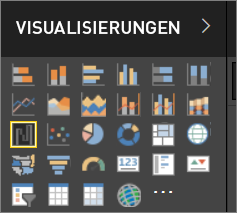

# Visualisierungen in Power BI-Berichten

Visualisierungen (auch als Visuals bezeichnet) zeigen Erkenntnisse an, die in den Daten ermittelt wurden. Ein Power BI-Bericht kann eine einzelne Seite mit einem Visual oder mehrere mit Visuals gefüllte Seiten enthalten. Im Power BI-Dienst können Visuals [aus Berichten an Dashboards angeheftet](../service-dashboard-pin-tile-from-report.md) sein.

Es ist wichtig, den Unterschied zwischen einem *Designer* und *Consumer* Wenn die Person sind, erstellen oder ändern den Bericht, sind Sie mit einem Designer.  Designer über Bearbeitungsberechtigungen für den Bericht und das zugrunde liegende Dataset verfügen. In Power BI Desktop bedeutet dies, dass Sie das Dataset in der Datensicht öffnen und in der Berichtsansicht Visuals erstellen können. In Power BI-Dienst bedeutet dies können Sie das Dataset oder den Bericht in Berichts-Editor in öffnen [Bearbeitungsansicht](../consumer/end-user-reading-view.md). Wenn ein Bericht oder Dashboard [für Sie freigegeben](../consumer/end-user-shared-with-me.md) wurde, sind Sie ein **Nutzer** des Berichts. Zum Anzeigen und interagieren mit dem Bericht und seine Visuals können jedoch nicht möglich, wichtige Änderungen zu speichern.

Im Power BI-Bereich „VISUALISIERUNGEN“ stehen viele verschiedene Visualtypen zur Verfügung.

Wenn Sie eine noch größere Auswahl wünschen, besuchen Sie die [Website der Microsoft AppSource-Community](https://appsource.microsoft.com), um [benutzerdefinierte Visuals](../developer/custom-visual-develop-tutorial.md) zu suchen und [herunterzuladen](https://appsource.microsoft.com/marketplace/apps?page=1&product=power-bi-visuals), die von Microsoft und der Community bereitgestellt werden.

<iframe width="560" height="315" src="https://www.youtube.com/embed/SYk_gWrtKvM?list=PL1N57mwBHtN0JFoKSR0n-tBkUJHeMP2cP" frameborder="0" allowfullscreen></iframe>

  Wenn Sie noch nicht mit Power BI gearbeitet haben oder Ihre Kenntnisse auffrischen möchten, finden Sie unten Links zu den Grundlagen von Power BI-Visualisierungen.  Alternativ finden Sie im Inhaltsverzeichnis (links neben diesem Artikel) weitere hilfreiche Informationen.

## Hinzufügen einer Visualisierung in Power BI

[Erstellen Sie Visualisierungen](power-bi-report-add-visualizations-i.md) auf Ihren Berichtsseiten Durchsuchen Sie die [Liste der verfügbaren Visualisierungen und verfügbaren Visualisierungstutorials](power-bi-visualization-types-for-reports-and-q-and-a.md). 

## Hochladen einer benutzerdefinierten Visualisierung und deren Verwendung in Power BI

Fügen Sie eine benutzerdefinierte Visualisierung hinzu, die Sie selbst erstellt oder auf der [Website der Microsoft AppSource-Community](https://appsource.microsoft.com/marketplace/apps?product=power-bi-visuals) gefunden haben. Sind Sie kreativ? Nutzen Sie Ihren Quellcode komplett, und erstellen Sie mit unseren [Entwicklertools](../developer/custom-visual-develop-tutorial.md) neue Typen von Visualisierungen, die Sie dann [für die Community freigeben](../developer/office-store.md) können. Informationen zur Entwicklung von benutzerdefinierten Visuals finden Sie unter [Entwickeln eines benutzerdefinierten Visuals für Power BI](../developer/custom-visual-develop-tutorial.md).

## Ändern des Visualisierungstyps

Versuchen Sie [den Visualisierungstyp zu ändern](power-bi-report-change-visualization-type.md), um zu sehen, welcher für Ihre Daten am besten geeignet ist.

## Anheften der Visualisierung

Wenn die Visualisierung Ihren Wünschen entspricht, können Sie sie im Power BI-Dienst als Kachel an ein [Dashboard anheften](../service-dashboard-pin-tile-from-report.md). Wenn Sie die im Bericht verwendete Visualisierung ändern, nachdem Sie sie angeheftet haben, wird die Kachel im Dashboard nicht geändert. Wenn die Visualisierung ein Liniendiagramm war, bleibt sie ein Liniendiagramm, selbst wenn Sie sie im Bericht in ein Ringdiagramm geändert haben.

## Einschränkungen und Überlegungen
- Abhängig von der Datenquelle und die Anzahl von Feldern (Measures oder Spalten) kann ein visuelles langsam geladen werden.  Es wird empfohlen, Visuals auf insgesamt 10 bis 20-Felder, beide Gründen der Lesbarkeit und Leistung zu beschränken. 

- Der obere Grenzwert für die visuellen Elemente ist 100 Feldern (Measures oder Spalten). Wenn Ihre Visualisierung nicht laden, reduzieren Sie die Anzahl der Felder an.   

## Nächste Schritte

* [Visualisierungstypen in Power BI](power-bi-visualization-types-for-reports-and-q-and-a.md)
* [Benutzerdefinierte Visuals](../power-bi-custom-visuals.md)