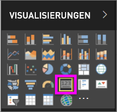
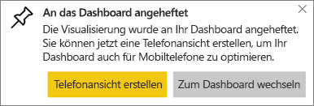
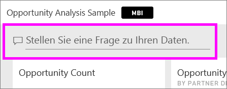
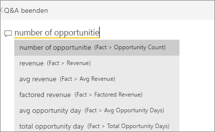
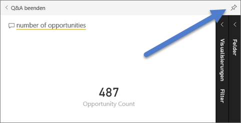
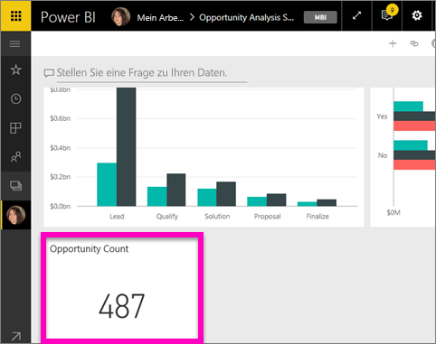
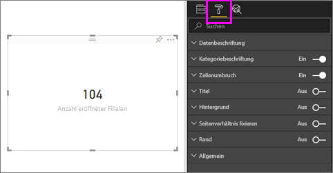
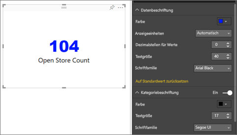
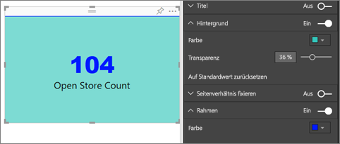

# Kartenvisualisierungen
Manchmal ist eine einzelne Zahl das Wichtigste, das Sie in Ihrem Power BI-Dashboard oder Bericht nachverfolgen möchten, wie z.B. der Gesamtumsatz, der Marktanteil im Jahresverlauf oder die Gesamtverkaufschancen. Eine solche Visualisierung wird als *Karte* bezeichnet. Wie fast alle nativen Power BI-Visualisierungen können Karten im Berichts-Editor oder in Q&A erstellt werden.

## Erstellen einer Karte im Berichts-Editor
In dieser Anleitung wird das Analysebeispiel für den Einzelhandel verwendet. Wenn Sie diese Schritte selbst ausführen möchten, [laden Sie das Beispiel für den Power BI-Dienst („app.powerbi.com“) oder Power BI Desktop herunter](../sample-datasets.md).   

1. Beginnen Sie mit einer leeren Berichtsseite, und wählen Sie das Feld **Store** \> **Anzahl offener Stores** aus. Wenn Sie den Power BI-Dienst verwenden, müssen Sie den Bericht in der [Bearbeitungsansicht](../service-interact-with-a-report-in-editing-view.md) öffnen.

    Power BI erstellt ein Säulendiagramm mit dieser einen Zahl.

   
2. Wählen Sie im Bereich „Visualisierungen“ das Kartensymbol aus.

   
6. Zeigen Sie auf die Karte, und wählen Sie das Anheftsymbol  aus, um die Visualisierung dem Dashboard hinzuzufügen.

   
7. Heften Sie die Kachel an ein vorhandenes oder neues Dashboard an.

   * Vorhandenes Dashboard: Wählen Sie den Namen des Dashboards aus der Dropdownliste aus.
   * Neues Dashboard: Geben Sie den Namen des neuen Dashboards ein.
8. Wählen Sie **Anheften**aus.

   Eine Erfolgsmeldung (in der Nähe der oberen rechten Ecke) weist Sie darauf hin, dass die Visualisierung als Kachel zu Ihrem Dashboard hinzugefügt wurde.

   
9. Wählen Sie **Zum Dashboard wechseln** aus. Hier können Sie die angeheftete Visualisierung [bearbeiten und verschieben](../service-dashboard-edit-tile.md).

## Erstellen einer Karte aus dem Q&A-Fragefeld
Das Q&A-Fragefeld bietet die einfachste Möglichkeit, eine Karte zu erstellen. Das Q&A-Fragefeld ist im Power BI-Dienst in Dashboards oder Berichten und in der Desktopberichtsansicht verfügbar. Die folgenden Schritte beschreiben das Erstellen einer Karte aus einem Dashboard im Power BI-Dienst. Wenn Sie in Power BI Desktop eine Karte mit Q&A erstellen möchten, [folgen Sie diesen Anweisungen](https://powerbi.microsoft.com/en-us/blog/power-bi-desktop-december-feature-summary/#QandA) für die Q&A-Vorschau von Desktop-Berichten.

1. Erstellen Sie ein [Dashboard](../service-dashboards.md) und [rufen Sie Daten ab](../service-get-data.md). Hier wird das [Beispiel zur Opportunityanalyse](../sample-opportunity-analysis.md) verwendet.

1. Geben Sie oben auf Ihrem Dashboard im Fragefeld ein, was Sie über Ihre Daten wissen möchten. 

   

> [!TIP]
> Wählen Sie in einem Bericht im Power BI-Dienst in der Bearbeitungsansicht in der oberen Menüleiste **Frage stellen** aus. Suchen Sie in einem Power BI Desktop-Bericht eine freie Stelle, und doppelklicken Sie, um ein Fragefeld anzuzeigen.

3. Geben Sie z. B. „Anzahl Verkaufschancen“ in das Fragefeld ein.

   

   Im Fragefeld werden Vorschläge und Formulierungsalternativen angezeigt. Schließlich sehen Sie hier die Gesamtanzahl.  
4. Wählen Sie das Anheftsymbol  rechts oben aus, um die Karte zum Dashboard hinzuzufügen.

   
5. Heften Sie die Karte als Kachel an ein vorhandenes oder neues Dashboard an.

   * Vorhandenes Dashboard: Wählen Sie den Namen des Dashboards aus der Dropdownliste aus. Sie können nur die Dashboards innerhalb des aktuellen Arbeitsbereichs auswählen.
   * Neues Dashboard: Geben Sie den Namen des neuen Dashboards ein. Dieses wird anschließend dem aktuellen Arbeitsbereich hinzugefügt.
6. Wählen Sie **Anheften**aus.

   Eine Erfolgsmeldung (in der Nähe der oberen rechten Ecke) weist Sie darauf hin, dass die Visualisierung als Kachel zu Ihrem Dashboard hinzugefügt wurde.  

   
7. Wählen Sie **Zum Dashboard wechseln**, um die neue Kachel anzuzeigen. Dort können Sie es u.a. [umbenennen, die Größe ändern, einen Link hinzufügen und die Kachel auf dem Dashboard verschieben](../service-dashboard-edit-tile.md).

   

## Zu beachtende Aspekte und Problembehandlung
- Wenn kein Fragefeld angezeigt wird, wenden Sie sich an den System- oder Mandantenadministrator.    
- Wenn Sie die Desktop-Version verwenden und beim Klicken an eine leere Stelle im Bericht Q&A nicht geöffnet wird, müssen Sie diese Funktion möglicherweise aktivieren.  Wählen Sie **Datei > Optionen und Einstellungen > Optionen > Vorschaufeatures > Q&A** aus, und starten Sie Power BI Desktop neu.

## Formatieren einer Karte
Sie haben viele Möglichkeiten, Beschriftungen, Text, Farben usw. zu ändern. Der einfachste Weg, um dies zu lernen, ist eine Karten zu erstellen und dann den Formatierungsbereich zu erkunden. Hier sehen Sie ein paar Beispiele der verfügbaren Formatierungsoptionen. 

1. Öffnen Sie den Formatierungsbereich, indem Sie das Farbrollersymbol auswählen. 

    
2. Erweitern Sie **Datenbeschriftung**, und verändern Sie die Farbe, die Größe und die Schriftfamilie. Wenn Sie Tausende Filialen haben, können Sie **Anzeigeeinheiten** verwenden, um die Anzahl der Filialen in Tausenderschritten anzeigen und die Dezimalstellen ebenso zu steuern. Beispielsweise 125,8k anstatt 125.832,00.

3.  Erweitern Sie die **Kategoriebeschriftung**, und ändern Sie Farbe und Größe.

    

4. Erweitern Sie den **Hintergrund**, und verschieben Sie den Regler auf „On“ (Ein).  Sie können nun die Hintergrundfarbe und -transparenz ändern.

    

5. Machen Sie sich weiter mit den Formatoptionen vertraut, bis Ihre Karte so aussieht, wie Sie es sich vorstellen. 

    

## Nächste Schritte
[Kombinationsdiagramm in Power BI](power-bi-visualization-combo-chart.md)

[Visualisierungstypen in Power BI](power-bi-visualization-types-for-reports-and-q-and-a.md)
