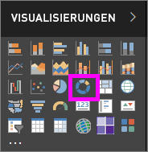
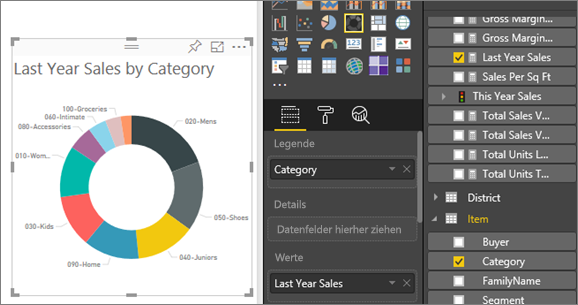

# Ringdiagramme in Power BI
Ein Ringdiagramm ähnelt einem Kreisdiagramm insofern, als dass es die Beziehung von Teilen zu einem Ganzen zeigt. Der einzige Unterschied ist, dass die Mitte leer und Platz für eine Beschriftung oder ein Symbol bleibt.

## Erstellen eines Ringdiagramms
Mit dieser Anleitung erstellen Sie anhand des Analysebeispiels für den Einzelhandel ein Ringdiagramm, das den Absatz des laufenden Jahres nach Kategorie anzeigt. Wenn Sie diese Schritte selbst ausführen möchten, [laden Sie das Beispiel für den Power BI-Dienst („app.powerbi.com“) oder Power BI Desktop herunter](../sample-datasets.md).

1. Beginnen Sie auf einer [leeren Berichtsseite](../power-bi-report-add-page.md), und wählen Sie **SalesStage** \> **Vertriebsphase** aus. Wenn Sie den Power BI-Dienst verwenden, achten Sie darauf, den Bericht in der [Bearbeitungsansicht](../service-interact-with-a-report-in-editing-view.md) zu öffnen.

2. Wählen Sie im Bereich „Felder“ die Option **Verkäufe** \> **Verkäufe im letzten Jahr** aus.  
   
3. Wählen Sie im Bereich „Visualisierungen“ das Symbol für ein Ringdiagramm  aus, um das Balkendiagramm in ein Ringdiagramm zu konvertieren. Wenn sich die Kategorie **Verkäufe im letzten Jahr** nicht im Bereich **Werte** befindet, ziehen Sie diese dorthin.
     
   

4. Wählen Sie **Element** \> **Kategorie** aus, um die Kategorie dem Bereich **Legende** hinzuzufügen. 
     
    

5. Optional können Sie [die Textgröße und -farbe des Diagramms anpassen](power-bi-visualization-customize-title-background-and-legend.md). 

## Zu beachtende Aspekte und Problembehandlung
* Die Summe der Ringdiagrammwerte muss insgesamt 100 % betragen.
* Zu viele Kategorien erschweren das Lesen und Interpretieren der Werte.
* Ringdiagramme werden am besten zum Vergleichen eines bestimmten Bereichs gegenüber dem Ganzen verwendet, anstatt einzelne Abschnitte miteinander zu vergleichen. 

## Nächste Schritte
[Berichte in Power BI](../consumer/end-user-reports.md)

[Visualisierungstypen in Power BI](power-bi-visualization-types-for-reports-and-q-and-a.md)

[Visualisierungen in Power BI-Berichten](power-bi-report-visualizations.md)

[Power BI – Grundkonzepte](../consumer/end-user-basic-concepts.md)

Weitere Fragen? [Wenden Sie sich an die Power BI-Community](http://community.powerbi.com/)

