# Visual „Wichtige Einflussfaktoren“
Mithilfe des Visuals „Wichtige Einflussfaktoren“ können Sie die wichtigen Faktoren einer für Sie relevanten Metrik besser nachvollziehen. Es analysiert die Daten, erstellt eine Rangfolge für wichtige Faktoren und stellt diese dar. Das kann beispielsweise relevant sein, wenn Sie ermitteln möchten, welche Faktoren sich auf die Mitarbeiterfluktuation (Stellenwechsel) auswirkt. Dabei können z.B. die Länge des Anstellungsvertrags oder das Alter des Mitarbeiters wichtige Faktoren darstellen. 
 
## Wann empfiehlt sich die Verwendung des Visuals „Wichtige Einflussfaktoren“? 
Sie können das Visual in folgenden Fällen erfolgreich verwenden: 
- Zur Übersicht über die Faktoren, die sich auf die analysierte Metrik auswirken

- Zum Vergleich der relativen Wichtigkeit dieser Faktoren, z.B. bei der Frage, ob Kurzzeitverträge sich stärker als Langzeitverträge auf die Fluktuation auswirken. 

## Voraussetzungen für das Visual „Wichtige Einflussfaktoren“ 
Bei der analysierten Metrik muss es sich um ein kategorisches Feld handeln.    

## Features des Visuals „Wichtige Einflussfaktoren“

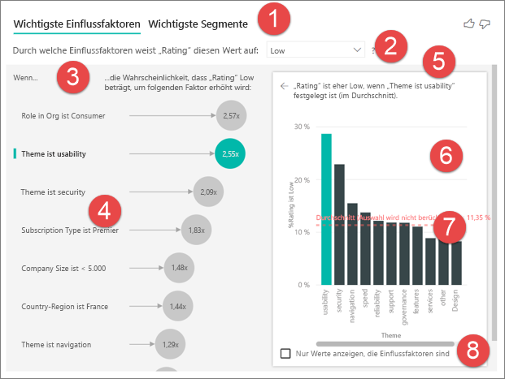    

1. ***Registerkarten:*** Klicken Sie auf eine Registerkarte, um die Ansicht zu wechseln. Auf der Registerkarte „Wichtige Einflussfaktoren“ wird dargestellt, wodurch der ausgewählte Metrikwert beeinflusst wird. Auf der Registerkarte „Wichtigste Segmente“ werden die Segmente dargestellt, die den größten Einfluss auf den ausgewählten Metrikwert haben. Ein *Segment* besteht aus einer Kombination mehrerer Werte.  Beispielsweise könnte ein Segment sich aus den Verbrauchern zusammensetzen, die seit mindestens 20 Jahren zur Kundschaft zählen und im Westen des Landes leben. 

2. ***Dropdownmenü:*** Der Wert der analysierten Metrik. In diesem Fall wird die **Bewertung** der Metrik analysiert. Der ausgewählte Wert ist **Low** (Niedrig).    

3. ***Neudarstellung:*** Diese Ansicht unterstützt Sie beim Interpretieren des Visuals im linken Bereich. 

4. ***Linker Bereich:*** Im linken Bereich wird ein Visual dargestellt.  In diesem Beispiel handelt es sich um eine Liste der wichtigsten Einflussfaktoren.

5. ***Neudarstellung:*** Diese Ansicht unterstützt Sie beim Interpretieren des Visuals im rechten Bereich.

6. ***Rechter Bereich:*** Im rechten Bereich wird ein Visual dargestellt. In diesem Fall werden im Säulendiagramm alle Werte für den links ausgewählten Faktor **Theme** (Thema) des Visuals **Wichtige Einflussfaktoren** dargestellt. Der ausgewählte Wert (hier: **Usability** (Benutzerfreundlichkeit)) wird grün dargestellt, während alle anderen Werte von **Theme** (Thema) schwarz dargestellt werden.

7. ***Durchschnittslinie:*** Der Durchschnitt, der aus allen Werten von **Theme** (Thema) mit Ausnahme von **Usability** (Benutzerfreundlichkeit) berechnet wurde. Die Berechnung setzt sich also aus allen schwarz dargestellten Werten zusammen. Dadurch wird ersichtlich, welcher Prozentsatz der sonstigen **Themen** eine niedrige Bewertung verursacht hat. Das heißt, dass ein Kunde, der eine Bewertung abgibt, auch den Grund bzw. das **Thema** der Bewertung angegeben hat. Zu den Themen zählen unter anderem Benutzerfreundlichkeit, Geschwindigkeit und Sicherheit. „**Theme** is **Usability**“ (Thema ist gleich Benutzerfreundlichkeit) ist dem Visual auf der linken Seite nach der zweitgrößte Einflussfaktor für eine niedrige Bewertung. Die Berechnung des Durchschnitts aus dem Einfluss aller anderen Themen auf die **niedrige** Bewertung führt zu dem rot dargestellten Ergebnis. 

8. ***Kontrollkästchen:*** Nur Werte anzeigen, die Einflussfaktoren sind.

## Erstellen eines Visuals für wichtige Einflussfaktoren 
 
In diesem Video wird veranschaulicht, wie ein Visual für wichtige Einflussfaktoren erstellt wird. Mit den unten beschriebenen Schritten können Sie dann selbst ein solches Visual erstellen. 

<iframe width="560" height="315" src="https://www.youtube.com/embed/fDb5zZ3xmxU" frameborder="0" allow="accelerometer; autoplay; encrypted-media; gyroscope; picture-in-picture" allowfullscreen></iframe>

Unser Produkt-Manager möchte ermitteln, welche Faktoren dazu führen, dass Kunden negative Bewertungen zu unserem Clouddienst abgeben.  Öffnen Sie die Datei [customerfeedback.pbix](https://github.com/Microsoft/powerbi-desktop-samples/blob/master/2019/customerfeedback.pbix) in Power BI Desktop, um diesem Tutorial zu folgen. Sie können außerdem die Excel-Datei [customerfeedback.xlsx](https://github.com/Microsoft/powerbi-desktop-samples/blob/master/2019/customerfeedback.xlsx) für den Power BI-Dienst oder Power BI Desktop herunterladen. 

> [!NOTE]
> Das Customer Feedback-Dataset basiert auf dem Werk „[Moro et al., 2014] S. Moro, P. Cortez und P. Rita. A Data-Driven Approach to Predict the Success of Bank Telemarketing. Decision Support Systems, Elsevier, 62:22-31, Juni 2014“. 

1. Öffnen Sie den Bericht, und klicken Sie auf das Symbol für die wichtigsten Einflussfaktoren.  

    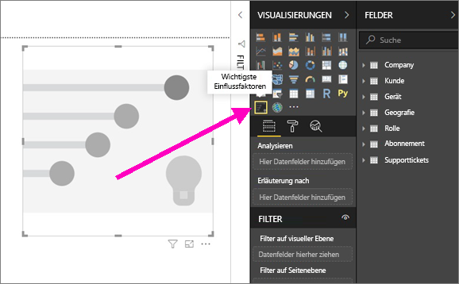

2. Ziehen Sie die Metrik, die Sie analysieren möchten, in das Feld **Analyse**. Im Feld **Analyse** werden nur kategorische (also nicht kontinuierliche) Variablen unterstützt. Da unser Fokus darauf liegt, was Kunden dazu bewegt, eine **niedrige** Bewertung abzugeben, sollten Sie **Customer Table** > **Rating** (Kundentabelle > Bewertung) auswählen.    
3. Ziehen Sie dann die Felder, von denen Sie vermuten, dass sie sich auf die **Bewertung** auswirken, in den Bereich **Erläuterung nach**. Sie können beliebig viele Felder dorthin ziehen. Wir beginnen in diesem Fall mit den folgenden: 
    - Country-Region (Land/Region) 
    - Role in Org (Rolle in der Organisation) 
    - Subscription Type (Abonnementtyp) 
    - Company Size (Unternehmensgröße) 
    - wechseln     
4. Da in diesem Fall die negativen Bewertungen relevant sind, sollten Sie im Dropdownmenü von **What influences Rating to be** (Wodurch fällt die Bewertung folgendermaßen aus:) **Low** (Niedrig) auswählen.  

    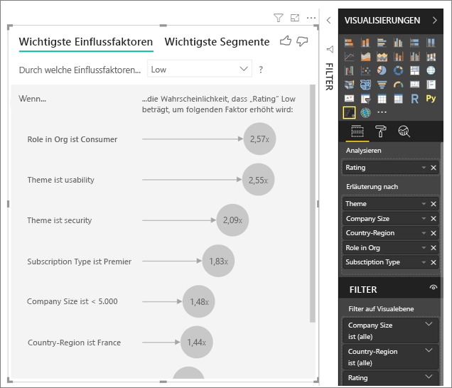

Die Analyse wird auf Tabellenebene des entsprechenden Felds ausgeführt. In diesem Fall ist die Metrik **Rating** (Bewertung) relevant, die auf Kundenebene definiert ist (jeder Kunde hat eine hohe oder niedrige Bewertung abgegeben). Alle erläuternden Faktoren für das Visual müssen auf Kundenebene definiert werden, damit sie verwendet werden können. 

Im obigen Beispiel weisen alle erläuternden Faktoren eine 1:1- oder eine n:1-Beziehung zur Metrik auf. So wird beispielsweise jeder Bewertung genau ein Thema zugeordnet (bei dem es sich um das Hauptthema der Kundenbewertung handelt). Gleichermaßen stammen die Kunden aus einem Land, weisen einen Mitgliedschaftstyp auf und haben eine Rolle in der Organisation inne. Bei den erläuternden Faktoren handelt es sich also um bestehende Attribute eines Kunden, sodass keine Transformation nötig ist. Das Visual kann die Attribute direkt verwenden. 

Im Verlauf des Tutorials werden komplexere Beispiele mit 1:n-Beziehungen behandelt. In solchen Fällen müssen Spalten zunächst auf Kundenebene aggregiert werden, bevor die Analyse ausgeführt werden kann.  

Measures und Aggregate, die als erläuternde Faktoren verwendet werden, werden in der Metrik **Analyse** ebenfalls auf Tabellenebene ausgewertet. Im weiteren Verlauf des Artikels finden Sie hierfür Beispiele. 

## Interpretieren von kategorischen wichtigen Einflussfaktoren 
Nun sehen wir uns die wichtigsten Einflussfaktoren für niedrige Bewertungen genauer an. 

### Faktor, der am wahrscheinlichsten zu einer niedrigen Bewertung führt

In unserer Organisation gibt es drei Rollen: Verbraucher, Administratoren und Herausgeber. Die Rolle des Verbrauchers führt dabei am wahrscheinlichsten zu einer niedrigen Bewertung 

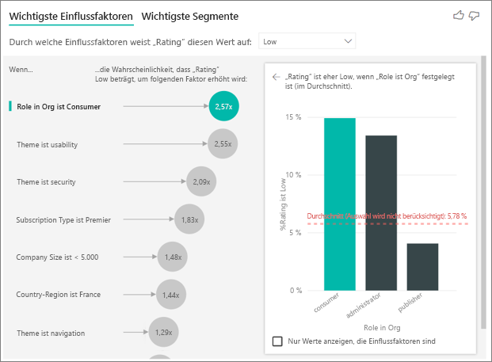

Genauer gesagt ist es 2,57-mal wahrscheinlicher, dass ein Verbraucher eine negative Bewertung abgibt. Auf dem Diagramm „Wichtige Faktoren“ wird **Role in Org** (Rolle in der Organisation) auf der linken Seite zuerst aufgeführt. Wenn Sie auf **Role in Org** (Rolle in der Organisation) klicken, zeigt Power BI zusätzliche Details im Bereich auf der rechten Seite an, unter anderem die Auswirkung verschiedener **Rollen** auf eine niedrige Bewertung im Vergleich.
  
- 14,93 % der Verbraucher geben eine niedrige Bewertung ab.  
- Im Durchschnitt geben nur 5,78 % aller anderen Rollen eine niedrige Bewertung ab. 
- Es ist daher 2,57-mal wahrscheinlicher, dass ein Verbraucher eine niedrige Bewertung abgibt (der Unterschied zwischen der grünen Leiste und der rot gepunkteten Linie). 

### Faktor, der am zweitwahrscheinlichsten zu einer niedrigen Bewertung führt

Mit dem Visual „Wichtige Einflussfaktoren“ können die Faktoren aus vielen verschiedenen Variablen verglichen und nach Rangfolge sortiert werden.  Der zweitgrößte Einflussfaktor unterscheidet sich sehr von **Role in Org** (Rolle in der Organisation).  Wählen Sie den zweitgrößten Einflussfaktor aus der Liste aus, **Theme is usability** (Thema ist gleich Benutzerfreundlichkeit). 

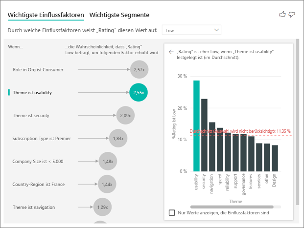

Hier sehen Sie, dass sich der zweitwichtigste Faktor auf das Thema der Kundenbewertung bezieht. Verbraucher, die Feedback zur *Benutzerfreundlichkeit* des Produkts abgegeben haben, haben 2,55-mal wahrscheinlicher eine schlechte Bewertung abgegeben als Kunden, die Feedback zu den Themen Zuverlässigkeit, Design oder Geschwindigkeit abgegeben haben. 

Der Durchschnitt (die rot gepunktete Linie) hat sich im Vergleich zum vorherigen Visual von 5,78 % auf 11,34 % geändert. Der Durchschnittswert ist dynamisch, da er auf dem Durchschnitt aus allen anderen Werten basiert. Beim wichtigsten Einflussfaktor wurde die Rolle „Verbraucher“ aus dem Durchschnitt ausgenommen, während beim zweitwichtigsten das Thema „Benutzerfreundlichkeit“ ausgenommen wurde. 
 
Wenn Sie das Kontrollkästchen unter dem Visual aktivieren, wird im Visual nur nach Einflussfaktoren gefiltert (in diesem Fall die Rollen, die zu einer niedrigen Bewertung führen). Sie müssen sich deshalb nicht mit allen zwölf Themen befassen, sondern nur mit den vier, die von Power BI als Ursache für niedrige Bewertungen ermittelt wurden. 

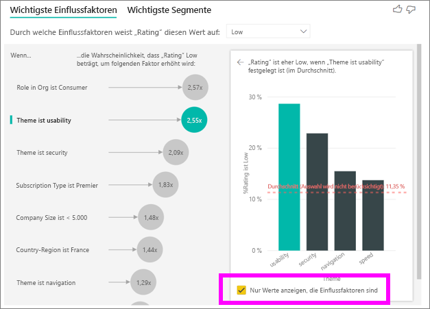

## Interaktion mit anderen Visuals 
 
Immer, wenn ein Benutzer auf einen Slicer, einen Filter oder ein anderes Visual im Zeichenbereich klickt, führt das Visual für wichtige Einflussfaktoren die Analyse für die neu ausgewählten Daten erneut aus. Sie können beispielsweise „Company Size“ (Unternehmensgröße) auf den Bericht ziehen und als Slicer verwenden. Nun möchten wir feststellen, ob die wichtigen Einflussfaktoren für Unternehmenskunden (Unternehmen mit über 50.000 Mitarbeitern) sich von denen der restlichen Kunden unterscheiden.  
 
Wenn Sie **> 50.000** auswählen, wird die Analyse erneut ausgeführt, und Sie werden feststellen, dass auch die Einflussfaktoren sich geändert haben. Bei großen Unternehmenskunden ist der wichtigste Einflussfaktor für eine niedrige Bewertung das **Thema** **Sicherheit**. Sie sollten nun weiter untersuchen, ob es bestimmte Sicherheitsfeatures gibt, mit denen große Kunden nicht zufrieden sind. 

## Interpretieren von kontinuierlichen wichtigen Einflussfaktoren 
 
Bisher haben wir das Visual verwendet, um zu ermitteln, wie unterschiedliche kategorische Felder sich auf niedrige Bewertungen auswirken. Sie können jedoch auch kontinuierliche Faktoren (z.B. Alter, Dauer, Preis) in „Erläuterung nach“ einbeziehen. Beobachten Sie, was geschieht, wenn Sie „Tenure“ (Verwendungsdauer) von „Customer Table“ (Kundentabelle) in „Erläuterung nach“ einbeziehen. Die Verwendungsdauer bezieht sich darauf, wie lange der Kunde den Dienst bereits verwendet. 
 
Aus den Daten ergibt sich, dass es bei einem höheren Wert für **Tenure** (Verwendungsdauer) auch wahrscheinlicher ist, dass eine niedrige Bewertung abgegeben wird. Daraus lässt sich ableiten, dass Langzeitkunden wahrscheinlicher eine negative Bewertung abgeben. Auf diese interessante Erkenntnis wird im Verlauf des Tutorials noch eingegangen.  
 
Aus dem Visual ist ersichtlich, dass die Wahrscheinlichkeit einer niedrigen Bewertung sich um das 1,23-fache erhöht, wenn die Verwendungsdauer um 13,44 Monate steigt. In diesem Fall stellen 13,44 Monate die Standardabweichung der Verwendungsdauer dar. Wir ziehen also Erkenntnisse daraus, wie sich das Erhöhen der Verwendungsdauer um eine Standardmenge (die Standardabweichung der Verwendungsdauer) auf die Wahrscheinlichkeit einer niedrigen Bewertung auswirkt. 
 
Das Streudiagramm auf der rechten Seite stellt den durchschnittlichen Prozentsatz der niedrigen Bewertungen für jeden Wert der Verwendungsdauer dar und enthält zudem eine Trendlinie, die für die Steigung steht.  

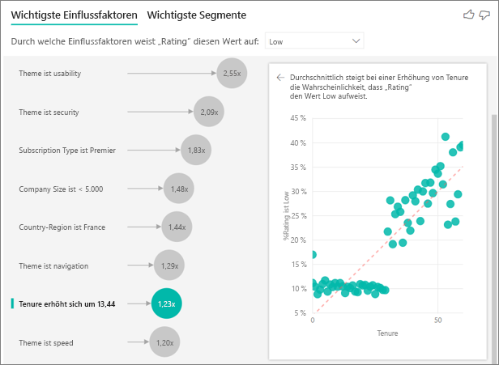

## Interpretieren von Measures und Aggregaten als wichtige Einflussfaktoren 
 
Benutzer können zudem Measures und Aggregate als erläuternde Faktoren in ihren Analysen verwenden. Nehmen Sie an, dass Sie herausfinden möchten, welche Auswirkung die Anzahl der Supporttickets oder die Öffnungsdauer eines Tickets auf die abgegebene Bewertung hat. 
 
In diesem Fall müssen Sie ermitteln, ob die Anzahl der Supporttickets, die ein Kunde erstellt, sich auf die Bewertung auswirkt. Hierfür beziehen wir die Supportticket-ID aus der Tabelle „Support Ticket“ (Supportticket) ein. Da ein Kunde mehrere Supporttickets öffnen kann, müssen wir die ID auf die Kundenebene aggregieren. Diese Aggregation ist wichtig, da die Analyse auf Kundenebene ausgeführt und alle Treiber deshalb auf dieser Ebene definiert werden müssen. 
 
Sehen wir uns die Anzahl der IDs an, sodass für jede Customer-Zeile die Anzahl der Supporttickets angezeigt wird, die dieser zugeordnet sind. In diesem Fall geht daraus hervor, dass mit dem Anstieg der Supporttickets auch die Wahrscheinlichkeit einer niedrigen Bewertung um das 5,51-fache steigt. Auf dem rechten Visual wird die durchschnittliche Anzahl von Supporttickets nach unterschiedlichen Rating-Werten (Auswertung auf Kundenebene) dargestellt. 

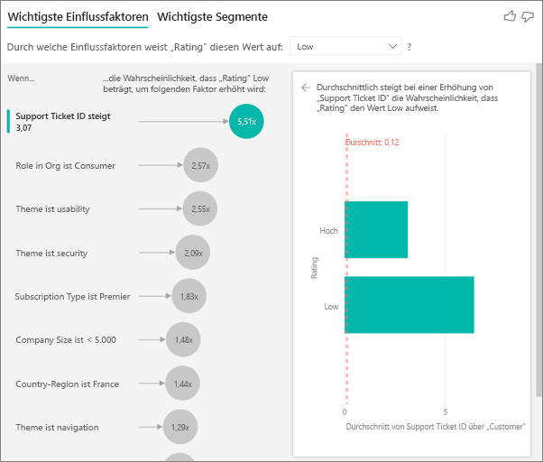

## Interpretieren der Ergebnisse: Wichtigste Segmente 
 
Während Benutzer die Faktoren auf der Registerkarte „Wichtige Einflussfaktoren“ einzeln bewerten können, kann auf der Registerkarte „Wichtigste Segmente“ dargestellt werden, wie eine Kombination dieser Faktoren sich auf die analysierte Metrik auswirkt. 
 
Auf der Registerkarte „Wichtigste Segmente“ wird zunächst ein Überblick über alle von Power BI ermittelten Segmente angezeigt. In diesem Beispiel wurden sechs Segmente ermittelt. Diese Segmente wurden nach dem Prozentsatz der niedrigen Bewertung innerhalb der einzelnen Segmente angeordnet. Daraus geht beispielsweise hervor, dass 74,3 % aller Kundenbewertungen in Segment 1 niedrig sind.  Je höher der Kreis positioniert ist, desto größer ist der Anteil der niedrigen Bewertungen. Die Größe des Kreises gibt an, wie viele Kunden in einem Segment vorhanden sind. 

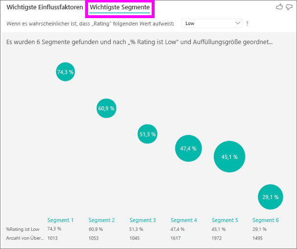

Wenn Sie auf einen Kreis klicken, werden die Details zu diesem Segment angezeigt. Wenn Sie beispielsweise Segment 1 auswählen, wird ersichtlich, dass es sich bei den Benutzern um längerfristige Kunden (über 29 Monate) handelt, die viele Supporttickets eröffnen (über 4). Außerdem handelt es sich bei diesen Benutzern nicht um Herausgeber – es muss sich also um Verbraucher oder Administratoren handeln.  
 
74,3 % der Benutzer in dieser Gruppe haben eine niedrige Bewertung abgegeben. Im Durschnitt geben 11,7 % aller Benutzer eine negative Bewertung ab. In diesem Segment ist der Anteil der niedrigen Bewertung also erheblich größer (um knapp 63 %). Segment 1 enthält zudem 2,2 % aller Daten und stellt damit einen adressierbaren Anteil aller Benutzer dar. 

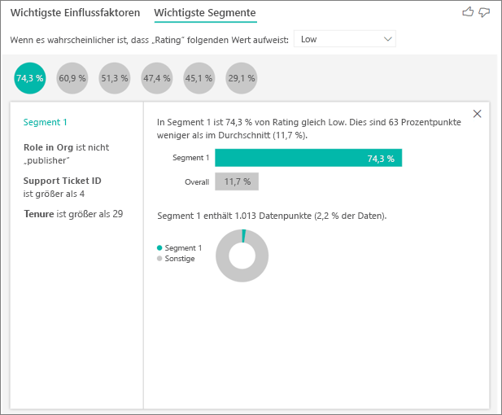

## Zu beachtende Aspekte und Problembehandlung 
 
**Welche Einschränkungen sind in der Vorschauversion vorhanden?** 
 
Das Visual „Wichtige Einflussfaktoren“ befindet sich derzeit in der Vorschauversion. Deshalb gibt es für Benutzer einige Einschränkungen. Derzeit sind folgende Funktionen nicht verfügbar: 
- Das Analysieren von Metriken, die Aggregate oder Measures sind 
- Das Verwenden des Visuals in Power BI Embedded 
- Das Verwenden des Visuals in Power BI Mobile 
- Unterstützung von RLS 
- Unterstützung von DirectQuery 
- Unterstützung von Liveabfragen 
 
**Es wird ein Fehler angezeigt, dass keine Einflussfaktoren bzw. Segmente gefunden wurden. Wieso?**  

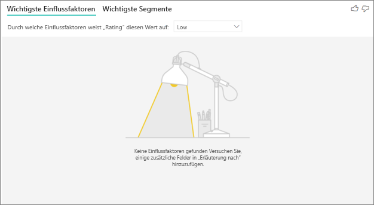

Dieser Fehler tritt auf, wenn Sie Felder in **Erläuterung nach** eingeschlossen haben, aber keine Einflussfaktoren gefunden wurden.   
- Sie haben die analysierte Metrik in „Analysieren“ und „Erläuterung nach“ eingeschlossen (Sie sollten diese aus **Erläuterung nach** entfernen). 
- Die erläuternden Felder enthalten zu viele Kategorien, in denen nur wenige Beobachtungen vorhanden sind. Dadurch kann das Visual die Einflussfaktoren nicht bestimmen, da eine Generalisierung nicht anhand weniger Beobachtungen stattfinden kann. 
- Die erläuternden Faktoren enthalten zwar ausreichend Beobachtungen für eine Generalisierung, aber das Visual konnte keine sinnvollen Korrelationen ermitteln, aus denen ein Bericht erstellt werden kann. 
 
**Es wird ein Fehler angezeigt, dass die zu analysierende Metrik nicht genügend Daten für eine Analyse enthält. Wieso?**  

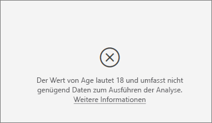

Das Visual vergleicht die Muster in den Daten einer Gruppe (z.B. Kunden, die eine niedrige Bewertung abgegeben haben) mit denen anderer Gruppen (z.B. Kunden, die eine hohe Bewertung abgegeben haben). Wenn die Daten in Ihrem Modell nur wenige Beobachtungen enthalten, können nur schwer Muster ermittelt werden. Wenn im Visual nicht genügend Daten enthalten sind, um aussagekräftige Einflussfaktoren zu ermitteln, wird angezeigt, dass mehr Daten benötigt werden, um die Analyse durchzuführen. Es wird empfohlen, mindestens 100 Beobachtungen für den ausgewählten Status (Kunden, die wechseln) und mindestens 10 Beobachtungen für den Vergleichsstatus (Kunden, die nicht wechseln) zu sammeln.  
 
**Es wird ein Fehler angezeigt, dass ein Feld in „Erläuterung nach“ keine eindeutige Beziehung zu der Tabelle aufweist, die die analysierte Metrik enthält. Wieso?**  
 
Die Analyse wird auf Tabellenebene des entsprechenden Felds ausgeführt. Wenn Sie beispielsweise Kundenfeedback für Ihren Dienst analysieren, besitzen Sie möglicherweise eine Tabelle, aus der hervorgeht, ob ein Kunde eine hohe oder eine niedrige Bewertung abgegeben hat. In diesem Fall wird die Analyse auf Ebene der Kundentabelle durchgeführt. 

Wenn Sie eine verknüpfte Tabelle besitzen, die auf einer präziseren Ebene als die Tabelle, die Ihre Metrik enthält, definiert ist, wird dieser Fehler ausgelöst. Hier finden Sie ein Beispiel für dieses Szenario: 
 
- Sie analysieren, was Kunden dazu bewegt, eine niedrige Bewertung für Ihren Dienst abzugeben. 
- Sie möchten wissen, ob das Gerät, auf dem Ihre Kunden den Dienst verwenden, sich auf die Bewertung auswirkt. 
- Kunden können den Dienst auf unterschiedlichen Geräten verwenden.   
- Im folgenden Beispiel verwendet Kunde 10000000 sowohl einen Browser als auch ein Tablet, um auf den Dienst zuzugreifen. 

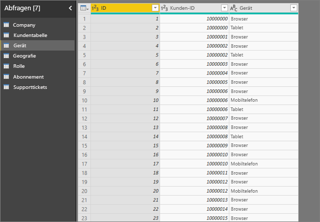

Wenn Sie versuchen, die Spalte „device“ als erläuternden Faktor zu verwenden, wird folgender Fehler angezeigt: 

Das liegt daran, dass „device“ nicht auf Kundenebene definiert ist, denn ein Kunde kann den Dienst auf mehreren Geräten nutzen. Damit das Visual Muster ermitteln kann, muss „device“ ein Attribut von „customer“ sein. In diesem Fall gibt es je nach Einschätzung mehrere mögliche Lösungsansätze: 
 
- Sie können die Zusammenfassung von „device“ beispielsweise auf die Anzahl festlegen, wenn Sie denken, dass sich die Anzahl der Geräte auf die Bewertung des Kunden auswirkt. 
- Sie können die Spalte „device“ pivotieren, um festzustellen, ob die Verwendung des Geräts auf einem bestimmten Gerät sich auf die Kundenbewertung auswirkt.  
 
In diesem Beispiel wurden die Daten pivotiert, sodass die neuen Spalten „browser“, „mobile“ und „tablet“ erstellt wurden. Diese können nun in „Erläuterung nach“ verwendet werden. Daraus ergibt sich, dass alle Geräte Einflussfaktoren sind. Der Browser hat hierbei jedoch die größte Auswirkung auf die Kundenbewertung. 

Genauer gesagt geben Kunden, die den Dienst nicht über den Browser verwenden, 3,79-mal wahrscheinlicher eine niedrige Bewertung ab. Weiter unten in der Liste wird ersichtlich, dass dies umgekehrt auf mobile Geräte zutrifft. Kunden, die die mobile App verwenden, geben wahrscheinlicher eine niedrige Bewertung ab.  

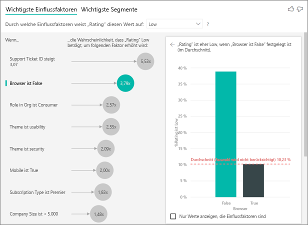

**Es wird ein Fehler angezeigt, dass die Measures nicht in die Analyse einbezogen wurden. Wieso?** [2052261] 

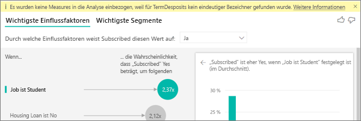

Die Analyse wird auf Tabellenebene des entsprechenden Felds ausgeführt. Wenn Sie die Abwanderung von Kunden analysieren, haben Sie möglicherweise eine Tabelle erstellt, die aussagt, ob ein Kunde den Anbieter gewechselt hat. In diesem Fall wird die Analyse auf Ebene der Kundentabelle durchgeführt.
 
Measures und Aggregate werden standardmäßig auf Tabellenebene analysiert. Wenn Sie ein Measure für die durchschnittlichen monatlichen Ausgaben erstellt hätten, würde dieses auf Ebene der Kundentabelle analysiert werden.  

Wenn die Kundentabelle keinen eindeutigen Bezeichner aufweist, können deren Measures nicht ausgewertet werden, und die Tabelle wird aus der Analyse ausgeschlossen. Sie können dieses Problem vermeiden, indem Sie der Tabelle, die Ihre Metrik enthält (in diesem Fall die Kundentabelle), einen eindeutigen Bezeichner aufweist (z.B. Kunden-ID). Mithilfe von Power Query können Sie zudem einfach eine Indexspalte hinzufügen.
 
**Es wird eine Warnung angezeigt, dass die analysierte Metrik mehr als 10 eindeutige Werte aufweist und somit die Qualität der Analyse beeinträchtigen kann. Wieso?**  

Das KI-Visual wurde für die Analyse von Kategorien optimiert, z.B. für „Wechsel ist gleich Ja/Nein“ oder „Kundenzufriedenheit ist gleich Hoch/Mittel/Niedrig“. Wenn Sie die Anzahl der zu analysierenden Kategorien erhöhen, gibt es weniger Beobachtungen pro Kategorie. Dadurch wird es dem Visual erschwert, Muster in den Daten zu ermitteln. 

Es wird empfohlen, ähnliche Werte in einer einzigen Einheit zu gruppieren, um aussagekräftigere Einflussfaktoren zu ermitteln. Wenn Sie beispielsweise eine Metrik für den Preis besitzen, erhalten Sie wahrscheinlich bessere Ergebnisse, wenn Sie ähnliche Preise in Buckets wie „Hoch“, „Mittel“ oder „Niedrig“ gruppieren, anstatt einzelne Preispositionen zu verwenden. 

**In den Daten sind Faktoren vorhanden, bei denen es sich nicht um wichtige Einflussfaktoren handelt, obwohl sie es sein sollten. Wie kann es dazu kommen?**

Im folgenden Beispiel sehen Sie, dass die Kunden, bei denen es sich um Verbraucher handelt, für die niedrigsten Bewertungen sorgen (14,93 % aller niedrigen Bewertungen). Interessanterweise ist der Anteil der niedrigen Bewertungen bei der Benutzern mit der Rolle Administrator ebenfalls hoch (13,42 %), aber diese werden nicht als Einflussfaktoren gewertet. 

Das liegt daran, dass das Visual bei der Ermittlung von Einflussfaktoren auch die Anzahl der Datenpunkte berücksichtigt. In diesem Beispiel gibt es zehnmal so viele Verbraucher (ca. 29.000) wie Administratoren (ca. 2900). Zudem haben nur 390 Administratoren eine niedrige Bewertung abgegeben. Das Visual enthält also nicht genügend Daten, um zu bestimmen, ob bei den Administratoren wirklich ein Muster vorliegt oder ob es sich um einen Zufall handelt.  

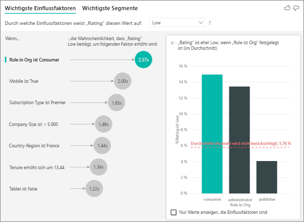

**Wie werden die wichtigen Einflussfaktoren berechnet?**

Das KI-Visual führt im Hintergrund eine logistische Regression aus, um die wichtigen Einflussfaktoren zu berechnen. Bei einer logistischen Regression handelt es sich um ein Statistikmodell, das verschiedene Gruppen miteinander vergleicht. Während wir uns darauf konzentrieren, was Benutzer zu niedrigen Bewertungen bewegt, ermittelt die logistische Regression, was der Unterschied zwischen den Kunden ist, die eine niedrige oder eine hohe Bewertung abgegeben haben. Wenn mehrere Kategorien vorhanden wären (hohe Bewertung, neutrale Bewertung, niedrige Bewertung), würden wir ermitteln, was der Unterschied zwischen den Kunden ist, die eine hohe, neutrale oder niedrige Bewertung abgegeben haben. 
 
Die logistische Regression sucht in den Daten nach Mustern, um zu ermitteln, welcher Unterschied zwischen den Kunden besteht, die eine niedrige oder hohe Bewertung abgegeben haben. So wird möglicherweise ermittelt, dass Kunden, die viele Supporttickets öffnen, einen höheren prozentualen Anteil an den niedrigen Bewertungen ausmachen als die Kunden, die wenige oder keine Supporttickets öffnen.
 
Bei der logistischen Regression wird auch die Anzahl der Datenpunkte berücksichtigt. Wenn Kunden mit Administratorrolle beispielsweise anteilig mehr negative Bewertungen abgeben, aber es nur sehr wenige Administratoren gibt, wird dieser Faktor nicht als Einflussfaktor gewertet, weil nicht genügend Datenpunkte vorliegen, um ein Muster abzuleiten. Es wird ein statistischer Test (Wald-Test) verwendet, um zu bestimmen, ob ein Faktor als Einflussfaktor gewertet werden kann. Im Visual wird ein p-Wert von 0,05 verwendet, um den Schwellenwert zu berechnen. 
 
**Wie werden Segmente berechnet?**

Das KI-Visual führt im Hintergrund eine Entscheidungsstruktur aus, um interessante Untergruppen zu ermitteln. Das Ziel der Entscheidungsstruktur besteht darin, eine Untergruppe von Datenpunkten zu ermitteln, die in der relevanten Metrik relativ stark vertreten ist (z.B. Kunden, die eine niedrige Bewertung abgegeben haben). 

Die Entscheidungsstruktur analysiert jeden erläuternden Faktor und versucht zu ermitteln, welcher die beste Aufteilung bietet. Wenn die Daten z.B. so gefiltert werden, dass nur große Unternehmenskunden berücksichtigt werden, stellt sich beispielsweise die Frage, ob Kunden aussortiert werden, die eine hohe bzw. niedrige Bewertung abgegeben haben. Weiterhin stellt sich die Frage, ob es sich als besser erweist, die Daten so zu filtern, dass nur Kunden berücksichtigt werden, die eine Bewertung zum Thema Sicherheit abgegeben haben. 

Sobald die Entscheidungsstruktur eine Aufteilung vornimmt, wird diese Untergruppe von Daten (z.B. Kunden, die eine Bewertung zum Thema Sicherheit abgegeben haben) analysiert, um die nächstbeste Aufteilung für diese Daten zu ermitteln. Nach jeder Aufteilung wird ebenfalls analysiert, ob in der aktuellen Aufteilung genügend Datenpunkte vorliegen und diese somit als repräsentative Gruppe in Frage kommt, von der ein Muster abgeleitet werden kann. Es könnte sich aber auch um eine Anomalie in den Daten und somit nicht um ein zu berücksichtigendes Segment handeln. (Ein weiterer statistischer Test mit dem p-Wert 0,05 wird durchgeführt, um die statistische Relevanz der Aufteilungsbedingung zu überprüfen.) 

Nach der Ausführung der Entscheidungsstruktur werden aus allen Aufteilungen (Feedback zur Sicherheit, große Unternehmen) Power BI-Filter erstellt. Diese Filter werden im Visual zu einem Segment kombiniert. 
 
**Warum werden bestimmte zu Einflussfaktoren bzw. aus den Einflussfaktoren entfernt, wenn mehr Felder in „Erläuterung nach“ gezogen werden?**

Das Visual wertet alle erläuternden Faktoren zusammen aus. Das bedeutet, dass ein Faktor einzeln als Einflussfaktor zählen kann, zusammen mit anderen Faktoren jedoch möglicherweise nicht. Angenommen, Sie möchten analysieren, wodurch der Preis eines Hauses steigt und haben dabei die erläuternden Faktoren „Schlafzimmer“ und „Fläche“: 
- Als einzelner Faktor kann die Anzahl der Schlafzimmer den Preis eines Hauses erhöhen. 
- Wenn die Fläche in die Analyse einbezogen wird, bedeutet das, dass analysiert wird, wie sich die Schlafzimmer auswirken, während die Fläche des Hauses konstant bleibt. 
- Wenn die Fläche des Hauses auf 1500 Quadratfuß (ca. 140 m²) festgelegt wird, ist es unwahrscheinlich, dass der Preis für das Haus erheblich steigt, weil die Anzahl der Schlafzimmer erhöht wird. Die Schlafzimmer sind also ein weniger wichtiger Faktor, wenn auch die Fläche des Hauses mit einbezogen wird. 

## Nächste Schritte
[Kombinationsdiagramm in Power BI](power-bi-visualization-combo-chart.md)

[Visualisierungstypen in Power BI](power-bi-visualization-types-for-reports-and-q-and-a.md)
