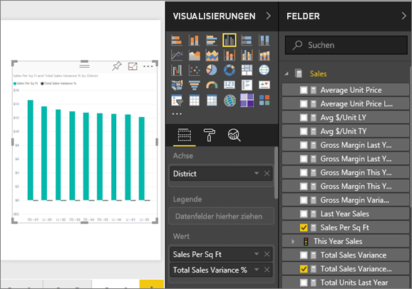
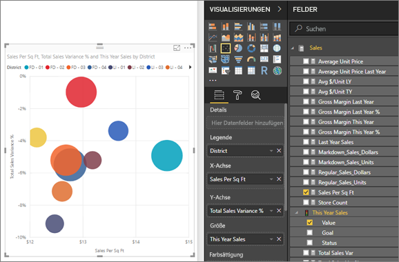
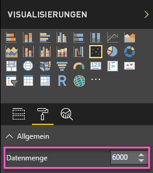
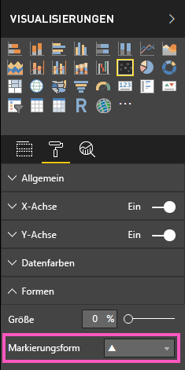
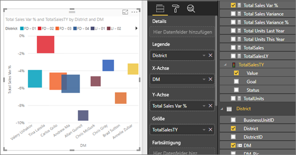
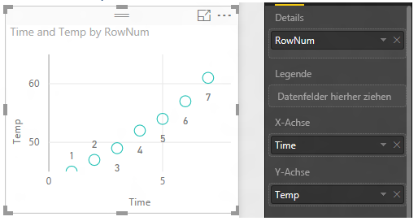
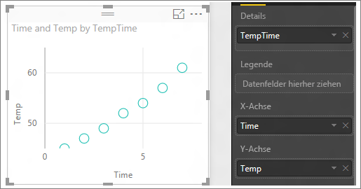

# Punktdiagramme, Punktplotdiagramme und Blasendiagramme in Power BI
Ein Punktdiagramm weist immer zwei Wertachsen auf, sodass ein Satz von numerischen Daten entlang einer horizontalen Achse und ein anderer Satz von numerischen Werten entlang einer vertikalen Achse angezeigt werden. Das Diagramm zeigt Schnittpunkte von x- und y-Zahlenwerten an, wobei diese Werte in jeweils einem einzelnen Punkt kombiniert werden. Diese Datenpunkte können in Abhängigkeit von den Daten gleichmäßig oder ungleichmäßig auf der horizontalen Achse verteilt sein.

In einem Blasendiagramm werden Datenpunkte durch Blasen ersetzen, hierbei repräsentiert die *Größe* der Blase eine zusätzliche Dimension der Daten.

Ein Punktplotdiagramm ähnelt einem Blasen- und einem Punktdiagramm mit der Ausnahme, dass numerische oder Kategoriedaten entlang der X-Achse dargestellt werden können. 

Sie können die Anzahl der Datenpunkte auf maximal 10.000 festlegen.  

## Wann sollte ein Punktdiagramm oder ein Blasendiagramm verwendet werden?
### Punktdiagramme sind in folgenden Fällen gut geeignet:
* Zum Anzeigen von Beziehungen zwischen zwei (Punktdiagramm) oder drei (Blasendiagramm) **numerischen** Werten.
* Zum Darstellen zweier Gruppen von Zahlen als eine Reihe von XY-Koordinaten.
* Anstelle eines Liniendiagramm, wenn Sie die Skalierung der horizontalen Achse ändern möchten.    
* Zum Darstellen der horizontalen Achse in logarithmischer Skalierung.
* Zum Anzeigen von Arbeitsblattdaten, die Paare oder gruppierte Werte enthalten. In einem Punktdiagramm können Sie die unabhängigen Skalierungen der Achsen anpassen, um weitere Informationen zu den gruppierten Werten anzugeben.
* Um Muster in großen Mengen von Daten aufzuzeigen, z. B. lineare oder nicht lineare Trends, Ansammlungen oder Ausreißer.
* Um große Mengen von Datenpunkten ohne Berücksichtigung der Zeit zu vergleichen.  Je mehr Daten Sie in ein Punktdiagramm aufnehmen, desto bessere Vergleiche können Sie vornehmen.

### Blasendiagramme sind in folgenden Fällen gut geeignet:
* Wenn Ihre Daten drei Datenreihen aufweisen, die jeweils einen Satz von Werten enthalten.
* Zum Präsentieren von Finanzdaten.  Unterschiedliche Blasengrößen sind nützlich zum optischen Hervorheben bestimmter Werte.
* Für die Verwendung mit Quadranten.

### Im folgenden Fall sind Punktplotdiagramme eine hervorragende Alternative zu einem Punkt- oder Blasendiagrammen:
* Sie möchten Kategoriedaten entlang der X-Achse einschließen

## Erstellen eines Punktdiagramms
In diesem Video sehen Sie, wie Will ein Punktdiagramm erstellt. Mit den unten beschriebenen Schritten können Sie dann selbst ein solches Diagramm erstellen.

<iframe width="560" height="315" src="https://www.youtube.com/embed/PVcfPoVE3Ys?list=PL1N57mwBHtN0JFoKSR0n-tBkUJHeMP2cP" frameborder="0" allowfullscreen></iframe>

In dieser Anleitung wird das Analysebeispiel für den Einzelhandel verwendet. Wenn Sie diese Schritte selbst ausführen möchten, [laden Sie das Beispiel für den Power BI-Dienst („app.powerbi.com“) oder Power BI Desktop herunter](../sample-datasets.md).   

1. Öffnen Sie den Bericht in der Bearbeitungsansicht, und klicken Sie auf das gelbe Plussymbol, um eine leere Berichtsseite zu erstellen.
 
2. Wählen Sie im Bereich „Felder“ die folgenden Felder aus:
   - **Umsätze** > **Umsätze pro Quadratmeter**
   - **Umsätze** > **Abweichungen der Gesamtumsätze in Prozent**
   - **Region** > **Region**

     

     Wenn Sie den Power BI-Dienst verwenden, achten Sie darauf, den Bericht in der [Bearbeitungsansicht](../service-interact-with-a-report-in-editing-view.md) zu öffnen.

3. Führen Sie eine Konvertierung in ein Punktdiagramm durch. Wählen Sie im Bereich „Visualisierungen“ das Symbol für das Punktdiagramm aus.

   .

4. Ziehen Sie **Region** von **Details** auf **Legende**. Es wird ein Punktdiagramm angezeigt, in dem die **Abweichungen des Gesamtumsatzes in Prozent** auf der Y-Achse und der **Umsatz pro Quadratmeter** auf der X-Achse dargestellt werden. Die Farben der Datenpunkte stellen die Regionen dar:

    

Nun fügen wir eine dritte Dimension hinzu.

## Erstellen eines Blasendiagramms

1. Ziehen Sie aus dem Bereich **Felder** die Option **Umsätze** > **Umsätze dieses Jahr** > **Wert** in den Bereich **Größe**. Die Datenpunkte werden zu Werten erweitert, die proportional zu den Umsatzwerten sind.
   
   

2. Zeigen Sie auf eine Blase. Die Größe der Blase gibt den Wert von **Umsätze dieses Jahr**an.
   
    

3. Wenn Sie die Anzahl der im Blasendiagramm anzuzeigenden Datenpunkte festlegen möchten, erweitern Sie im Abschnitt **Format** des Bereichs **Visualisierungen** die Karte **Allgemein**, und passen Sie die **Datenmenge** an. Sie können die maximale Datenmenge auf eine beliebige Zahl bis 10.000 festlegen. Sobald Sie höhere Zahlen erreichen, wird empfohlen, zuerst einen Test durchzuführen, um gute Leistung sicherzustellen. 

     

   Durch eine größere Anzahl von Datenpunkten kann sich die Ladezeit verlängern. Daher sollten Sie, wenn Sie Berichte veröffentlichen, deren Datenmenge im oberen Bereich liegt, die Berichte im Web und auf mobilen Plattformen testen, um sicherzustellen, dass die Leistung den Erwartungen der Benutzer entspricht. 

4. Sie können [u.a. Visualisierungsfarben, Bezeichnungen, Titel, Hintergrund formatieren](service-getting-started-with-color-formatting-and-axis-properties.md). Zum [Verbessern der Barrierefreiheit](../desktop-accessibility.md) sollten Sie das Hinzufügen von Markierungsformen zu jeder Linie in Betracht ziehen. Die Verwendung einer anderen Markierungsform für jede Linie macht es den Benutzern des Berichts leichter, die Linien (oder Flächen) voneinander zu unterscheiden. Sie können zum Auswählen der Markierungsform die Karte **Formen** erweitern und dann eine Markierungsform auswählen.

      

   Sie können auch die Markierungsform in Raute, Dreieck oder Quadrat ändern:

   

## Erstellen eines Punktplotdiagramms
Um ein Punktplotdiagramm zu erstellen, ersetzen Sie das numerische Feld für die X-Achse durch ein Kategoriefeld.

Entfernen Sie im Bereich **X-Achse** das Feld **Verkäufe pro qm**, und ersetzen Sie es durch **Distrikt > DM**.
   

## Zu beachtende Aspekte und Problembehandlung

### **Das Punktdiagramm weist nur einen Datenpunkt auf**
Weist Ihr Punktdiagramm nur einen Datenpunkt auf, in dem alle Werte auf der X- und der Y-Achse zusammengefasst sind?  Oder werden alle Werte auf einer einzelnen horizontalen oder vertikalen Linie zusammengefasst?

Fügen Sie im Bereich **Details** ein Feld hinzu, sodass Power BI erkennt, wie die Werte gruppiert werden sollen. Das Feld muss für jeden Punkt, der dargestellt werden soll (z.B. eine einfache Zeilennummer oder ein ID-Feld), eindeutig sein.

Wenn dies mit Ihren Daten nicht möglich ist, erstellen Sie ein Feld, in dem die X- und Y-Werte für jeden Punkt auf individuelle Weise dargestellt werden:

Um ein neues Feld zu erstellen, [fügen Sie mit dem Abfrage-Editor von Power BI Desktop dem Dataset eine Indexspalte hinzu](../desktop-add-custom-column.md).  Fügen Sie diese Spalte dann dem Bereich **Details** Ihrer Visualisierung hinzu.

## Nächste Schritte

[High density scatter charts (Stichprobenentnahme mit hoher Dichte in Punktdiagrammen)](desktop-high-density-scatter-charts.md)

[Visualisierungstypen in Power BI](power-bi-visualization-types-for-reports-and-q-and-a.md)

