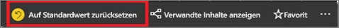
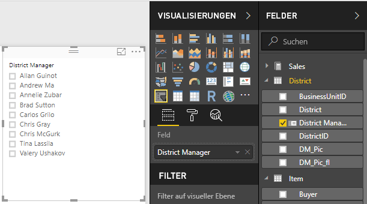
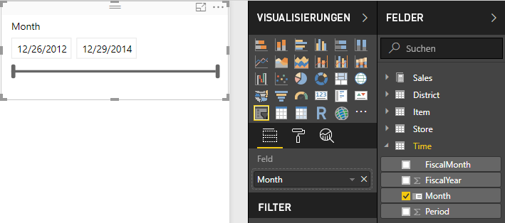
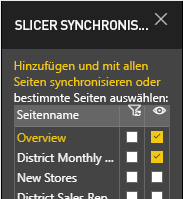
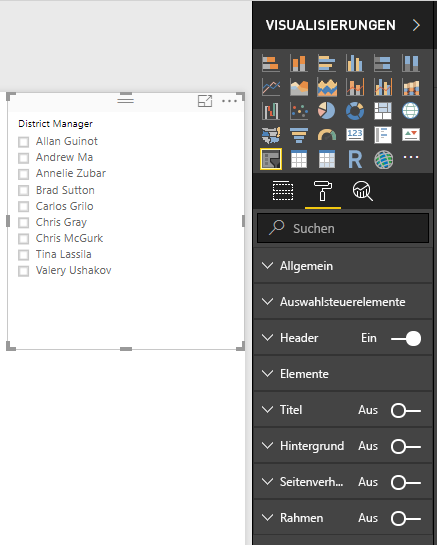
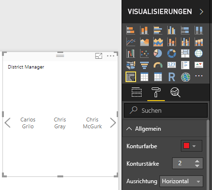
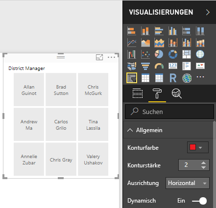
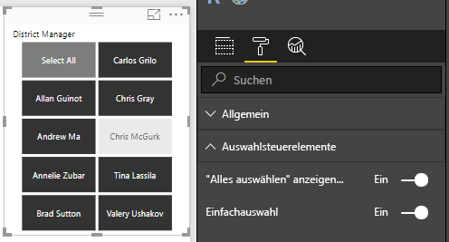
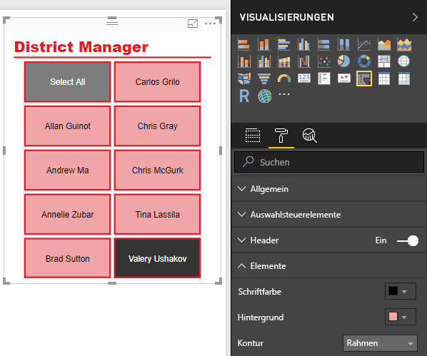

# Slicer in Power BI
Die Leser des Berichts sollen die gesamten Vertriebsmetriken ansehen können, aber auch die Leistung einzelner Bezirksleiter und unterschiedliche Zeitrahmen hervorheben können. Sie könnten separate Berichte oder vergleichende Diagramme erstellen. Alternativ könnten Sie auch Slicer verwenden. Ein Slicer stellt eine Alternative zur Filterung dar. Er schränkt den Teil des Datasets ein, das in den anderen Visualisierungen in einem Bericht angezeigt wird. 

In diesem Tutorial werden anhand des kostenlosen [Analysebeispiels für den Einzelhandel](../sample-retail-analysis.md) die Erstellung und Formatierung eines Slicers sowie die Verwendung des Slicers für Listen und Datumsbereiche erläutert. Viel Vergnügen beim Entdecken der Möglichkeiten zum Formatieren und Verwenden von Slicern! 

## Verwenden von Slicern
Slicer sind für folgende Zwecke gut geeignet:

* Anzeigen häufig verwendeter oder wichtiger Filter für den einfacheren Zugriff im Zeichenbereich des Berichts.
* Einfacheres Anzeigen des aktuellen gefilterten Zustands, ohne dass das Öffnen einer Dropdownliste erforderlich ist. 
* Filtern nach Spalten, die nicht benötigt und in den Datentabellen ausgeblendet werden.
* Erstellen fokussierterer Berichte durch das Einfügen von Slicern neben wichtigen visuellen Elementen.

Power BI-Slicer weisen die folgenden Einschränkungen auf:

- Slicer unterstützen keine Eingabefelder.
- Slicer können nicht an ein Dashboard angeheftet werden.
- Drilldown wird für Slicer nicht unterstützt.
- Slicer unterstützen keine Filter auf visueller Ebene.

## Erstellen von Slicern

Wenn Sie einen neuen Slicer erstellen möchten, können Sie das Slicersymbol und anschließend das Datenfeld für die Filterung auswählen (Sie können es auch im Bereich **Visualisierungen** in das Feld **Felder** ziehen). Alternativ können Sie das Datenfeld zur Erstellung einer Visualisierung zunächst auswählen oder ziehen und anschließend das Slicersymbol auswählen, um die Visualisierung in einen Slicer zu konvertieren. Mit unterschiedlichen Datentypen werden individuelle Slicertypen erstellt, die verschiedene Effekte und Optionen aufweisen. 

Wenn Sie einen Bericht zum ersten Mal ändern, leuchtet die Schaltfläche **Auf Standardwert zurücksetzen** auf. Dies soll Sie daran erinnern, dass Sie eine Änderung an den ursprünglichen Berichtseinstellungen vorgenommen haben. Wenn Sie die Ansicht wechseln, wird diese Änderung gespeichert (beibehalten). Wenn Sie zum Bericht zurückkehren, müssen Sie diesen nicht neu unterteilen.  Wenn Sie jedoch den Bericht auf die Standardeinstellungen des Autors zurücksetzen möchten, klicken Sie auf der oberen Menüleiste auf die Schaltfläche **Auf Standardwert zurücksetzen**.

> [!NOTE]
> Wenn die Schaltfläche **Auf Standardwert zurücksetzen** deaktiviert bleibt, bedeutet dies entweder, dass der Berichtsautor das Feature für den Bericht deaktiviert hat oder dass der Bericht ein benutzerdefiniertes Visual enthält. Zeigen Sie einfach mit dem Mauszeiger auf die Schalfläche, um die QuickInfo mit einer Erklärung anzuzeigen. 

**So erstellen Sie einen neuen Slicer zum Filtern von Daten nach Bezirksleiter**

1. Öffnen Sie in Power BI Desktop oder im Power BI-Dienst das [Analysebeispiel für den Einzelhandel](../sample-retail-analysis.md). (Wählen Sie im Power BI-Dienst oben links die Option **Bericht bearbeiten** aus.)
2. Wählen Sie auf der Seite **Übersicht**, auf der im Zeichenbereich keine Auswahl getroffen wurde, im Bereich **Visualisierungen** das Symbol  **Slicersymbol** aus, um einen neuen Slicer zu erstellen. 
3. Wählen Sie nach der Auswahl des neuen Slicers im Bereich **Felder** unter **Bezirk** den **Bezirksleiter** aus, um den Slicer aufzufüllen. Der neue Slicer besteht aus einer Liste mit Auswahlfeldern vor den Namen. 
    
    
    
4. Ändern Sie die Größe, und ziehen Sie den Slicer sowie andere Elemente in den Zeichenbereich, um Platz für den Slicer zu machen. Beachten Sie, dass die Slicerelemente abgeschnitten werden, wenn Sie den Slicer zu stark verkleinern. 
5. Wählen Sie Namen im Slicer aus, und beachten Sie die Auswirkungen auf die anderen Visualisierungen auf der Seite. Wählen Sie Namen erneut aus, wenn Sie diese abwählen möchten. Halten Sie die Taste **STRG** gedrückt, wenn Sie mehrere Namen auswählen möchten. Die Auswahl sämtlicher Namen hat die gleiche Wirkung wie die Auswahl keiner Namen. 

>[!TIP]
>Slicerelemente für Listen werden standardmäßig in aufsteigender alphanumerischer Reihenfolge sortiert. Wenn Sie die Sortierreihenfolge in eine absteigende Reihenfolge umkehren möchten, wählen Sie in der rechten oberen Ecke des Slicers die Ellipsen (**...**) und anschließend in der Dropdownliste **Sort by District Manager** (nach Bezirksleiter sortieren) aus. 

**So erstellen Sie einen neuen Slicer zum Filtern von Daten nach Datumsbereich**

1. Öffnen Sie, ohne dass im Zeichenbereich eine Auswahl getroffen wurde, das Dropdownfeld **Zeit** im Bereich „Felder“, und ziehen Sie **Monat** (im Power BI-Dienst **Datum**) im Bereich „Visualisierungen“ in das Feld **Werte**, um eine neue Visualisierung zu erstellen.
2. Wählen Sie nach der Auswahl der neuen Visualisierung das Symbol **Slicer** aus, um die neue Visualisierung in einen Slicer zu konvertieren. Dieser Slicer stellt ein Schieberegler-Steuerelement mit ausgefülltem Datumsbereich dar.
    
    
    
4. Ändern Sie die Größe, und ziehen Sie den Slicer sowie andere Elemente in den Zeichenbereich, um Platz für den Slicer zu machen. Beachten Sie, dass sich die Größe des Schiebereglers abhängig von der Größe des Slicers ändert. Eine zu starke Verkleinerung des Slicers führt jedoch dazu, dass der Schieberegler verschwindet und die Datumsangaben abgeschnitten werden. 
4. Wählen Sie mit dem Schieberegler unterschiedliche Datumsbereiche aus, oder wählen Sie ein Datumsfeld aus, um für eine genauere Auswahl einen Wert einzugeben oder einen Kalender in einem Popup-Menü zu öffnen. Beachten Sie die Auswirkungen auf die anderen Visualisierungen auf der Seite.
    
    >[!NOTE]
    >Numerische Datentypen und Datentypen des Typs „Datum/Uhrzeit“ erzeugen standardmäßig Schieberegler-Slicer für Bereiche. Seit dem Power BI-Update im Februar 2018 werden Schieberegler für Bereiche mit Datentypen des Typs „Ganzzahl“ jetzt an ganzzahligen Werten ausgerichtet und nicht mit Dezimalstellen angezeigt. 

>[!TIP]
>Auch wenn das Datumsfeld **Monat** standardmäßig einen Schieberegler-Slicer für Bereiche des Typs **Zwischen** erzeugt, können Sie diesen in andere Slicertypen und Auswahloptionen ändern. Wenn Sie den Slicertyp bei dem ausgewählten Slicer ändern möchten, zeigen Sie mit dem Mauszeiger auf den rechten oberen Bereich, öffnen Sie das Dropdownfeld bei dem angezeigten Carat-Zeichen, und wählen Sie eine der anderen Optionen aus, z.B. **Liste** oder **Vorher**. Beachten Sie, wie sich die Darstellung des Slicers und die Auswahloptionen ändern. 

Weitere Informationen zum Erstellen von Slicern für Datumsbereiche und numerische Bereiche finden Sie unter [Verwenden der Funktion „Slicer für numerische Bereiche“ in Power BI Desktop](../desktop-slicer-numeric-range.md) oder im folgenden Video.
<iframe width="560" height="315" src="https://www.youtube.com/embed/zIZPA0UrJyA" frameborder="0" allowfullscreen></iframe> 

## Steuern der Auswirkungen von Slicern auf visuelle Seitenelemente
Auf Berichtsseiten haben Slicer standardmäßig auf alle anderen Visualisierungen auf dieser Seite Auswirkungen, auch untereinander. Beachten Sie die Auswirkungen auf die anderen Visualisierungen, wenn Sie gerade erstellte Werte in der Liste und Schieberegler für Datumsangaben auswählen. Die gefilterten Daten stellen eine Schnittmenge der Werte dar, die in beiden Slicern ausgewählt wurden. 

Mit der Option **Visual interactions** (visuelle Interaktionen) können Sie ausschließen, dass einige Seitenvisualisierungen von anderen beeinflusst werden. Auf der Seite **Übersicht** zeigt das Diagramm „Total Sales Variance by FiscalMonth and District Manager“ (Abweichung vom Gesamtumsatz nach Geschäftsmonat und Bezirksleiter) die gesamten Vergleichsdaten für Bezirksleiter nach Monat, die jederzeit sichtbar bleiben sollen. Sie können mit der Option **Visual interactions** (visuelle Interaktionen) verhindern, dass die Slicerauswahl dieses Diagramm filtert. 

1. Bei Auswahl des Slicers für Bezirksleiter:
    - Wählen Sie in Power BI Desktop unter **Visual Tools** das Menü **Format** und anschließend **Interaktionen bearbeiten** aus.
    - Öffnen Sie im Power BI-Dienst in der Menüleiste das Dropdownfeld **Interaktionen mit visuellen Elementen**, und aktivieren Sie **Interaktionen bearbeiten**. 
   
   Über allen anderen visuellen Elementen auf der Seite werden  angezeigt. Zu Beginn sind alle **Filtersymbole** ausgewählt.
   
2. Wählen Sie das Symbol **Keine** über dem Diagramm **Total Sales Variance by FiscalMonth and District Manager** (Abweichung vom Gesamtumsatz nach Geschäftsmonat und Bezirksleiter) aus, um die Filterung durch den Slicer zu beenden. 
3. Wählen Sie den Slicer für **Monat** und anschließend erneut das Symbol **Keine** über dem Diagramm **Total Sales Variance by FiscalMonth and District Manager** (Abweichung vom Gesamtumsatz nach Geschäftsmonat und Bezirksleiter) aus, um die Filterung durch den Slicer zu beenden. Wenn Sie in den Slicern Namen und Datumsbereiche ausgewählt haben, bleibt das Diagramm „Total Sales Variance by FiscalMonth and District Manager“ (Abweichung vom Gesamtumsatz nach Geschäftsmonat und Bezirksleiter) unverändert. 

Weitere Informationen zur Bearbeitung von Interaktionen finden Sie unter [Interaktionen mit visuellen Elementen in einem Power BI-Bericht](../service-reports-visual-interactions.md).

## Synchronisieren und Verwenden von Slicern auf anderen Seiten
Ab dem Power BI-Update von Februar 2018 können Sie einen Slicer synchronisieren und auf einer beliebigen Seite oder allen Seiten in einem Bericht verwenden. 

Im aktuellen Bericht ist auf der Seite **Monatsumsätze nach Bezirk** auch ein Slicer für **Bezirksleiter** vorhanden. Dieser wird jedoch nicht mit dem Slicer synchronisiert, den Sie auf der Seite **Übersicht** erstellt haben (die beiden Slicer können eine unterschiedliche Elementauswahl aufweisen). Auf der Seite **Neue Filialen** ist nur ein Slicer für **Filialnamen** vorhanden. Sie können Ihren neuen Slicer für **Bezirksleiter** auf diesen Seiten synchronisieren, damit sich die Auswahl von Slicern auf einer Seite auf die Visualisierungen auf allen drei Seiten auswirkt. 

1. Wählen Sie in Power BI Desktop im Menü **Ansicht** die Option **Slicer synchronisieren** aus (oder aktivieren Sie im Power BI-Dienst den Bereich **Slicer synchronisieren**). Der Bereich **Slicer synchronisieren** wird angezeigt. 
2. Wählen Sie auf der Seite **Übersicht** den Slicer für **Bezirksleiter** aus. Beachten Sie, dass die Seite **Monatsumsätze nach Bezirk** bereits in der Spalte **Sichtbar** ausgewählt wurde, da sich auf dieser Seite ebenfalls ein Slicer für Bezirksleiter befindet. In der Spalte **Synchronisieren** wurde die Seite jedoch nicht ausgewählt. 
    
    
    
3. Wählen Sie in der Spalte **Synchronisieren** die Seite **Neue Filialen** und anschließend die Seite **Monatsumsätze nach Bezirk** aus, um den Slicer für die **Übersicht** auf diesen Seiten zu synchronisieren. 
    
3. Wählen Sie in der Spalte **Sichtbar** die Seite **Neue Filialen** aus, und lassen Sie die Seite **Monatsumsätze nach Bezirk** ausgewählt. 
4. Beobachten Sie die Auswirkungen der Synchronisierung des Slicers und der Sichtbarmachung auf den anderen Seiten. Auf der Seite **Monatsumsätze nach Bezirk** zeigt der Slicer für **Bezirksleiter** jetzt die gleiche Auswahl wie auf der Seite **Übersicht** an. Auf der Seite **Neue Filialen** hat die Auswahl im Slicer für **Bezirksleiter** Auswirkungen auf die Auswahl, die im Slicer für **Filialnamen** verfügbar ist. 
    
    >[!TIP]
    >Der Slicer wird zwar auf den synchronisierten Seiten zunächst in der gleichen Größe und an der gleichen Position wie auf der ursprünglichen Seite angezeigt, Sie können die synchronisierten Slicer auf den verschiedenen Seiten jedoch unabhängig voneinander verschieben, formatieren und ihre Größe ändern. 

>[!NOTE]
>Wenn Sie einen Slicer auf einer Seite synchronisieren, dies auf dieser Seite jedoch nicht sichtbar machen, werden die Daten auf der Seite von den auf den anderen Seiten ausgewählten Slicern weiterhin gefiltert.
 
## Formatieren von Slicern
Abhängig vom Slicertyp sind verschiedene Formatierungsoptionen verfügbar. Wenn Sie die Ausrichtung **Horizontal**, das Layout **Dynamisch** und die Farbgebung für **Elemente** auswählen, können Sie anstelle von Standardlistenelementen Schaltflächen oder Kacheln erstellen und die Größe von Slicerelementen an verschiedene Bildschirmgrößen und Layouts anpassen.  

1. Wählen Sie bei dem ausgewähltem Slicer für **Bezirksleiter** auf einer Seite im Bereich **Visualisierungen** das Symbol **Format**  aus, um die Formatierungssteuerungen anzuzeigen. 
    
    
    
2. Klicken Sie neben den einzelnen anzuzeigenden Kategorien auf die Dropdown-Pfeile, und bearbeiten Sie die Optionen. 

### Allgemeine Optionen
1. Wählen Sie unter **Konturfarbe** die Farbe Rot aus, und ändern Sie **Konturstärke** in „2“. Wenn diese Option aktiviert ist, werden die Farbe und Stärke von Konturen und Unterstreichungen dadurch festgelegt. 
2. Die **Ausrichtung** **vertikal** ist die Standardeinstellung. Wählen Sie **Horizontal** aus, um einen Slicer mit horizontal angeordneten Kacheln oder Schaltflächen zu erzeugen sowie Scrollpfeile, über die auf Elemente zugegriffen werden kann, die nicht in den Slicer passen.
    
    
    
3. Aktivieren Sie das Layout **Dynamisch**, um die Größe und Anordnung der Slicerelemente entsprechend der Bildschirm- und Slicergröße zu ändern. Bei Slicern für Listen ist das dynamische Layout nur bei der horizontalen Ausrichtung verfügbar. Zudem wird verhindert, dass Elemente auf kleinen Bildschirmen abgeschnitten werden. Bei Schieberegler-Slicern für Bereiche wird durch die dynamische Formatierung die Art des Schiebereglers geändert. Zudem kann die Größe flexibler geändert werden. Beide Slicertypen werden zu sehr kleinen Filtersymbolen. 
    
    
    
    >[!NOTE]
    >Durch dynamische Layoutänderungen können bestimmte, von Ihnen festgelegte Formatierungen von Überschriften und Elementen überschrieben werden. 
    
4. Legen Sie die Position und Größe des Slicers unter **X-Position**, **Y-Position**, **Breite** und **Höhe** mit numerischer Genauigkeit fest, oder verschieben Sie den Slicer direkt im Zeichenbereich und ändern die Größe. Experimentieren Sie mit verschiedenen Größen und Anordnungen der Elemente, und beachten Sie, wie sich die dynamische Formatierung entsprechend ändert.  

    

Weitere Informationen zur horizontalen Ausrichtung und zum dynamischen Layout finden Sie unter [Erstellen eines dynamischen Slicers mit anpassbarer Größe in Power BI](../power-bi-slicer-filter-responsive.md).

### Optionen für Auswahlsteuerelemente (nur bei Slicern für Listen)
1. Die Anzeige von **Alles auswählen** ist standardmäßig deaktiviert (**Off**). Sie können sie aktivieren (**On**), um das Element **Alles auswählen** zum Slicer hinzuzufügen, über das beim Umschalten alle Elemente ausgewählt oder abgewählt werden können. Wenn alle Elemente ausgewählt sind, werden sie durch das Klicken oder Tippen auf ein Element wieder abgewählt, wodurch ein Filter vom Typ „is-not“ (Ist nicht) zugelassen wird. 
    
    
    
2. Die **Einfachauswahl** ist standardmäßig aktiviert (**On**). Durch Klicken oder Tippen auf die einzelnen Elemente werden diese ausgewählt. Wenn Sie die Taste **Strg** während des Klickens oder Tippens gedrückt halten, werden mehrere Elemente ausgewählt. Deaktivieren Sie die **Einfachauswahl** (**Off**), damit mehrere Elemente ausgewählt werden können, ohne dass die Taste **Strg** gedrückt werden muss. Durch erneutes Klicken oder Tippen auf die einzelnen Elemente werden diese wieder abgewählt. 

### Headeroptionen
Der **Header** ist standardmäßig eingeschaltet (**On**). Darin wird im oberen Bereich des Slicers der Datenfeldname angezeigt. 
1. Formatieren Sie den Headertext so, dass die **Schriftfarbe** Rot, die **Textgröße** 14 Pt. und die **Schriftfamilie** Arial Black ist. 
2. Wählen Sie unter **Kontur** die Option **Nur unten** aus, um einen Unterstrich in der unter **Allgemeine Optionen** festgelegten Größe und Farbe zu erzeugen. 

### Elementoptionen (nur bei Slicern für Listen)
1. Formatieren Sie Elementtext und den Hintergrund so, dass die **Schriftfarbe** Schwarz, der **Hintergrund** Hellrot, die **Textgröße** 10 Pt. und die **Schriftfamilie** Arial ist. 
2. Wählen Sie unter **Kontur** die Option **Rahmen** aus, um eine Umrandung für die einzelnen Elemente in der unter **Allgemeine Optionen** festgelegten Größe und Farbe zu zeichnen. 
    
    
    
    >[!TIP]
    >- Bei **Ausrichtung > Horizontal** zeigen abgewählte Elemente die ausgewählten Text- und Hintergrundfarben an, während ausgewählte Elemente den Systemstandard verwenden (in der Regel schwarzer Hintergrund mit weißem Text).
    >- Bei **Ausrichtung > Vertikal** zeigen Elemente immer die festgelegten Farben an, während Auswahlfelder immer schwarz sind, wenn sie ausgewählt werden. 

### Optionen für die Eingabe von Datumsangaben/numerischen Werten und Schieberegler-Optionen (nur bei Schieberegler-Slicern für Bereiche)
- Optionen für die Eingabe von Datumsangaben/numerischen Werten sind mit den Optionen für **Elemente** bei Slicern für Listen identisch. Eine Ausnahme besteht darin, dass keine **Kontur** und kein Unterstrich verwendet werden.
- Mit Schieberegler-Optionen können Sie die Farbe des Schiebereglers für Bereiche festlegen oder den Schieberegler deaktivieren (**Off**), sodass nur die numerischen Eingaben bleiben.

### Weitere Formatierungsoptionen
Die weiteren Formatierungsoptionen sind standardmäßig ausgeschaltet. Wenn sie eingeschaltet (**On**) sind: 
- **Titel**: Fügt im oberen Bereich des Slicers einen Titel hinzu und formatiert diesen (zusätzlich zu und unabhängig vom Header). 
- **Hintergrund**: Fügt eine Hintergrundfarbe zum gesamten Slicer hinzu und legt die Transparenz fest.
- **Seitenverhältnis**: Behält bei einer Größenänderung die Form des Slicers bei.
- **Rahmen**: Fügt einen 1-Pixel-Rahmen um den Slicer hinzu und legt die Farbe fest. (Dieser Slicerrahmen ist separat von den allgemeinen Einstellungen für Konturen; diese haben keinen Einfluss auf ihn.) 

## Nächste Schritte
[Registrieren Sie sich für eine kostenlose Testversion](https://powerbi.microsoft.com/get-started/)

Haben Sie Verbesserungsvorschläge für Power BI? [Vorschlag einreichen](https://ideas.powerbi.com/forums/265200-power-bi-ideas)

Weitere Fragen? [Wenden Sie sich an die Power BI-Community](http://community.powerbi.com/)

[Hinzufügen einer Visualisierung zu einem Bericht](power-bi-report-add-visualizations-i.md)

[Visualisierungstypen in Power BI](power-bi-visualization-types-for-reports-and-q-and-a.md)

[Power BI – Grundkonzepte](../service-basic-concepts.md)

