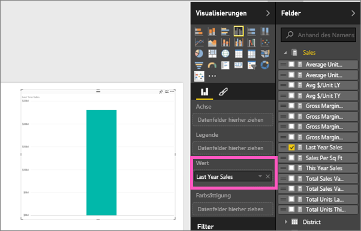
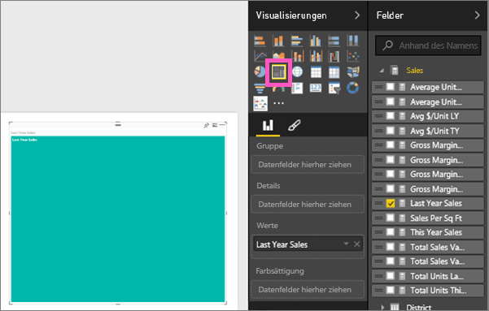
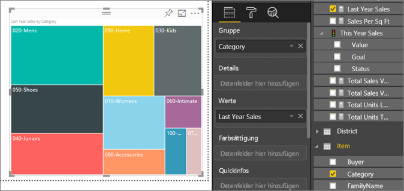
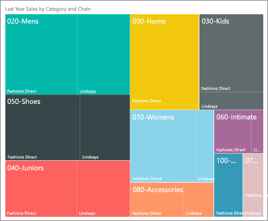

# Treemaps in Power BI
Treemaps zeigen hierarchische Daten als verschachtelten Rechtecke an.  Jede Hierarchieebene wird durch ein farbiges Rechteck (auch als „Verzweigung“ bezeichnet) dargestellt, das andere Rechtecke („Blätter“) enthält.  Die Größe der einzelnen Rechtecke hängt von den gemessenen Werten ab. Die Rechtecke werden von oben links (das Größte) nach unten rechts (das Kleinste) angeordnet.

Bei der Analyse der Verkäufe gibt es beispielsweise Rechtecke auf der obersten Ebene für die Bekleidungskategorien, die auch als *Verzweigungen* bezeichnet werden: **In der Stadt**, **Auf dem Land**, **Jugend** und **Mix**.  Die Rechtecke für die Kategorie werden in kleinere Rechtecke, die sogenannten *Blätter* unterteilt, die für die einzelnen Kleidungshersteller innerhalb dieser Kategorie stehen. Die Größe und Schattierungen dieser kleineren Rechtecke werden wiederum basierend auf den Verkaufszahlen angepasst.  

In dem Beispiel oben wurden zwar viele Kleidungsstücke von `Maximus` in der Verzweigung **In der Stadt** verkauft, dafür aber weniger von `Natura` und `Fama` und nur sehr wenige von `Leo`.  Demnach sieht das Treemap-Diagramm in diesem Beispiel für die Verzweigung **In der Stadt** wie folgt aus:
* Das größte Rechteck für `Maximus` befindet sich oben links in der Ecke.
* Die Rechtecke für `Natura` und `Fama` sind etwas kleiner.
* Es gibt viele Rechtecke für alle andere verkauften Kleidungsstücke. 
* Es gibt ein kleines Rechteck für `Leo`.  

Die Größe und Schattierung der einzelnen Blattknoten ermöglicht einen Vergleich der Verkaufszahlen. Je größer und dunkler schattiert das Rechteck ist, desto höher ist der Wert.

## Verwenden von Treemaps
Treemaps sind gut geeignet:

* Zum Anzeigen großer Mengen hierarchischer Daten
* Bei einer Anzahl von Werten, die für ein Balkendiagramm zu groß wäre
* Zum Darstellen des Verhältnisses zwischen den einzelnen Teilen und der Gesamtmenge
* Zum Anzeigen der Verteilung der einzelnen Werte innerhalb jeder Kategorieebene in der Hierarchie
* Zum Anzeigen von Attributen über Größe und Farbcodierung
* Zum Erkennen von Mustern, Ausreißern, den wichtigsten Einflussfaktoren und Ausnahmen

### Voraussetzungen
 - Power BI-Dienst oder Power BI Desktop
 - Analysebeispiel für den Einzelhandel

## Erstellen eines einfachen Treemap-Diagramms
Sie möchten sich zunächst einmal ansehen, wie ein Treemap-Diagramm erstellt wird?  Ab Position 2:10 erläutert Amanda in diesem Video das Erstellen eines Treemap-Diagramms.

<iframe width="560" height="315" src="https://www.youtube.com/embed/IkJda4O7oGs" frameborder="0" allowfullscreen></iframe>

Sie können auch ein eigenes Treemap-Diagramm erstellen. In dieser Anleitung wird das Analysebeispiel für den Einzelhandel verwendet. Melden Sie sich beim Power BI-Dienst an, und klicken Sie auf **Daten abrufen\> Beispiele \> Analysebeispiel für Einzelhandel \> Verbinden\> Zum Dashboard wechseln**. Zum Erstellen von Visualisierungen in einem Bericht benötigen Sie Bearbeitungsberechtigungen für das Dataset und den Bericht. Erfreulicherweise können die Power BI-Beispiele bearbeitet werden. Sie können allerdings keine Visualisierungen zu einem Bericht hinzufügen, den jemand für Sie freigegeben hat.  

1. Wählen Sie die Kachel „Läden gesamt“ aus, um den Bericht „Analysebeispiel für Einzelhandel“ zu öffnen.    
2. Öffnen Sie die [Bearbeitungsansicht](../service-interact-with-a-report-in-editing-view.md), und wählen Sie das Measure **Umsätze** > **Umsätze letztes Jahr** aus.   
      
3. Wandeln Sie das Diagramm in ein Treemap-Diagramm um.  
      
4. Ziehen Sie **Element** > **Kategorie** in den Bereich **Gruppe**. Power BI erstellt ein Treemap-Diagramm, in dem die Größe der Rechtecke auf dem Gesamtumsatz basiert und die Farbe die Kategorie widerspiegelt.  Im Wesentlichen haben Sie eine Hierarchie erstellt, die die relative Größe des Gesamtumsatzes nach Kategorie visuell darstellt.  In der Kategorie **Herren** wurden die höchsten Umsätze verzeichnet, in der Kategorie **Strumpfwaren** hingegen die niedrigsten.   
      
5. Ziehen Sie **Laden** > **Kette** in den Bereich **Details**, um das Treemap-Diagramm zu vervollständigen. Sie können den Vorjahresumsatzes jetzt nach Kategorie und Kette vergleichen.   
   
   
   > [!NOTE]
   > Farbsättigung und Details können nicht gleichzeitig verwendet werden.
   > 
   > 
5. Zeigen Sie auf einen **Kettenbereich** , um die QuickInfo für diesen Teil der **Kategorie**anzuzeigen.  Wenn Sie in dem Rechteck **090-Home** z.B. mit dem Mauszeiger über **Fashions Direct** fahren, wird die QuickInfo zum Fashions Direct-Teil der Kategorie „Home“ angezeigt.  
   
6. [Fügen Sie das Treemap-Diagramm als Dashboardkachel hinzu (heften Sie die Visualisierung an)](../service-dashboard-tiles.md). 
7. [Speichern Sie den Bericht](../service-report-save.md).

## Hervorheben und Kreuzfiltern
Informationen zur Verwendung des Filterbereichs finden Sie unter [Hinzufügen eines Filters zu einem Bericht in Power BI](../power-bi-report-add-filter.md).

Das Markieren von Kategorien oder Details in einem Treemap-Diagramm ermöglicht die Kreuzhervorhebung und Kreuzfilterung anderer Visualisierungen auf der Berichtsseite und umgekehrt. Fügen Sie dieser Berichtsseite entweder einige Visuals hinzu, oder kopieren Sie das Treemap-Diagramm auf eine der anderen Seiten in diesem Bericht, die nicht leer ist.

1. Wählen Sie im Treemap-Diagramm entweder eine Kategorie oder eine Kette innerhalb einer Kategorie aus.  Dadurch erfolgt eine Kreuzhervorhebung der anderen Visualisierungen auf der Seite. Wenn Sie beispielsweise **050-Schuhe**auswählen, wird für Schuhe ein Umsatz von 3.640.471 $ für das letzte Jahr angezeigt, wobei 2.174.185 $ auf Fashions Direct entfielen.  
   

2. Wählen Sie im Kreisdiagramm **Verkäufe im letzten Jahr nach Kette** das Segment **Fashions Direct** aus, um eine Kreuzfilterung des Treemap-Diagramms durchzuführen.  
       

3. Informationen zum Steuern der Kreuzhervorhebung und Kreuzfilterung von Diagrammen finden Sie unter [Interaktionen mit Visualisierungen in einem Power BI-Bericht](../service-reports-visual-interactions.md).

## Nächste Schritte

[Wasserfalldiagramme in Power BI](power-bi-visualization-waterfall-charts.md)

[Visualisierungstypen in Power BI](power-bi-visualization-types-for-reports-and-q-and-a.md)