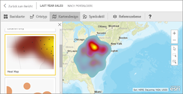
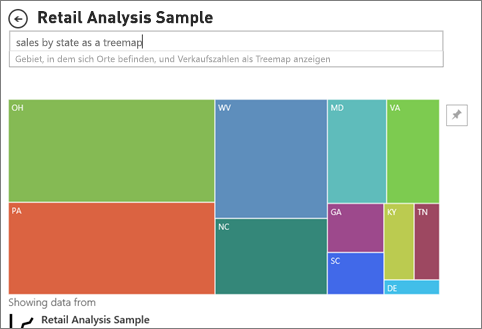

# Visualisierungstypen in Power BI
## Power BI-Visualisierungen
Wir werden neue Visualisierungen hinzufügen, seien Sie gespannt!

Besuchen Sie auch [Microsoft AppSource](https://appsource.microsoft.com/marketplace/apps?product=power-bi-visuals). Sie finden dort eine wachsende Anzahl von [benutzerdefinierten Visuals](../power-bi-custom-visuals.md), die Sie herunterladen und in eigenen Dashboards und Berichten verwenden können. Sind Sie kreativ? [Erfahren Sie, wie Sie eigene Visuals erstellen und zur Communitywebsite hinzufügen können](../developer/office-store.md).  

## Liste der in Power BI verfügbaren Visualisierungen
Alle genannten Visualisierungen können zu Power BI-Berichten hinzugefügt, in Fragen und Antworten angegeben und auf Dashboards angeheftet werden.

### Flächendiagramme: einfach (überlappend) und gestapelt

>[!TIP]
>Das einfache Flächendiagramm basiert auf dem Liniendiagramm, wobei beim Flächendiagramm der Bereich zwischen Achse und Linie ausgefüllt ist.

Weitere Informationen finden Sie unter [Tutorial: Einfaches Flächendiagramm](power-bi-visualization-basic-area-chart.md).

### Balken- und Säulendiagramme
 

 

>[!TIP]
>Balkendiagramme sind die Standarddarstellung für einen bestimmten Wert über verschiedene Kategorien hinweg.

### Karten: mehrzeilig

### Karten: einzelne Zahl

Weitere Informationen finden Sie unter [Erstellen einer Karte (Kachel für große Zahlen)](power-bi-visualization-card.md).

### Kombinationsdiagramme

>[!TIP]
>Ein Kombinationsdiagramm vereinigt Säulendiagramm und Liniendiagramm. Wählen Sie entweder *Linien- und gestapeltes Säulendiagramm* oder *Linien- und gruppiertes Säulendiagramm* aus.

Weitere Informationen finden Sie unter [Tutorial: Kombinationsdiagramme in Power BI](power-bi-visualization-combo-chart.md).

### Ringdiagramme

>[!TIP]
>Ringdiagramme ähneln Kreisdiagrammen.  Sie zeigen die Beziehung von Teilen zu einem Ganzen.

Weitere Informationen finden Sie unter [Lernprogramm: Ringdiagramme in Power BI](power-bi-visualization-doughnut-charts.md).

### Trichterdiagramme

>[!TIP]
>Trichter unterstützen die Visualisierung von Prozessen mit Phasen, bei denen Elemente fortlaufend von einer Phase in die nächste übergehen.  Verwenden Sie einen Trichter, wenn zwischen Phasen ein fortlaufender Fluss herrscht, z.B. bei einem Vertriebsprozess, der mit Kundenkontakten beginnt und mit dem vollendeten Kauf endet.

Weitere Informationen finden Sie unter [Tutorial: Trichterdiagramme in Power BI](power-bi-visualization-funnel-charts.md).

### Messgerätdiagramme

>[!TIP]
>Zeigt den aktuellen Status in Bezug auf ein Ziel an.

Weitere Informationen finden Sie unter [Tutorial: Messgerätediagramme in Power BI](power-bi-visualization-radial-gauge-charts.md).

### KPIs

>[!TIP]
>Hiermit wird der Fortschritt bezogen auf einen messbaren Zielwert angezeigt.

Weitere Informationen finden Sie unter [Lernprogramm: KPIs in Power BI](power-bi-visualization-kpi.md).

### Liniendiagramme

>[!TIP]
>Diese heben die allgemeine Form einer ganzen Wertereihe hervor, in der Regel im Zeitverlauf.

### Karten: Einfache Karten

>[!TIP]
>Diese werden verwendet, um kategorische und quantitative Informationen mit räumlichen Standorten zu verknüpfen.

Weitere Informationen finden Sie unter [Tipps und Tricks für Kartenvisualisierungen](power-bi-map-tips-and-tricks.md).

### Karten: ArcGIS-Karten

Weitere Informationen finden Sie unter [Tutorial: ArcGIS-Karten in Power BI](../power-bi-visualization-arcgis.md).

### Karten: gefüllte Karten

>[!TIP]
>Je intensiver die Farbe, desto größer der Wert.

Weitere Informationen finden Sie unter [Tutorial: Gefüllte Karten in Power BI](power-bi-visualization-filled-maps-choropleths.md).

### Matrix

### Kreisdiagramme

### Punkt- und Blasendiagramme

>[!TIP]
>Zeigen Sie die Beziehungen zwischen zwei (Punktdiagramm) oder drei (Blasendiagramm) quantitativen Maßeinheiten an – Vorhandensein, Reihenfolge usw.

Weitere Informationen finden Sie unter [Tutorial: Punktdiagramme in Power BI](power-bi-visualization-scatter.md).

### Datenschnitte

Weitere Informationen finden Sie unter [Lernprogramm: Datenschnitte in Power BI](power-bi-visualization-slicers.md).

### Eigenständige Bilder

Weitere Informationen finden Sie unter [Hinzufügen eines Widgets zu einem Dashboard](../service-dashboard-add-widget.md).

### Tabellen

>[!TIP]
>Gut geeignet für quantitative Vergleiche zwischen Elementen mit vielen Kategorien.

Weitere Informationen finden Sie unter [Arbeiten mit Tabellen in Power BI](power-bi-visualization-tables.md).

### Treemap-Diagramme

Weitere Informationen finden Sie unter [Tutorial: Treemaps in Power BI](power-bi-visualization-treemaps.md).

>[!TIP]
>Dies sind Diagramme mit farbigen Rechtecken, deren Größe einen Wert darstellt.  Sie können eine hierarchische Struktur aufweisen, bei denen Rechtecke in den Hauptrechtecken geschachtelt werden.

### Wasserfalldiagramme

>[!TIP]
>Wasserfalldiagramme zeigen eine laufende Summe an, während Werte hinzugefügt oder entfernt werden.

Weitere Informationen finden Sie unter [Tutorial: Wasserfalldiagramme in Power BI](power-bi-visualization-waterfall-charts.md).

## Angeben der verwendeten Visualisierung für Q&A
Bei der Eingabe von Abfragen in natürlicher Sprache über den Bereich für Fragen und Antworten in Power BI können Sie den Visualisierungstyp in der Abfrage angeben.  Beispiel:

***Umsätze nach Bundesland als Treemap***

## Nächste Schritte
[Visualisierungen in Power BI-Berichten](power-bi-report-visualizations.md)    
[„The right visual reference“ von sqlbi.com](http://www.sqlbi.com/wp-content/uploads/videotrainings/dashboarddesign/visuals-reference-may2017-A3.pdf)

[Berichte in Power BI](../service-reports.md)

[Power BI – Grundkonzepte](../service-basic-concepts.md)

Weitere Fragen? [Wenden Sie sich an die Power BI-Community](http://community.powerbi.com/)

