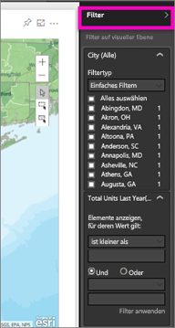
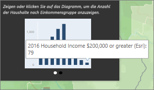

# Interagieren mit ArcGIS-Karten in Power BI
Dieses Thema ist für Personen verfasst, die ArcGIS-Karten im Power BI-Dienst, in Power BI Desktop oder in einer mobilen Power BI-App *nutzen*. Sobald ein Ersteller eine ArcGIS-Karte für Sie freigegeben hat, gibt es viele Möglichkeiten für die Interaktion mit dieser Karte.  Weitere Informationen zum Erstellen einer ArcGIS-Karte finden Sie im [Tutorial zu ArcGIS Maps von ESRI](../power-bi-visualization-arcgis.md).

Die Kombination von ArcGIS Maps und Power BI bietet völlig neue Möglichkeiten der Kartendarstellung, die über die Darstellung von Punkten auf einer Karte weit hinausgeht. Die verfügbaren Optionen für Basiskarten, Standorttypen, Designs, Symbolstile und Referenzebenen ermöglichen das Erstellen von beeindruckenden, aussagekräftigen Kartenvisualisierungen. Die Kombination von autoritativen Datenebenen (z.B. Volkszählungsdaten) auf einer Karte mit räumlicher Analyse vermittelt ein tieferes Verständnis der Daten in der Visualisierung.

> [!TIP]
> GIS steht für „Geographic Information Science“.
> 

Das hier verwendete Beispiel ist die im [Tutorial zu ArcGIS Maps von ESRI](../power-bi-visualization-arcgis.md) erstellte ArcGIS-Karte. In dieser wird der Vorjahresumsatz nach Ort ausgewertet. Es wird eine Basiskarte verwendet, die Größe wird durch Blasensymbole dargestellt, und für das mittlere Haushaltseinkommen wird eine Referenzebene verwendet. Die Karte enthält 3 Stecknadeln und einen Fahrzeitradius (in Violett).

> [!TIP]
> Besuchen Sie die [Seite von ESRI für Power BI](https://www.esri.com/powerbi), auf der Sie viele Beispiele und Kommentare von Kunden finden. Und besuchen Sie dann die [Seite für erste Schritte mit ArcGIS Maps für Power BI](https://doc.arcgis.com/en/maps-for-powerbi/get-started/about-maps-for-power-bi.htm) (in englischer Sprache) von ESRI.
> 
> 

 

## Zustimmung des Benutzers
Wenn eine ArcGIS-Karte zum ersten Mal von einem Kollegen für Sie freigegeben wird, wird in Power BI eine Eingabeaufforderung angezeigt. ArcGIS Maps für Power BI wird von ESRI bereitgestellt (www.esri.com), und die Verwendung von ArcGIS Maps für Power BI unterliegt den Nutzungsbedingungen und der Datenschutzrichtlinie von Esri. Power BI-Benutzer, die Visuals von ArcGIS Maps für Power BI verwenden möchten, müssen die Informationen im Zustimmungsdialogfeld akzeptieren.

## Auswahltools
ArcGIS-Karten für Power BI stellt drei Auswahlmodi bereit. Es können maximal 250 Datenpunkte gleichzeitig ausgewählt werden.

 Wählt einzelne Datenpunkte aus.

 Zeichnet ein Rechteck auf der Karte und wählt die darin enthaltenen Datenpunkte aus. Mit STRG können Sie mehrere rechteckige Bereiche auswählen.

 Ermöglicht die Verwendung von Begrenzungen oder Polygonen in den Referenzebenen zum Auswählen von enthaltenen Datenpunkten.

 

## Interagieren mit einer ArcGIS-Karte
Die für Sie verfügbaren Funktionen hängen davon ab, ob Sie der *Ersteller* (die Person, von der die Karte erstellt wurde) oder der *Nutzer* (jemand hat eine ArcGIS-Karte für Sie freigegeben) sind. Wenn Sie als Nutzer mit einer ArcGIS-Karte interagieren (auch als [Leseansicht](../consumer/end-user-reading-view.md) bezeichnet), sind die folgenden Aktionen für Sie verfügbar.

* Wie bei anderen Visualisierungstypen können Sie Elemente [an Dashboards anheften](../service-dashboard-pin-tile-from-report.md), [die zugrunde liegenden Daten anzeigen](../consumer/end-user-show-data.md) und/oder [exportieren](power-bi-visualization-export-data.md) sowie die Karte im [Fokusmodus](../consumer/end-user-focus.md) und [Vollbildmodus](../service-fullscreen-mode.md) anzeigen.    
* Erweitern Sie den Bereich **Filter**, um die Karte mithilfe von Filtern zu untersuchen. Wenn Sie den Bericht schließen, werden die angewendeten Filter nicht gespeichert.    
      
* Wenn die Karte über eine Referenzebene verfügt, wählen Sie Standorte aus, um Details in einer QuickInfo anzuzeigen. In diesem Beispiel wurde Adams County ausgewählt, und es werden Daten aus der Referenzebene für das mittlere Haushaltseinkommen angezeigt, die der Karte vom Ersteller hinzugefügt wurde.
  
      
  
    In diesem Fall wird auch ein Diagramm angezeigt. Wählen Sie einen Balken im Diagramm aus, um die Daten genauer zu untersuchen. Hier lässt sich erkennen, dass 79 Haushalte in Adams County über ein Einkommen von mindestens 200.000 $ verfügen.
  
    
  
    Wählen Sie den Pfeil aus, um weitere Diagramme anzeigen.
* Zeigen Sie auf Standortsymbole der Basiskarte, um Details in einer QuickInfo anzuzeigen.     
  
  
  > [!TIP]
  > Möglicherweise müssen Sie zoomen, um einen bestimmten Standort auszuwählen.  Andernfalls werden möglicherweise mehrere QuickInfos gleichzeitig in Power BI angezeigt, wenn sich Standorte überlappen. Wählen Sie die Pfeile aus, um zwischen den QuickInfos zu wechseln.
  > 
  > 
  > 
  > 
* Wenn der Ersteller der ArcGIS-Karte eine Infografikebene hinzugefügt hat, werden in der rechten oberen Ecke der Karte zusätzliche Daten angezeigt.  Hier hat z.B. der Kartenersteller „Children under 14“ (Kinder unter 14) hinzugefügt.
  
    

## Überlegungen und Einschränkungen
ArcGIS Maps für Power BI ist in den folgenden Diensten und Anwendungen verfügbar:

<table>
<tr><th>Dienst/App</th><th>Verfügbarkeit</th></tr>
<tr>
<td>Power BI Desktop</td>
<td>Ja</td>
</tr>
<tr>
<td>Power BI service (app.powerbi.com)</td>
<td>Ja</td>
</tr>
<tr>
<td>Mobile Apps für Power BI</td>
<td>Ja</td>
</tr>
<tr>
<td>Power BI-Webveröffentlichung</td>
<td>Nein</td>
</tr>
<tr>
<td>Power BI Embedded</td>
<td>Nein</td>
</tr>
<tr>
<td>Einbettung in den Power BI-Dienst (PowerBI.com)</td>
<td>Nein</td>
</tr>
</table>

**Wie interagieren ArcGIS Maps for Power BI miteinander?**
ArcGIS Maps for Power BI werden von Esri (www.esri.com) bereitgestellt. Die Verwendung von ArcGIS Maps for Power BI unterliegt den [Nutzungsbedingungen](https://go.microsoft.com/fwlink/?LinkID=8263222) und der [Datenschutzrichtlinie](https://go.microsoft.com/fwlink/?LinkID=826323) von Esri. Power BI-Benutzer, die Visualisierungen von ArcGIS Maps for Power BI verwenden möchten, müssen die Informationen im Zustimmungsdialogfeld akzeptieren (Details finden Sie unter „Benutzerzustimmung“).  Die Verwendung von ArcGIS Maps for Power BI unterliegt den Nutzungsbedingungen und der Datenschutzrichtlinie von Esri, auf die auch über das Zustimmungsdialogfeld verwiesen wird. Jeder Benutzer muss seine Zustimmung geben, bevor er ArcGIS Maps for Power BI zum ersten Mal verwendet. Sobald der Benutzer seine Zustimmung gegeben hat, werden die Daten, die an das Visual gebunden sind, zumindest für die Geocodierung an die Esri-Dienste gesendet. Das bedeutet, dass Informationen zum Standort in Längen- und Breitengrade umgewandelt werden, die auf einer Karte dargestellt werden können. Gehen Sie davon aus, dass alle Daten, die an die Datenvisualisierung gebunden sind, an die Esri-Dienste gesendet werden können. Esri stellt u.a. Dienste wie Basiskarten, räumliche Analysen und Geocodierung bereit. Die ArcGIS Maps for Power BI-Visualisierung interagiert mit diesen Diensten unter Verwendung einer SSL-Verbindung, die von einem Zertifikat geschützt wird, das von Esri bereitgestellt und verwaltet wird. Zusätzliche Informationen zu ArcGIS Maps for Power BI erhalten Sie auf der [ArcGIS Maps for Power BI-Produktseite](https://www.esri.com/powerbi) von Esri.

Wenn sich ein Benutzer für ein Plus-Abonnement registriert, das von Esri über ArcGIS Maps for Power BI angeboten wurde, wird dadurch eine direkte Beziehung zu Esri hergestellt. Power BI sendet keine persönlichen Informationen über den Benutzer an Esri. Der Benutzer registriert sich für eine AAD-Anwendung, die von Esri bereitgestellt wird, und verwendet dabei seine eigene AAD-Identität. Außerdem vertraut er der Anwendung. Dadurch gibt er seine persönlichen Informationen direkt für Esri frei. Sobald der Benutzer einer ArcGIS Maps for Power BI-Visualisierung Plus-Inhalt hinzufügt, benötigen auch andere Power BI-Benutzer ein Plus-Abonnement von Esri, um den Inhalt anzeigen und bearbeiten zu können. 

Wenn Sie komplexe, technische Fragen zur Funktionsweise von ArcGIS Maps for Power BI haben, können Sie Esri über deren Supportwebsite kontaktieren.

**Die ArcGIS-Karte wird nicht angezeigt**    
In Diensten und Anwendungen, für die ArcGIS Maps für Power BI nicht verfügbar ist, wird statt der Visualisierung ein leeres Visual mit dem Power BI-Logo angezeigt.

**Auf der Karte werden nicht alle Adressen angezeigt**    
Bei der Geocodierung von Adressen werden nur die ersten 1500 Adressen verarbeitet. Ortsnamen und Länder sind von dieser Geocodierung-Einschränkung auf 1500 Einträge nicht betroffen.

**Fallen Gebühren für die Verwendung von ArcGIS-Karten für Power BI an?**

ArcGIS Maps für Power BI ist für alle Power BI-Benutzer ohne zusätzliche Kosten verfügbar. Dies ist eine von **Esri** bereitgestellte Komponente, die den Nutzungsbedingungen und der Datenschutzrichtlinie von **Esri** unterliegt, wie weiter oben in diesem Artikel beschrieben.

**Ich erhalte eine Fehlermeldung, dass der Cache voll ist**

Dieser Fehler ist bekannt und wird behoben.  Wählen Sie in der Zwischenzeit den in der Fehlermeldung angezeigten Link aus, um Anweisungen zum Leeren des Power BI-Caches zu erhalten.

**Kann ich meine ArcGIS-Karten offline anzeigen?**

Nein. Zum Anzeigen der Karten in Power BI ist eine Netzwerkverbindung erforderlich.

## Nächste Schritte
Hilfe: **ESRI** bietet eine [umfassende Dokumentation](https://go.microsoft.com/fwlink/?LinkID=828772) zu den Funktionen von **ArcGIS Maps für Power BI**.

In der [Power BI-Community finden Sie einen Thread zu **ArcGIS Maps für Power BI**](https://go.microsoft.com/fwlink/?LinkID=828771) mit aktuellen Informationen. Dort können Sie auch Fragen stellen und Probleme melden.

Verbesserungsvorschläge können Sie an die [Ideensammlung für Power BI](https://ideas.powerbi.com) senden.

[Produktseite zu ArcGIS-Karten für Power BI](https://www.esri.com/powerbi)

