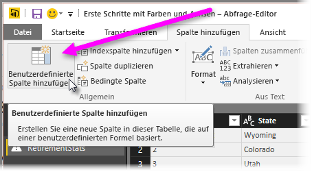

# Histogramme
Es gibt mehrere Methoden zum Erstellen von Histogrammen in Power BI. Wir beginnen mit der einfachsten Methode, bevor wir weitere beschreiben.

## Einfache Histogramme
Bestimmen Sie zunächst die Abfrage des Felds, für das Sie ein Histogramm erstellen möchten.  Verwenden Sie die Option *Verweis* für die Abfrage, um eine neue Abfrage zu erstellen, und geben Sie dieser den Namen *FieldName-Histogramm*. Verwenden Sie die Option **Gruppieren nach** im Menüband **Transformieren** , und wählen Sie das Aggregat **Zeilen zählen** aus. Achten Sie darauf, dass die resultierende Aggregatspalte eine Zahl als Datentyp hat. Anschließend können Sie diese Daten auf der Berichtsseite visualisieren. Diese Vorgehensweise ist schnell und ermöglicht eine einfache Erstellung, ist jedoch wenig geeignet, wenn Sie viele Datenpunkte haben, und sie ermöglicht kein Brushing über visuelle Objekte hinweg.

## Definieren von Buckets zum Erstellen eines Histogramms
Bestimmen Sie die Abfrage des Felds, für das Sie ein Histogramm erstellen möchten. Verwenden Sie die Option *Verweis* für die Abfrage, um eine neue Abfrage zu erstellen, und geben Sie dieser den Namen *FieldName*.  Nun definieren Sie die Buckets mit einer Regel. Verwenden Sie die Option **Benutzerdefinierte Spalte hinzufügen** im Menüband **Spalte hinzufügen** , und erstellen Sie eine benutzerdefinierte Regel.

Achten Sie darauf, dass die resultierende Aggregatspalte eine Zahl als Datentyp hat. Jetzt können Sie die in **Einfache Histogramme** (weiter oben in diesem Artikel) beschriebene Vorgehensweise mit „Gruppieren nach“ verwenden, um das Histogramm zu erstellen. Bei dieser Option werden mehr Datenpunkte verarbeitet, aber auch sie ermöglicht kein Brushing.

## Definieren eines Histogramms, das Brushing unterstützt
Brushing liegt vor, wenn visuelle Objekte miteinander verknüpft sind, sodass, nachdem ein Benutzer einen Datenpunkt in einem visuellen Objekt ausgewählt hat, in anderen visuellen Objekten auf der Berichtsseite Datenpunkte hervorgehoben oder gefiltert werden, die mit dem ausgewählten Datenpunkt verknüpft sind.  Da Daten zur Abfragezeit verarbeitet werden, müssen Sie eine Beziehung zwischen Tabellen erstellen und sicher sein, dass Sie wissen, welches Detailelement mit dem Bucket im Histogramm verknüpft ist und umgekehrt.

Beginnen Sie den Vorgang, indem Sie die Option *Verweis* für die Abfrage verwenden, die das Feld umfasst, für das Sie ein Histogramm erstellen möchten.  Geben Sie der neuen Abfrage den Namen *Buckets*.  Für dieses Beispiel soll die ursprüngliche Abfrage den Namen *Details* haben.  Entfernen Sie als Nächstes alle Spalten außer der Spalte, die Sie als Bucket für das Histogramm verwenden möchten.  Verwenden Sie nun die Funktion *Duplikate entfernen* in der Abfrage (diese Funktion wird im Kontextmenü angezeigt, wenn Sie die Spalte auswählen), damit die verbleibenden Werte die eindeutigen Werte in der Spalte sind. Wenn Sie Dezimalzahlen haben, können Sie zunächst den Tipp zum Definieren von Buckets verwenden, um ein Histogramm zu erstellen, damit Sie eine verwaltbare Anzahl von Buckets erhalten.  Prüfen Sie jetzt die Daten, die in der Abfragevorschau angezeigt werden. Wenn Sie leere Werte oder Nullwerte sehen, müssen Sie diese korrigieren, bevor Sie eine Beziehung erstellen. Weitere Informationen finden Sie unter „Erstellen einer Beziehung, wenn die Daten Null- oder leere Werte haben“. Dieser Ansatz kann problematisch sein, weil sortiert werden muss. Informationen zur richtigen Sortierung der Buckets finden Sie unter „Sortierreihenfolge: Kategorien in der gewünschten Reihenfolge anzeigen“. 

> [!NOTE]
> Sie sollten sich die Sortierreihenfolge überlegt haben, bevor Sie Visuals erstellen.   
> 
> 

Der nächste Schritt in der Vorgehensweise besteht darin, eine Beziehung zwischen den Abfragen *Buckets* und *Details* über die Bucketspalte zu definieren.  Wählen Sie in *Power BI Desktop* im Menüband die Option *Beziehungen verwalten* aus.  Erstellen Sie eine Beziehung, in der sich *Buckets* in der linken Tabelle und *Details* in der rechten Tabelle befindet, und wählen Sie das Feld aus, das Sie für das Histogramm verwenden. 

Der letzte Schritt ist die Erstellung des Histogramms. Ziehen Sie das Bucketfeld aus der Tabelle *Buckets* . Entfernen Sie das Standardfeld aus dem resultierenden Säulendiagramm.  Ziehen Sie nun das Histogrammfeld aus der Tabelle *Details* in dasselbe visuelle Objekt. Ändern Sie in der Feldquelle das Standardaggregat in „Anzahl“. Das Ergebnis ist das Histogramm. Wenn Sie ein weiteres visuelles Objekt erstellen, etwa eine Tree Map aus der Tabelle „Details“, wählen Sie einen Datenpunkt in der Tree Map aus, um die Histogrammhervorhebung zu sehen und das Histogramm für den ausgewählten Datenpunkt in Bezug auf den Trend für das gesamte Dataset anzuzeigen.

