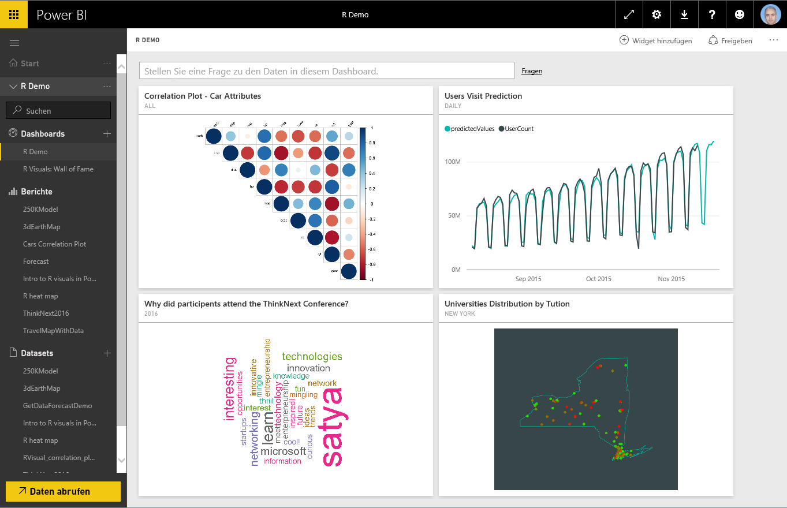
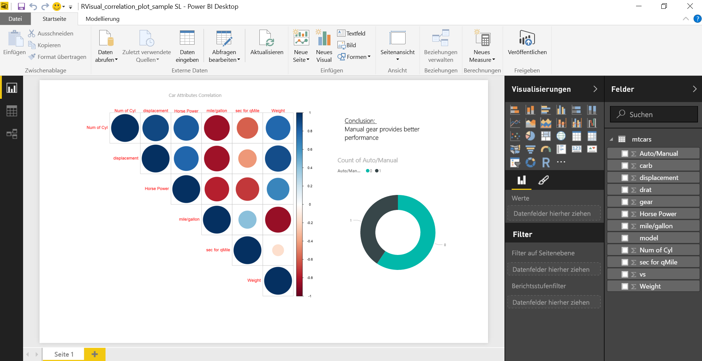
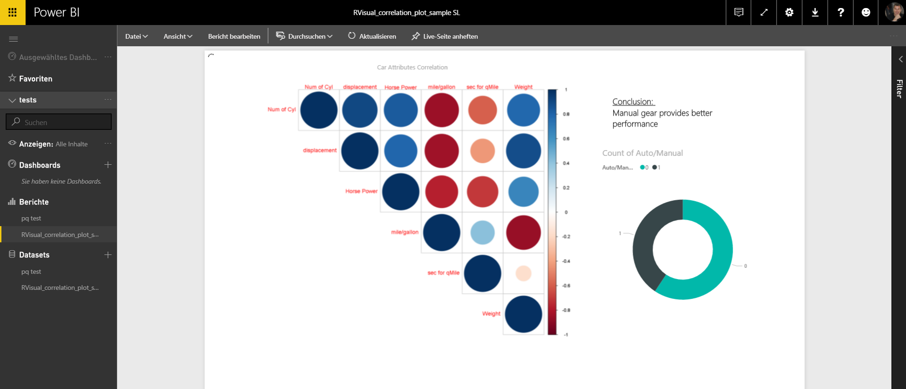
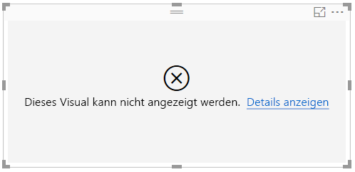
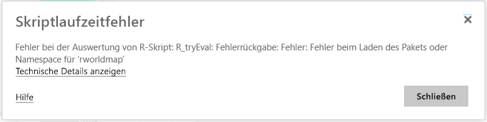
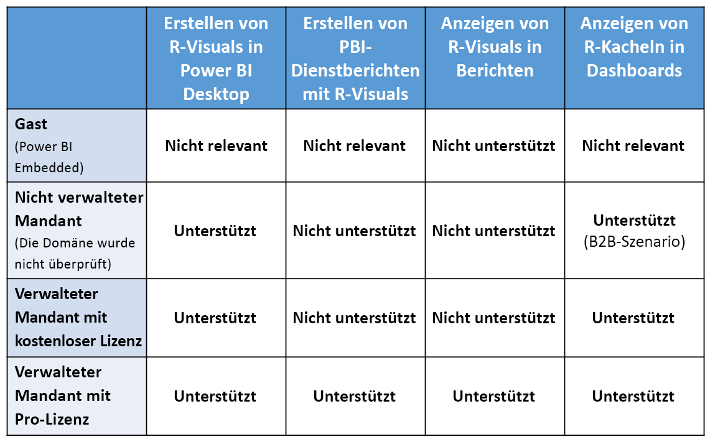

# Erstellen von R-Visualisierungen im Power BI-Dienst
Der Power BI-Dienst unterstützt das Anzeigen von und das Interagieren mit Visualisierungen, die mit R-Skripts erstellt werden. Visualisierungen, die mit R-Skripts erstellt werden, sogenannte*R-Visualisierungen*, können erweiterte Datenstrukturierung und -analysen wie z.B. Vorhersagen darstellen, indem sie sich die starke Leistung von R hinsichtlich Analysen und Visualisierung zu Nutze machen.

> [!NOTE]
> Die [Programmiersprache R](https://www.r-project.org/) gehört zu den von Statistikern, Datenanalysten und Business Analysten am häufigsten verwendeten Programmiersprachen. Die Sprache R verfügt über eine Open-Source-Community, die über 7.000 Add-On-Pakete sowie häufig verwendete [R-Benutzergruppen](http://msdsug.microsoft.com/) zur Verfügung stellt. Die im Power BI-Dienst bereitgestellte Version von R ist *Revolution R Open 3.2.2.*
> 
> 

Die folgende Abbildung zeigt ein Power BI-Dashboard mit einer Sammlung von R-Visuals, die für erweiterte Analysen verwendet werden.

R-Visualisierungen werden in einem [Power BI Desktop-Bericht](../desktop-get-the-desktop.md) wie dem in der folgenden Abbildung dargestellten Bericht erstellt.

Sobald der Bericht in **Power BI Desktop** erstellt wurde, können Sie den Bericht, der mindestens eine R-Visualisierung enthält, im Power BI-Dienst veröffentlichen. R-Visualisierungen können derzeit nur in **Power BI Desktop** erstellt und anschließend im Power BI-Dienst veröffentlicht werden. Weitere Informationen zum Erstellen von R-Visualisierungen finden Sie unter [Erstellen von Power BI-Visualisierungen mithilfe von R (Power BI Desktop)](../desktop-r-visuals.md).

Beachten Sie, dass im Dienst nicht alle R-Pakete unterstützt werden. Eine Liste der derzeit im Power BI-Dienst unterstützten Pakete finden Sie am Ende dieses Artikels unter „Unterstützte Pakete“.

Sie können diese [Beispieldatei für Power BI Desktop](http://download.microsoft.com/download/D/9/A/D9A65269-D1FC-49F8-8EC3-1217E3A4390F/RVisual_correlation_plot_sample%20SL.pbix) (PBIX-Datei), die einige R-Visualisierungen enthält, herunterladen, um zu sehen, wie dies funktioniert und um zu experimentieren.

R-Visualisierungen, die in **Power BI Desktop** erstellt und anschließend im Power BI-Dienst veröffentlicht wurden, verhalten sich größtenteils wie jede andere Visualisierung im Power BI-Dienst. Sie können mit ihnen interagieren, sie filtern, schneiden, an ein Dashboard anheften oder sie für andere freigeben. Weitere Informationen zum Freigeben von Dashboards und Visualisierungen finden Sie unter [Freigeben eines Dashboards für Kollegen und andere](../service-share-dashboards.md). Ein Unterschied zu anderen Visualisierungen ist, dass R-Visualisierungen keine QuickInfos anzeigen und nicht dazu verwendet werden können, andere Visualisierungen zu filtern.

Wie in folgender Abbildung zu sehen, werden R-Visualisierungen im Power BI-Dienst, entweder in Dashboards oder Berichten, größtenteils wie jede andere Virtualisierung angezeigt und verhalten sich auch größtenteils wie jedes andere Visualisierung. Benutzer müssen das zugrunde liegende R-Skript, das die Visualisierung erstellt hat, nicht kennen.

## Sicherheit der R-Skripts
R-Visualisierungen werden aus R-Skripts erstellt, die möglicherweise Code mit Sicherheits- oder Datenschutzrisiken enthalten können.

Diese Risiken existieren hauptsächlich in der Erstellungsphase, wenn Skriptautoren das Skript auf ihrem eigenen Computer ausführen.

Der Power BI-Dienst wendet eine *Sandkasten*-Technologie an, um die Benutzer und den Dienst vor Sicherheitsrisiken zu schützen.

Dieser *Sandkasten*-Ansatz erlegt den im Power BI-Dienst ausgeführten R-Skripts einige Einschränkungen auf wie z.B. die Einschränkung des Zugriffs auf das Internet oder auf andere Ressourcen, die zum Erstellen der R-Visualisierung nicht benötigt werden.

## Fehlererfahrung bei R-Skripts
Wenn ein R-Skript auf einen Fehler stößt, wird die R-Visualisierung nicht gezeichnet, und eine Fehlermeldung wird angezeigt. Wählen Sie im Zeichenbereich in der Fehlermeldung der R-Visualisierung wie in folgender Abbildung dargestellt **Details anzeigen** aus, um weitere Informationen zu dem Fehler zu erhalten.

Die folgende Abbildung zeigt als weiteres Beispiel die Fehlermeldung, die angezeigt wird, wenn ein R-Skript aufgrund eines fehlenden R-Pakets in Azure nicht ordnungsgemäß ausgeführt wurde.

## Lizenzierung
R-Visualisierungen benötigen eine [Power BI Pro](../service-self-service-signup-for-power-bi.md)-Lizenz, um in Berichten zu rendern, um zu aktualisieren, zu filtern und über Kreuz zu filtern. Weitere Informationen zu Power BI Pro-Lizenzen und wie sie sich von kostenlosen Lizenzen unterscheiden, finden Sie unter [Power BI Pro-Inhalt – was ist das?](../service-premium.md)

Kostenlose Benutzer von Power BI können nur für sie freigegebene Kacheln verwenden. Weitere Informationen finden Sie unter [Erwerb von Power BI Pro](../service-admin-purchasing-power-bi-pro.md).

Die folgende Tabelle beschreibt die auf der Lizenzierung basierenden Funktionen der R-Visualisierungen.

## Bekannte Einschränkungen
R-Visualisierungen weisen im Power BI-Dienst einige Einschränkungen auf:

* Die Unterstützung für R-Visualisierungen ist beschränkt auf die Pakete, die auf der folgenden Seite identifiziert wurden: <make this a link to the supported packages page per my excel>. Benutzerdefinierte Pakete werden derzeit nicht unterstützt.
* Beschränkungen der Datengröße – die vom visuellen R-Element zum Zeichnen verwendeten Daten sind auf 150.000 Zeilen beschränkt. Bei Auswahl von mehr als 150.000 Zeilen werden nur die oberen 150.000 Zeilen verwendet, und im Bild wird eine Meldung angezeigt.
* Beschränkung der Berechnungszeit – wenn die Berechnung der R-Visualisierung 60 Sekunden überschreitet, wird das Skript aufgrund der Zeitüberschreitung abgebrochen und eine Fehlermeldung angezeigt.
* Visuelle R-Elemente werden aktualisiert, wenn Daten aktualisiert, gefiltert oder hervorgehoben werden. Allerdings ist das eigentliche Bild nicht interaktiv und unterstützt QuickInfos nicht.
* Visuelle R-Elemente reagieren auf das Hervorheben anderer Visualisierungen. Sie können jedoch nicht auf visuelle R-Elemente klicken, um eine Kreuzfilterung anderer Elemente auszuführen.
* R-Visualisierungen werden für den *Uhrzeit*-Datentyp derzeit nicht unterstützt. Bitte verwenden Sie stattdessen Datum/Uhrzeit.
* R-Visualisierungen werden nicht angezeigt, wenn **Im Web veröffentlichen** verwendet wird.
* R-Visualisierungen drucken derzeit nicht, wenn Dashboards und Berichte drucken
* R-Visualisierungen werden im DirectQuery-Modus von Analysis Services derzeit nicht unterstützt
* Für chinesische, japanische und koreanische Schriftarten sind alle der folgenden zusätzlichen Schritte erforderlich, damit sie im Power BI-Dienst ordnungsgemäß funktionieren:
  
  * Installieren Sie zunächst das R-Paket *showtext* und alle Abhängigkeiten. Hierzu können Sie das folgende Skript ausführen:
    
        *install.packages("showtext")*
  * Fügen Sie als Nächstes die folgende Zeile am Anfang des R-Skripts ein:
    
        powerbi_rEnableShowTextForCJKLanguages =  1

## Übersicht über R-Pakete
R-Pakete sind Sammlungen von R-Funktionen, Daten und kompiliertem Code, die in einem genau definierten Format kombiniert werden. Bei der Installation umfasst R einen Standardsatz von Paketen, weitere Pakete können heruntergeladen und installiert werden. Nach Abschluss der Installation muss ein R-Paket in die Sitzung geladen werden, um es verwenden zu können. Die Hauptressource für kostenlose R-Pakete ist CRAN, das [Comprehensive R Archive Network](https://cran.r-project.org/web/packages/available_packages_by_name.html).

In **Power BI Desktop** können alle R-Pakettypen ohne Einschränkung verwendet werden. Sie können R-Pakete für die Verwendung in **Power BI Desktop** selbst installieren (z.B. mit [RStudio IDE](https://www.rstudio.com/)).

R-Visualisierungen im **Power BI-Dienst** werden von den Paketen im Abschnitt **Unterstützte Pakete** [dieses Artikels](../service-r-packages-support.md) unterstützt. Wenn Sie ein für Sie interessantes Paket nicht in der Liste unterstützter Pakete finden, können Sie die Unterstützung für das Paket anfordern. Informationen zum Anfordern von Support finden Sie unter [R-Pakete im Power BI-Dienst](../service-r-packages-support.md).

### Voraussetzungen und Einschränkungen für R-Pakete
Es gibt eine Reihe von Voraussetzungen und Einschränkungen für R-Pakete:

* Der Power BI-Dienst unterstützt die meisten R-Pakete mit kostenlosen und Open Source-Softwarelizenzen, z.B. GPL-2, GPL-3, MIT+ usw.
* Der Power BI-Dienst unterstützt in CRAN veröffentlichte Pakete. Der Dienst unterstützt keine privaten oder benutzerdefinierten R-Pakete. Wir bitten unsere Benutzer, ihre privaten Pakete auf CRAN verfügbar zu machen, bevor sie die Veröffentlichung im Power BI-Dienst anfordern.
* Für **Power BI Desktop** gibt es zwei Varianten von R-Paketen:
  
  * Für R-Visualisierungen können Sie jedes Paket installieren, auch benutzerdefinierte R-Pakete.
  * Bei benutzerdefinierten R-Visualisierungen werden nur öffentliche CRAN-Pakete für die automatische Installation der Pakete unterstützt.
* Aus Sicherheits- und Datenschutzgründen werden derzeit keine R-Pakete unterstützt, die Client-Server-Abfragen über das World Wide Web im Dienst bereitstellen (z.B. RgoogleMaps). Netzwerke werden bei solchen Versuchen blockiert. Eine Liste der unterstützten und nicht unterstützten R-Pakete finden Sie unter [R-Pakete im Power BI-Dienst](../service-r-packages-support.md).
* Das Genehmigungsverfahren zum Einschließen eines neuen R-Pakets umfasst eine Reihe von Abhängigkeiten. Einige Abhängigkeiten, die im Dienst installiert werden müssen, können nicht unterstützt werden.

### Unterstützte Pakete:
Eine umfangreiche Liste der unterstützten R-Pakete (und die kurze Liste der nicht unterstützten Pakete) finden Sie im folgenden Artikel:

* [R-Pakete im Power BI-Dienst](../service-r-packages-support.md)

