# Tipps und Tricks zur Farbformatierung in Power BI
Power BI bietet viele unterschiedliche Methoden zum Anpassen der Dashboards und Berichte. In diesem Artikel erhalten Sie Tipps, wie Sie Ihre Power BI-Visualisierungen ansprechender, interessanter und personalisierter gestalten können.

Nachfolgend finden Sie einige Tipps. Haben Sie weitere tolle Tipps? Sehr gut! Wenn Sie sie uns zukommen lassen, nehmen wir sie möglicherweise in diese Liste auf.

* Farbe eines einzelnen Datenpunkts ändern
* Farben eines Diagramms nach einem numerischen Wert vergeben
* Farbe der Datenpunkte nach einem numerischen Wert vergeben
* Farben in der Farbskala anpassen
* Abweichende Farbskalen verwenden
* Änderungen in Power BI rückgängig machen

Um Änderungen vorzunehmen, müssen Sie einen Bericht bearbeiten. Öffnen Sie den Bericht, und wählen Sie im oberen Menübereich **Bericht bearbeiten** aus, wie im folgenden Bild gezeigt.

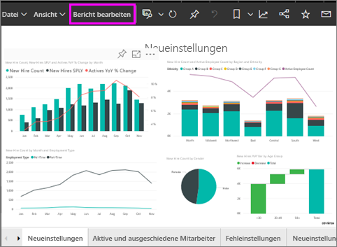

Wenn das Fenster **Visualisierungen** auf der rechten Seite des Bereichs **Bericht** angezeigt wird, können Sie ihn anpassen. Wenn der Bereich nicht angezeigt wird, klicken Sie auf den Pfeil in der oberen rechten Ecke, um ihn zu öffnen.

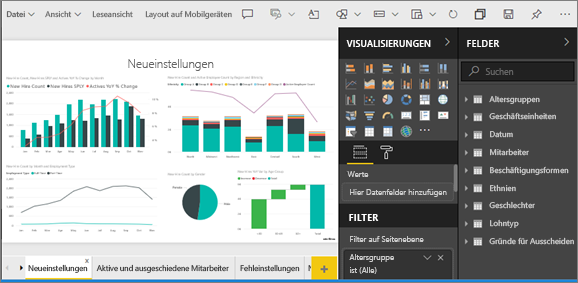

## Farbe eines einzelnen Datenpunkts ändern
Unter Umständen möchten Sie einen bestimmten Datenpunkt markieren. Möglicherweise handelt es sich dabei um die Verkaufszahlen für ein neu eingeführtes Produkt oder bessere Qualitätsergebnisse nach der Einführung eines neuen Programms. Mit Power BI können Sie einen bestimmten Datenpunkt hervorheben, indem Sie seine Farbe ändern.

In der folgenden Visualisierung werden verkaufte Einheiten nach Produktsegment angeordnet. 

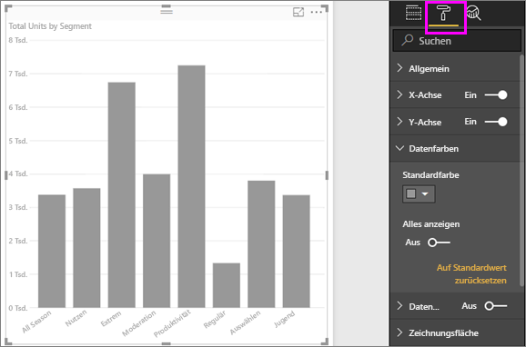

Stellen Sie sich vor, dass Sie das Segment **Convenience** farblich hervorheben möchten, um zu zeigen, wie gut dieses brandneue Segment abschneidet. Gehen Sie wie folgt vor:

Erweitern Sie den Abschnitt **Datenfarben**, und aktivieren Sie den Schieberegler für **Alles einblenden**. Die Farben für jedes Datenelement in der Visualisierung werden angezeigt. Wenn Sie auf die Datenpunkte zeigen, wird der Bildlauf aktiviert, sodass Sie alle Datenpunkte ändern können.

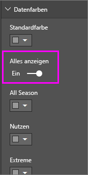

Legen Sie **Convenience** auf Orange fest. 

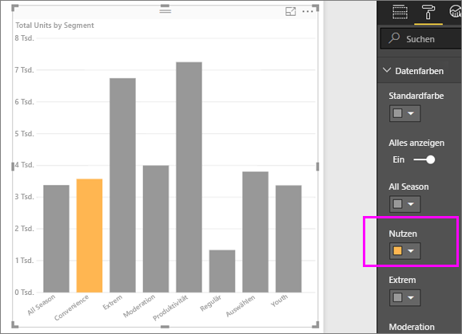

Sobald die Auswahl getroffen wurde, wird der Datenpunkt **Convenience** in einem ansprechenden Orange hervorgehoben.

Auch wenn Sie Visualisierungstypen ändern und später zurückkehren, speichert Power BI Ihre Auswahl und markiert **Convenience** in Orange.

Sie können die Farbe eines Datenpunkts für einzelne, mehrere oder alle Datenelemente in der Visualisierung ändern. Vielleicht möchten Sie Ihr Visual an Ihre Unternehmensfarben anpassen. 

Farben bieten Ihnen viele Gestaltungsmöglichkeiten. Im nächsten Abschnitt prüfen wir Farbverläufe.

## Farben eines Diagramms nach einem numerischen Wert vergeben
Diagramme lassen sich mit dynamischen Farbeinstellungen nach dem numerischen Wert eines Felds ansprechend gestalten. Dadurch können Sie einen anderen als für die Größe eines Balkens verwendeten Wert anzeigen und die beiden Werte in einer einzelnen Grafik anzeigen. Sie können damit auch Datenpunkte markieren, die über (oder unter) einem bestimmten Wert liegen, z. B. Bereiche mit geringer Rentabilität.

Die folgenden Abschnitte zeigen die verschiedene Methoden, Farben auf Grundlage eines numerischen Werts anzupassen.

## Farbe von Datenpunkten nach einem numerischen Wert vergeben
Um eine Farbe auf Grundlage eines Werts zu ändern, ziehen Sie das Feld, auf dem die Farbe basieren soll, in den Bereich **Farbsättigung** im Bereich **Felder**. In der folgenden Abbildung wurde **%Market Share SPLY YTD** (% Marktanteil im gleichen Vorjahreszeitraum seit Jahresbeginn) in **Farbsättigung** gezogen. 

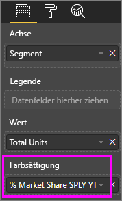

Legen Sie im Bereich „Formatierung“ unter **Datenfarben** fest, wie Farbe und Schattierung in Ihrem Säulendiagramm durch den Wert von **%Market Share SPLY YTD** (% Marktanteil im gleichen Vorjahreszeitraum seit Jahresbeginn) geändert werden. In diesem Beispiel wird ein niedrigerer prozentualer Marktanteil hellblau angezeigt, und höhere Werte werden in dunklerem Blau dargestellt.

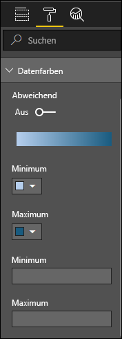

Sie sehen, dass zwar mehr Einheiten aus den Bereichen **Productivity** und **Extreme** verkauft wurden (die Säulen sind höher), **Moderation** aber dennoch einen höheren Wert für **%Market Share SPLY YTD** (% Marktanteil im gleichen Vorjahreszeitraum seit Jahresbeginn) aufweist (die Säule zeigt eine stärkere Farbsättigung).

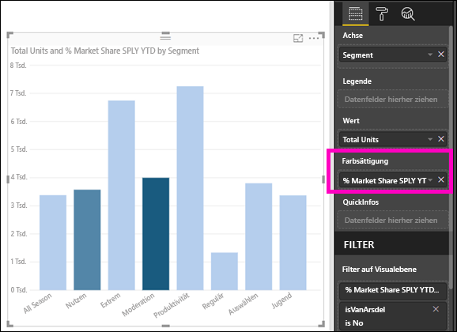

## Farben in der Farbskala individuell anpassen
Sie können auch die Farben in der Farbskala anpassen. Standardmäßig wird dem niedrigsten Wert in Ihren Daten die geringste Farbsättigung und dem höchste Wert die stärkste Farbsättigung zugewiesen. In der obigen Abbildung wurde ein blauer Farbverlauf verwendet. 

Wenn Sie **Datenfarben** erweitern, sehen einen Farbverlauf der Farben für die visuelle Darstellung Ihrer Daten. Der Farbbereich wird auf einer Farbverlaufsleiste angezeigt, die das Spektrum zwischen den **minimalen** und den **maximalen** Farbwerten anzeigt. Der **Minimalwert** wird links, der **Maximalwert** rechts angezeigt.

Um die Skalierung für einen anderen Farbbereich zu ändern, wählen Sie das Farb-Dropdown neben **Minimal** oder **Maximal**, und wählen Sie eine Farbe aus. In der folgenden Abbildung wird die **Maximal**-Farbe in Schwarz geändert, und die Farbverlaufsleiste zeigt das neue Farbspektrum zwischen **Minimal** und **Maximal**.

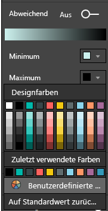

Sie können auch ändern, wie die Werte diesen Farben zugeordnet werden. In der folgenden Abbildung werden für **Minimal** und **Maximal** die Farben Orange und Grün festgelegt.

Achten Sie im ersten Bild darauf, wie die Balken im Diagramm den Farbverlauf in der Farbverlaufsleiste widerspiegeln. Der höchste Wert ist Grün, ist der niedrigste ist Orange, und jeder Balken dazwischen wird mit einer Farbe zwischen Grün und Orange gekennzeichnet.

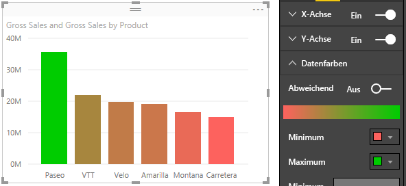

Was passiert nun, wenn wir in den Feldern **Minimum** und **Maximum** numerische Werte eingeben. Diese werden unter der **minimalen** und der **maximalen** Farbauswahl angezeigt (im folgenden Bild veranschaulicht). Legen Sie **Minimum** auf 20.000.000 und **Maximum** auf 20.000.001 fest.

Werden diese Werte festgelegt, wird der Farbverlauf nicht mehr auf die Werte im Diagramm angewendet, die unter dem **Minimum** oder über dem **Maximum** liegen. Alle Balken mit Werten oberhalb des **Maximums** werden grün, alle Balken mit Werten unterhalb des **Minimums** rot markiert.

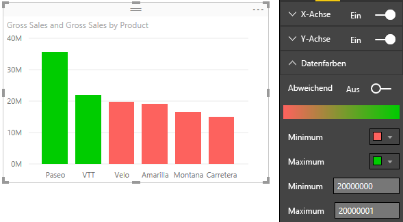

## Abweichende Farbskalen verwenden
Manchmal verfügen Ihre Daten über natürlich abweichende Skalen. Beispielsweise liegt bei einem Temperaturbereich die natürliche Mitte am Gefrierpunkt, und eine Rentabilitätsbewertung hat einen natürlichen Mittelpunkt (Null).

Um abweichende Farbskalen zu verwenden, bewegen Sie den Schieberegler für **Abweichend** auf **Ein**. Wenn **Abweichend** aktiviert ist, werden eine zusätzliche Farbauswahl und ein Wertefeld, die beide **Mitte**heißen, wie nachfolgend angezeigt.

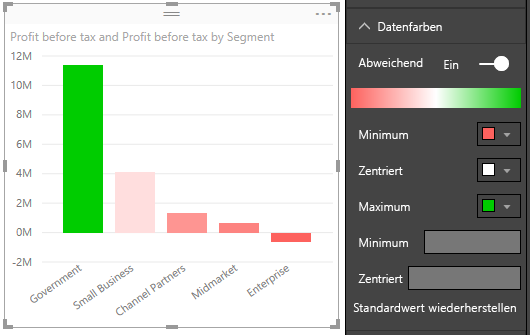

Wenn der Schieberegler **Abweichend** aktiviert ist, können Sie die Farben für **Minimal**, **Maximal** und **Mitte** separat auswählen. In der folgenden Abbildung wird für **Mitte** „1“ festgelegt, sodass Balken mit Werten über 1 in einem Grünton und Balken mit Werten unter 1 in einem Rotton angezeigt werden.

## Änderungen in Power BI rückgängig machen
Wie viele andere Microsoft-Dienste und Software bietet Power BI eine einfache Möglichkeit, den letzten Befehl rückgängig zu machen. Nehmen wir an, Sie ändern die Farbe eines Datenpunkts oder eine Reihe von Datenpunkten, und die Farbe gefällt Ihnen nicht, wenn sie in der Visualisierung angezeigt wird. Sie wissen nicht genau, wie die Farbe zuvor festgelegt war, aber Sie möchten wieder diese Farbe angezeigt bekommen.

Sie können Ihre letzte Aktion bzw. die letzten paar Aktionen ganz einfach **rückgängig machen**:

- Geben Sie STRG + Z ein.

## Feedback
Haben Sie einen Tipp, von dem Sie berichten möchten? Bitte lassen Sie ihn uns zukommen –möglicherweise nehmen wir ihn in diese Liste auf.

>[!NOTE]
>Die Farb- und Achseneinstellungen sowie die zugehörigen Anpassungen, die bei Auswahl des Symbols **Format** verfügbar sind, stehen auch in Power BI Desktop zur Verfügung.

## Nächste Schritte
[Erste Schritte mit Farbeinstellungen und Achseneigenschaften](service-getting-started-with-color-formatting-and-axis-properties.md)

