# Verteilen von Power BI-Inhalten an externe Gastbenutzer mit Azure Active Directory B2B

**Zusammenfassung:** Dies ist ein technisches Whitepaper, wie Sie Inhalte an Benutzer außerhalb der Organisation, die mithilfe der Integration von Azure Active Directory Business-to-Business (Azure AD B2B) verteilen.

**Autoren:** Lukasz Pawlowski, Kasper de Jonge

**Technische Reviewer:** Adam Wilson, Sheng Liu, Qian Liang, Sergei Gundorov, Jacob Grimm, Adam Saxton, Maya Shenhav, Nimrod Shalit, Elisabeth Olson

> [!NOTE]
> Sie können dieses Whitepaper speichern oder ausdrucken, indem Sie in Ihrem Browser erst auf **Drucken** und dann auf **Als PDF speichern** klicken.

## Einführung

Powerbi kann alle Benutzer in diesen Organisationen für intelligente Entscheidungen mit Daten und bietet Organisationen eine 360-Grad-Ansicht ihres Unternehmens. Viele dieser Organisationen verfügen über sichere und vertrauenswürdige Beziehungen mit externen Partnern, Clients und Auftragnehmern. Diese Organisationen müssen sicheren Zugriff auf Power BI-Dashboards und Berichte für Benutzer in diesen externen Partnern angeben.

Powerbi arbeitet mit [Azure Active Directory Business-to-Business (Azure AD B2B)](https://docs.microsoft.com/azure/active-directory/b2b/what-is-b2b) um sichere Verteilung von Power BI Inhalten an Gastbenutzer außerhalb der Organisation zu ermöglichen, während der Zugriff weiterhin die Kontrolle und leitenden auf interne Daten.

Dieses Whitepaper enthält, die alle Details, die Sie Power BI-Integration mit Azure Active Directory B2B zu verstehen müssen. Wir behandeln die häufigsten Anwendungsfälle, Setup, Lizenzierung und Sicherheit auf Zeilenebene.

> [!NOTE]
> In diesem Whitepaper beziehen wir uns in Azure Active Directory als Azure AD und Azure Active Directory Business-to-Business als Azure AD B2B.

## Szenarien

Contoso ist ein Automobilhersteller und arbeitet mit vielen verschiedenen Lieferanten, die alle Komponenten, Materialien und Services zum Ausführen der Vorgänge für die Produktion bereitstellen. Contoso möchte seine lieferkettenlogistik und Pläne zur Power BI zu verwenden, um seine Lieferkette wichtige Leistungsmetriken überwachen zu optimieren. Contoso möchte mit externen Supply Chain-Partner Analytics in eine sicherere und überschaubarere Möglichkeit gemeinsam nutzen.

Contoso kann die folgenden Möglichkeiten für externe Benutzer, die mithilfe von Power BI und Azure AD B2B aktivieren.

### Ad-Hoc pro Freigeben von Elementen

Contoso arbeitet mit einem Lieferanten, der Heizkörpern für Contoso Autos erstellt. Häufig müssen sie die Zuverlässigkeit der Heizkörpern mit Daten von allen Contoso Autos zu optimieren. Ein Analyst bei Contoso verwendet Power BI, um einen Kühler Zuverlässigkeit-Bericht für einen Techniker an den Lieferanten freigeben. Der Techniker erhält eine e-Mail mit einem Link zum Anzeigen des Berichts.

Wie oben beschrieben, wird dieses Ad-hoc-Freigeben von geschäftlichen Benutzern auf Bedarf ausgeführt. Die Verknüpfung von Power BI an den externen Benutzer gesendet wird, ein Link zur freigabeeinladung Azure AD B2B. Der externe Benutzer auf den Link öffnet, wird er aufgefordert, Contosos Azure AD-Organisation als Gastbenutzer hinzugefügt. Nachdem die Einladung angenommen wurde, wird die Verknüpfung geöffnet, Bericht oder Dashboard. Azure Active Directory-Administrator delegiert die Berechtigung für die Einladung externer Benutzer für die Organisation und entscheidet, was die Benutzer ausführen können, nachdem sie die Einladung akzeptieren, wie in der Governance-Abschnitt dieses Dokuments beschrieben. Der Contoso-Analyst kann den Guest-Benutzer einladen, nur, weil der Azure AD-Administrator die Aktion und dem Power BI zulässigen Administrator zugelassenen Benutzer einladen von Gästen in den mandanteneinstellungen des Power BI Inhalte anzeigen.

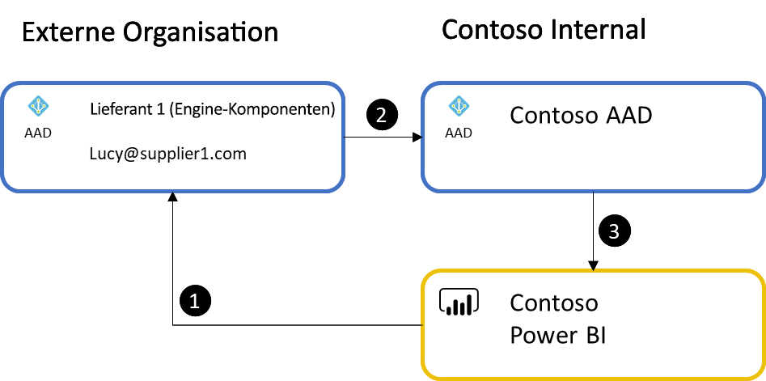

1. Der Prozess beginnt mit einem internen Contoso-Benutzer, die ein Dashboard oder einen Bericht mit einem externen Benutzer freigeben. Ist der externe Benutzer nicht bereits ein Gast Contosos Azure AD, sie sind dazu eingeladen. Eine e-Mail wird gesendet, deren e-Mail-Adresse, die enthält eine Einladung an Contosos Azure AD
2. Der Empfänger akzeptiert die INVITE-Nachricht an Contoso Azure AD-Verzeichnis, und wird als Gastbenutzer in Contosos-Azure hinzugefügt AD.
3. Der Empfänger wird dann umgeleitet, um die Power BI-Dashboard, Bericht oder -app, die für den Benutzer schreibgeschützt sind.

Der Prozess wird als Ad-hoc-betrachtet, da geschäftlichen Benutzern in Contoso die INVITE-Nachricht nach Bedarf für ihre Geschäftszwecke Aktion. Jedes Element freigegeben ist, dass einen einzelnen Link, der die externe Benutzer zugreifen kann, die den Inhalt anzuzeigen.

Sobald der externe Benutzer eingeladen wurde, den Zugriff auf Ressourcen von Contoso, ein Schattenkonto für Contoso Azure AD erstellt werden kann, und sie müssen nicht erneut eingeladen werden sollen.  Beim ersten versucht wird, auf eine Contoso-Ressource wie eine Power BI-Dashboard, durchlaufen sie einen Zustimmungsprozess, die die Einladung eingelöst hat.  Wenn sie die Zustimmung noch nicht abgeschlossen werden, können sie nicht Contosos-Inhalte zugreifen.  Wenn sie Probleme beim einlösen der einladungs über der originallink bereitgestellt haben, kann in Azure AD-Administrator eine bestimmte Einladungslink dafür einlösen erneut gesendet.

### Geplante pro Freigeben von Elementen

Contoso arbeitet mit Zulieferer Zuverlässigkeit Heizkörpern analysieren. Die Vertragspartner verfügt über eine Gruppe von 10 Leuten, die Zugriff auf Daten in Power BI-Umgebung von Contoso benötigen. Der Administrator von Contoso Azure AD ist, alle Benutzer einzuladen und Ergänzungen/Änderungen als Personen, die bei der Änderung Vertragspartner behandelt. Azure AD-Administrator erstellt eine Sicherheitsgruppe für alle Mitarbeiter auf die Vertragspartner. Verwenden die Sicherheitsgruppe, können Contosos-Mitarbeiter ganz einfach Verwalten des Zugriffs auf Berichte und stellen sicher, dass alle erforderlichen Vertragspartner Mitarbeiter Zugriff auf die gewünschten Berichte, Dashboards und Power BI-apps. Azure AD-Administrator beteiligt des einladungsprozesses vollständig durch Auswahl Einladung Rechte an einen vertrauenswürdigen Mitarbeiter an Contoso oder an den Zulieferer rechtzeitig Mitarbeiter delegieren kann auch vermeiden, Management.

Einige Organisationen benötigen besser steuern zu können, wenn externe Benutzer hinzugefügt werden, sind viele Benutzer in einer externen Organisation oder viele externe Organisationen einladen. In diesen Fällen kann geplante Freigabe verwendet werden, verwalten die Staffelung der Freigabe, die zum Erzwingen von Unternehmensrichtlinien und sogar die delegieren Sie Rechte auf vertrauenswürdige Personen einladen und externe Benutzer verwalten. Azure AD B2B unterstützt geplante Einladungen direkt gesendet werden [vom Azure-Portal von einem IT-Administrator](https://docs.microsoft.com/azure/active-directory/b2b/add-users-administrator), oder über [PowerShell mithilfe der einladungs-Manager-API-](https://docs.microsoft.com/azure/active-directory/b2b/customize-invitation-api) , in denen eine Gruppe von Benutzern in einem eingeladen werden kann die Aktion. Verwenden das geplante Einladungen Ansatz, die Organisation kann steuern, wer einladen von Benutzern und Genehmigungsprozesse implementieren kann. Erweiterte Funktionen der Azure AD an, wie dynamische Gruppen für die automatische Verwaltung der Mitgliedschaft in Sicherheitsgruppen erleichtern können.

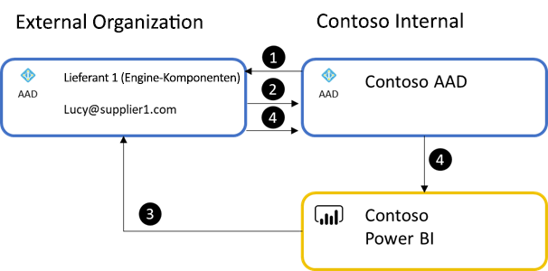

1. Die Prozess-Sterne mit einladen des Gastbenutzers entweder manuell oder über die API, die von Azure Active Directory bereitgestellten IT-administrator
2. Der Benutzer nimmt die Einladung an, für die Organisation.
3. Sobald der Benutzer die Einladung angenommen hat, kann ein Benutzer in Power BI Freigeben eines Berichts oder Dashboards mit den externen Benutzer oder eine Sicherheitsgruppe, die, der Sie im sind. Wie erhält der externe Benutzer mit regulären Freigabe in Power BI eine e-Mail mit dem Link zum Element.
4. Wenn die externe Benutzer-Zugriffe, die auf der Link, die Authentifizierung in ihrem Verzeichnis Contoso an Azure AD-Verzeichnis und verwendet, um Zugriff auf die Power BI-Inhalte zu erhalten.

### Ad-hoc- oder geplanten gemeinsame Nutzung von Power BI-Apps

Contoso verfügt über eine Reihe von Berichten und Dashboards, die sie mit einem oder mehreren Lieferanten freigeben möchten. Um sicherzustellen, dass alle erforderliche externe Benutzern Zugriff auf diesen Inhalt verfügen, wird es als ein Power BI-app verpackt. Der externe Benutzer werden entweder direkt an die app-Zugriffsliste oder über Sicherheitsgruppen hinzugefügt. Ein Benutzer bei Contoso sendet dann die app-URL, an alle externen Benutzer, z. B. in einer e-Mail. Wenn die externen Benutzer den Link öffnen, sehen sie alle Inhalte in einem einfach zu Benutzeroberfläche zu navigieren.

Mit einer Power BI-app erleichtert Ihnen für Contoso, erstellen Sie eine BI-Portal für ihren Lieferanten. Eine Liste für den Zugriff per einmaligem steuert den Zugriff auf alle erforderlichen Inhalte, die Einsparung von Zeit zu überprüfen und Festlegen von Berechtigungen auf Objektebene reduziert. Azure AD B2B verwaltet, für den Zugriff des Lieferanten einheitlichen Identität verwenden, sodass Benutzer keine zusätzliche Anmeldeinformationen erforderlich. Wenn Sie mit der Sicherheitsgruppen mit geplanten eingeladen wird, wird zugriffsverwaltung für die app beim Drehen von Mitarbeitern in oder aus dem Projekt vereinfacht. Die Mitgliedschaft in sicherheitsaktivierten Gruppen manuell oder mithilfe von [dynamische Gruppen](https://docs.microsoft.com/azure/active-directory/b2b/use-dynamic-groups), sodass alle externen Benutzer von einem anderen Lieferanten automatisch der entsprechenden Sicherheitsgruppe hinzugefügt werden.

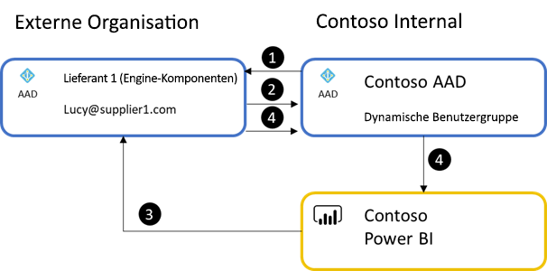

1. Der Prozess gestartet wird, durch den Benutzer, die Einladung zur Contoso Azure AD-Organisation über das Azure-Portal oder PowerShell
2. Der Benutzer kann für eine Benutzergruppe in Azure Active Directory hinzugefügt werden. Eine statische oder dynamische Benutzergruppe kann verwendet werden, aber die dynamische Gruppen reduzieren manuellen Arbeit.
3. Der externe Benutzer sind Zugriff auf die Power BI-App über die Benutzergruppe gewährt. Die app-URL direkt an den externen Benutzer gesendet oder an einem Standort platziert werden soll, haben sie Zugriff auf. Mit Powerbi können bestmöglich versuchen soll, senden eine e-Mail mit den app-Link für externe Benutzer bei Verwendung von Benutzergruppen, deren Mitgliedschaft ändern kann, Power BI ist jedoch nicht für alle externen Benutzer durch Benutzergruppen verwaltet zu senden.
4. Wenn der externe Benutzer die Power BI-app-URL zugreift, werden sie von Contoso Azure authentifiziert AD die app für den Benutzer installiert ist, und der Benutzer kann alle enthaltenen Berichte und Dashboards in der app sehen.

Außerdem haben die Apps ein eindeutiger Feature, können app-Autoren, installieren Sie die Anwendung automatisch für den Benutzer aus, sodass sie verfügbar ist, wenn der Benutzer anmeldet. Dieses Feature wird nur für externe Benutzer, die bereits Teil Contosos-Organisation, die zum Zeitpunkt die Anwendung veröffentlicht oder aktualisiert wird automatisch installiert. Also, es wird am besten mit dem geplante Einladungen-Ansatz verwendet und hängt von der app veröffentlicht oder aktualisiert, nachdem der Benutzer Contosos Azure hinzugefügt werden AD. Externe Benutzer können die app über den Link der app jederzeit installieren.

### Kommentieren und Abonnieren von Inhalt zwischen Organisationen

Da Contoso die Vertragspartner oder Lieferanten zusammenarbeiten ständig, müssen das externe Entwickler arbeiten eng mit Contoso Analysten zu. Powerbi bietet mehrere Features für die Zusammenarbeit, mit deren Hilfe Benutzer über Inhalte zu kommunizieren, die sie nutzen können. Kommentieren Dashboard (und in Kürze melden kommentieren) ermöglicht es Benutzern, Datenpunkte zu besprechen, erkennen und kommunizieren mit Autoren von Berichten, Fragen zu stellen.

Derzeit können externe Gastbenutzer Kommentare teilnehmen, Kommentieren und Lesen Sie die Antworten. Im Gegensatz zu internen Benutzern Gastbenutzer können jedoch kein werden @mentioned und erhalten keine Benachrichtigungen, dass sie einen Kommentar erhalten haben. Gastbenutzer können nicht das Abonnementsfeature "in Power BI zum Zeitpunkt der Verfassung verwenden. In einer zukünftigen Version, werden diese Einschränkungen aufgehoben werden, und der Guest-Benutzer erhalten e-Mail, wenn Sie einen Kommentar @mentions , oder wenn ein Abonnement an ihre e-Mail-Adresse, die einen zu den Inhalten in Power BI Link bereitgestellt.

### Zugriff auf Inhalte in den mobilen Power BI-apps

In einer zukünftigen Version Wenn Contosos-Benutzer durch ihre externe Gast-Entsprechungen, Berichte oder Dashboards freigeben sendet Power BI per e-Mail benachrichtigt, des Gasts. Der Guest-Benutzer auf den Link, um den Bericht oder Dashboard auf seinem mobilen Gerät öffnet, wird der Inhalt in der nativen mobilen Power BI-apps auf ihrem Gerät, geöffnet, wenn diese installiert sind. Der Guest-Benutzer wird dann zum Navigieren zwischen Inhalten, die für sie freigegeben werden, in den externen Mandanten und zurück an ihre eigenen Inhalte aus ihren home-Mandanten können.

> [!NOTE]
> Der Gastbenutzer kann nicht die mobile Power BI-app und sofort navigieren Sie zu den externen Mandanten, sie müssen mit einem Link zu einem Element in der externen Mandanten beginnen. Im Allgemeinen problemumgehungen beschrieben die [Verteilen von Links zu Inhalten, die in der übergeordneten Organisation des Power BI](#distributing-links-to-content-in-the-parent-organizations-power-bi) weiter unten in diesem Dokument.

### Organisationsübergreifende Bearbeitung und Verwaltung von Power BI-Inhalten

Contoso und seine Lieferanten und Vertragspartner werden zunehmend eng zusammen arbeiten. Häufig benötigt ein Analytiker am Zulieferers zusätzliche Metriken oder Daten von Visualisierungen zu einem Bericht hinzugefügt werden, die Contoso für sie freigegeben hat. Die Daten in Power BI-Mandanten von Contoso befinden sollte, aber externe Benutzer sollten in der Lage zu bearbeiten, erstellen neuen Inhalte und auch an geeignete Personen verteilen.

Powerbi bietet eine Option, die es ermöglicht **externe Gastbenutzer können bearbeiten und Verwalten von Inhalten** in der Organisation. Standardmäßig müssen externe Benutzer eine nur-Lese Nutzung ausgerichteten Umgebung. Allerdings kann diese neue Einstellung der Power BI-Administrator, um auszuwählen, welche externe Benutzer verwalten und bearbeiten können Inhalt in der eigenen Organisation. Sobald erlaubt, kann der externe Benutzer Bearbeiten von Berichten, Dashboards, veröffentlichen oder Aktualisieren von apps, in Arbeitsbereichen arbeiten und eine Verbindung mit Daten, die diese Berechtigung zum verwenden.

Dieses Szenario wird in der aktivieren "im Abschnitt" externe Benutzer bearbeiten und Verwalten von Inhalten in Power BI weiter unten in diesem Dokument ausführlich beschrieben.

## Organisationsbeziehungen mithilfe von Power BI und Azure AD B2B

Wenn alle Benutzer von Power BI für die Organisation intern sind, ist es nicht erforderlich, Azure AD B2B verwenden. Jedoch einmal möchten, dass zwei oder mehr Organisationen auf Daten und Erkenntnisse zusammenarbeiten, vereinfacht Power BI Support für Azure AD B2B problemlos und kosteneffektiv bereitstellen möchten.

Im folgenden finden Sie in der Regel aufgetretene Organisationsstrukturen, die sich gut für die Azure AD B2B-Stil organisationsübergreifende Zusammenarbeit in Power BI sind. Azure AD B2B in den meisten Fällen gut funktioniert, aber in einigen Situationen die allgemeinen alternative Ansätze, die am Ende dieses Dokuments behandelt, die in Betracht gezogen werden.

### Fall 1: Direkte Zusammenarbeit zwischen Organisationen

Contoso Beziehung mit den zugehörigen Lieferanten Kühler ist ein Beispiel für die direkte Zusammenarbeit zwischen Organisationen. Da es relativ wenige Benutzer bei Contoso gibt und die zugehörigen Lieferanten, die Zugriff auf Kühler Zuverlässigkeit Informationen benötigen, mithilfe von Azure AD B2B, die externe Freigabe basiert ist ideal. Es ist einfach zu verwenden und einfach zu verwalten. Dies ist auch ein allgemeines Muster in Beratungsdiensten, in denen möglicherweise ein Berater müssen Inhalte für eine Organisation erstellen.

In der Regel tritt auf, diese gemeinsame Verwendung zunächst mithilfe von Ad-hoc-pro Freigeben von Elementen. Allerdings wird Ansatz wie Teams wachsen oder Beziehungen zu vertiefen, die geplante pro Freigeben von Elementen die bevorzugte Methode zum Verwaltungsaufwand zu verringern. Darüber hinaus kann die Ad-hoc- oder geplanten Freigabe von Power BI-Apps, Kommentieren und das Abonnieren von Inhalt in Organisationen, den Zugriff auf Inhalte in mobilen apps in Play ebenfalls und organisationsübergreifende Bearbeitung und Verwaltung von Power BI-Inhalten stammen. Vor allem wenn beider Organisationen Benutzer Power BI Pro-Lizenzen in die jeweiligen Abteilungen haben, können sie diese Pro-Lizenzen in jeder anderen Power BI-Umgebungen verwenden. Dies bietet vorteilhaft Lizenzierung, da die einladende Organisation möglicherweise nicht für eine Power BI Pro-Lizenz für externe Benutzer Zahlen muss. Dies wird ausführlicher im Abschnitt "Lizenzierung" weiter unten in diesem Dokument erläutert.

### Fall 2: Übergeordnete Element und seine Tochtergesellschaften oder Tochterunternehmen

Einige Unternehmen Strukturen sind komplexer, einschließlich teilweise oder vollständig im Besitz des Benutzers Niederlassungen, Tochterunternehmen oder verwalteter Dienst Anbieter-Beziehungen. Diese Organisationen haben eine übergeordneten Organisation z. B. ein Unternehmen, aber die zugrunde liegende Organisationen arbeiten durch autonom, manchmal unter verschiedenen regionalen Anforderungen. Dies führt zu jede Organisation, die über eine eigene Azure AD-Umgebung und separate Power BI-Mandanten.

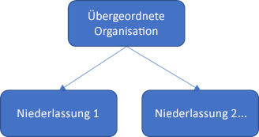

In dieser Struktur muss die übergeordneten Organisation in der Regel um standardisierte Einblicke in den einzelnen Niederlassungen verteilen. In der Regel tritt auf, diese gemeinsame Verwendung mit der Ad-hoc- oder geplanten Freigabe von Power BI-Apps-Ansatz, wie in der folgenden Abbildung ist dargestellt, da es die Verteilung von standardisierten autorisierender Inhalt für ein breites Publikum ermöglicht. In der Praxis ist eine Kombination aus allen Szenarien, die weiter oben in diesem Dokument verwendet.

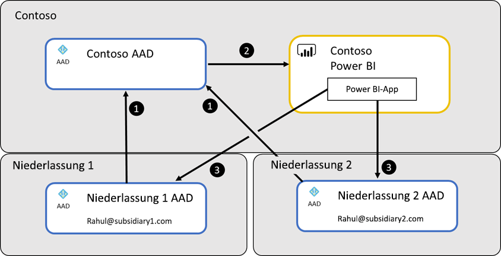

Dies entspricht den folgenden Prozess:

1. Benutzern aus jeder Niederlassung sind eingeladen, an Contosos Azure AD
2. Klicken Sie dann Power BI-app veröffentlicht wird, um diesen Benutzern den Zugriff auf die erforderlichen Daten
3. Schließlich öffnen Sie die Benutzer die app über einen Link an, die, den Sie erhalten haben, die Berichte finden Sie unter

Einige wichtige Herausforderungen werden von Unternehmen in dieser Struktur konfrontiert:

- Gewusst wie: Verteilen von Links zu Inhalten, die in der übergeordneten Organisation des Power BI
- Vorgehensweise zum erlauben von untergeordneten Benutzern Zugriff auf die Datenquelle, die von der übergeordneten Organisation gehostet wird

#### Verteilen von Links zu Inhalten, die in der übergeordneten Organisation des Power BI

Drei Ansätze werden häufig verwendet, um Links zu Inhalten zu verteilen. Die erste und die meisten Basic ist auf den Link der App für die Benutzer zu senden oder an eine SharePoint Online-Website Platzieren von dem aus sie geöffnet werden kann. Benutzer können dann den Link in ihren Browsern für einen schnelleren Zugriff auf die Daten einem Lesezeichen versehen, die sie benötigen.

Der zweite Ansatz hängt davon ab, die organisationsübergreifende bearbeiten und die Verwaltung von Power BI-Inhalt-Funktion. Die übergeordneten Organisation kann Benutzer aus der Niederlassungen auf der Power BI zugreifen, und steuert, was durch eine Berechtigung zugegriffen werden kann. Dadurch erhält Zugriff auf Power BI Home, in denen der Benutzer die Niederlassung eine umfassende Liste der Inhalte, die sie in der übergeordneten Organisation des Mandanten freigegeben wird. Klicken Sie dann die URL für den übergeordneten Organisationen Power BI-Umgebung für die Benutzer auf die Daten erhält.

Der letzte Ansatz verwendet eine Power BI-app, die innerhalb der Power BI-Mandant für jede Niederlassung erstellt. Power BI-app umfasst ein Dashboard mit [Kacheln, die mit der externen Link-Option konfiguriert](https://docs.microsoft.com/power-bi/service-dashboard-edit-tile#hyperlink). Wenn der Benutzer auf die Kachel "drückt, werden sie auf den entsprechenden Bericht, Dashboard oder in der übergeordneten Organisation des Power BI-app weitergeleitet. Dieser Ansatz hat den zusätzlichen Vorteil, dass die app automatisch für alle Benutzer in der Niederlassung installiert werden kann und zur Verfügung, ist wenn die Anmeldung auf ihrer Power BI-Umgebung. Ein weiteren Vorteil dieses Ansatzes ist, dass sie funktioniert gut mit den mobilen Power BI-apps an, die den Link systemintern öffnen können. Sie können dies auch mit dem zweiten Ansatz zu aktivieren, einfacher Wechsel zwischen Umgebungen mit Power BI kombinieren.

#### Untergeordnete Benutzer den Zugriff auf Datenquellen, die von der übergeordneten Organisation gehostet wird

Häufig Analysten in einer Niederlassung müssen ihre eigenen Analytics, die mithilfe des von der übergeordneten Organisation angegebenen Daten zu erstellen. In diesem Fall clouddatenquellen dienen meist zum die Herausforderungen zu meistern.

Der erste Ansatz nutzt [Azure Analysis Services](https://docs.microsoft.com/azure/analysis-services/analysis-services-overview) Enterprise Datawarehouse auf Unternehmensniveau zu erstellen, die von Analysten über das übergeordnete Element und seinen Tochtergesellschaften, wie die folgende Abbildung gezeigt hat. Contoso kann die Daten hosten und Verwenden von Funktionen wie Sicherheit auf Zeilenebene, sicherzustellen, dass Benutzer in jeder Niederlassung nur ihre Daten zugreifen kann. Analysten in jeder Organisation können Zugriff auf das Datawarehouse über Power BI Desktop und resultierende Analysen in ihren entsprechenden Mandanten für Power BI veröffentlichen.

Der zweite Ansatz nutzt [Azure SQL-Datenbank](https://azure.microsoft.com/services/sql-database/) ein relationales Datawarehouse für den Zugriff auf Daten zu erstellen. Dies funktioniert auf ähnliche Weise mit dem Azure Analysis Services-Ansatz, obwohl einige Funktionen wie Sicherheit auf Zeilenebene zum Bereitstellen und Warten auf Daten schwieriger sein kann.

Komplexere Ansätze sind ebenfalls denkbar, jedoch die oben genannten bei weitem am häufigsten sind.

### Fall 3: Freigegebenen Umgebung für Partner

Contoso kann in eine Partnerschaft mit ein Konkurrent, ein Auto gemeinsam in einer freigegebenen Assembly Zeile zu erstellen, sondern das Fahrzeug unter verschiedenen Marken oder in unterschiedlichen Regionen verteilen eingeben. Dies erfordert umfassende Zusammenarbeit und Co-ownership Daten, Intelligence und Analysen für Organisationen an. Diese Struktur ist auch üblich, in der consulting Services-Branche, in denen möglicherweise ein Team in von Beratern projektbasierten Analytics für einen Client verwendet.

In der Praxis ist diese Strukturen sind komplex, wie in der folgenden Abbildung dargestellt, und Mitarbeiter verwalten müssen. Um effektiv zu sein verwendet diese Struktur die organisationsübergreifende bearbeiten und die Verwaltung von Power BI-Inhalt-Funktion beeinträchtigt, da Organisationen die Power BI Pro-Lizenzen erworben haben, für ihre jeweiligen Power BI-Mandanten wiederverwenden.

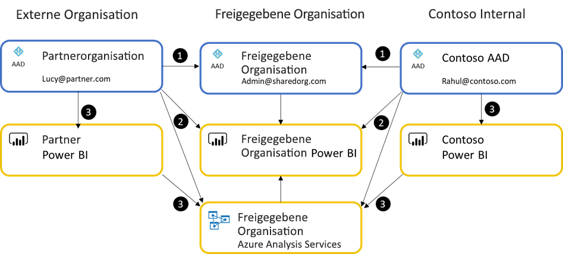

Um einen freigegebenen Power BI-Mandanten herzustellen, muss ein Azure Active Directory erstellt werden, und mindestens ein Power BI Pro-Benutzer-Konto muss für einen Benutzer in diesem active Directory erworben werden. Dieser Benutzer lädt die erforderlichen Benutzer für die freigegebene Organisation ein. Wichtig ist, dass werden in diesem Szenario Contosos-Benutzer als externe Benutzer behandelt, wenn sie in der freigegebenen Organisation Power BI funktionieren.

Der Prozess ist wie folgt aus:

1. Der Organisation freigegeben wird hergestellt, wie eine neue Azure Active Directory und mindestens ein Benutzerkonto wird erstellt, in der neuen Organisation. Dieser Benutzer benötigen eine Power BI Pro-Lizenz zugewiesen.
2. Dieser Benutzer ist dann ein Power BI-Mandant erstellt und lädt die erforderlichen Benutzer von Contoso und der Partnerorganisation. Der Benutzer stellt auch alle freigegebenen Ressourcen wie Azure Analysis Services her. Contoso und die Benutzer des Partners können der freigegebenen Organisation Power BI als Gastbenutzer zugreifen. Wenn zugelassen, bearbeiten und Verwalten von Inhalten in Power BI können die externen Benutzer mithilfe von Power BI home, verwenden Sie Arbeitsbereiche, hochladen oder Bearbeiten von Inhalten und Freigeben von Berichten. In der Regel werden alle freigegebenen Assets gespeichert und von der Organisation freigegebenen zugegriffen.
3. Je nachdem, wie die Parteien stimmen für die Zusammenarbeit ist es möglich, dass jede Organisation, ihre eigenen proprietären Data und Analytics mithilfe des shared Datawarehouse-Ressourcen zu entwickeln. Sie können diese in die entsprechenden internen Benutzer mit ihren internen Power BI-Mandanten verteilen.

### Fall 4: Verteilung auf Hunderte oder Tausende von Partnern

Während für ein Lieferant einen Kühler Zuverlässigkeit-Bericht für Contoso erstellt haben, möchte nun Contoso eine Reihe von standardisierten Berichten für Hunderte von Lieferanten zu erstellen. Dies ermöglicht Contoso, um sicherzustellen, dass alle Lieferanten die Analyse benötigten um Verbesserungen vorzunehmen oder Fertigungsfehlern zu beheben.

Wenn eine Organisation standardisierten Daten und Einblicke, um viele externe Benutzer/Organisationen zu verteilen muss, können sie verwenden die Ad-hoc- oder geplanten gemeinsame Nutzung von Power BI-Apps-Szenario, um eine BI-Verwaltungsportal schnell und ohne umfangreiche Entwicklungskosten zu erstellen. Der Prozess zum Erstellen solcher ein Portal mit einer Power BI-app wird in die Fallstudie behandelt: Erstellen eine BI-Verwaltungsportal mithilfe von Power BI und Azure AD B2B – schrittweise Anleitung weiter unten in diesem Dokument.

Eine häufige Variante der diesem Fall ist, wenn es sich bei eine Organisation mit Kunden, Erkenntnisse zu teilen, insbesondere, wenn Sie möchten Azure B2C mit Power BI verwenden möchte. Powerbi unterstützt nicht nativ Azure B2C. Wenn Sie Optionen für diesen Fall bewerten möchten, sollten Sie Alternative Option-2 in die allgemeine alternativen Ansätze Abschnitt weiter unten in diesem Dokument.

## Fallstudie: Erstellen einer BI-Verwaltungsportal mithilfe von Power BI + Azure AD B2B – Anleitung

Powerbi-Integration mit Azure AD B2B-Contoso bietet eine nahtlose und unkomplizierte Möglichkeit für sicheren Zugriff auf die BI-Verwaltungsportal Gastbenutzer bereit. Contoso kann dies mit drei Schritten eingerichtet:

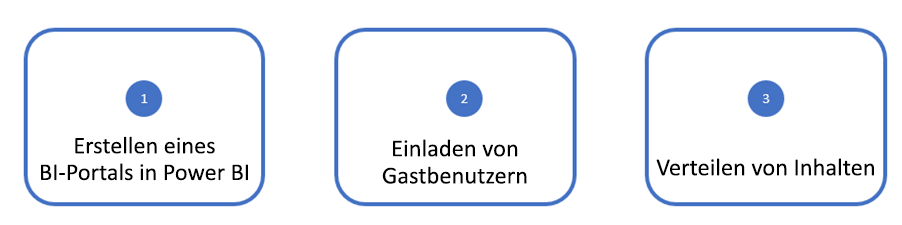

1. Erstellen eines BI-Portals in Power BI

    Die erste Aufgabe für Contoso wird ihre BI-Verwaltungsportal in Power BI zu erstellen. Contoso BI-Verwaltungsportal wird bestehen aus einer Sammlung von zweckbestimmten Dashboards und Berichten, die für viele interne und Guest-Benutzer verfügbar gemacht werden. Die empfohlene Methode dafür in Power BI ist eine Power BI-app erstellen. Erfahren Sie mehr über [-apps in Power BI](https://powerbi.microsoft.com/blog/distribute-to-large-audiences-with-power-bi-apps/).

- Contoso BI-Team erstellt einen App-Arbeitsbereich in Power BI

    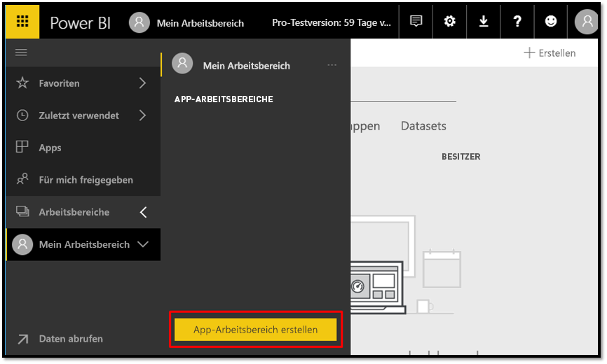
    

- Andere Autoren werden dem Arbeitsbereich hinzugefügt.

    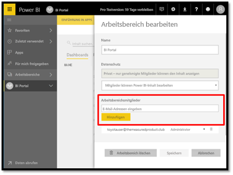

- Inhalt wird innerhalb des Arbeitsbereichs erstellt.

    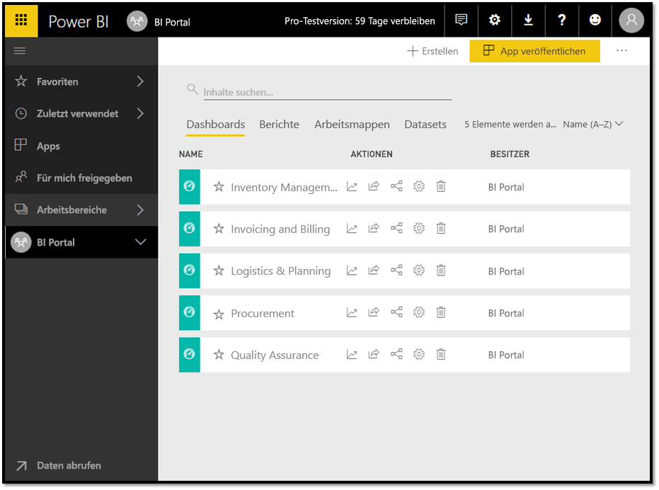

    Nun, dass der Inhalt in einem app-Arbeitsbereich erstellt wird, kann Contoso einladen von Gastbenutzern in Partnerorganisationen, die diese Inhalte nutzen.

2. Einladen von Gastbenutzern

    Es gibt zwei Möglichkeiten für Contoso zum Einladen von Gastbenutzern auf die BI-Verwaltungsportal in Power BI:

    * Geplante Einladungen
    * Ad-hoc-Einladungen

    **Geplante Einladungen**

    Bei diesem Ansatz Contoso der Gastbenutzer in Azure AD vorab lädt und verteilt dann Power BI-Inhalten auf diese. Contoso kann es sich um Gastbenutzer aus dem Azure-Portal oder mithilfe von PowerShell einladen. Hier sind die Schritte zum Einladen von Gastbenutzern aus dem Azure-Portal:

    - Azure AD-Administrator von Contoso navigiert **Azure-Portal > Azure Active Directory > Benutzer und Gruppen > alle Benutzer > neuer Gastbenutzer**

    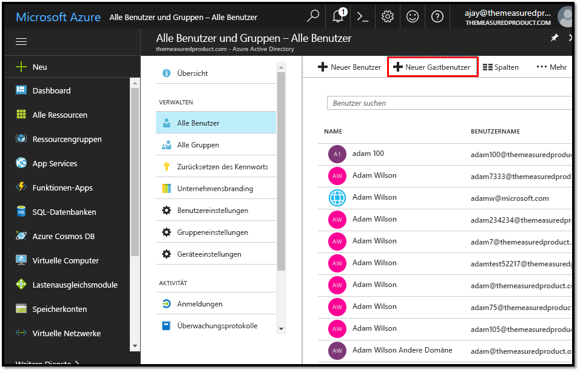

    - Fügen Sie eine Einladungsnachricht für Gastbenutzer hinzu, und klicken Sie auf INVITE-Nachricht

    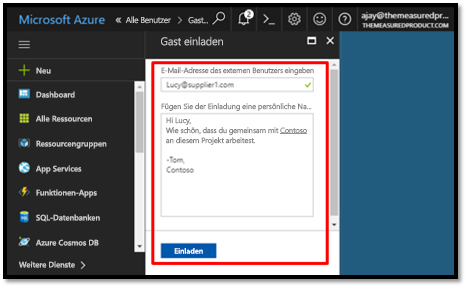

    > [!NOTE]
    > Zum Einladen von Gastbenutzern aus dem Azure-Portal müssen Sie Administrator für Azure Active Directory Ihres Mandanten.

    Wenn Contoso, viele Gastbenutzer einzuladen will, können sie hierfür PowerShell. Azure AD-Administrator von Contoso speichert die e-Mail-Adressen aller Gäste Benutzer in einer CSV-Datei. Hier sind [Azure Active Directory B2B Zusammenarbeit: Code- und PowerShell-Beispiele](https://docs.microsoft.com/azure/active-directory/b2b/code-samples) und Anweisungen.

    Nachdem Sie die Einladung empfangen Gastbenutzer eine e-Mail mit den Einladungslink.

    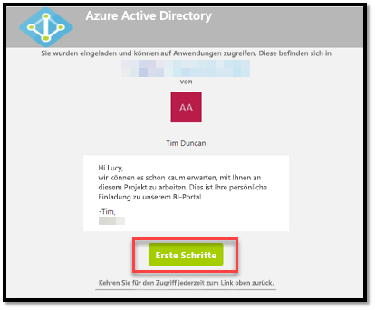

    Wenn Gastbenutzer auf den Link klicken, können sie Inhalte in den Contoso Azure AD-Mandanten zugreifen.

    > [!NOTE]
    > Es ist möglich, ändern Sie das Layout der einladungs-e-Mail mithilfe der Azure AD-branding-Funktion, wie beschrieben [hier](https://docs.microsoft.com/azure/active-directory/active-directory-b2b-invitation-email).

    **Ad-hoc-Einladungen**

    Was geschieht, wenn Contoso weiß nicht, alle Gastbenutzer, die sie vorher laden möchte? Oder, was geschieht, wenn das Verteilen von Inhalten an Gastbenutzer selbst der Analyst bei Contoso, das BI-Portal erstellt, hat, möchte? Wir unterstützen dieses Szenario auch in Power BI, mit der Ad-hoc-Einladungen.

    Der Analyst kann einfach die externen Benutzer der Zugriffsliste der app hinzufügen, wenn sie es veröffentlichen. Gastbenutzer wird eine INVITE-Nachricht ein, und sobald sie diese akzeptieren, werden sie automatisch umgeleitet, auf die Power BI-Inhalte sind.

    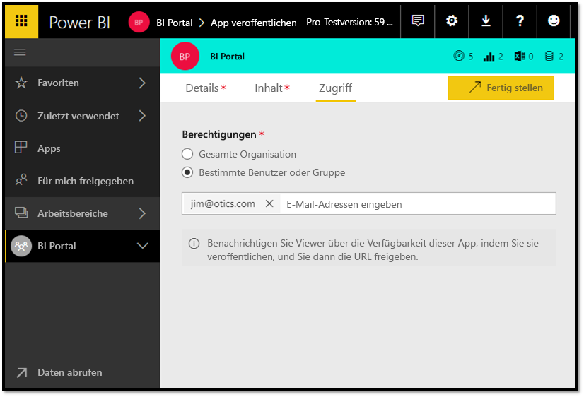

    > [!NOTE]
    > Einladungen sind nur beim ersten Mal erforderlich, ein externer Benutzer in Ihrer Organisation eingeladen wird.

3. Verteilen von Inhalten

    Nun, da Contosos BI-Team hat das BI-Portal erstellt und Gastbenutzer eingeladen, können sie ihrem Portal für ihre Endbenutzer verteilen, indem Gastbenutzer Zugriff auf die app gewährt, und veröffentlichen. Powerbi vervollständigt-automatisch Namen Guest-Benutzer, die zuvor für den Contoso-Mandanten hinzugefügt wurden. Ad-hoc-Einladungen an andere Gastbenutzer können auch an diesem Punkt hinzugefügt werden.

    > [!NOTE]
    > Wenn Sicherheitsgruppen zum Verwalten des Zugriffs auf die app für externe Benutzer, verwenden Sie die geplante Einladungen Methode aus, und teilen Sie den app-Link, direkt mit jeder externe Benutzer, der darauf zugreifen muss. Andernfalls der externe Benutzer möglicherweise nicht zu installieren oder Inhalt aus der App anzuzeigen. _

    Gastbenutzer erhalten eine e-Mail mit einem Link zur app an.

    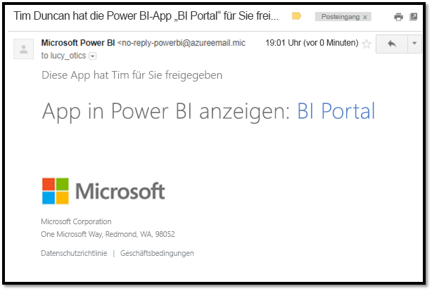

    Für auf diesen Link klicken, werden Gastbenutzer für die Authentifizierung mit ihrer eigenen Organisation Identität aufgefordert.

    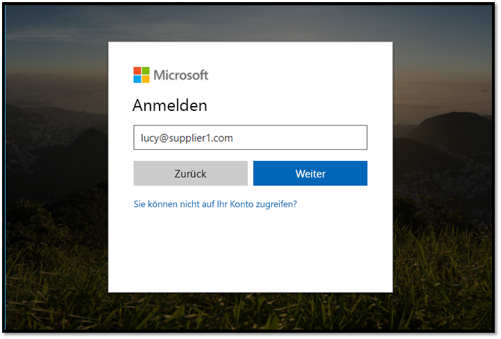

    Nachdem sie erfolgreich authentifiziert wurden, werden sie Contosos BI-App umgeleitet.

    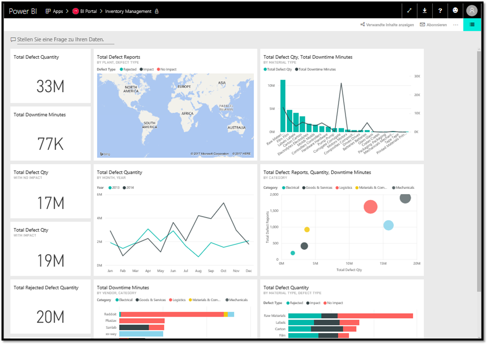

    Gastbenutzer können anschließend auf Contosos-app durch Klicken auf den Link in der e-Mail oder den Link Lesezeichen abrufen. Contoso kann auch vereinfachen für Gastbenutzer durch Hinzufügen von diesen Link zu einem vorhandenen extranet-Portal, das der Gastbenutzer bereits verwenden.

4. Nächste Schritte

    Mit einer Power BI-app und Azure AD B2B können konnte Contoso ein BI-Portal für ihren Lieferanten schnell auf eine Weise ohne Code zu erstellen. Dies vereinfacht deutlich, verteilen standardisierte Analytics, um die Lieferanten, die es benötigt.

    Während im Beispiel wurde gezeigt, wie ein einzelner Bericht für allgemeine Lieferanten verteilt werden konnte, kann Power BI viel weiter gehen. Um sicherzustellen, dass jeder Partner nur Daten für sich selbst angezeigt werden, kann Sicherheit auf Zeilenebene einfach den Bericht und das Datenmodell hinzugefügt werden. Die datensicherheit für externe Partner weiter unten in diesem Dokument wird dieser Prozess ausführlich beschrieben.

    Häufig einzelne Berichte und Dashboards in einem vorhandenen Portal eingebettet werden müssen. Dies kann auch viele der Techniken, die im Beispiel dargestellte Wiederverwendung erreicht werden. In solchen Situationen kann es jedoch einfacher, betten Sie Berichte oder Dashboards direkt aus einem Arbeitsbereich sein. Der Prozess für das einladen und Zuweisen von-Sicherheitsberechtigung, um die benötigen Benutzer bleiben unverändert.

## Hinter den Kulissen: Wie wird Lucy aus Supplier1 können Power BI-Inhalte von Contoso Mandanten darauf zugreifen?

Nun, wir gesehen haben, wie Contoso nahtlos Power BI-Inhalten an Gastbenutzer in Partnerorganisationen verteilen kann, sehen wir uns die Funktionsweise im Hintergrund.

Wenn Contoso eingeladen [ lucy@supplier1.com ](mailto:lucy@supplier1.com) in das Verzeichnis, erstellt Azure AD einen Link zwischen [ Lucy@supplier1.com ](mailto:Lucy@supplier1.com) und den Contoso Azure AD-Mandanten. Über diesen Link können Sie Azure AD wissen, dass Lucy@supplier1.com auf Inhalte im Contoso-Mandanten zugreifen.

Wenn Lucy versucht, die Contosos Power BI-app zugreifen, überprüft Azure AD an, dass Lucy kann auf den Contoso-Mandanten zugreifen, und klicken Sie dann ein Token, der angibt, dass Lucy, die für den Zugriff auf Inhalte im Contoso-Mandanten authentifiziert wird bietet Power BI. Powerbi verwendet dieses Token, um zu autorisieren, und stellen Sie sicher, dass Lucy Zugriff auf Power BI-app von Contoso hat.

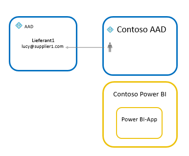

Powerbi-Integration mit Azure AD B2B funktioniert mit allen geschäftlichen e-Mail-Adressen. Wenn der Benutzer nicht über ein Azure AD-Identität verfügt, werden sie möglicherweise aufgefordert, eine zu erstellen. Die folgende Abbildung zeigt die detaillierten Fluss:

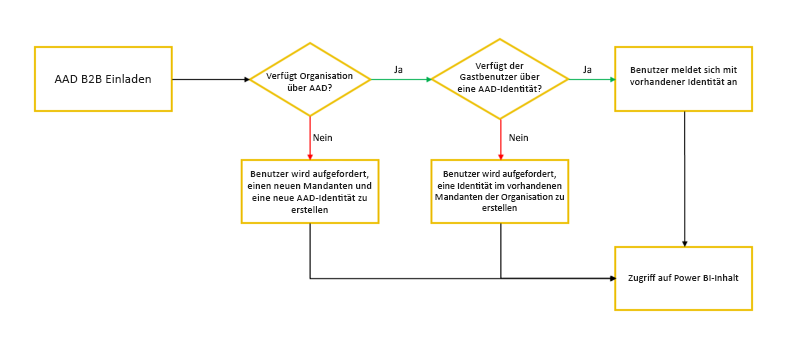

Es ist wichtig zu wissen, dass Azure AD-Kontos verwendet oder in der externen Partei erstellt wird Azure AD, dadurch wird der Organisation stellen, die es möglich, dass Lucy ihren eigenen Benutzernamen und das Kennwort können und ihre Anmeldeinformationen werden automatisch funktionsunfähig in anderen jedes Mal, wenn Mandanten sie das Unternehmen verlässt, wenn ihre Organisation auch Azure AD verwendet.

## Lizenzierung

Contoso kann einen der drei Ansätze für Gastbenutzer Lizenz von Lieferanten und Partnerorganisationen Zugriff auf Power BI-Inhalt auswählen.

> [!NOTE]
> _Die Azure AD B2B-free-Tarif ist ausreichend, um Power BI mit Azure AD B2B verwenden. Einige erweiterten Azure AD B2B-Funktionen wie dynamische Gruppen erfordern zusätzliche Lizenzen. Finden Sie in der Azure AD B2B-Dokumentation für zusätzliche Informationen:_ [_https://docs.microsoft.com/azure/active-directory/b2b/licensing-guidance_](https://docs.microsoft.com/azure/active-directory/b2b/licensing-guidance)

### Ansatz 1: Contoso verwendet Power BI Premium

Bei diesem Ansatz Contoso erwirbt Power BI Premium-Kapazität und dessen BI-Portal-Inhalt dieser Kapazität zugewiesen. Dies ermöglicht es sich um Gastbenutzer aus Partnerunternehmen zum Zugriff auf Contoso Power BI-app ohne alle Power BI-Lizenz.

Externe Benutzer unterliegen außerdem den Verbrauch nur Erfahrungen bei der Nutzung von Inhalten in Power BI Premium "Kostenlose" Benutzer in Power BI angeboten.

Contoso kann auch andere Power BI Premium-Funktionen für die apps, z.B. höhere Aktualisierungsraten, dedizierte Kapazität und große Modelle nutzen.

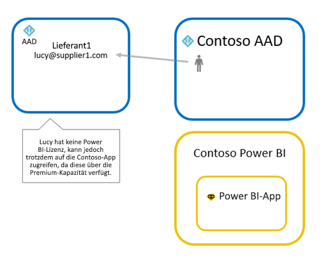

### Ansatz 2: Contoso Gastbenutzer Power BI Pro-Lizenzen zugewiesen

Bei diesem Ansatz Contoso weist pro-Lizenzen an Gastbenutzer aus Partner Organisationen – Dies ist möglich über Contosos Microsoft 365 Administrationscenter aus. Dies ermöglicht es sich um Gastbenutzer aus Partnerunternehmen zu Contoso Power BI-app zugreifen, ohne den Erwerb einer Lizenz selbst. Dies kann für gemeinsame Nutzung für externe Benutzer, deren Organisation noch nicht Power BI übernommen hat, geeignet sein.

> [!NOTE]
> _Contoso pro-Lizenz gilt für Gastbenutzer nur, wenn sie Inhalt im Contoso-Mandanten zugreifen. Pro-Lizenzen ermöglichen den Zugriff auf Inhalte, die nicht in einer Power BI Premium-Kapazität enthalten ist. Allerdings werden externe Benutzer mit einer Pro-Lizenz Nutzung nur Funktionen standardmäßig eingeschränkt. Dies kann die Änderung sein, mithilfe der beschriebenen Vorgehensweise die_ _externen Benutzern ermöglichen, bearbeiten und Verwalten von Inhalten in Power BI_ _weiter unten in diesem Dokument._

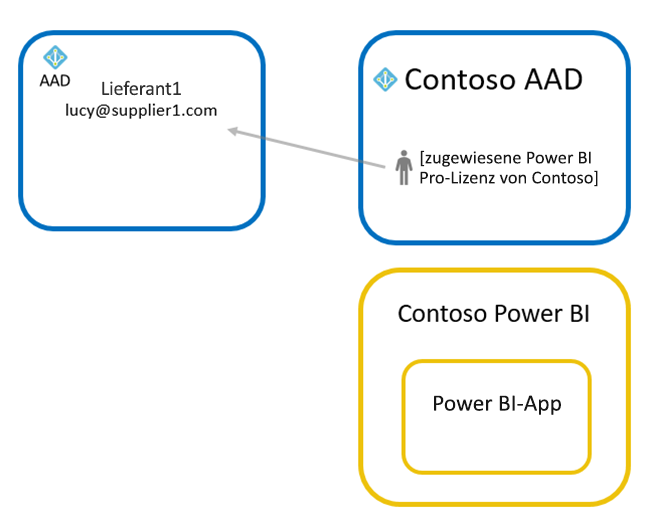

### Methode 3: Gastbenutzer bringen, ihre eigenen Power BI Pro-Lizenz

Bei diesem Ansatz wird mit Lieferanten 1 Lucy eine Power BI Pro-Lizenz zugewiesen. Sie können dann Power BI-app mit dieser Lizenz von Contoso zugreifen. Da Lucy ihre Pro-Lizenz von der eigenen Organisation kann beim Verwenden einer externen Umgebung für Power BI den Zugriff auf, diesen Ansatz wird manchmal als bezeichnet _Nutzung eigener Lizenzen_ (BYOL). Wenn beide Organisationen Power BI verwenden, wird dies bietet vorteilhaft Lizenzierung für die gesamte Analytics-Lösung und minimiert den Verarbeitungsaufwand von externen Benutzern Lizenzen zuzuweisen.

> [!NOTE]
> _Die pro-Lizenz, Lucy zugewiesen werden, um Lieferanten 1 gilt für alle Power BI-Mandanten, in denen Lucy ein Gastbenutzer ist. Pro-Lizenzen ermöglichen den Zugriff auf Inhalte, die nicht in einer Power BI Premium-Kapazität enthalten ist. Allerdings werden externe Benutzer mit einer Pro-Lizenz Nutzung nur Funktionen standardmäßig eingeschränkt. Dies kann die Änderung sein, mithilfe der beschriebenen Vorgehensweise die_ _externen Benutzern ermöglichen, bearbeiten und Verwalten von Inhalten in Power BI_ _weiter unten in diesem Dokument._

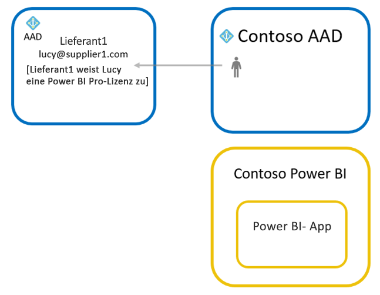

## Datensicherheit für externe Partner

Im Allgemeinen bei der Arbeit mit mehreren externen Lieferanten muss Contoso sicherstellen, dass der einzelnen Lieferanten Daten nur über eine eigene Produkte angezeigt werden. Benutzerbasierten Sicherheit und dynamische Sicherheit auf Zeilenebene können dies erreichen mit Power BI.

### Benutzer-basierte Sicherheit

Eines der leistungsstärksten Features von Power BI ist die Sicherheit auf Zeilenebene. Dieses Feature ermöglicht Contoso ein einzelner Bericht und Dataset zu erstellen, aber andere Sicherheitsregeln für jeden Benutzer weiterhin gültig. Eine ausführliche Erläuterung finden Sie [Sicherheit auf Zeilenebene (RLS)](https://powerbi.microsoft.com/documentation/powerbi-admin-rls/).

Powerbi-Integration mit Azure AD B2B kann Contoso Gastbenutzer Regeln für Sicherheit auf Zeilenebene zuweisen, sobald sie auf den Contoso-Mandanten eingeladen werden. Wie wir gesehen haben, bevor Contoso Gastbenutzer entweder durch hinzufügen kann geplant oder Ad-hoc-Einladungen. Wenn es sich bei Contoso möchte, dass die Sicherheit auf Zeilenebene zu erzwingen, wird es dringend empfohlen, geplante Einladungen zu verwenden, beim Hinzufügen der Guest-Benutzer vor der Zeit, und sie vor dem Freigeben des Inhalts die Sicherheitsrollen zugewiesen. Wenn Contoso verwendet stattdessen kann Ad-hoc-Einladungen, es eine kurze Zeitspanne, in dem Gastbenutzer nicht keine Daten angezeigt werden können.

> [!NOTE]
> Diese Verzögerung beim Zugriff auf Daten, die durch RLS geschützt werden, wenn mithilfe von Ad-hoc-Einladungen kann führen, um Anforderungen an Ihr IT-Team zu unterstützen, da Benutzern angezeigt werden soll, entweder leer oder fehlerhafte Berichte/Dashboards suchen, öffnen eine Freigabe in der e-Mail, die sie erhalten verknüpfen. Aus diesem Grund wird es dringend empfohlen, geplante Einladungen in dieser scenario.* * verwenden

Betrachten wir dies anhand eines Beispiels.

Wie bereits erwähnt, handelt es sich bei Contoso hat Lieferanten auf der ganzen Welt, und sie möchten, um sicherzustellen, dass die Benutzer aus ihrer Organisationen Lieferanten Einblicke in Daten aus einfach ihre Region zu erhalten.  Aber die Benutzer von Contoso auf alle Daten zugreifen können. Statt mehrere verschiedene Berichte, Contoso erstellt einen einzelnen Bericht, und filtert die Daten basierend den Benutzer anzeigen.

Um sicherzustellen, dass Contoso filtern können Sie Daten basierend auf, die eine Verbindung herstellt, werden zwei Rollen in Power BI Desktop erstellt. Eins zu filtern, alle Daten aus der SalesTerritory "Europe" und eine für "Nordamerika".

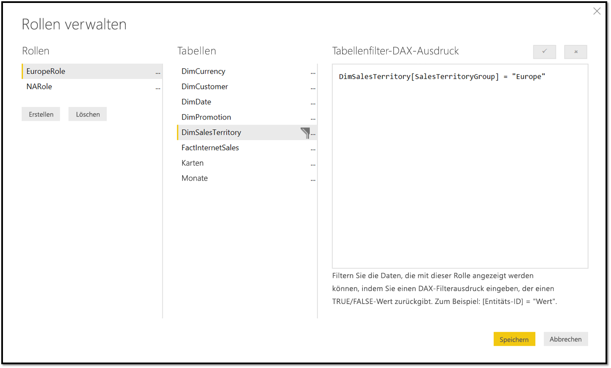

Wenn Rollen im Bericht definiert sind, muss ein Benutzer für sie für den Zugriff auf alle Daten einer bestimmten Rolle zugewiesen werden. Das Zuweisen von Rollen in Power BI-Dienst erfolgt ( **Datasets > Sicherheit** )

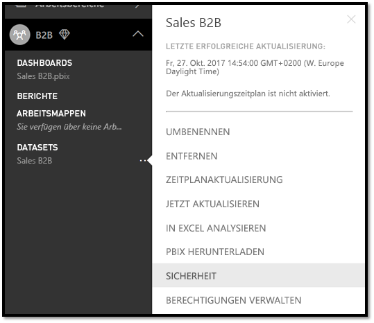

Dadurch wird eine Seite, die Contosos BI-Team, in dem die beiden angezeigt Rollen, die sie erstellt.  Jetzt kann Contosos BI-Team Benutzer Rollen zuweisen.

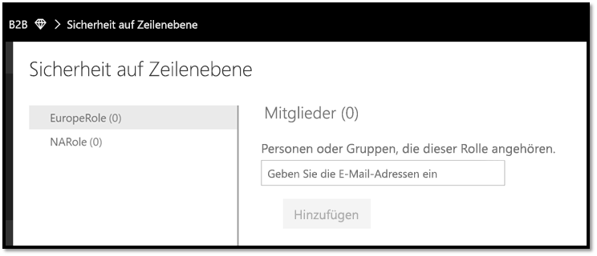

Im Beispiel Contoso ist das Hinzufügen eines Benutzers in einer Partnerorganisation mit e-Mail-Adresse "[adam@themeasuredproduct.com](mailto:adam@themeasuredproduct.com)" zur Rolle "Europa":

Wenn dies von Azure AD aufgelöst Ruft, sehen Contoso den Namen im Fenster hinzugefügt werden angezeigt:

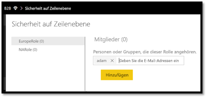

Wenn dieser Benutzer die app, die für ihn freigegeben wurde öffnet, sieht er jetzt nur einen Bericht mit Daten aus Europa:

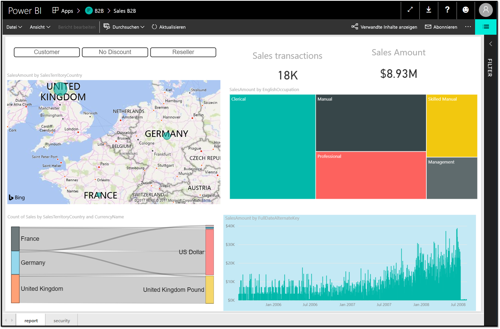

### Dynamische Sicherheit auf Zeilenebene

Ein weiteres interessantes Thema besteht darin, finden Sie unter wie dynamische Sicherheit auf Zeilenebene (RLS) arbeiten mit Azure AD B2B Zeile.

Dynamische Sicherheit auf Zeilenebene wird kurz gesagt: Filtern von Daten in das Modell basierend auf den Benutzernamen der Person, die mit Power BI verbinden. Statt mehrere Rollen für Gruppen von Benutzern zu addieren, definieren Sie die Benutzer im Modell an. Es wird nicht das Muster hier ausführlich beschrieben. Kasper de Jong bietet einen detaillierten Schreibvorgang für alle Varianten von Sicherheit auf Zeilenebene in [Cheat Sheet für Power BI Desktop dynamische Sicherheit](https://www.kasperonbi.com/power-bi-desktop-dynamic-security-cheat-sheet/), und klicken Sie in [in diesem Whitepaper](https://msdn.microsoft.com/library/jj127437.aspx) .

Betrachten wir ein kurzes Beispiel: Contoso verfügt über einen einfachen Bericht auf den Vertrieb von Gruppen:

Nachdem dieser Bericht zwei Guest-Benutzer und einem internen Benutzer freigegeben werden muss – der interne Benutzer kann alles anzeigen, aber der Guest-Benutzer nur die Gruppen sehen haben sie Zugriff auf. Dies bedeutet, dass wir nur die Daten für den Gastbenutzer Filtern müssen. Um die Daten entsprechend zu filtern, verwendet Contoso die dynamische Sicherheit auf Zeilenebene-Muster, wie in dem Whitepaper "und"-Blog-Beitrag beschrieben. Dies bedeutet, dass fügt Contoso die Benutzernamen, auf die Daten selbst:

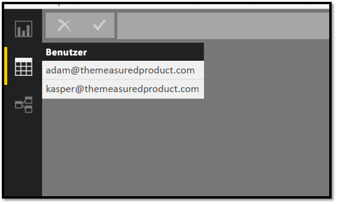

Anschließend wird Contoso das ideale Datenmodell, das filtert, die Daten ordnungsgemäß mit den richtigen Beziehungen erstellt:

Um die Daten basierend auf den angemeldeten automatisch zu filtern, muss eine Rolle, die übergibt den Benutzer zu erstellen, die eine Verbindung herstellt. In diesem Fall Contoso erstellt zwei Rollen – die erste Möglichkeit ist die "Securityrole", die die Tabelle durch den aktuellen Benutzernamen in Power BI (dies funktioniert auch für Azure AD B2B-Gastbenutzer) Anmeldung des Benutzers filtert.

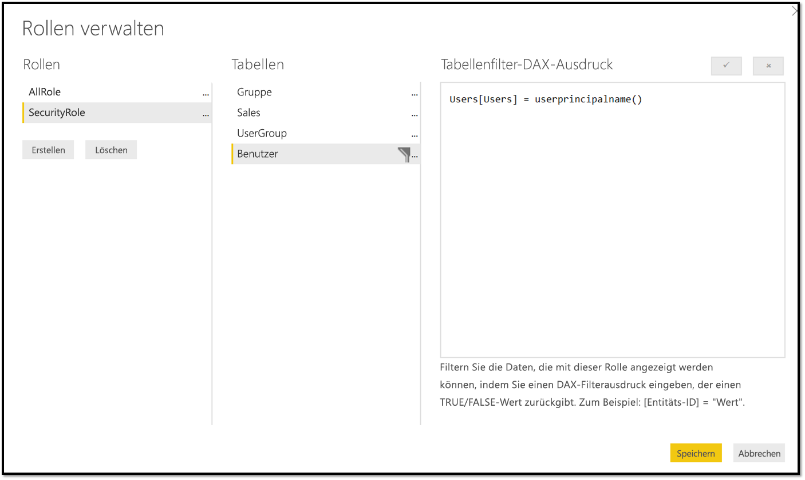

Contoso erstellt auch eine andere "AllRole" für interne Benutzer, die alle Elemente anzeigen können – diese Rolle verfügt nicht über alle sicherheitsprädikat.

Nach dem Hochladen der Power BI desktop-Datei mit dem Dienst kann Contoso Gastbenutzer, die "SecurityRole" und interne Benutzer, die "AllRole" zuweisen.

Nun, wenn Gastbenutzer auf den Bericht öffnen, sie nur sieht Umsätze aus Gruppe A:

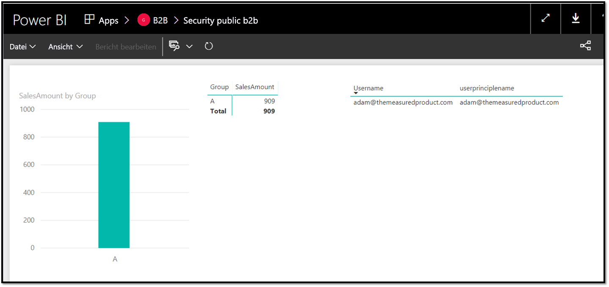

In der Matrix mit der rechten Seite sehen Sie das Ergebnis der Funktion USERNAME() und USERPRINCIPALNAME(), die beide zurückgegeben werden, dass Gastbenutzer e-Mail-Adresse.

Jetzt wird der interne Benutzer, alle Daten finden Sie unter:

Wie Sie sehen können, funktioniert dynamische Sicherheit auf Zeilenebene für interne oder Guest-Benutzer.

> [!NOTE]
> Dieses Szenario funktioniert auch, wenn Sie ein Modell in Azure Analysis Services verwenden. In der Regel Ihre Azure Analysis Services mit dem gleichen Azure AD als Power BI verbunden ist – in diesem Fall weiß Azure Analysis Services auch Gastbenutzer eingeladen, die über Azure AD B2B.

## Herstellen einer Verbindung mit lokalen Datenquellen

Powerbi bietet die Möglichkeit für Contoso zur Nutzung von lokalen Datenquellen wie [SQL Server Analysis Services](https://powerbi.microsoft.com/documentation/powerbi-gateway-enterprise-manage-ssas/) oder [SQL Server](https://powerbi.microsoft.com/documentation/powerbi-gateway-kerberos-for-sso-pbi-to-on-premises-data/) direkt vielen Dank an die [On-Premises Data Gateway](https://powerbi.microsoft.com/documentation/powerbi-gateway-onprem/). Es ist auch möglich, für die Anmeldung bei dieser Datenquellen über den gleichen Anmeldeinformationen wie für Power BI verwendet.

> [!NOTE]
> Wenn Sie ein Gateway für die Verbindung mit Ihrem Power BI-Mandanten zu installieren, müssen Sie einen vom Benutzer in Ihrem Mandanten verwenden. Externe Benutzer nicht installieren eines Gateways und verbinden Sie ihn mit Ihrem Mandanten. _

Für externe Benutzer, dies ist möglicherweise komplizierter, da die externen Benutzer in der Regel nicht für die lokale bekannt sind AD. Powerbi bietet eine problemumgehung für diesen, da Administratoren von Contoso die externen Benutzernamen auf interne Benutzernamen zuordnen, wie in beschrieben [Verwalten Ihrer Datenquelle – Analysis Services](https://powerbi.microsoft.com/documentation/powerbi-gateway-enterprise-manage-ssas/). Z. B. [ lucy@supplier1.com ](mailto:lucy@supplier1.com) zugeordnet werden kann, um [Lucy\_supplier1\_com-EXT@contoso.com](mailto:lucy_supplier1_com).

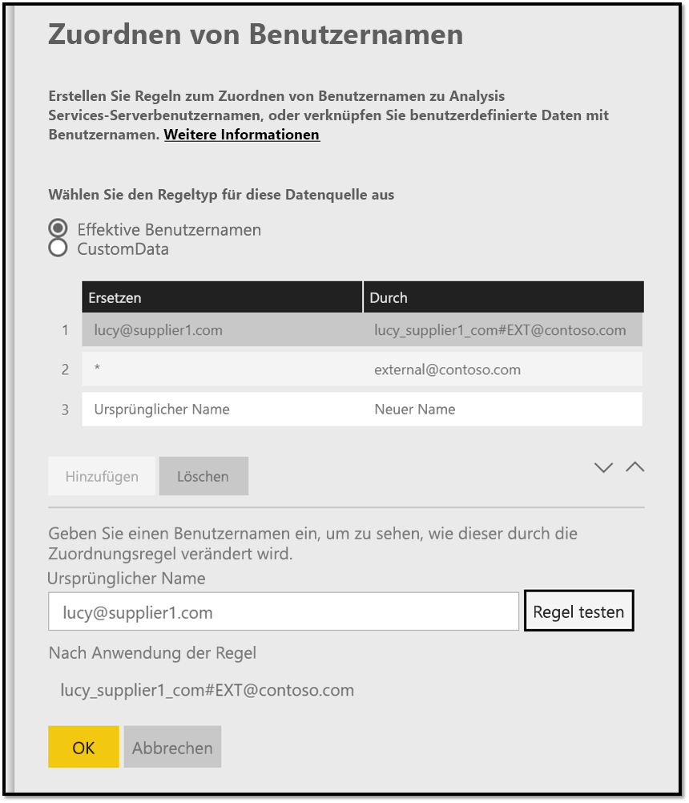

Diese Methode ist in Ordnung, wenn es sich bei Contoso verfügt nur über eine Reihe von Benutzern oder wenn Contoso alle externen Benutzer zu einem einzelnen internen Konto zuordnen kann. Für komplexere Szenarien, in dem jeder Benutzer seine eigenen Anmeldeinformationen benötigt, es gibt ein erweiterter Ansatz, der verwendet [benutzerdefinierten AD-Attribute](https://technet.microsoft.com/library/cc961737.aspx) die Zuordnung vornehmen, wie in beschrieben [Verwalten Ihrer Datenquelle – Analysis Services](https://powerbi.microsoft.com/documentation/powerbi-gateway-enterprise-manage-ssas/). Dadurch würde den Contoso-Administrator, eine Zuordnung für jeden Benutzer in Ihrem Azure AD (auch externe B2B-Benutzer) zu definieren.  Diese Attribute können festgelegt werden, über das AD-Objektmodell mithilfe von Skripts oder Code, damit die Zuordnung auf INVITE-Nachricht oder einem geplanten Rhythmus von Contoso vollständig automatisieren kann.

## Externen Benutzern ermöglichen, bearbeiten und Verwalten von Inhalten in Power BI

Contoso können externe Benutzer auf Inhalte innerhalb des Unternehmens beitragen, wie weiter oben in die organisationsübergreifende Bearbeitung und Verwaltung von Power BI-Inhalt im Abschnitt beschrieben werden.

> [!NOTE]
> Zum Bearbeiten und Verwalten von Inhalten in Ihrer Organisation Power BI, muss der Benutzer eine Power BI Pro-Lizenz in einem anderen Arbeitsbereich als Arbeitsbereich verfügen. Benutzer können Pro-Lizenzen erhalten, wie in der Projektausgabe _Licensing__section dieses Dokuments._

Das Power BI-Verwaltungsportal bietet die **externe Gastbenutzer zum Bearbeiten und Verwalten von Inhalt in der Organisation können** in den Einstellungen für Mandanten festlegen. Standardmäßig wird die Einstellung festgelegt, um deaktiviert ist, was bedeutet, dass externe Benutzer über eine eingeschränkte lediglich schreibgeschützte Vorgänge standardmäßig ab. Die Einstellung gilt für Benutzer mit usertype-Attribut in Azure AD auf Gast festgelegt. In der folgenden Tabelle wird beschrieben, die Verhaltensweisen, die Benutzern auf, abhängig von seiner usertype-Eigenschaft, und wie die Einstellungen konfiguriert werden.

| **Benutzertyp in Azure AD** | **Zulassen Sie externe Gastbenutzer bearbeiten und verwalten die Einstellung "Inhalt"** | **Behavior** |
| --- | --- | --- |
| Gast | Deaktiviert für den Benutzer (Standard) | Pro Nutzung arbeitsaufgabenexklusiven Ansicht. Ermöglicht schreibgeschützten Zugriff auf Berichte, Dashboards und apps, die bei der Anzeige über eine URL, die auf den Gastbenutzer gesendet. Power BI Mobile-apps bieten eine schreibgeschützte Ansicht, auf dem Gastbenutzer. |
| Gast | Für den Benutzer aktiviert | Der externe Benutzer erhält Zugriff auf die vollständige Power BI-Benutzeroberfläche, obwohl einige Funktionen nicht verfügbar sind, an Sie. Der externe Benutzer muss in Power BI mit der Power BI-Dienst-URL, die die Mandanteninformationen enthalten anmelden. Der Benutzer ruft ab, die die Home-Erfahrung, einen Arbeitsbereich und basierend auf Berechtigungen durchsuchen können, anzeigen und Inhalte erstellen.    Power BI Mobile-apps bieten eine schreibgeschützte Ansicht, auf dem Gastbenutzer. |

> [!NOTE]
> Externe Benutzer in Azure AD können auch auf Member von "usertype" festgelegt werden. Dies wird derzeit nicht in Power BI unterstützt.

In der Power BI-Verwaltungsportal wird die Einstellung in der folgenden Abbildung angezeigt.

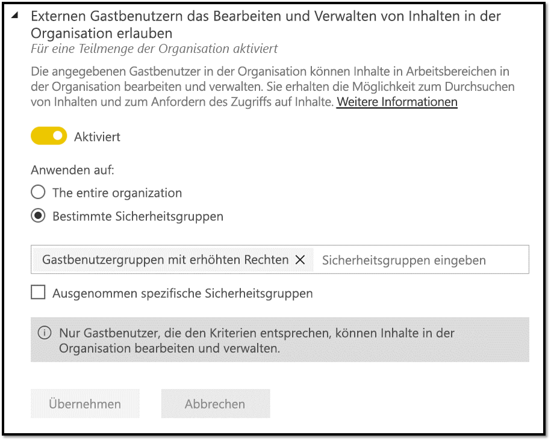

Gastbenutzer erhalten die Standardbenutzeroberfläche für den nur-Lese und das Bearbeiten und Verwalten von Inhalten können. Der Standardwert ist deaktiviert, was bedeutet, dass alle Gastbenutzer, die schreibgeschützt-Erfahrung haben. Der Power BI-Administrator können entweder die Einstellung für alle Gastbenutzer in der Organisation oder für bestimmte Sicherheitsgruppen in Azure AD definiert. In der folgenden Abbildung erstellt der Contoso-Power-BI-Administrator eine Sicherheitsgruppe in Azure AD verwalten, welche externe Benutzer können bearbeiten und Verwalten von Inhalten im Contoso-Mandanten an.

Damit diese Benutzer bei Power BI anmelden können, stellen sie die Mandanten-URL. Gehen Sie wie folgt vor, um die Mandanten-URL zu finden:

1. Wählen Sie in Power BI-Dienst, klicken Sie im oberen Menü Hilfe ( **?** ) klicken Sie dann **über Powerbi**.
2. Suchen Sie nach den Wert neben **-Mandanten-URL**. Dies ist die Mandanten-URL, die Sie für Ihre Gastbenutzer freigeben können.

    

Beim Verwenden der externe Gastbenutzer zulassen bearbeiten und Verwalten von Inhalt in der Organisation, angegebenen Gastbenutzer erhalten Sie Zugriff auf Ihrer Organisation Power BI und finden Sie alle Inhalte, die für die sie die Berechtigung verfügen. Sie können Zugriff auf Start, navigieren Sie und Inhalt in Arbeitsbereichen beitragen, Installieren von apps, in dem sie auf der Zugriffssteuerungsliste werden und haben, einen Arbeitsbereich. Sie können einen Administrator für Arbeitsbereiche erstellen, der die neue Arbeitsbereichsoberfläche verwendet, oder sie können selbst ein Administrator für diese Bereiche sein.

> [!NOTE]
> Bei Verwendung dieser Option stellen Sie sicher, dass die Governance-Abschnitt dieses Dokuments überprüfen, da die Standardeinstellungen für die Azure AD zu verhindern, dass Gastbenutzer, um bestimmte Funktionen wie Personenauswahl verwenden, was zu einer verringerten experience.* * führen kann

Für Gastbenutzer, die über die externe Gastbenutzer zulassen bearbeiten und Verwalten von Inhalten in der Organisation mandanteneinstellung aktiviert werden sind einige Funktionen nicht zur Verfügung. Zum Aktualisieren oder Veröffentlichen von Berichten, müssen Gastbenutzer mit der Power BI Service-Web-Benutzeroberfläche, einschließlich der Daten zum Hochladen von Power BI Desktop-Dateien abrufen. Die folgenden Funktionen werden nicht unterstützt:

- Direktes Veröffentlichen aus Power BI Desktop im Power BI-Dienst
- Gastbenutzer können Power BI Desktop nicht dazu verwenden, eine Verbindung mit Dienstdatasets im Power BI-Dienst herzustellen.
- Klassische Arbeitsbereiche, die mit Office 365-Gruppen verknüpft sind: Gastbenutzer können keine Administratoren für diese Arbeitsbereiche erstellen oder selbst Administratoren sein. Sie können Mitglieder sein.
- Das Senden von Ad-hoc-Einladungen wird für Arbeitsbereichszugriffslisten nicht unterstützt.
- Power BI Publisher für Excel wird für Gastbenutzer nicht unterstützt.
- Gastbenutzer können nicht Power BI Gateway installieren und eine Verbindung von Power BI Gateway mit Ihrer Organisation herstellen.
- Gastbenutzer können keine Apps installieren und diese für die gesamte Organisation freigeben.
- Gastbenutzer können keine Organisationsinhaltspakete verwenden, erstellen, aktualisieren oder installieren.
- Gastbenutzer können nicht „In Excel analysieren“ verwenden.
- Gastbenutzer nicht @mentioned in auskommentieren (diese Funktion wird in einer zukünftigen Version hinzugefügt werden)
- Gastbenutzer können nicht als Abonnements verwenden (diese Funktion wird in einer zukünftigen Version hinzugefügt werden.)
- Gastbenutzer, die diese Funktion verwenden, sollten ein Geschäfts-, Schul- oder Unikonto besitzen. Gastbenutzer mit persönlichen Konten kommen weitere Einschränkungen aufgrund von Anmeldung Einschränkungen.

## Governance

### Zusätzliche Azure AD-Einstellungen, die bei der Power BI, die im Zusammenhang mit Azure AD B2B hat Auswirkungen auf

Beim Freigeben von Azure AD B2B steuert der Azure Active Directory-Administrator des externen Benutzers Aspekte. Diese werden auf der Einstellungsseite für externe Zusammenarbeit in den Azure Active Directory-Einstellungen für Ihren Mandanten gesteuert.

Informationen zu den Einstellungen sind hier verfügbar:

[https://docs.microsoft.com/azure/active-directory/b2b/delegate-invitations](https://docs.microsoft.com/azure/active-directory/b2b/delegate-invitations)

> [!NOTE]
> Standardmäßig sind die Berechtigungen für Gastbenutzer beschränkt Option auf Ja festgelegt ist, sodass Gastbenutzer in Power BI besonders Erfahrungen eingeschränkter umschließen freigeben, in denen die Personenauswahl in Benutzeroberflächen funktionieren nicht für diese Benutzer. Es ist wichtig, Sie arbeiten mit Ihren Azure AD-Administrator, um sie auf "Nein" festgelegt, wie unten dargestellt, um eine gute experience.* * sicherzustellen

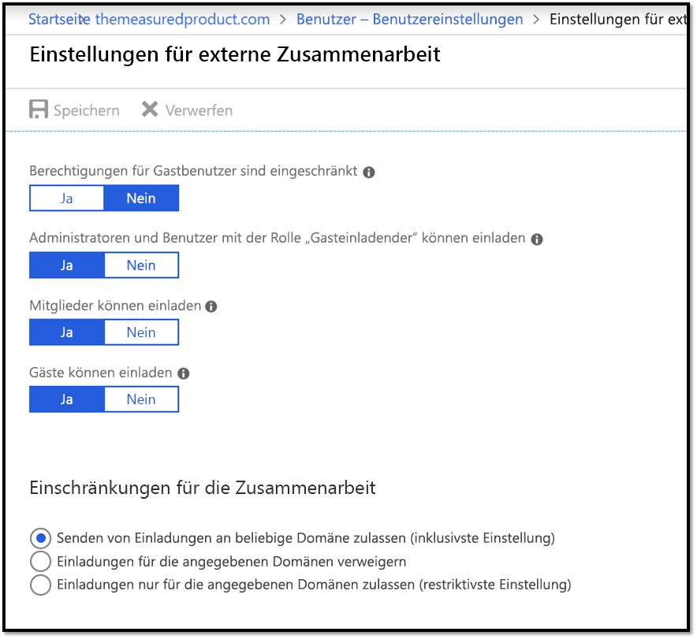

### Steuerelement-Gast-Einladungen

Power BI-Administratoren können die externe Freigabe nur für Power BI finden Sie auf der Power BI-Verwaltungsportal steuern. Mandantenadministratoren können jedoch auch steuern externe Freigabe mit verschiedenen Azure AD-Richtlinien.  Diese Richtlinien ermöglichen es Administratoren, Mandanten

- Einladungen Deaktivieren von Endbenutzern
- Nur Administratoren und Benutzer in der Rolle "Gasteinladender" dürfen einladen.
- Administratoren, die Rolle "Gasteinladender" und Mitglieder dürfen einladen.
- Alle Benutzer, einschließlich Gästen, dürfen einladen.

Erfahren Sie mehr zu diesen Richtlinien in [Delegieren von Einladungen zur Azure Active Directory B2B-Zusammenarbeit](https://docs.microsoft.com/azure/active-directory/active-directory-b2b-delegate-invitations).

Alle Aktionen im Power BI durch externe Benutzer sind auch [unserer auditing-Portal überwacht](https://powerbi.microsoft.com/documentation/powerbi-admin-auditing/).

### Richtlinien für bedingten Zugriff für Gastbenutzer

Contoso kann Richtlinien für bedingten Zugriff für Gastbenutzer erzwingen, Inhalte aus dem Contoso-Mandanten zugreifen. Sie finden die detaillierte Anweisungen im [für bedingten Zugriff für B2B-zusammenarbeitsbenutzer](https://docs.microsoft.com/azure/active-directory/active-directory-b2b-mfa-instructions).

## Häufige alternative Ansätze

Während Azure AD B2B zum Freigeben von Daten und Berichte für Organisationen vereinfacht, gibt es einige weitere Ansätze, die werden häufig verwendet und können in bestimmten Fällen überlegen sein.

### Alternative Option 1: Erstellen von Benutzern für die doppelten Identitäten für partner

Mit dieser Option hatte Contoso doppelten Identitäten für jeden Partnerbenutzer im Contoso-Mandanten, manuell zu erstellen, wie in der folgenden Abbildung dargestellt. Dann kann in Power BI, Contoso auf die zugewiesenen Identitäten der entsprechenden Berichten, Dashboards oder apps freigeben.

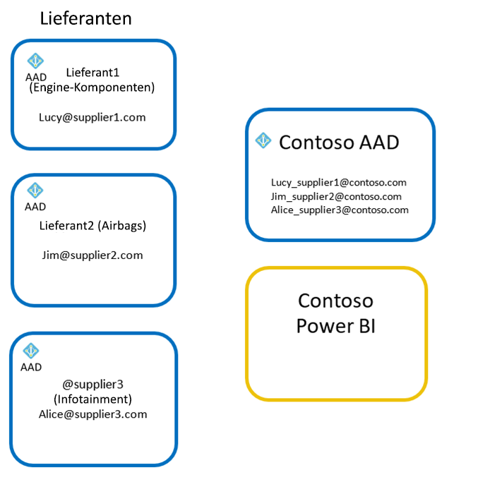

Gründe für diese Alternative auswählen:

- Da die Identität des Benutzers von Ihrer Organisation gesteuert wird, alle verwandten Dienst z. B. e-Mail, SharePoint, usw. sind auch innerhalb des Steuerelements Ihrer Organisation. Ihre IT-Administratoren können Kennwörter zurücksetzen, Zugriff auf Konten deaktivieren oder Überwachen von Aktivitäten in diesen Diensten.
- Benutzer, die Persönliche Konten zu verwenden, für ihr Unternehmen sind häufig Zugriff auf bestimmte Dienste beschränkt möglicherweise deshalb ein Organisations-Konto.
- Einige Dienste funktionieren nur für Benutzer Ihres Unternehmens. Beispielsweise kann mithilfe von Intune zum Verwalten von Inhalt auf dem Personal/Mobile-Geräten von externen Benutzern, die mithilfe von Azure B2B nicht möglich.

Die Gründe nicht zu dieser Alternativen Vorgehensweise wählen:

- Benutzer von Partnerorganisationen müssen zwei Sätze von Anmeldeinformationen – ein Zugriff auf Inhalte aus der eigenen Organisation und die andere zum Zugreifen auf Inhalte von Contoso. Hierbei handelt es sich um bereitet diesen Gastbenutzern und viele Gastbenutzer durch diese Oberfläche verwechselt werden.
- Contoso muss erwerben und Zuweisen von Benutzerlizenzen für diese Benutzer. Wenn ein Benutzer muss zum Empfangen von e-Mails oder Office-Anwendungen verwenden, benötigen sie die entsprechenden Lizenzen, einschließlich der Power BI Pro zum Bearbeiten und Freigeben von Inhalten in Power BI.
- Contoso möchten möglicherweise strengere Autorisierungs- und Governance-Richtlinien für externe Benutzer, die im Vergleich zu internen Benutzer zu erzwingen. Zu diesem Zweck muss Contoso eine interne Nomenklatur für externe Benutzer zu erstellen, und alle Contoso-Benutzer über diese Nomenklatur dahingehend geschult werden müssen.
- Wenn der Benutzer ihre Organisation verlässt, werden Sie weiterhin haben Zugriff auf Contoso Ressourcen, bis der Contoso-Administrator manuell sein Konto gelöscht
- Contoso-Administratoren müssen die Identität für den Gast, einschließlich Erstellung, das Zurücksetzen von Kennwörtern usw. zu verwalten.

### Alternative Option 2: Erstellen einer benutzerdefinierten Power BI Embedded-Anwendung, die Verwendung der benutzerdefinierten Authentifizierung

Eine weitere Option für Contoso ist eine eigene benutzerdefinierte eingebettete Power BI-Anwendung mit der benutzerdefinierten Authentifizierung zu erstellen (["App ist Besitzer der Daten"](https://docs.microsoft.com/power-bi/developer/embed-sample-for-customers)). Während viele Organisationen nicht über die Zeit oder Ressourcen zum Erstellen einer benutzerdefinierten Anwendung zum Verteilen von Power BI von Inhalten für ihre externen Partner verfügen, für einige Organisationen Dies ist der beste Ansatz und sollte in Betracht gezogen werden.

Organisationen verfügen häufig über vorhandenen Partner-Portale, die Zugriff auf alle Unternehmensressourcen für Partner zentralisieren und ermöglichen die Isolation von internen Ressourcen der Organisation bieten optimierte Funktionen für Partner, die zur Unterstützung von vielen Partnern und die einzelnen Benutzer.

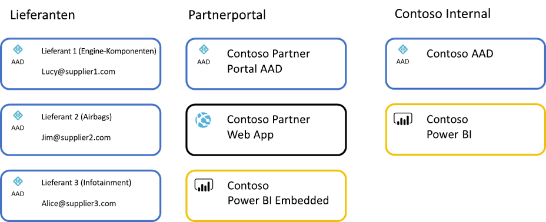

Im Beispiel oben können Benutzer jede Anmeldung Lieferanten auf Contoso Partner-Portal verwendet, die AAD als Identitätsanbieter an. Es konnte AAD B2B, B2C für Azure, systemeigene Identitäten verwenden, oder Erstellen eines Verbunds mit einer beliebigen Anzahl anderer Identitätsanbieter entgegen. Der Benutzer würde anmelden und Zugriff auf einen Build der Partner-Portal mithilfe von Azure-Web-App oder eine ähnliche Infrastruktur.

In der Web-app sind Power BI-Berichte aus einer Power BI Embedded Bereitstellung eingebettet. Die Web-app würde den Zugriff auf die Berichte und alle zugehörigen Dienste in eine zusammenhängende Oberfläche, die darauf abzielen, Lieferanten, die für die Interaktion mit Contoso erleichtern optimieren. Dieses Portal-Umgebung wird von den internen Contoso AAD isoliert werden, und der Umgebung von Contoso interne Power BI um Lieferanten sicherzustellen, dass konnte nicht auf diese Ressourcen zugreifen. In der Regel werden Daten in einem separaten Partner Datawarehouse, um sicherzustellen, dass die Isolation von Daten als auch gespeichert werden. Diese Isolation bietet Vorteile, da er die Anzahl der externe Benutzer mit direktem Zugriff auf die Daten Ihrer Organisation begrenzt, einschränken, welche Daten möglicherweise an den externen Benutzer verfügbar sein können, und beschränken die versehentliche Freigabe für externe Benutzer.

Mit Power BI Embedded können im Portal kann vorteilhaft Lizenzierung nutzen, mithilfe von app-Token oder masterbenutzer plus Premium-Kapazität erworben wurden, Azure-Modell, die Bedenken in Bezug auf Zuweisen von Lizenzen zu Benutzern vereinfacht, und lassen sich zentral hoch-/Herunterskalieren, basierend auf erwartet. die Nutzung. Im Portal bieten eine insgesamt höhere Qualität und konsistente Umgebung, da Partner ein einziges Portal, die speziell für alle Anforderungen eines Partners, denken Sie daran zugreifen. Schließlich, da Power BI Embedded basierte Lösungen in der Regel mit mehreren Mandanten entwickelt wurden, erleichtert es Isolierung zwischen Partnerunternehmen zu gewährleisten.

Gründe für diese Alternative auswählen:

- Einfacher zu verwalten als die Anzahl von Partnerorganisationen wächst. Da ein separates Verzeichnis isoliert von internen AAD-Verzeichnis von Contoso Partner hinzugefügt werden, vereinfacht die Governance-Aufgaben und verhindert versehentliche Freigabe von interne Daten für externe Benutzer.
- Typische Partner-Portale sind hoch Branding Erfahrungen mit einheitliche Umgebungen für Partner und entsprechend den Bedürfnissen der typischen Partner optimiert. Contoso kann einen besseren Gesamteindruck bietet daher an Partner anbieten, indem Sie alle erforderlichen Dienste in ein einziges Portal integrieren.
- Power BI Premium erworben, und erfordert keine Zuweisung von Power BI Pro-Lizenzen den Benutzern Lizenzierungskosten für erweiterte Szenarien wie das Bearbeiten von Inhalt in die Power BI Embedded Azure behandelt wird.
- Bietet eine bessere Isolierung über Partner an, wenn eine Lösung mit mehreren Mandanten ausgelegt.
- Das Partner-Portal enthält oft andere Tools für den Partner über Power BI-Berichte, Dashboards und apps.

Die Gründe nicht zu dieser Alternativen Vorgehensweise wählen:

- Erheblichen Aufwand ist erforderlich, um zu erstellen, ausführen und verwalten diese ein Portal somit eine erhebliche Investition in die Ressourcen und Zeit.
- Projektmappe wird viel länger als die Verwendung von B2B freigeben, da eine sorgfältige Planung und Ausführung auf mehreren mit Arbeitsabläufen ist erforderlich.
- Mit eine kleinere Anzahl von Partnern ist der Aufwand für diese alternativen wahrscheinlich zu hoch ist, zu begründen.
- Zusammenarbeit mit Ad-hoc-Freigabe ist das primäre Szenario konfrontiert, die von Ihrer Organisation.
- Die Berichte und Dashboards unterscheiden sich für jeden Partner. Diese Alternative führt Management Aufwand über die Freigabe nur direkt mit Partnern.

## HÄUFIG GESTELLTE FRAGEN

**Senden Contoso eine Einladung, die automatisch eingelöst wird, damit der Benutzer nur "abgeschlossen" ist? Oder hat der Benutzer stets bis zur einlösungs-URL durchklicken?**

Der Endbenutzer muss immer durch die Zustimmungsbenutzeroberfläche klicken, bevor sie den Inhalt zugreifen können.

Wenn Sie viele Gastbenutzer einladen, es wird empfohlen, dass Sie dies von Ihrer Core Azure AD-Administratoren durch Delegieren [Hinzufügen eines Benutzers zu der Rolle "Gast" gasteinladender "in der ressourcenorganisation](https://docs.microsoft.com/azure/active-directory/active-directory-b2b-add-guest-to-role). Dieser Benutzer kann andere Benutzer in der Partnerorganisation einladen, mithilfe der Anmeldeoberfläche, PowerShell-Skripts oder APIs. Dies reduziert den Verwaltungsaufwand für Ihre Azure AD-Administratoren zum einladen oder erneut Einladungen an Benutzer in der Partnerorganisation.

**Kann Contoso erzwingen Multi-Factor Authentication für Gastbenutzer, wenn seine Partner nicht über Multi-Factor Authentication verfügen?**

Ja. Weitere Informationen finden Sie unter [für bedingten Zugriff für B2B-zusammenarbeitsbenutzer](https://docs.microsoft.com/azure/active-directory/active-directory-b2b-mfa-instructions).

**Funktioniert B2B-Zusammenarbeit wie bei der eingeladene Partner Partnerverbund verwendet, um ihre eigene lokale Authentifizierung hinzuzufügen?**

Wenn der Partner Azure AD-Mandanten, der in die lokale Authentifizierungsinfrastruktur verbunden ist verfügt, wird automatisch lokales einmaliges Anmelden (SSO) erreicht. Wenn der Partner nicht über Azure AD-Mandanten verfügt, kann Azure AD-Kontos für neue Benutzer erstellt werden.

**Kann ich einladen von Gastbenutzern mit Consumer-e-Mail-Konten?**

Einladen von Gastbenutzern mit Consumer-e-Mail-Konten wird in Power BI unterstützt. Dies schließt die Domänen z. B. hotmail.com, outlook.com und gmail.com. Jedoch diese Benutzer möglicherweise Einschränkungen über hinaus, was Benutzer mit Geschäfts- oder schulkonten auftreten.
