# Bereitstellen und Verwalten von Power BI Premium-Kapazitäten

**Zusammenfassung:** Power BI Premium bietet eine einheitlichere Leistung, Unterstützung für große Datenmengen und die Flexibilität, eine einheitliche Self-Service- und Enterprise-BI-Plattform für alle Benutzer in Ihrer Organisation. Diese Stufe 300 technischen Whitepaper wurde speziell für Power BI-Administratoren und Autoren von Inhalten und Herausgeber geschrieben. Es zielt darauf ab, um diese das volle Potenzial von Power BI Premium besser zu verstehen und zu entwerfen, bereitstellen, überwachen und Behandeln von skalierbaren Lösungen erläutert.

**Autor:** [Peter Myers](https://www.linkedin.com/in/peterjsmyers) (Data Platform MVP und unabhängige BI-Experte mit bitweise Lösungen)

**Technische Reviewer:** Adam Saxton, Akshai Mirchandani, Bhavik Merchant, David Magar, Josh Caplan, Michael Blythe, Nimrod Shalit, Olivier Matrat, Swati Gupta

**Gilt für:** Power BI-Dienst, Power BI Premium und Azure Power BI Embedded-Kapazitäten

> [!NOTE]
> Sie können dieses Whitepaper speichern oder ausdrucken, indem Sie in Ihrem Browser erst auf **Drucken** und dann auf **Als PDF speichern** klicken.

## Einführung in Power BI

Powerbi ist eine Business Analytics-Dienst entwickelt, um Einblicke zu bieten, die schnelle und fundierte Entscheidungen zu ermöglichen. Seit seiner Veröffentlichung 2015 schnell geworden häufig genutzte Dienste verwendet, um Lösungen für Unternehmen auf die größten Unternehmen.

Es wird auf zwei Arten verfügbar gemacht: Als Cloud-Dienst sowie eine lokale berichterstellung mit dem Namen **Power BI-Berichtsserver**. \[[1](#endnote-01)\]

Power BI, wie ein Cloud-Dienst-Software-as-a-Service (SaaS) \[ [2](#endnote-02)\]. Es stellt einen Satz von Diensten und Anwendungen, mit denen Unternehmen entwickeln, bereitstellen, verwalten, Lösungen zum Überwachen ihres Unternehmens dar.

Es ist nicht die Absicht dieses Whitepaper, um eine umfassende Beschreibung der Power BI-Dienst bereitzustellen. Stattdessen konzentriert Sie sich auf Themen mit Relevanz für den Antragsteller des Power BI Premium. Allgemeine Informationen zu Power BI, finden Sie in der umfassenden [Power BI-Dokumentation](service-admin-premium-multi-geo.md). Eine ausführlichere Erläuterung von Power BI-Dienst mit dem Schwerpunkt auf das gut funktionierenden unternehmensbereitstellungen zu erreichen, finden Sie in der umfassenden [Planen einer Unternehmensbereitstellung von Power BI](https://aka.ms/pbienterprisedeploy) Whitepaper.

Im Rahmen dieses Whitepapers des Antragstellers in diesem Abschnitt führt und beschreibt die Kapazitäten, Power BI-Inhaltstypen, Modell Speichermodi und Lizenzierung. Ein Überblick über diese Themen ist wichtig, erfolgreich bereitstellen und Verwalten von Power BI Premium.

### Funktionen

**Kapazitäten** sind ein Power BI-Kernkonzept, die einem Satz von Ressourcen (Speicher, Prozessor und Arbeitsspeicher), die zum Hosten und Bereitstellen von Power BI Content. Kapazitäten werden entweder freigegeben oder dediziert. Ein **gemeinsam genutzte Kapazität** ist zwar mit anderen Microsoft-Kunden freigegeben, eine **Dedicated-Kapazität** wird vollständig auf einen einzelnen Kunden ein Commit ausgeführt. Dedizierte Kapazitäten entstehen in der [Premium-Kapazitäten](#premium-capacities) Thema.

Führen gemeinsam genutzte Kapazität Workloads auf Computerressourcen mit anderen Kunden freigegeben. Wie die Kapazität Ressourcen freigeben muss, werden Einschränkungen auferlegt, um sicherzustellen, dass "Fair Play", z. B. die maximale Modellgröße (1 GB) und die maximale aktualisierungshäufigkeit pro Tag (acht Mal pro Tag).

### Arbeitsbereiche

Power BI-Arbeitsbereiche in Kapazitäten befinden, und bilden sie Sicherheit, Zusammenarbeit und der Bereitstellung. Jeder Power BI-Benutzer hat einen persönlichen Arbeitsbereich, bekannt als **Arbeitsbereich**. Zusätzliche Arbeitsbereiche können erstellt werden, um die Zusammenarbeit und die Bereitstellung zu ermöglichen, und diese werden als bezeichnet **App-Arbeitsbereiche**. Standardmäßig werden – einschließlich der persönlichen Arbeitsbereiche - Arbeitsbereiche in gemeinsam genutzten Kapazität erstellt.

### Power BI-Inhaltstypen

Zur Einführung von Power BI Premium Themen ist es wichtig, um eine umfassende Erläuterung der Power BI-Architektur sowie grundlegende Inhaltstypen zu starten.

Alle Power BI-Inhalte gespeichert und verwaltet Arbeitsbereiche sind Container für Power BI-Inhalten. Jeder Power BI-Benutzer hat ihre eigenen persönlichen Arbeitsbereich, aber die allgemeine bewährte Methode ist die Erstellung von app-Arbeitsbereiche. App-Arbeitsbereiche ermöglichen Co-ownership von Inhalt und die Möglichkeit, Inhalte gemeinsam bearbeiten. Sie bieten auch die Möglichkeit zum Bereitstellen und Verteilen von Inhalten für große Zielgruppen wie apps.

Die folgende Power BI-Inhalt wird in Arbeitsbereichen gespeichert:

- Dataflows
- Datasets
- Arbeitsmappen
- Berichte
- Dashboards

#### Dataflows

Power BI-Datenflüsse können Unternehmen die Vereinheitlichung von Daten aus unterschiedlichen Quellen. Sie können betrachtet werden als Daten vorbereitet und für die Verwendung in Modellen bereitgestellt werden, aber sie können nicht direkt als Quelle für die berichterstellung verwendet werden. Nutzen sie die umfassende Sammlung von datenconnectors für Microsoft, aktivieren die Erfassung von Daten aus lokalen und cloudbasierten Datenquellen.

Datenflüsse können nur erstellt und in der app-Arbeitsbereiche verwaltet werden, und sie werden als Entitäten in Common Data Model (CDM) in Azure Data Lake-Speicher Gen2 gespeichert. In der Regel sind sie mit geplanter Aktualisierung regelmäßig um aktuelle Daten zu speichern.

Weitere Informationen finden Sie in der [in Power BI (Vorschau) für die Vorbereitung von Self-service-](service-dataflows-overview.md) Dokument.

#### Datasets

Power BI-Datasets darstellen, eine Datenquelle für berichterstellungs- und Visualisierungstools bereit. Es gibt viele Arten von Datasets, die von erstellt:

- Herstellen einer Verbindung zu einem vorhandenen Datenmodell, die nicht in einer Power BI-Kapazität gehostet wird
- Hochladen einer Power BI Desktop-Datei, die ein Modell enthält.
- Hochladen einer Excel-Arbeitsmappe (mit einer oder mehreren Excel-Tabellen und/oder Datenmodellen Arbeitsmappe) oder das Hochladen einer Datei (COMMA-Separated Value)
- Mithilfe von Power BI-Dienst zum Erstellen einer Push-streaming oder Hybrid-streamingdataset

Mit Ausnahme von streamingdatasets \[ [3](#endnote-03)\], das Dataset stellt ein Datenmodell nutzt die ausgereifte-modellierungstechnologien von Analysis Services dar.

Beachten Sie, dass in der Dokumentation manchmal die Terminologie von Datasets und Modelle austauschbar sind. Im Allgemeinen vom Standpunkt der Power BI-Dienst wird bezeichnet als eine **Dataset** , und aus Sicht der Entwicklung wird es als bezeichnet ein **Modell**. Im Rahmen dieses Whitepapers bedeutet, dass sie dieselbe Sache.

##### Extern gehosteten Modellen

Herstellen einer Verbindung mit einem extern gehostete Modell umfasst die Installation der [On-Premises Data Gateway](service-gateway-onprem.md) zur Verbindung mit SQL Server Analysis Services, lokal oder VM-gehostete Infrastructure-as-a-Service (IaaS). Azure Analysis Services ist einen Gateway nicht erforderlich. Dieses Szenario ist häufig sinnvoll, wenn Investitionen Modell vorhanden sind, in der Regel, die Teil von Enterprise Data Warehouse (EDW) bilden. Dadurch, dass Power BI zum Ausführen einer **Live-Verbindung** (LC) mit Analysis Services und führt Sie dies durch das Erzwingen von Berechtigungen mithilfe der Identität des Benutzers der Power BI-Bericht. Für SQL Server Analysis Services werden sowohl für mehrdimensionale Modelle (Cubes) als auch für tabellarische Modelle unterstützt. Wie in der folgenden Abbildung gezeigt wird, übergibt ein Live-Verbindung-Dataset Abfragen, der extern gehosteten Modellen.

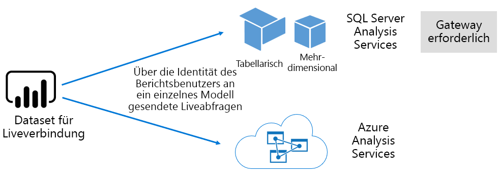

##### Power BI Desktop entwickelten Modelle

Power BI Desktop - einer Clientanwendung vorgesehen, die für die Entwicklung von Power BI - können Sie ein Modell zu entwickeln, die effektiv ist von einem tabellarischen Modell von Analysis Services verwendet werden. Modelle können entwickelt werden, durch das Importieren von Daten aus der Datenflüsse, die dann mit anderen Datenquellen integriert werden können. Während die Angaben darüber, wie die Modellierung erreicht werden kann außerhalb des Bereichs dieses Whitepaper, es ist wichtig zu verstehen, dass es gibt drei verschiedene Typen – oder Modi – von Modellen, die mithilfe von Power BI Desktop entwickelt werden können. Diese Modi bestimmen, ob die Daten in das Modell importiert werden oder ob sie in der Datenquelle bleibt. Die drei Modi sind: Importieren, DirectQuery und zusammengesetzte. Eine vollständige Erläuterung der einzelnen Modi wird in behandelt die [Modell Speichermodi](#model-storage-modes) Thema.

Extern gehostete Ansichtsmodelle und Modelle, die in Power BI Desktop entwickelten können erzwingen, Row-Level Security (RLS), um Daten zu beschränken, die für einen bestimmten Benutzer abgerufen werden können. Beispielsweise können Benutzer, die zur Sicherheitsgruppe Vertriebsmitarbeiter zugewiesen nur als Berichtsdaten für den Verkauf Regionen anzeigen, die sie zugewiesen sind. RLS-Rollen können dynamisch oder statisch sein. **Dynamische Rollen** Filter durch den Benutzer des Berichts, während **statische Rollen** gelten die gleichen Filter für alle Benutzer der Rolle zugewiesen.

##### Excel-Arbeitsmappe Datenmodelle

Erstellen von Datasets basierend auf der Excel-Arbeitsmappen oder CSV-führt Dateien die automatische Erstellung eines Modells. Excel-Tabellen und CSV-Daten werden importiert werden, um Tabellen im Modell zu erstellen, während ein Datenmodell von Excel-Arbeitsmappe ausgetauscht werden wird, um ein Power BI-Modell erstellen. In allen Fällen werden die Dateidaten in ein Modell importiert.

Unterscheidungen können dann über Power BI-Datasets bereitgestellt werden, die Modelle darstellen:

- Sie werden entweder im Power BI-Dienst gehostet oder extern von Analysis Services gehostet werden
- Sie können die importierte Daten speichern oder sie können Pass-Through-Abfrage-Anforderungen ausgeben, zugrunde liegenden Datenquellen oder eine Kombination beider

Hier ist eine Zusammenfassung der wichtige Fakten zur Power BI-Datasets, die Modelle darstellen:

- SQL Server Analysis Services gehosteten Modelle erfordern ein Gateway zum Ausführen von LC-Abfragen
- Power BI-gehosteten Modelle, die Daten importieren
  - Muss vollständig in den Arbeitsspeicher geladen sein, sodass sie abgefragt werden können
  - Erfordert die Aktualisierung durch, um die Daten aktuell zu halten und Gateways müssen einbezogen werden, wenn Daten nicht direkt über das Internet zugänglich ist
- Power BI-gehosteten Modelle, die DirectQuery (DQ)-Speichermodus verwenden erfordern Konnektivität zu den Quelldaten an. Wenn das Modell abgefragt wird, gibt Power BI Abfragen an den Quelldaten um aktuelle Daten abzurufen. In diesem Modus muss Gateways umfassen, wenn Daten nicht direkt über das Internet zugänglich ist.
- Modelle können RLS-Regeln, erzwingen die Filter zum Einschränken des Datenzugriffs für bestimmte Benutzer erzwingen.

Wenn erfolgreich bereitstellen und Verwalten von Power BI Premium, ist es wichtig, zu verstehen, wo die Modelle gehostet werden, deren Speichermodus, alle Abhängigkeiten von Gateways, die Größe des importierten Daten, Typ und die Häufigkeit zu aktualisieren. Diese können alle einen erheblichen Einfluss auf den Power BI Premium-Ressourcen. Darüber hinaus kann der Mischung der Aspekte des Modellentwurfs selbst einschließlich der Vorbereitung von Datenabfragen und Berechnungen hinzufügen.

Es ist auch wichtig zu verstehen, dass es sich bei Power BI-gehosteten Import Modelle können gemäß Zeitplan aktualisieren oder auf Anforderung von einem Benutzer in Power BI-Dienst ausgelöst.

Entwerfen von optimierten Modellen wird weiter unten in diesem technischen Artikel in erläutert die [Modelle optimieren](#optimizing-models) Thema.

#### Arbeitsmappen

Power BI Arbeitsmappen sind ein Power BI Content \[ [4](#endnote-04)\]. Sie sind Excel-Arbeitsmappen, die in Power BI-Dienst hochgeladen wurden, und sollte nicht mit der hochgeladenen Excel-Arbeitsmappen, die Erstellen von Datasets (Modelle) verwechselt werden. Der Inhaltstyp für die Arbeitsmappe darstellt, eine Verbindung mit einer Arbeitsmappe, die kann entweder in Power BI-Dienst hochgeladen werden oder in einem cloudspeicher auf OneDrive oder SharePoint Online bleiben.

Es ist wichtig zu verstehen, dass dieser Inhaltstyp nicht als Datenquelle für Power BI-datenvisualisierungen verfügbar ist. Stattdessen können sie als eine Arbeitsmappe in Power BI-Dienst geöffnet werden mithilfe von Excel Online. Die wichtigsten Absicht dieses Inhaltstyps ist älteren Excel-Arbeitsmappe Berichte im Power BI-Dienst aus zugänglich sein, und seine datenvisualisierungen, Power BI-Dashboards angeheftet werden können.

Weitere Informationen finden Sie in der [Abrufen von Daten aus Excel-Arbeitsmappendateien](service-excel-workbook-files.md) Dokument.

#### Berichte

Es gibt zwei Arten von Berichten: Power BI-Berichten und paginierten Berichte.

**Power BI-Berichte** bieten eine interaktive datenvisualisierung Erfahrungen, das mit nur einem einzelnen Dataset verbunden wird. Berichte werden häufig zur Förderung der Benutzereingriffe, sodass sie für die Interaktion mit einem außergewöhnlichen Array von Funktionen, einschließlich Filterung, segmentieren, Filtern und hervorheben, Drillup, Drilldown, Drillthrough, Fragen und Antworten eine natürliche überschreiten Sprache zu hinterfragen, konzentrieren, Seitennavigation, das hervorheben, Anzeigen von Lesezeichen und mehr.

Im Rahmen dieses Whitepapers, es ist wichtig zu verstehen, wie der Power BI-Architektur, Design und berichtsinteraktionen des Powerbi alle für die Power BI-Dienst-Ressourcen auswirken können:

- Zum Laden und interagieren mit Berichten, die basierend auf Modellen der importieren, muss das Modell vollständig in den Arbeitsspeicher geladen, (ob in Power BI-Dienst gehostet oder extern gehostet)
- Jeder Bericht visual gibt eine Abfrage zum Abrufen von Daten durch Abfragen des Modells
- Filter und Slicer Interaktionen umfassen im Allgemeinen das Abfragen des Modells. Z. B. Ändern der Auswahl der Slicer wird – standardmäßig - erfordern das erneute Laden jedes visuelle Element auf der Seite \[ [5](#endnote-05)\]
- Power BI-Berichte mit aktuelle Daten können nicht garantiert werden, und möglicherweise muss der Benutzer zum Aktualisieren des Berichts der Berichtsseite und seine Visuals neu laden
- Benutzer erreichen das Q & ermöglicht sie die eine natürliche Sprache-Funktion, den Entwurf der Power BI-Bericht bereitstellen, Fragen zu stellen und das Dataset stellt dar, ein Modell des Power BI-gehosteten Daten importieren oder ein LC-Dataset, das so konfiguriert, dass Q & A

**Paginierte Berichte** ermöglicht die Veröffentlichung und das Rendern von Berichten für SQL Server Reporting Services (SSRS) (\*RDL-Format). Wie ihre Namen bereits vermuten lässt, werden die paginierte Berichte häufig verwendet, wenn Anforderungen müssen für den Druck auf einer festen Seitengröße diktieren, oder Variablen Listen mit Daten, die vollständig erweitert werden müssen. Angenommen, eine Rechnung, die für mit mehreren Seiten (anstatt einen Bildlauf in einem visuellen) entwickelt und drucken.

Geben Sie die beiden unterstützten Typen Wahl für Berichtsautoren, sodass sie den Typ aus, basierend auf Anforderungen, und vorgesehene Verwendung. Im Allgemeinen sind die Power BI-Berichten ideal für interaktive Funktionen, damit der Benutzer kennen lernen und entdecken Erkenntnisse aus Daten, während Sie paginierte Berichte parametergesteuerten Seitenlayouts besser geeignet sind.

Unabhängig vom Berichtstyp ist es zwingend erforderlich, für die Bereitstellung einer zuverlässige und leistungsfähige benutzererfahrung, erreichen reaktionsfähig berichtsupdates Daten laden und (wenn der Filter oder Parameter geändert werden).

#### Dashboards

Power BI-Dashboards dienen zur Überwachung unterstützt und sind Konzept sehr unterscheidet sich von Power BI-Berichten. Dashboards dienen für die Anzeige auf einem einzelnen Bereich zusammengefasst, Werte und datenvisualisierungen in Kacheln auszudrücken. Im Allgemeinen bieten Dashboards weniger Interaktion als Power BI-Berichten mit einigen Dashboard-Designs, die keine Interaktion erwartet. Beispiel: ein für die unbeaufsichtigte-Dashboard auf einem Bildschirm ohne Fingereingabe in einem Serverraum angezeigt. Ein weiterer wichtiger Unterschied ist, dass es sich bei Dashboards Kacheln vorhanden sein können, die Daten aus mehreren Datasets, während ein Power BI melden immer nur auf einem einzelnen Dataset basieren können.

Es ist wichtig zu verstehen, dass ein Dashboard schnell geladen werden soll, und um die aktuellen Daten (mit dem Power BI-Dienst bezeichnet) auf allen express ein Timeout. Er erreicht dies durch die Zwischenspeicherung von Abfrageergebnissen Kachel, und dies ist für jedes Dashboard. In der Tat müssen sie für jeden Benutzer dazu, die an ein Dashboard zugreifen, die auf Modellen basieren, die dynamische Sicherheit auf Zeilenebene zu erzwingen.

Power BI-Dienst wird automatisch Dashboard Abfrage Caches aktualisiert, sobald Power BI-gehosteten importmodelle aktualisiert werden. Im Fall von LC und DQ-Modelle hat der Besitzer des Datasets ein Maß an Steuerung, wie oft Power BI-Dienst für den Cache aktualisiert die häufig als alle 15 Minuten oder eher selten, z.B. als einmal pro Woche konfiguriert werden können. Beachten Sie, dass LC Abfrage Cacheupdates zuerst Modellmetadaten, um zu bestimmen, ob eine Aktualisierung des Modells seit der letzten cacheaktualisierung stattgefunden hat, und es nicht fortgesetzt wird, den Cache zu aktualisieren, wenn eine Aktualisierung nicht da aufgetreten abfragt. Diese Überprüfung ist nicht möglich, dass DQ-Modelle, und daher Cacheupdates erfolgt, ob die Daten oder nicht geändert wurden.

Dashboard Abfragecache aktualisiert basierend auf DQ und LC-Modelle können auf Power BI-Dienst-Ressourcen und Daten aus externen Quellen deutlich beeinträchtigen. Erwägen Sie ein Dashboard mit 20 Kacheln, die alle basierend auf einem Azure Analysis Services-Modell erzwingt, dass die dynamische Sicherheit auf Zeilenebene, einmal pro Stunde aktualisiert wird und, die dieses Dashboard ist mit 100 Benutzern geteilt werden soll. Wenn der Dataset konfiguriert ist, um einmal pro Stunde zu aktualisieren, würde dies mindestens 2000 (20 x 100) LC Abfragen führen. Dies kann das Laden einer riesigen platzieren, auf dem Power BI-Dienst und die Daten aus externen Quellen, und es kann auch Grenzwerte für die verfügbaren Ressourcen überschreiten. Capacity-Ressourcen und Einschränkungen gelten der [Kapazitätsknoten](#capacity-nodes) Thema.

Benutzer können mit einem Dashboard auf verschiedene Weise interagieren, die Power BI-Dienst-Ressourcen erforderlich sind. Genauer gesagt können sie:

- Auslösen einer Aktualisierung von dashboardkacheln,, was eine bedarfsgesteuerte Aktualisierung alle zugehörigen gehostete Power BI-Import-Datenmodellen führen kann
- Diskutieren Sie mit Q & A natürlicher Sprache-Feature, Sie (mit der Dashboardentwurf ermöglicht es, und das Dataset ist ein Modell des Power BI-gehosteten Daten importieren oder ein LC-Dataset, das so konfiguriert, dass Q & A) Fragen
- Verwenden Sie das Feature "Schnelleinblicke" Power BI haben Erkenntnisse aus einer zugrunde liegenden Dataset und Antworten mit visuellen Elementen, die anzeigen und beschrieben werden (vorausgesetzt, dass die Kachel basiert auf einem Dataset, das Modell für Power BI-gehosteten Daten importieren)
- Konfigurieren von Warnungen für dashboardkacheln, dass Power BI-Dienst zum Vergleichen von Schwellenwerten, die als Werte sind möglich: möglicherweise so häufig wie stündlichen - Kacheln und Benutzer zu benachrichtigen, wenn Schwellenwerte überschritten werden (vorausgesetzt, dass die Kachel einen einzelnen numerischen Wert zeigt und basiert auf einer DataSet, das Modell für Power BI-gehosteten Daten importieren)

### Modell-Speichermodi

Denken Sie daran, dass es sich bei Power BI Desktop ermöglicht die Entwicklung eines Modells in einem von drei Modi. Es ist wichtig zu verstehen, die Gründe für die einzelnen datenspeichermodus des Modells und mögliche Auswirkungen auf Power BI-Dienst-Ressourcen. In diesem Abschnitt werden alle drei Modi eingeführt. Diese werden noch ausführlicher weiter unten in diesem Whitepaper unter dem Thema Optimieren von Modellen erläutert.

#### Importmodus

Importmodus ist der am häufigsten verwendete Modus, die zum Entwickeln von Modellen aufgrund der extrem schnellen Leistung mit in-Memory-Abfragen, die Entwurfsflexibilität Modellierer, zur Verfügung und Unterstützung für bestimmte Power BI-Dienst-Funktionen (Q & A, Quick Insights usw..). Es ist der Standardmodus, wenn Sie eine neue Power BI Desktop-Lösung zu erstellen.

Es ist wichtig zu verstehen, dass die importierte Daten immer gespeichert ist und die vollständig geladen ist, in den Arbeitsspeicher abgefragt oder aktualisiert werden muss. Im Arbeitsspeicher erzielen einmal importmodelle ultraschnellem Abfrageergebnisse an. Es ist auch wichtig zu verstehen, dass es kein Konzept für ein Modell importieren, die teilweise in den Arbeitsspeicher geladen wird.

Aktualisiert, Daten komprimiert und optimiert, und klicken Sie dann auf dem Datenträger gespeichert, von der VertiPaq-Speicher-Engine. Wenn vom Datenträger in den Arbeitsspeicher geladen wird, ist es möglich, 10 X Komprimierung finden Sie unter, und daher ist es sinnvoll, Sie davon ausgehen, dass ungefähr 1 GB Größe 10 GB an Daten komprimieren kann. Größe des Speichers auf dem Datenträger kann einer Reduzierung der 20 % nach oben dies erreichen. \[[6](#endnote-06)\]

Entwurfsflexibilität kann auf drei verschiedene Arten erreicht werden. Datenmodellierer können Aktionen ausführen:

- Integrieren von Daten durch das Zwischenspeichern von Daten aus mehreren Datenquellen – unabhängig vom Typ der Datenquelle und des Formats
- Nutzen Sie den gesamten Satz von Funktionen von Power Query-Formelsprache (informell als M bezeichnet), beim Erstellen von Abfragen für Daten vorbereiten
- Den gesamten Satz von Data Analysis Expressions (DAX)-Funktionen zu nutzen, wenn das Modell mit Geschäftslogik, die mit berechneten Spalten, berechnete Tabellen und Maßnahmen erreicht verbessern

Wie in der folgenden Abbildung gezeigt, kann ein Modell importieren Daten aus einer beliebigen Anzahl von unterstützten Datenquellentypen integrieren.

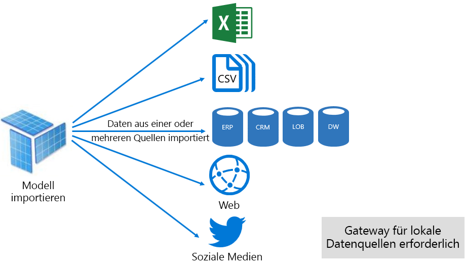

Zwar gibt es überzeugende Vorteile, die Import-Modellen zugeordnet sind, gibt es jedoch Nachteile zu:

- Das gesamte Modell muss auf den Speicher geladen werden, bevor der Power BI das Modell Abfragen können, mit das Druck auf verfügbare Ressourcen platzieren können, wenn Anzahl und Größe von Modellen wachsen
- Modellieren von Daten ist nur so aktuell wie der neuesten Aktualisierung und daher importmodelle vorzugsweise auf Basis eines Zeitplans aktualisiert werden müssen
- Eine vollständige Aktualisierung entfernt alle Daten aus allen Tabellen und neu geladen wird, aus der Datenquelle. Dies kann sehr viel Zeit und Ressourcen für Power BI-Dienst und der bzw. den Datenquelle(n) sein. Powerbi verfügt über Unterstützung für die inkrementelle Aktualisierung die Kürzung und Neuladen ganze Tabellen vermeiden kann, und dies wird im behandelt die [Optimizing Power BI-Hosted Modelle](#optimizing-power-bi-hosted-models) Thema.

Erfordern importmodelle hinsichtlich Ressource Power BI-Dienst:

- Genügend Arbeitsspeicher zum Laden des Modells bei einer Abfrage oder aktualisiert wird
- Verarbeiten von Ressourcen und zusätzliche Speicherressourcen zum Aktualisieren von Daten

#### DirectQuery Mode

Im Modus für DirectQuery (DQ) entwickelten Modelle importieren Sie Daten nicht. Stattdessen diese bestehen nur aus Metadaten, die bei abgefragt Probleme native Abfragen an die zugrunde liegenden Datenquelle.

Es gibt zwei wesentliche Gründe dafür, erwägen die Entwicklung eines DQ-Modells. Der erste Grund ist, wenn die Datenvolumes zu groß sind – auch, wenn die Verringerung der Methoden angewendet werden – in ein Datenmodell zu laden oder aktualisieren Sie praktisch. Der zweite Grund ist, wenn Berichte und Dashboards müssen das "nahezu in Echtzeit" von Daten, über welche innerhalb der Grenzwerte für die geplante Aktualisierung (48 Mal pro Tag für eine dedizierte Kapazität) erreicht werden kann.

Es gibt mehrere Vorteile, die DQ-Modellen zugeordnet sind:

- Größenbeschränkungen für den Import-Modell werden nicht angewendet.
- Modelle erfordern keine Aktualisierung
- Benutzer des Berichts werden die neuesten Daten angezeigt, bei der Interaktion mit dem Berichtsfilter und Slicer, den gesamten Bericht zum Abrufen von aktueller Daten aktualisiert
- Dashboardkacheln, die bei basierend auf den DQ-Modelle können so häufig wie alle 15 Minuten automatisch aktualisiert.

Es gibt jedoch zahlreiche Nachteile und Einschränkungen DQ-Modellen zugeordnet sind:

- Das Modell muss auf eine unterstützte Datenquelle basieren, und daher eine Datenintegration bereits in der Datenquelle erreicht werden muss. Unterstützte Datenquellen werden relationale und analytische Systeme, mit Unterstützung für viele beliebte Data-Speicher \[ [7](#endnote-07)\].
- Leistung kann langsam sein, möglicherweise negative Auswirkungen auf, auf dem Power BI-Dienst (Abfragen können sehr CPU-intensiv sein) und für die Datenquelle (die nicht für analytische Abfragen optimiert werden kann)
- Power Query-Abfragen nicht übermäßig kompliziert, und sind auf M-Ausdrücke und Funktionen, die in nativen Abfragen, die von der Datenquelle verstanden umgesetzt werden können
- DAX-Funktionen auf diejenigen beschränkt werden, die in nativen Abfragen, die von der Datenquelle verstanden umgesetzt werden können, und es gibt keine Unterstützung für berechnete Tabellen oder integrierten Time Intelligence-Funktionen
- Standardmäßig fehl Modell Abfragen, die Abrufen von mehr als eine Million Zeilen erforderlich
- Berichte und Dashboards mit mehreren Visualisierungen können inkonsistente Ergebnisse angezeigt, insbesondere, wenn die Datenquelle "volatile" ist
- F & A und Schnelleinblicke werden nicht unterstützt.

Erfordern DQ-Modelle im Hinblick auf Power BI-Dienst-Ressource:

- Minimaler Arbeitsspeicher zum Laden des Modells (nur Metadaten) Wenn sie abgefragt wird
- Manchmal signifikante Prozessor--Ressourcen, zum Generieren und Verarbeiten von Abfragen an die Datenquelle gesendet

Weitere Informationen finden Sie in der [Verwendung von DirectQuery in Power BI Desktop](desktop-use-directquery.md) Dokument.

#### Composite-Modus

Die im zusammengesetzten Modus entwickelten Modelle können konfiguriert werden, des Speichern von Modus für die einzelnen Modelltabellen. Aus diesem Grund unterstützt eine Mischung von Import und DQ-Tabellen. Es unterstützt auch berechnete Tabellen (mit DAX definiert) und mehrere DQ-Datenquellen.

Speichermodus für die Tabelle kann als importieren "," DirectQuery "oder" Dual konfiguriert werden. Eine Tabelle als duale Speicherung-Modus konfiguriert ist, den Import und DirectQuery, und dadurch die Power BI-Dienst, um zu bestimmen, die effizientesten Modus auf Grundlage von Abfragen verwenden können.

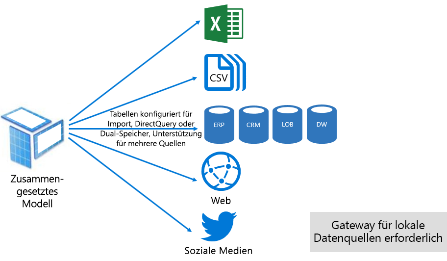

Zusammengesetzte Modelle bemühen uns um das beste aus den Import und DirectQuery-Modus bereitstellen. Bei entsprechender Konfiguration können sie hohe abfrageleistung von in-Memory-Modellen die Möglichkeit, Daten in Echtzeit aus Datenquellen abrufen kombinieren.

Datenmodellierer, die zusammengesetzte Modelle zu entwickeln, sind wahrscheinlich Dimensionstyp Tabellen in der Import "oder" Dual-Modus und Faktentyp Speichertabellen im DirectQuery-Modus zu konfigurieren. Betrachten Sie beispielsweise ein Modell mit einer Product-Dimension-Type-Tabelle im Dual-Modus und eine Sales Faktentyp Tabelle im DirectQuery-Modus. Die Product-Tabelle konnte von in-Memory-Rendern Sie den Datenschnitt eines Berichts schnell und effizient abgefragt werden. Die Sales-Tabelle kann dann im DirectQuery-Modus mit der zugehörigen Product-Tabelle verknüpft abgefragt werden. Die zweite Abfrage konnte die Generierung einer einzelnen effizient native Abfrage verknüpfen der Tabellen "Product" und "Sales" und "nach den Werten der Slicer Filtern aktiviert werden.

Im Allgemeinen können die vor- und Nachteile, die mit jedem Modellmodus verknüpften Tabelle Speichermodus zusammengesetzten Modelle zuweisen betrachtet werden.

Weitere Informationen finden Sie in der [Verwenden von zusammengesetzten Modellen in Power BI Desktop](desktop-composite-models.md) Dokument.

### Lizenzierung

Powerbi verfügt über drei Lizenzen:

- Power BI Free
- Power BI Pro
- Power BI Premium

Die **Power BI Free** Lizenz ermöglicht eine Einzelperson, melden Sie sich beim Power BI-Dienst und in ihrem persönlichen Arbeitsbereich durch die Veröffentlichung von Datenmodellen und Berichten arbeiten. Es ist wichtig zu verstehen, dass es nicht möglich, Power BI-Inhalte freigeben, indem Sie die Verwendung dieser Lizenz. Dieser Lizenz, ist wie der Name schon sagt, kostenlos.

Die **Power BI Pro** Lizenz Einzelperson erstellen und Zusammenarbeit innerhalb der app-Arbeitsbereiche und freigeben und Verteilen von Power BI-Inhalte ermöglicht. Sie können auch die Aktualisierung für ihre Datasets für automatisch Daten aktuell sind, einschließlich aus lokalen Datenquellen konfigurieren. Darüber hinaus können sie überwachen und steuern, wie die Daten zugegriffen und verwendet werden. Diese Lizenz ist erforderlich, um freigegebene Inhalte, die von anderen Benutzern zu erhalten, wenn der Benutzer eine dedizierte Power BI Premium-Kapazität zugeordnet ist.

Die **Power BI Premium** Lizenz ist eine auf Mandantenebene, und es wird erläutert, der [Einführung in Power BI Premium](#introducing-power-bi-premium) Abschnitt.

Weitere Informationen zur Lizenzierung von Power BI finden Sie in der [Power BI-Preise](https://powerbi.microsoft.com/pricing/) Seite.

## Einführung in Power BI Premium

Power BI Premium bietet eine einheitliche Self-Service- und Enterprise BI-Plattform, mit der Skalierung, zuverlässige Leistung und Kosten. Er erreicht dies in erster Linie durch die Bereitstellung dedizierter Ressourcen zum Ausführen von Power BI-Dienst für Ihre Organisation.

Power BI Premium bietet außerdem viele Enterprise-Features:

- Kostengünstige Verteilung von Inhalten, ermöglichen die gemeinsame Nutzung von Power BI-Inhalt für unbegrenzte Power BI Free-Benutzer, einschließlich externer Benutzer
- Unterstützung für größere Datasets \[ [8](#endnote-08)\]
- Höhere Aktualisierungsraten Datenflüsse und Datasets (bis zu 48-Mal pro Tag)
- Die inkrementelle Aktualisierung Datenflüsse und datasets
- Datenfluss verknüpft, Entitäten und parallele Ausführung von Transformationen
- Paginierte Berichte
- Power BI-Berichtsserver, für die lokale berichterstellung
- Möglichkeit zum Einbetten von Inhalten in apps für app-Benutzer (PaaS)

Viele dieser Features genutzt werden kann, um effiziente und skalierbare unternehmenslösungen bereitzustellen, und finden Sie unter den [Optimieren von Premium-Kapazitäten](#optimizing-premium-capacities) Abschnitt.

### Abonnements und Lizenzen

Power BI Premium ist ein auf Mandantenebene Office 365-Abonnement in zwei SKU (Stock Keeping Unit)-Familien verfügbar:

- **EM** SKUs (EM1-EM3) für das einbetten, müssen eine jährliche Verpflichtung, monatliche Abrechnung
- **P** SKUs (P1-P3) einbetten und Enterprise-Funktionen erfordern eine monatliche oder jährliche Verpflichtung monatlich in Rechnung gestellt, und enthält eine Lizenz für Power BI-Berichtsserver lokal installieren

Ein alternativer Ansatz ist ein Azure Power BI Embedded-Abonnement erwerben, die über eine einzelne SKU-Familie verfügt: **Ein** SKUs (A1-A6) für die Einbettung und Kapazität, die ausschließlich zu Testzwecken.

Alle SKUs bieten V-Kerne zum Erstellen von Kapazitäten \[ [9](#endnote-09)\], aber die EM-SKUs sind für Einbetten von kleineren Skalierung eingeschränkt. Während der Schwerpunkt in diesem Whitepaper zu den P-SKUs ist, ist viel der diskutierten ist auch auch A-SKUs.

Im Gegensatz zu den Premium-Abonnement können Sie SKUs, die Azure-SKUs erfordern keine Zeitaufwand und abgerechnet wird. Sie bieten vollständige Skalierung aktivieren, um Flexibilität, zentral Herunterskalieren, Pause-, fortsetzen- und löschen.

Azure Power BI Embedded ist größtenteils nicht Gegenstand dieses Whitepapers, aber es wird erläutert, unter dem Thema testen Ansätze als praktische und wirtschaftliche-Option von Tests und Messungen Workloads.

Weitere Informationen zu den Azure-SKUs finden Sie in der [Dokumentation zu Azure Power BI Embedded](/azure/power-bi-embedded/).

Power BI-Premium-Abonnements werden von Administratoren im Microsoft 365 Administrationscenter gekauft. Insbesondere können nur globale Administratoren von Office 365 oder Administratoren Abrechnung SKUs erwerben.

Nach dem Erwerb der Mandant erhält keine entsprechende Anzahl von V-Kerne zum Zuweisen von Kapazitäten – Dies bezeichnet man als **V-Kern-pooling**. Beispielsweise stellt der Erwerb einer P3-SKU des Mandanten mit 32 V-Kerne.

Weitere Informationen finden Sie in der [zum Erwerb von Power BI Premium](service-admin-premium-purchase.md) Dokument.

### Premium-Kapazitäten

Im Gegensatz zu einer gemeinsam genutzten Kapazität Ausführungsort der Workloads auf Computerressourcen gemeinsam mit anderen Kunden, eine **dedizierte Kapazität** ist für die ausschließliche Verwendung von einer anderen Organisation. Es wird isoliert mit dedizierten Compute-Ressourcen die zuverlässige und konsistente Leistung für gehosteten Inhalt zu bieten.

Der Schwerpunkt dieses Whitepapers liegt **Premium-Kapazität** , d. h. es EM oder P-SKUs zugeordnet ist.

#### Kapazität von Knoten

Wie beschrieben in den Abonnements und Lizenzen, Thema gibt es zwei Power BI Premium-SKU-Familien: EM und P. Alle Power BI Premium-SKUs stehen als kapazitätsknoten, mit jeweils darstellen eines festgelegten Zeitraums Prozessor, Arbeitsspeicher und Speicher mit Ressourcen zur Verfügung. Zusätzlich zu den Ressourcen jede SKU hat funktionsbegrenzungen, auf die Anzahl der Verbindungen von DirectQuery (DQ) und Live-Verbindung (LC) pro Sekunde, und die Anzahl der parallelen Modells wird aktualisiert.

Verarbeitung erfolgt durch eine festgelegte Anzahl von V-Kerne, gleichmäßig zwischen Back-End- und Front-End unterteilt.

**Back-End-V-Kerne** sind verantwortlich für die Core-Power BI-Funktionen, einschließlich der abfrageverarbeitung, cacheverwaltung, Ausführen von R Services, Aktualisierung des Modells, die Verarbeitung natürlicher Sprache (Q & A) und serverseitiges Rendering von Berichten und Bildern. Back-End-V-Kerne sind eine feste Menge an Arbeitsspeicher zugewiesen, die primären verwendet, um den Host-Modelle, die auch als aktiver Datasets bezeichnet werden.

**Front-End-V-Kerne** sind verantwortlich für die Web Service, Dashboard und Bericht dokumentverwaltung, zugriffsrechteverwaltung, zeitplanung, APIs, lädt und downloads und Allgemein für alles, was im Zusammenhang mit der Benutzer hat.

Speicher wird auf 100 TB pro kapazitätsknoten festgelegt.

Die Ressourcen und die Grenzen der einzelnen Premium-SKU (und gleichermaßen Größe ein SKU) werden in der folgenden Tabelle beschrieben.

| Kapazität von Knoten | Gesamtzahl an V-Kernen | Back-End-V-Kerne | RAM (GB) | Front-End-V-Kerne | DQ/LC (pro Sekunde) | Modell aktualisieren Parallelität |
| --- | --- | --- | --- | --- | --- | --- |
| EM1/A1 | 1 | 0,5 | 2.5 | 0,5 | 3.75 | 1 |
| EM2/A2 | 2 | 1 | 5 | 1 | 7.5 | 2 |
| EM3/A3 | 4 | 2 | 10 | 2 | 15 | 3 |
| P1/A4 | 8 | 4 | 25 | 4 | 30 | 6 |
| P2/A5 | 16 | 8 | 50 | 8 | 60 | 12 |
| P3/A6 | 32 | 16 | 100 | 16 | 120 | 24 |
| | | | | | | |

#### Capacity-Workloads

Capacity-Workloads sind Dienste, die Benutzern zur Verfügung gestellt. Premium und Azure-Kapazitäten Unterstützung standardmäßig nur eine Dataset-Workload, die mit der Ausführung von Power BI-Abfragen, die nicht deaktiviert werden können.

Zusätzlicher Workloads können für paginierte Berichte, Datenflüsse und AI aktiviert werden. Jede zusätzliche arbeitsauslastung erforderlich ist, konfigurieren den maximalen Arbeitsspeicher (als Prozentsatz des gesamten verfügbaren Arbeitsspeichers), der von der arbeitsauslastung verwendet werden kann.

#### Wie funktionieren Kapazitäten

Immer zielt darauf ab Power BI-Dienst vornehmen kapazitätsressourcen optimal nutzen, während die Kapazität nicht überschreiten von Grenzwerten für auferlegt werden.

Capacity-Vorgänge werden entweder als klassifiziert interaktive oder Hintergrund. Interaktive Vorgänge enthalten, Rendern von Anforderungen und die Reaktion auf Benutzerinteraktionen (filtern, Q & A-Abfragen usw.). Im Allgemeinen ist die Import-Modell abgefragt Arbeitsspeicher ressourcenintensiv, während Abfragen LC/DQ-Modellen CPU-intensiv ist. Hintergrundvorgänge Datenfluss einschließen, und importieren Sie Modell aktualisiert und das Dashboard Abfrage Zwischenspeichern.

Es ist wichtig zu verstehen, dass interaktive Vorgänge immer über die Hintergrundvorgänge ausgeführt, um sicherzustellen, dass die bestmögliche benutzerumgebung priorisiert werden. Wenn nicht genügend Ressourcen vorhanden sind, werden die Hintergrundvorgänge hinzugefügt, an eine Warteschlange zur Verarbeitung, wenn Ressourcen frei. Hintergrundvorgänge, z. B. das Dataset-Aktualisierungen und KI-Funktionen, können beendet mitten von Power BI-Dienst und einer Warteschlange hinzugefügt.

Importmodelle müssen vollständig in den Arbeitsspeicher geladen werden, damit diese abgefragt oder aktualisiert werden können. Power BI-Dienst verwaltet Speicher der Nutzung von anspruchsvolle Algorithmen, um sicherzustellen, dass maximal verfügbaren Arbeitsspeicher nutzen, und erreichen die Überbelastung der Kapazitätsbedarfs: Es ist zwar möglich, für die Modelle einer Kapazität zum Speichern von vielen importieren (bis zu 100 TB pro Premium-Kapazität), wenn die kombinierte Datenträgerspeicher überschreitet den unterstützten Speicher (zusätzlicher Speicher ist erforderlich, zum Abfragen und aktualisieren), klicken Sie dann sie nicht alle geladen werden in den Arbeitsspeicher an gleichzeitig.

Importmodelle werden aus diesem Grund in - geladen und aus dem - Speicher entsprechend der Verwendung entfernt. Ein Modell importieren wird geladen, wenn es sich um abgefragten (interaktive Vorgang) ist und noch nicht im Arbeitsspeicher oder wenn sie aktualisiert werden soll (Vorgang im Hintergrund).

Das Entfernen eines Modells aus dem Arbeitsspeicher wird als bezeichnet **Entfernung** , und es ist ein Vorgang, der Power BI abhängig von der Größe der Modelle schnell ausführen können. Wenn die Kapazität jeder ungenügendem Arbeitsspeicher nicht auftreten, werden Modelle sind einfach in den Arbeitsspeicher geladen und bleiben dort. \[[10](#endnote-10) \] jedoch, wenn nicht genügend Arbeitsspeicher zum Laden eines Modells verfügbar ist, im Power BI-Dienst müssen zunächst, um Arbeitsspeicher freizugeben. Durch das Erkennen von Modellen, die inaktiv haben durch Suchvorgänge Modelle, die nicht in den letzten drei Minuten verwendet wurden Speicherplatz freigegeben \[ [11](#endnote-11)\], und klicken Sie dann entfernen sie. Wenn es keine inaktiven Modelle gibt zu entfernen, versucht Power BI-Dienst für Hintergrundoperationen geladene Modelle zu entfernen. Dies kann das Entfernen von Hintergrund-Workloads wie die KI-Workloads umfassen. Letzte Möglichkeit, nach 30 Sekunden nicht erfolgreicher Versuche \[ [11](#endnote-11)\], besteht darin, das interaktive fehl. In diesem Fall wird der Benutzer des Berichts ordnungsgemäß bildschirmaufnahmedatei eine Empfehlung, versuchen es in Kürze informiert.

Es ist wichtig zu betonen, dass das Dataset Entfernung ein normales und erwartetes Verhalten ist. Es zielt darauf ab, zum Maximieren der speicherauslastung durch Laden und Entladen von Modellen, die zusammen mit verfügbaren Arbeitsspeicher überschreiten können. Dies ist beabsichtigt, und für Benutzer des Berichts vollständig transparent. Hohe entfernungsraten bedeuten nicht unbedingt, dass die Kapazität unzureichend Ressourcen zugewiesen ist. Sie können jedoch einem Problem werden, wenn die Abfrage oder Aktualisierung Reaktionsfähigkeit aufgrund hoher entfernungsraten warnungskontext.

Aktualisierungen von importmodelle sind immer Arbeitsspeicheraufwand hoch, wie Modelle in den Arbeitsspeicher geladen werden müssen und zusätzlicher Arbeitsspeicher für die Verarbeitung erforderlich ist. Eine vollständige Aktualisierung kann ungefähr doppelt so viel Arbeitsspeicher, die das Modell benötigte eingabedatenschema verwenden. Dadurch wird sichergestellt, dass das Modell abgefragt werden kann, selbst wenn verarbeitet werden (Abfragen gesendet werden, das vorhandene Modell, bis die Aktualisierung abgeschlossen wurde, und die neue Modelldaten zur Verfügung steht). Beachten Sie, inkrementeller Aktualisierung erfordert weniger Arbeitsspeicher und kann schneller ausgeführt werden kann und daher nicht genügend kapazitätsressourcen erheblich reduzieren. Aktualisierungen können auch die CPU-intensiv sein für Modelle, vor allem solche mit komplexen Power Query-Transformationen oder berechneten Tabellen/Spalten, die komplex sind oder für große Tabellen basieren.

Aktualisiert – wie bei Abfragen - erforderlich, dass das Modell in den Arbeitsspeicher geladen werden. Wenn nicht genügend Arbeitsspeicher verfügbar ist, versucht Power BI-Dienst zum Löschen der inaktiv Modelle, und wenn dies nicht möglich ist (wie alle Modelle aktiv sind), der Aktualisierungsauftrag in die Warteschlange eingereiht. Aktualisierungen werden in der Regel sehr CPU-intensiv, mehr dennoch als Abfragen. Aus diesem Grund stehen Kapazitätsgrenzen für die Anzahl der gleichzeitigen Aktualisierungen, legen Sie auf 1,5 Mal die Anzahl der Back-End-V-Kerne, die aufgerundet. Wenn zu viele gleichzeitige Aktualisierungen sind, wird eine geplante Aktualisierung in die Warteschlange eingereiht werden. Wenn diese Situationen auftreten, dauert es länger, bis die Aktualisierung abzuschließen. Beachten Sie, dass bei Bedarf aktualisiert, die (von einer benutzeranforderung oder API-Aufruf ausgelöst) drei Wiederholungsversuche ausgeführt \[ [11](#endnote-11)\], und klicken Sie dann fehl, wenn noch nicht genügend Ressourcen vorhanden sind.

## Verwalten von Power BI Premium

Verwalten von Power BI Premium umfasst, Erwerb von Abonnements, und erstellen, verwalten und Überwachen von Premium-Kapazitäten.

### Erstellen und Verwalten von Kapazitäten

Die **Kapazitätseinstellungen** auf der Seite die **Power BI-Administrator** -Portal zeigt die Anzahl von V-Kerne erworben und verfügbar (d. h. noch zu einer Kapazität zugewiesen werden) und Premium-Kapazitäten aufgeführt. Die Seite ermöglicht globale Office 365-Administratoren oder Power BI-Dienstadministratoren zu Premium-Kapazitäten verfügbaren V-Kerne erstellen oder vorhandene Premium-Kapazitäten zu ändern.

Beim Erstellen einer Premium-Kapazität ist der Administrator erforderlich, um zu definieren:

- Kapazitätsname (eindeutig innerhalb des Mandanten)
- Kapazität admin(s)
- Kapazitätsumfang
- Region für datenresidenz \[ [12](#endnote-12)\]

Es muss mindestens ein Kapazitätsadministrator zugewiesen werden. Sie können Benutzer, die als Kapazitätsadministratoren zugewiesen:

- Die Kapazität Arbeitsbereiche zuweisen
- Verwalten von Benutzerberechtigungen, die zusätzliche Kapazitätsadministratoren oder Benutzer mit Zuweisungsberechtigungen (zur Aktivierung der sie die Kapazität Arbeitsbereiche zuweisen) hinzufügen.
- Verwalten von Workloads, um die maximale speicherauslastung für paginierte Berichte und Datenflüsse Workloads konfigurieren
- Starten Sie die Kapazität, um alle Vorgänge bei einem System Überladung zurückzusetzen neu \[ [13](#endnote-13)\]

Kapazitätsadministratoren können nicht auf Arbeitsbereich Inhalte zuzugreifen, (sofern nicht explizit um arbeitsbereichsberechtigungen zugewiesen), und sie haben keinen Zugriff auf alle Power BI-administrationsbereiche (sofern nicht explizit zugewiesen ist) wie z. B. nutzungsmetriken, Überwachungsprotokolle oder mandanteneinstellungen. Vor allem Kapazitätsadministratoren keine Berechtigungen, um neue Kapazitäten zu erstellen oder vorhandene Kapazitäten skalieren. Sie werden außerdem zugewiesen, auf einer pro Kapazität –, um sicherzustellen, dass sie nur können anzeigen und Verwalten von Kapazitäten, denen sie zugewiesen sind.

Größe der Kapazität muss über eine Liste der verfügbaren Optionen für die SKU der eingeschränkt wird durch die Anzahl der verfügbaren V-Kerne im Pool ausgewählt werden. Es ist möglich, mehrere Kapazitäten aus dem Pool zu erstellen, die von einem erstellt werden konnte, oder mehrere SKUs erworben. Beispielsweise eine P3-SKU (32 V-Kerne) verwendet werden, um drei Kapazitäten zu erstellen: eine P2 (16 virtuelle Kerne), und zwei P1 (2 x 8 virtuelle Kerne). Verbesserte Leistung und Skalierbarkeit durch das Erstellen von kleineren Größe Kapazitäten erreicht werden können, und in diesem Thema wird erläutert, der [Optimieren von Premium-Kapazitäten](#optimizing-premium-capacities) Abschnitt. Die folgende Abbildung zeigt ein Beispiel-Setup für die fiktive Contoso-Organisation bestehend aus fünf Premium-Kapazitäten (3 x P1 "und" 2 x P3) mit einzelnen enthaltenden app-Arbeitsbereiche und mehrere Arbeitsbereiche in gemeinsam genutzten Kapazität.

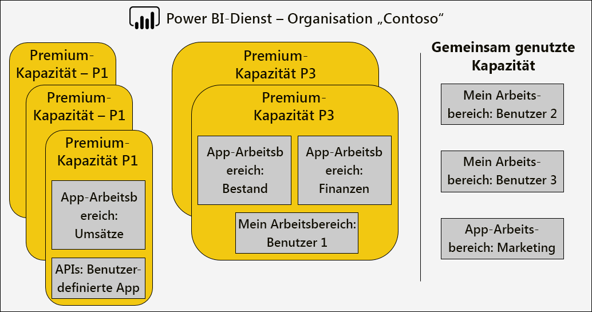

Eine Premium-Kapazität kann zu einer anderen Region als der Startbereich des Power BI-Mandanten, administrative Kontrolle über die Rechenzentren (in definierten geografischen Regionen) Power BI-Inhalt befindet sich zugewiesen werden. \[[12](#endnote-12)\]

Power BI-Dienstadministratoren und globale Office 365-Administratoren können Premium-Kapazitäten ändern. Genauer gesagt können sie:

- Ändern Sie die Größe der Kapazität um zentral hoch- oder Herunterskalieren von Ressourcen. Allerdings ist es nicht möglich, ein downgrade von einer P-SKU auf eine SKU "EM", oder umgekehrt zu aktualisieren.
- Hinzufügen oder Entfernen von Kapazitätsadministratoren
- Fügen Sie hinzu oder entfernen Sie Benutzer mit Zuweisungsberechtigungen
- Hinzufügen oder Entfernen von zusätzlichen workloads
- Ändern von Regionen

Berechtigung zur kapazitätszuweisung sind erforderlich, eine bestimmte Premium-Kapazität einen Arbeitsbereich zuweisen. Die gesamte Organisation, bestimmte Benutzer oder Gruppen können die Berechtigungen gewährt werden.

Standardmäßig unterstützen Premium-Kapazitäten für Workloads, die mit der Ausführung von Abfragen mit Power BI. Es unterstützt auch drei zusätzliche arbeitsauslastungen: **Paginierte Berichte**, **Datenflüsse**, und **AI**. Jede arbeitsauslastung erforderlich ist, konfigurieren den maximalen Arbeitsspeicher (als Prozentsatz des gesamten verfügbaren Arbeitsspeichers), der von der arbeitsauslastung verwendet werden kann. Es ist wichtig zu verstehen, dass das Erhöhen der maximalen speicherbelegung auf die Anzahl der aktiven Modelle, die gehostet werden können, und der Durchsatz von Aktualisierungen auswirken kann.

Der Arbeitsspeicher wird Dataflows dynamisch zugeordnet, ist paginierten Berichten jedoch statisch zugeordnet. Der Grund für die Zuweisung von statisch der maximale Arbeitsspeicher ist, dass paginierte Berichte in einem gesicherten enthaltenen Raum für die Kapazität ausgeführt. Wenn die Einstellung paginierten Berichte Speicher, da hierdurch von verfügbarem Speicher für das Laden von Modellen, sollte vorsichtig vorgenommen werden.

|                     | EM3                      | P1                       | P2                      | P3                       |
|---------------------|--------------------------|--------------------------|-------------------------|--------------------------|
| Paginierte Berichte | N/V | 20 % Standard, mindestens 10 % | 20 % Standard, mindestens 5 % | 20 % Standard, mindestens 2,5 % |
| Dataflows | 20 % Standard, mindestens 8 %  | 20 % Standard, mindestens 4 %  | 20 % Standard, mindestens 2 % | 20 % Standard, mindestens 1 %  |
| AI | N/V | Standardwert 20 % 20 % minimale  | 20 % Standard, mindestens 10 % | 20 % Standard, mindestens 5 %  |
| | | | | |

Löschen einer Premium-Kapazität ist möglich, und führen nicht das Löschen der Arbeitsbereiche und Inhalt. Stattdessen wird es keine zugewiesenen Arbeitsbereiche in gemeinsam genutzten Kapazität verschoben. Bei der Premium-Kapazität in einer anderen Region erstellt wurde, wird der Arbeitsbereich in gemeinsam genutzte Kapazität der home-Region verschoben werden.

### Kapazität Arbeitsbereiche zuweisen

Arbeitsbereiche können in einer Premium-Kapazität zugewiesen werden die **Power BI-Administrator** **Portal** "oder" - app-Arbeitsbereichs – klicken Sie im der **Arbeitsbereich** Bereich.

Kapazitätsadministratoren, sowie globale Office 365-Administratoren oder Power BI-Dienstadministratoren, können Sie Arbeitsbereiche zuweisen, in einen Massenimport der **Power BI-Administrator** **Portal**. BULK zugewiesen, kann auf anwenden:

- **Arbeitsbereiche nach Benutzern** : Alle Arbeitsbereiche, die im Besitz dieser Benutzer ab, einschließlich der persönlichen Arbeitsbereiche, werden die Premium-Kapazität zugewiesen. Dazu gehören die erneute Zuweisung von Arbeitsbereichen, wenn sie bereits einer anderen Premium-Kapazität zugewiesen werden. Darüber hinaus werden die Benutzer auch Berechtigungen für arbeitsbereichszuweisungen erteilt zugewiesen.

- **Bestimmte Arbeitsbereiche**
- **Arbeitsbereiche der gesamten Organisation** : Alle Arbeitsbereiche, einschließlich der persönlichen Arbeitsbereiche, werden die Premium-Kapazität zugewiesen. Darüber hinaus werden alle aktuellen und zukünftigen Benutzer die Berechtigungen für arbeitsbereichszuweisungen erteilt zugewiesen. \[[14](#endnote-14)\]

Kann ein Arbeitsbereich einer Premium-Kapazität hinzugefügt werden, mithilfe der **Arbeitsbereich** Bereich, sodass der Benutzer ist sowohl ein arbeitsbereichsadministrator und Zuweisungsberechtigungen hat.

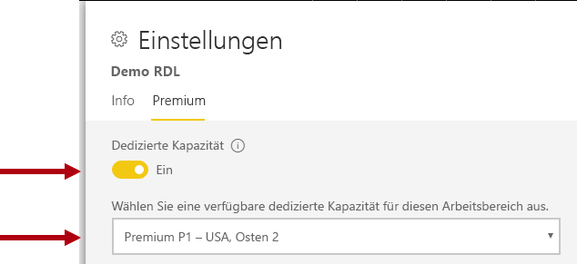

Arbeitsbereichsadministratoren können einen Arbeitsbereich zu einer Kapazität (für gemeinsam genutzte Kapazität) entfernen, ohne erforderliche Zuweisung-Berechtigung. Entfernen von Arbeitsbereichen aus dedizierten Kapazitäten effektiv verschiebt den Arbeitsbereich auf gemeinsam genutzte Kapazität. Beachten Sie, dass einen Arbeitsbereich aus einer Premium-Kapazität entfernen negative Folgen, dies führt z. B. freigegebene Inhalte, die nicht verfügbar für Power BI Free kann lizenzierte Benutzer oder die Unterbrechung der geplanten Aktualisierung, wenn sie die zulässige Anzahl unterstützt überschreiten von gemeinsam genutzten Kapazitäten.

Im Power BI-Dienst wird ein Arbeitsbereich einer Premium-Kapazität zugewiesen ganz einfach durch das Rautensymbol identifiziert, der den Namen des Arbeitsbereichs erweitert.

### Überwachen von Kapazitäten

Überwachen von Premium-Kapazitäten bietet Administratoren einen Überblick über die Leistung von Kapazitäten. Kapazitäten können überwacht werden, mithilfe der [Kapazitätsmetriken für Power BI Premium-app](service-admin-premium-monitor-capacity.md) oder [Power BI-Verwaltungsportal](service-admin-premium-monitor-portal.md).

#### Interpretieren von Metriken

Metriken sollten überwacht werden, um einen Überblick über Baseline-Nutzung und Workload-ressourcenaktivität herzustellen. Wenn die Kapazität langsam ist, es ist wichtig zu verstehen, welche Metriken überwacht werden, und die Schlussfolgerungen, die Sie vornehmen können.

Im Idealfall sollten Abfragen führen Sie innerhalb einer Sekunde reaktionsfähige Benutzeroberflächen für die benutzerberichterstattung bereitzustellen und höhere abfragedurchsatz zu aktivieren. Es ist in der Regel weniger von Belang, wenn Hintergrundprozesse – einschließlich Aktualisierungen - längere Zeiträume abgeschlossen werden.

Im Allgemeinen können langsam Berichte ein Anzeichen für eine Überhitzung Kapazität sein. Wenn Berichte nicht geladen werden, ist dies ein Hinweis auf eine übermäßige auseinandersetzungen Kapazität. In beiden Situationen kann die Hauptursache auf vielen Faktoren ab, einschließlich zurückzuführen sein:

- **Abfragen mit Fehlern** sicherlich angeben arbeitsspeicherauslastung und, die ein Modell konnte nicht in den Arbeitsspeicher geladen werden. Power BI-Dienst versucht, die Laden eines Modells für 30 Sekunden, bevor ein Fehler auftritt.

- **Eine übermäßige Abfrage Wartezeiten** kann verschiedene Ursachen sein:
  - Die Notwendigkeit von Power BI-Dienst zum ersten Modelle entfernen, und Laden Sie das Modell bei-werden abgefragt (Beachten Sie, dass entfernungsraten mit höhere Dataset nur einen Überblick über die Kapazität Belastung nicht sind, es sei denn, begleitet durch lange Wartezeiten der Abfrage, die angeben, arbeitsspeicherüberlastung)
  - Laden des Modells Zeiten (vor allem die Wartezeit ein großen Modells in den Arbeitsspeicher zu laden)
  - Abfragen mit langer
  - Zu viele LC\DQ-Verbindungen (überschreiten von Grenzwerten für die Kapazität)
  - Die CPU-Auslastung
  - Komplexe Berichtsentwürfe mit einer übermäßigen Anzahl von visuellen Elementen auf einer Seite (Beachten Sie, dass jedes visuelle Element um eine Abfrage handelt)
- **Lange Abfragen dauern** kann bedeuten, dass das Modell Entwürfe nicht optimiert sind, insbesondere, wenn mehrere Datasets in einer Kapazität aktiv sind, und nur ein Dataset lange abfragedauern erzeugt,. Dies deutet darauf hin, dass die Kapazität ausreichend Ressourcen zugewiesen ist und das Dataset in Frage suboptimale oder nur langsam ist. Abfragen mit langer kann problematisch sein, wie sie den Zugriff auf Ressourcen, die erforderlich sind, durch andere Prozesse blockieren können.
- **Aktualisieren Sie lange Wartezeiten oder KI-Aufruf Wartezeiten** ein Hinweis auf nicht genügend Arbeitsspeicher aufgrund von vielen active Modelle Arbeitsspeicher belegen oder, dass eine Aktualisierung der problematische andere blockiert werden aktualisiert (größer als parallele Aktualisierung Grenzwerte).

Eine ausführlichere Erläuterung zur Verwendung der Metriken als Nächstes finden Sie in der [Optimieren von Premium-Kapazitäten](#optimizing-premium-capacities) Abschnitt.

## Optimieren der Premium-Kapazitäten

Beim Premium-Kapazität Leistungsprobleme auftreten, werden eine gängige Methode für die erste Optimierung oder bereits bereitgestellte Lösungen zum Wiederherstellen von zulässigen Antwortzeiten zu optimieren. Der überschreibende Grund ist, um zu vermeiden, erwerben zusätzlichen Premium-Kapazität, es sei denn, es gerechtfertigt werden kann.

Wenn zusätzlicher Premium-Kapazität erforderlich ist, stehen Ihnen zwei Optionen, die weiter unten in diesem Abschnitt erläutert werden:

- Zentrales hochskalieren der Premium-Kapazität
- Hinzufügen einer neuen Premium-Kapazität

Schließlich beendet testen, Ansätze und Premium-Kapazitäten in diesem Abschnitt.

### Allgemein empfohlene Vorgehensweisen

Wenn am besten erreichen wollen sind Auslastung und Leistung gibt es einige bewährten Methoden, die in Form allgemeiner Empfehlungen an Bord ergriffen werden können. Dazu gehören:

- Verwendung von app-Arbeitsbereiche anstelle der persönlichen Arbeitsbereiche
- Trennen geschäftskritische und Self-Service-BI (SSBI) direkt in verschiedenen Kapazitäten

  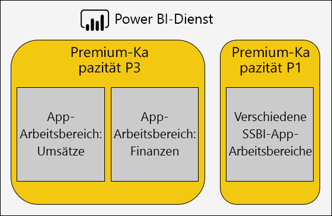

- Wenn für die Freigabe von Inhalten nur mit Power BI Pro-Benutzer möglicherweise keine Notwendigkeit zum Speichern des Inhalts in einer dedizierten Kapazität
- Verwenden Sie dedizierte Kapazität bei der Suche um eine bestimmte Aktualisierungszeit zu erreichen, oder wenn bestimmte Funktionen sind erforderlich, z. B. große Datasets oder paginierten reporting

### Allgemeine Fragen

Optimieren der Power BI Premium-Bereitstellungen ist ein komplexes Thema, die einen Überblick über die arbeitsauslastungsanforderungen, verfügbaren Ressourcen und deren effektive Verwendung betreffen.

Dieses Thema behandelt die sieben häufig gestellte Fragen, beschreiben mögliche Probleme und Beschreibungen und Informationen zum Identifizieren und beheben Sie diese.

#### Warum ist die Kapazität, die langsam, und was kann ich tun?

Es gibt viele Gründe, die zu einer langsamen Premium-Kapazität beitragen können. Diese Frage erfordert Weitere Informationen zu verstehen, was mit langsamen gemeint ist. Sind Berichte langsam geladen? Oder werden sie nicht geladen werden? Sind Sie berichtsvisuals langsam geladen oder aktualisiert werden, wenn der Benutzer mit dem Bericht interagieren? Werden Aktualisierungen dauert länger als erwartet wird, oder bereits aufgetreten ist?

Müssen erhielten einen Überblick über den Grund, können Sie anschließend beginnen, zu untersuchen. Antworten auf die folgenden sechs Fragen helfen Ihnen, mehr zu adressieren bestimmter Probleme.

#### Welche Inhalte wird meine Kapazität verwenden?

Sie können der **Kapazitätsmetriken für Power BI Premium** app zum Filtern von Kapazität und überprüfen die Leistungsmetriken für den Inhalt des Arbeitsbereichs. Es ist möglich, überprüfen die Leistung Metriken und die ressourcennutzung pro Stunde für die letzten sieben Tage für den gesamten Inhalt in einer Premium-Kapazität gespeichert. Dies ist häufig der erste Schritt bei der Problembehandlung für eine allgemeine Angelegenheiten handelt, zur Leistung für Premium-Kapazität.

Wichtige zu überwachende Metriken umfassen:

- Durchschnittliche CPU-Nutzung und die hohe Auslastung-Anzahl
- Durchschnittliche, Arbeitsspeicher und Anzahl der hohe Auslastung und speicherauslastung für bestimmte Datasets, Datenflüsse und paginierte Berichte
- Aktiver Datasets, die in den Arbeitsspeicher geladen
- Durchschnittliche und maximale abfragedauern
- Durchschnittliche abfragewartezeiten
- Durchschnittliche Dataset und den Datenfluss aktualisieren Zeiten
- Durchschnittliche AI zweimal aufrufen, und der Wartezeiten

Darüber hinaus zeigt aktiven Arbeitsspeichers in der Power BI Premium-Kapazität Metriken-App, die Gesamtmenge des Arbeitsspeichers für einen Bericht, der nicht entfernt werden kann, da es in den letzten drei Minuten verwendet wird. Eine hohe Spitze in der Wartezeit für die Aktualisierung konnte mit einem großen und/oder sehr aktiven Dataset korreliert werden.

Das Diagramm "Top 5 von Durchschnittsdauer" hebt hervor, die fünf Datasets, paginierte Berichte, Datenflüsse und AI-Aufrufe, die kapazitätsressourcen verbrauchen. Inhalte in der Top-fünf-Listen, sind Kandidaten für die Untersuchung und mögliche Optimierung.

#### Warum Berichte sind langsam?

Die folgenden Tabellen zeigen mögliche Probleme sowie Möglichkeiten zu identifizieren und behandeln.

##### Nicht genügend Kapazität-Ressourcen

| Mögliche Erklärungen | Identifizieren von | Gewusst wie: Auflösen |
| --- | --- | --- |
| Hohe active Gesamtspeicher (Modell kann nicht entfernt werden, weil es in den letzten drei Minuten verwendet wird)   Mehrere hohe Datenverkehrsspitzen abfragewartezeiten   Mehrere hohe Spitzen bei der Aktualisierung von Wartezeiten | Überwachen von Metriken zum Arbeitsspeicher \[ [18](#endnote-18)\], und der Anzahl der Entfernung \[ [19](#endnote-19)\] | Verringern Sie die Modellgröße, oder konvertieren Sie in den DirectQuery-Modus – finden Sie unter den [Modelle optimieren](#optimizing-models) Thema in diesem Abschnitt   Zentrales hochskalieren der Kapazität   Zuweisen des Inhalts zu einer anderen Kapazität |

##### Ineffiziente Berichtsentwürfe

| Mögliche Erklärungen | Identifizieren von | Gewusst wie: Auflösen |
| --- | --- | --- |
| Seiten des Berichts enthalten zahlreiche visuelle Elemente, die (interaktive Filterung kann mindestens eine Abfrage pro visuellem auszulösen).   Visuelle Elemente abgerufen werden mehr Daten als nötig | Überprüfen Sie die Berichtsentwürfe   Benutzer des Berichts Interview zu verstehen, wie sie mit den Berichten interagieren.   Überwachen von Dataset-abfragemetriken \[ [20](#endnote-20)\] | Neuentwurf von Berichten mit weniger Visualisierungen pro Seite |

##### DataSet verlangsamen (insbesondere wenn Berichte vorher auch ausgeführt haben)

| Mögliche Erklärungen | Identifizieren von | Gewusst wie: Auflösen |
| --- | --- | --- |
| Zunehmend große Mengen an Daten importieren   Komplexen oder ineffizienten Berechnungslogik, einschließlich der RLS-Rollen   Modell, die nicht vollständig optimiert.   (DQ/LC) Gateway-Latenz   Langsame Antwortzeiten für DQ Quelle Abfragen | Überprüfen Sie die Modell-Entwürfe   Überwachen von Leistungsindikatoren für gateway | Finden Sie unter den [Modelle optimieren](#optimizing-models) Thema in diesem Abschnitt |

##### Hohe gleichzeitige Berichte zur Nutzung

| Mögliche Erklärungen | Identifizieren von | Gewusst wie: Auflösen |
| --- | --- | --- |
| Hohe abfragewartezeiten   Die CPU-Auslastung   DQ/LC verbindungsbeschränkungen überschritten | Überwachen der CPU-Auslastung \[ [21](#endnote-21)\], abfragewartezeiten und DQ/LC Auslastung \[ [22](#endnote-22) \] Metriken + abfragedauern – Wenn schwankt kann Angeben von Parallelitätsproblemen | Zentrales hochskalieren der Kapazitätsbedarfs oder den Inhalt einer anderen Kapazität zuzuweisen.   Neuentwurf von Berichten mit weniger Visualisierungen pro Seite |

#### Warum Berichte werden nicht geladen?

Wenn Berichte nicht zum Laden der Daten ist ein Worst-Case-Szenario, und ein sicheres Zeichen, dass die Kapazität nicht genügend Arbeitsspeicher hat und zu auseinandersetzungen. Dies kann auftreten, wenn alle geladenen Modelle sind aktiv, die abgefragt wird, und können nicht entfernt werden, und alle Aktualisierungsvorgänge wurde angehalten oder verzögert wird. Power BI-Dienst versucht, laden das Dataset für 30 Sekunden, und der Benutzer ist der Fehler mit der eine Empfehlung, versuchen es in Kürze ordnungsgemäß benachrichtigt.

Es gibt derzeit keine Metrik für den Bericht von Ladefehlern überwachen. Sie können das Potenzial für dieses Problem durch Überwachung Systemspeicher, insbesondere der höchsten Auslastung und die Uhrzeit der höchsten Auslastung ermitteln. Hohe Dataset entfernungen und lange Dataset Aktualisierung durchschnittliche Wartezeit konnte wird empfohlen, dieses Problem auftritt.

In diesem nur sehr selten der Fall ist, kann dies nicht Prioritäten betrachtet werden. Benutzer des Berichts werden darüber informiert, dass der Dienst ausgelastet ist und, dass sie nach kurzer Zeit wiederholt werden soll. In diesem zu häufig der Fall ist, kann das Problem durch zentrale Skalierung der Premium-Kapazität oder durch Zuweisen des Inhalts einer anderen Kapazität aufgelöst werden.

Capacity Admins (und Power BI-Dienstadministratoren) können überwachen, die **Abfragefehlern** Metrik, um zu bestimmen, wenn dies geschieht. Sie können auch die Kapazität, die alle Vorgänge bei einem System Überladung zurücksetzen neu starten.

#### Warum werden die Aktualisierungen nicht nach Zeitplan gestartet?

Startzeiten der geplanten Aktualisierung sind nicht garantiert. Denken Sie daran, dass es sich bei Power BI-Dienst immer interaktive Vorgänge über Hintergrundvorgänge priorisieren wird. Datenaktualisierung ist eine Hintergrundoperation, die auftreten können, wenn zwei Bedingungen erfüllt sind:

- Ausreichend Arbeitsspeicher ist verfügbar
- Die Anzahl der unterstützten gleichzeitige Aktualisierungen für die Premium-Kapazität wurde nicht überschritten.

Wenn die Bedingungen nicht erfüllt sind, wird die Aktualisierung in die Warteschlange, bis die Bedingungen günstig sind.

Eine vollständige Aktualisierung Denken Sie daran, dass mindestens doppelt die aktuellen Dataset Arbeitsspeichergröße erforderlich ist. Wenn nicht genügend Arbeitsspeicher verfügbar ist, kann nicht die Aktualisierung beginnen, bis Modell Entfernung gibt Speicherplatz frei – Dies verzögert, bedeutet bis ein oder mehrere Datasets inaktiv und entfernt werden kann.

Denken Sie daran, dass die unterstützte Anzahl von maximalen gleichzeitigen Aktualisierungen 1,5 Mal die Back-End-V-Kerne, aufgerundet festgelegt ist.

Eine geplante Aktualisierung schlägt fehl, wenn er beginnen kann nicht vor die nächste geplante Aktualisierung aufgrund von zu beginnen. Eine bedarfsgesteuerte Aktualisierung manuell ausgelöst werden, über die Benutzeroberfläche versucht, die bis zu drei Mal ausführen, bevor ein Fehler auftritt.

Capacity Admins (und Power BI-Dienstadministratoren) können überwachen, die **durchschnittliche aktualisieren Wartezeit (Minuten)** Metrik für die durchschnittliche Verzögerung zwischen dem geplanten Zeitpunkt und dem Beginn des Vorgangs zu ermitteln.

Während eine administrative Priorität für die beeinflussen, in-Time-Daten in der Regel nicht aktualisiert werden soll, stellen Sie sicher, dass genügend Arbeitsspeicher verfügbar ist. Dies kann beinhalten, Datasets, auf die Kapazitäten, die mit bekannten genügend Ressourcen zu isolieren. Es ist auch möglich, dass Administratoren mit dem Besitzer von Datasets koordinieren konnte können staffeln, oder verringern Sie die geplante Aktualisierungen auf Zeiten, Konflikte zu minimieren. Beachten Sie, dass es nicht möglich, dass ein Administrator die Warteschlange für die Aktualisierung anzeigen oder zum Abrufen von Datasets plant.

#### Warum werden aktualisiert, die langsam?

Aktualisierungen kann slow- oder wahrgenommene langsam ist (wie die vorherige Frage Adressen allgemeine) sein.

Wenn die Aktualisierung in der Tat langsam ist, kann es verschiedene Ursachen sein:

- Unzureichende CPU (Aktualisierung kann sehr CPU-intensiv sein)
- Nicht genügend Arbeitsspeicher, sodass Aktualisierung anhalten (erfordert die Aktualisierung beginnen, wenn Bedingungen neu beginnen müssen günstig sind)
- Nicht-Kapazitätsgründen, z. B. Data Source Reaktionsfähigkeit des Systems, Netzwerklatenz, ungültige Berechtigungen oder Gateway-Durchsatz
- Datenvolume – ein guter Grund so konfigurieren Sie inkrementelle zu aktualisieren, wie im folgenden erläutert

Capacity Admins (und Power BI-Dienstadministratoren) können überwachen, die **durchschnittliche aktualisieren Dauer (Minuten)** Metrik, um zu bestimmen, eine Benchmark für den Vergleich im Laufe der Zeit und die **durchschnittliche aktualisieren Wartezeit (Minuten)** Metriken, um zu bestimmen, Durchschnittliche Verzögerung zwischen den Durchschnittliche Verzögerung zwischen dem geplanten Zeitpunkt und dem Beginn des Vorgangs.

Die inkrementelle Aktualisierung kann die Dauer des Daten aktualisieren, insbesondere bei großen Modelltabellen deutlich reduzieren. Es gibt vier Vorteile, die inkrementelle Aktualisierung zugeordnet:

- **Aktualisierungen sind schneller** : Nur eine Teilmenge einer Tabelle benötigt, laden, verringern Auslastung von CPU und Arbeitsspeicher und Parallelität kann höher sein, wenn mehrere Partitionen zu aktualisieren.
- **Aktualisierungen auftreten, nur im Bedarfsfall** : Die inkrementelle Aktualisierung Richtlinien können so konfiguriert werden, um Laden nur, wenn Daten geändert haben
- **Aktualisierungen sind zuverlässiger** : Kürzere ausgeführte Verbindungen mit Quellsystemen flüchtige Daten sind weniger anfällig für die Trennung der Verbindung
- **Modelle bleiben trim** : Die inkrementelle Aktualisierung Richtlinien können so konfiguriert werden, um Verlauf über ein gleitendes Fenster Zeit automatisch zu entfernen.

Weitere Informationen finden Sie in der [inkrementell zu aktualisieren, klicken Sie in Power BI Premium](service-premium-incremental-refresh.md) Dokument.

#### Warum Daten werden aktualisiert, nicht abgeschlossen?

Wenn die datenaktualisierung beginnt, aber es kann nicht abgeschlossen werden, kann es verschiedene Ursachen sein:

- Unzureichender Arbeitsspeicher, auch wenn es nur ein Modell in der Premium-Kapazität ist z. B. die Größe des Datenbankmodells sehr groß
- Nicht-Kapazitätsgründen, einschließlich Daten source System trennen "," Ungültige Berechtigungen "oder" Gatewayfehler

Capacity Admins (und Power BI-Dienstadministratoren) können überwachen, die **Aktualisieren von Fehlern aufgrund von nicht genügend Arbeitsspeicher** Metrik.

#### Warum werden von KI-Aufrufe fehlschlagen?

AI-Aufrufe können aus mehreren Gründen fehlschlagen. Der erforderliche Mindestarbeitsspeicher zu der AI-Workloads beträgt 5 GB, aber dies reicht möglicherweise nicht für einige Eingabedatasets. Beispielsweise erfordert die automatisierte für maschinelles lernen Trainieren des Modells mindestens zweimal und manchmal mehrere Male die Eingabe-Dataset-Größe. Darüber hinaus wird ein KI-Aufruf beendet, es dauert länger als zwei Stunden in Anspruch. Für automatisierte Computer wird die learning-Modell trainieren Aufrufe, die in zwei Stunden, das beste Modell finden Sie in diesen zwei Stunden abgeschlossen werden nicht zurückgegeben.  AI-Aufrufe können auch durch interaktive Anforderungen unterbrochen werden, die Vorrang hat.

Administratoren sollten die AI-Wartezeiten auf Anzeichen von anderen Anforderungen vor überwachen. Administratoren können auch sicherstellen, dass ausreichend Arbeitsspeicher für die KI-arbeitsauslastung relativ zur Größe der Eingabedaten verfügbar ist. Dies kann beinhalten, Isolieren von KI-Workloads auf die Kapazitäten, die bekannt, dass Sie über ausreichende Ressourcen verfügen. Es ist auch möglich, dass Administratoren mit Besitzern von Datenfluss zur Hilfe bei der staffeln, oder Verringern der Datenfluss Aktualisierungszeiten bereit koordinieren können, um Konflikte zu minimieren. Beachten Sie, dass es nicht möglich, dass ein Administrator ist, an die Warteschlange der AI-Aufruf.

### Optimieren von Modellen

Optimale Modellentwurf ist entscheidend für die Bereitstellung einer effizienten und skalierbare Lösung. Es ist jedoch über den Rahmen dieses Whitepapers hinaus um eine vollständige Erläuterung bereitzustellen. Stattdessen wird in diesem Abschnitt wichtige Bereiche berücksichtigt bereitstellen, der beim Optimieren der Modelle.

#### Optimieren der Power BI-gehosteten Modelle

Optimieren von Modellen, die in einer Premium-Kapazität gehostet, können auf Daten Quellen und Modell erreicht werden.

Beachten Sie die optimierungsmöglichkeiten für ein Modell importieren:

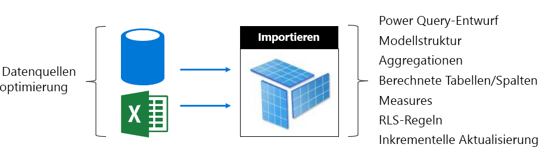

Klicken Sie auf der Datenschicht für die Quelle:

- Relationale Datenquellen um sicherzustellen, dass die schnellste Möglichkeit Aktualisierung mithilfe der vorab Integrieren von Daten, Anwenden der geeigneten Indizes, Tabellenpartitionen, die ausgerichtet sind für die inkrementelle Aktualisierung Zeiträume definieren und Umsetzung von Berechnungen optimiert werden können (anstelle von berechnet Model-Tabellen und Spalten) oder zum Hinzufügen von Berechnungslogik zu Ansichten
- Nicht relationale Datenquellen können in relationale Speicher vorab integriert werden
- Sicherstellen Sie, dass Gateways ausreichende Ressourcen, vorzugsweise auf dedizierten Computern, die mit genügend Netzwerkbandbreite und in der Nähe zu den Datenquellen verfügen.

Auf der Modellebene:

- Power Query-Abfrage Entwürfe minimieren oder entfernen Sie komplexe Transformationen und insbesondere über diejenigen, die verschiedene Datenquellen (Datawarehouses dies erreichen, während ihre extrahieren-transformieren-laden-Phase) zusammenführen können. Darüber hinaus kann sicherstellen, dass die entsprechenden datenschutzebenen der Datenquellen festgelegt werden, dies vermeiden, dass Power BI beim Laden der vollständigen Ergebnisse, um ein kombiniertes Ergebnis über mehrere Abfragen zu erstellen.
- Die Modellstruktur bestimmt die zu ladenden Daten und wirkt sich direkt auf die Größe des Datenbankmodells. Es kann entworfen werden, um zu vermeiden, laden überflüssige Daten durch Entfernen von Spalten, und Entfernen von Zeilen (vor allem historischen Daten) oder durch das Laden von zusammengefasster Daten (auf Kosten der detaillierte Daten wird geladen). Erhebliche Reduzierung kann erreicht werden, durch das Entfernen von Spalten mit hoher Kardinalität (insbesondere Textspalten), die nicht speichern oder sehr effizient komprimieren.
- Modell die abfrageleistung kann verbessert werden, durch Konfigurieren von Richtung Beziehungen, es sei denn, es gibt ein zwingenden Grund bidirektionales filtern können. Erwägen Sie auch die CROSSFILTER-Funktion anstelle von bidirektionalen Filterns.
- Aggregationstabellen können schnelle Abfragen, dass Antworten durch das Laden von Daten zusammengefasst, die vor erreichen, aber dies das Modell und das Ergebnis in längeren Aktualisierungszeiten vergrößert wird. Im Allgemeinen sollten Aggregationstabellen für sehr große Modelle oder zusammengesetzten Modells Entwürfe reserviert werden.
- Berechnete Tabellen und Spalten erhöhen Sie die Modellgröße aus, und führen mehr Aktualisierungszeiten bereit. Im Allgemeinen können eine geringere Datenspeichergröße und eine schnellere Aktualisierung erreicht werden, wenn die Daten materialisiert oder in der Datenquelle berechnet werden. Wenn dies nicht möglich ist, kann die mithilfe von Power Query, benutzerdefinierte Spalten verbesserte speicherkomprimierung anbieten.
- Es gibt möglicherweise Gelegenheit zum Optimieren von DAX-Ausdrücken für Measures und RLS-Regeln, die vielleicht umschreibungslogik zu formulieren um teure Formeln zu vermeiden.
- Die inkrementelle Aktualisierung kann erheblich Aktualisierungszeit reduzieren und Einsparen von Arbeitsspeicher und CPU. Die inkrementelle Aktualisierung kann auch konfiguriert werden, um Modelle trim behalten Verlaufsdaten zu entfernen.
- Ein Modell kann als zwei Modelle überarbeitet werden, bei anderen und in Konflikt stehende Abfragemuster. Für andere Berichte vorhanden allgemeine Aggregate über alle Verlauf, und es wird z. B. Wartezeit von 24 Stunden tolerieren. Andere Berichte sind mit Daten und differenzierten Zugriff auf einzelne Transaktionen benötigen. Anstatt Entwurf ein einzelnes Modell, um alle Berichte zu erfüllen erstellen Sie zwei Modelle, die für die einzelnen Anforderungen optimiert.

Erwägen Sie die optimierungsmöglichkeiten für ein DirectQuery-Modell. Wie das Modell abfrageanforderungen an die zugrunde liegende Datenquelle ausgibt, ist die Quelle datenoptimierung zur Bereitstellung von reaktionsfähigen Modell Abfragen wichtig.

 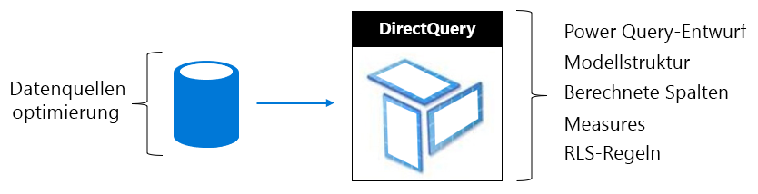

Klicken Sie auf der Datenschicht für die Quelle:

- Die Datenquelle kann optimiert werden um sicherzustellen, dass die schnellste Möglichkeit Abfragen nach vorab Integrieren von Daten (die nicht auf der Ebene des möglich ist), Anwenden der geeigneten Indizes, Definieren von Tabellenpartitionen, die durch das materialisieren zusammengefasste Daten (mit indizierten Sichten), und Minimieren den Betrag, der Berechnung an. Optimale Ergebnisse wird erreicht, bei der Pass-Through-Abfragen müssen, nur filtern und Ausführen innerer Verknüpfungen zwischen indizierten Tabellen oder Sichten.
- Sicherstellen Sie, dass Gateways genügend Ressourcen, vorzugsweise auf dedizierten Computern, die mit genügend Netzwerkbandbreite und in der Nähe zur Datenquelle verfügen.

Auf der Modellebene:

- Power Query-Abfrage, die Entwürfe sollte vorzugsweise gelten keine Transformationen – andernfalls versucht, die Transformationen auf ein absolutes minimum zu beschränken
- Modell die abfrageleistung kann verbessert werden, durch Konfigurieren von Richtung Beziehungen, es sei denn, es gibt ein zwingenden Grund bidirektionales filtern können. Darüber hinaus sollte Modellieren von Beziehungen konfiguriert werden, um wird davon ausgegangen wird referenzielle Integrität erzwungen (Wenn dies der Fall ist) und führt zu Datenquellenabfragen effizienter innere Joins (anstelle von äußeren Joins) verwenden.
- Erstellen benutzerdefinierter Spalten von Power Query-Abfrage oder eine berechnete modellspalte vermeiden – materialisieren in der Datenquelle, wenn möglich
- Es gibt möglicherweise Gelegenheit zum Optimieren von DAX-Ausdrücken für Measures und RLS-Regeln, die vielleicht umschreibungslogik zu formulieren um teure Formeln zu vermeiden.

Erwägen Sie die optimierungsmöglichkeiten für eine zusammengesetzte Modell ein. Denken Sie daran, dass eine kombinierte Modell eine Mischung von Import und DirectQuery-Tabellen ermöglicht.

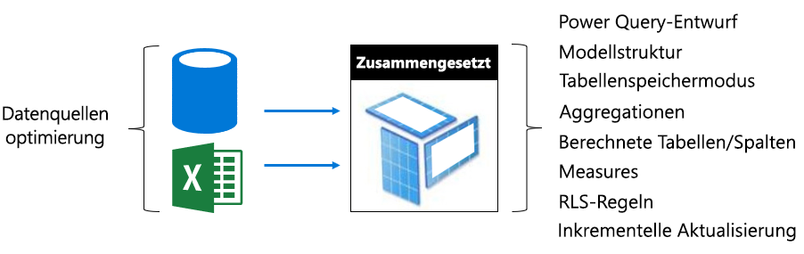

- Wenden Sie in der Regel die Themen "Optimierung" für Import- und DirectQuery-Modelle, auf zusammengesetzten Modells-Tabellen, die diese Speichermodi verwenden.
- In der Regel sich bemühen Sie, einen Entwurf mit Lastenausgleich zu erzielen, indem Sie Konfigurieren von Dimensionstyp Tabellen (für Geschäftseinheiten) als Dual-Modus und Faktentyp Speichertabellen (häufig große Tabellen, die betriebliche Fakten darstellt) als DirectQuery-Speichermodus. Dual-Speichermodus bedeutet, dass beide zu importieren und DirectQuery-Speichermodi und dadurch können die Power BI-Dienst, um zu bestimmen, die effizientesten-Speichermodus verwendet zur Erstellung einer systemeigenen Abfrage für Pass-Through.
- Sicherstellen Sie, dass Gateways ausreichende Ressourcen, vorzugsweise auf dedizierten Computern, die mit genügend Netzwerkbandbreite und in der Nähe zu den Datenquellen verfügen.
- Aggregationen Tabellen wird konfiguriert, wie Speicher Importmodus eindrucksvolle Abfrage leistungsverbesserungen bei der mit dem DirectQuery-Modus Faktentyp Speichertabellen zusammengefasst, liefern kann. In diesem Fall Aggregationstabellen werden die Größe des Modells sowie erhöhen Aktualisierungszeit, und dies ist häufig ein akzeptabler Kompromiss zu schnelleren Abfragen.

#### Optimieren von extern gehosteten Modellen

Viele optimierungsmöglichkeiten beschrieben, der [Optimizing Power BI-Hosted Modelle](#optimizing-power-bi-hosted-models) Thema gelten auch für Modelle, die mit Azure Analysis Services und SQL Server Analysis Services entwickelt. Löschen von Ausnahmen sind bestimmte Features, die derzeit nicht einschließlich zusammengesetzten Modelle und Aggregationstabellen unterstützt werden.

Eine weitere Überlegungen für extern gehostete Datasets ist eine Datenbank in Bezug auf Power BI-Dienst hostet. Für Azure Analysis Services bedeutet dies, erstellen die Azure-Ressource in der gleichen Region wie das Power BI-Mandant (home-Region). Für SQL Server Analysis Services für IaaS Dies bedeutet, dass den virtuelle Computer in derselben Region gehostet, und für lokale, es bedeutet, dass eine effiziente gatewaysetup sichergestellt.

Übrigens kann es sein, von Interesse sind, beachten Sie, dass Azure Analysis Services-Datenbanken und tabellarische SQL Server Analysis Services-Datenbanken erfordern, dass ihre Modelle vollständig in den Arbeitsspeicher geladen werden, dass sie es überhaupt bleiben Male auf, um Abfragen zu unterstützen. Wie im Power BI-Dienst muss es über ausreichend Arbeitsspeicher für aktualisiert, wenn es bei der Aktualisierung des Modells online bleiben muss. Im Gegensatz zu den Power BI-Dienst ist keine vorhanden, dass die Modelle in den Arbeitsspeicher gemäß Nutzung automatisch ersetzt werden. Power BI Premium bietet daher einen effizienteren Ansatz zur Maximierung des Modells Erstellen von Abfragen mit niedriger Auslastung des Speichers.

### Planen der Kapazität

Die Größe von einer Premium-Kapazität wird bestimmt, die Speicherplatz und Prozessorressourcen und Grenzwerte für die Kapazität. Die Anzahl der Premium-Kapazitäten wird auch berücksichtigt, wie das Erstellen mehrerer Premium Kapazitäten können Workloads voneinander zu isolieren. Beachten Sie, dass Speicher 100 TB pro kapazitätsknoten beträgt, und dies ist meist mehr als ausreichend für alle Workloads.

Ermitteln der Größe und Anzahl der Premium-Kapazitäten kann, insbesondere für die anfängliche Kapazitäten schwierig sein, die Sie erstellen. Der erste Schritt, wenn die erforderlichen Kapazitäten, die durchschnittlichen Workload, die Darstellung der erwartete täglichen Verwendung zu verstehen ist. Es ist wichtig zu verstehen, dass nicht alle arbeitsauslastungen gleich sind. Beispiel: an einem Ende einer Bandbreite - 100 gleichzeitige Benutzer, die Zugriff auf eine einzelne Berichtsseite, die ein einzelnes visuelles enthält ist einfach erreichbares. Noch - am anderen Ende des Spektrums - 100 gleichzeitige Benutzer, die Zugriff auf 100 verschiedene Berichte, jeweils mit 100 Visuals auf der Berichtsseite wird sehr unterschiedliche Anforderungen von kapazitätsressourcen stellen.

Kapazitätsadministratoren müssen daher viele Faktoren zu berücksichtigen, die spezifisch für Ihre Umgebung, die Inhalte und die erwartete Nutzung. Das Überschreiben wird, zugleich konsistente Abfragezeiten akzeptablen Wartezeiten und entfernungsraten Ausnutzung der Speicherkapazität zu maximieren. Zu berücksichtigende Faktoren können umfassen:

- **Modellieren Sie Größe und Merkmale** : Importmodelle muss vollständig geladen ist, in den Arbeitsspeicher können Abfragen oder aktualisieren. LC/DQ-Datasets können erhebliche Prozessorzeit und möglicherweise erheblichen Speicherplatz zum Auswerten von komplexen Measures oder RLS-Regeln erforderlich. Arbeitsspeicher und Prozessorgröße und abfragedurchsatz LC/DQ werden durch die Größe der Kapazität beschränkt.
- **Gleichzeitige aktive Modelle** : Das gleichzeitige Abfragen der verschiedenen importmodelle liefert beste Reaktionsfähigkeit und Leistung, wenn sie im Speicher verbleiben. Es sollte genügend Arbeitsspeicher, um alle häufig abgefragte Modelle mit zusätzlichen Arbeitsspeicher für die datenaktualisierung zu hosten.
- **Aktualisierung des Modells Import** : Der Aktualisierungstyp (vollständig oder inkrementell), die Dauer und Komplexität von Power Query-Abfragen und berechnete Tabelle/Spalte-Logik können an Arbeitsspeicher und insbesondere die prozessorauslastung auswirken. Gleichzeitige Aktualisierungen werden durch die Größe der Kapazität (1,5 X backend V-Kerne, aufgerundet) beschränkt.
- **Gleichzeitige Abfragen** : Viele gleichzeitige Abfragen können dazu führen in nicht reagiert wird berichtet, wenn Prozessor oder LC/DQ-Verbindungen überschreitet den Grenzwert von Kapazität. Dies gilt insbesondere für Berichtsseiten, die viele visuelle Elemente enthalten.
- **Datenflüsse, paginierte Berichte und KI-Funktionen** : Die Kapazität kann konfiguriert werden, um Datenflüsse, paginierte Berichte und KI-Funktionen, mit jeder erfordert einen konfigurierbaren maximalen Prozentsatz der Speicherkapazität zu unterstützen. Arbeitsspeicher wird dynamisch zugewiesen, um Datenflüsse, jedoch ist er statisch zugeordnet, paginierte Berichte und die AI-arbeitsauslastung.

Zusätzlich zu dieser Faktoren kann Kapazitätsadministratoren erwägen, mehrere Kapazitäten zu erstellen. Mehrere Kapazitäten ermöglichen die Isolierung von Workloads und können konfiguriert werden, um sicherzustellen, dass Kritischer arbeitsauslastungen garantiert, dass Ressourcen haben. Beispielsweise können zwei Kapazitäten erstellt werden, um geschäftskritische Workloads vom Self-service-BI (SSBI)-Workloads zu trennen. Die unternehmenskritischen Kapazität kann verwendet werden, um große Unternehmen Modelle bereit, mit garantierten Ressourcen, mit der Erstellung der Zugriff gewährt, die nur für die IT-Abteilung zu isolieren. Die Kapazität SSBI kann zu einem host eine wachsende Anzahl von kleineren Modellen mit Zugriff erteilt für Wirtschaftsanalytiker verwendet werden. Die Kapazität SSBI treten möglicherweise gelegentlich Abfrage oder Aktualisierung Wartevorgänge, die akzeptiert werden.

Im Laufe der Zeit kann Kapazitätsadministratoren Arbeitsbereiche auf Kapazitäten durch das Verschieben von Inhalten zwischen Arbeitsbereichen oder zwischen Kapazitäten-Arbeitsbereiche und skalieren Kapazitäten, oben oder unten zu verteilen. Im Allgemeinen zum Hosten von größeren skalieren Modelle, die Sie eingerichtet ist und für höhere Parallelität zu erzielen Sie Skalierung horizontal.

Denken Sie daran, dass Erwerb einer Lizenz des Mandanten mit der V-Kerne zur Verfügung. Der Kauf von einer **P3** -Abonnement verwendet werden kann, erstellen, oder bis zu vier Premium-Kapazitäten, d. h. 1 x P3 oder 2 x P2 oder 4 x P1. Darüber hinaus können vor dem Upsizing eine P2-Kapazität P3 Kapazität berücksichtigt werden, um die V-Kerne aufteilen zwei P1-Kapazitäten zu erstellen.

### Testen von Vorgehensweisen

Sobald eine Kapazitätsgröße entschieden wird, kann Tests ausgeführt werden, durch das Erstellen einer kontrollierten Umgebung. Eine praktische und eine wirtschaftliche Option ist die Erstellung einer Kapazitäten in Azure (A-SKUs), beachten Sie, dass eine P1-Kapazität auf die gleiche Größe wie eine A4-Kapazität, mit dem P2 ist und P3-Kapazitäten die gleiche Größe wie die Kapazitäten A5 und A6 jeweils. Azure-Kapazitäten können schnell erstellt werden und werden auf Stundenbasis in Rechnung gestellt. Also nach Tests abgeschlossen wurden, können sie problemlos gelöscht werden, um verwendungsgebühren Kosten.

Der Testinhalt auf der Azure-Kapazität erstellten Arbeitsbereiche im Rahmen hinzugefügt werden kann, und klicken Sie dann als einen einzelnen Benutzer kann Berichte ausführen, um eine realistische und repräsentativen arbeitsauslastung mit Abfragen zu generieren. Wenn importmodelle vorhanden sind, sollte auch eine Aktualisierung für jedes Modell ausgeführt werden. Überwachungstools kann dann verwendet werden, überprüfen Sie alle Metriken, um die Ressourcenverwendung zu verstehen.

Es ist wichtig, dass die Tests wiederholt werden: Tests sollten mehrere Male ausgeführt werden, und sie sollten jedes Mal, etwa das gleiche Ergebnis liefern. Durchschnittlich diese Ergebnisse kann dann extrapolieren können und schätzen die Workload unter Produktionsbedingungen "true" verwendet werden.

Erwägen Sie die Entwicklung eines Auslastungstests, die Anwendung zur Simulation einer realistischen arbeitsauslastung, um einen Belastungstest zu generieren. Einzelheiten hierzu werden über den Rahmen dieses Whitepapers. Weitere Informationen einschließlich ein Codebeispiel finden Sie in der [Load Tests von Power BI Anwendungen mit Visual Studio-Auslastungstests](https://blogs.msdn.microsoft.com/charles_sterling/2018/04/04/webinar-load-testing-power-bi-applications-with-visual-studio-load-test/) Webinar.

## Untersuchen der Praxis – Szenarien

In diesem Abschnitt werden einige reale Szenarien eingeführt werden, um häufig auftretende Probleme oder Herausforderungen, wie Sie sie zu identifizieren und wie Sie zu deren Behebung zu beschreiben:

- [Datasets auf dem neuesten Stand halten](#keeping-datasets-up-to-date)
- [Identifizieren langsame Reaktion datasets](#identifying-slow-responding-datasets)
- [Identifizieren von Ursachen für sporadisch langsam reagieren Datasets](#identifying-causes-for-sporadically-slow-responding-datasets)
- [Bestimmt, ob genügend Arbeitsspeicher](#determining-whether-there-is-enough-memory)
- [Bestimmt, ob genügend CPU](#determining-whether-there-is-enough-cpu)

Die Schritte, anhand von Beispielen, Diagramm und Tabelle stammen aus der **Power BI Premium-Kapazität Metriken App** (app), dass ein Power BI-Administrator Zugriff zu erhalten.

### Beibehalten von Datasets bis Datum

In diesem Szenario wurde eine Untersuchung ausgelöst, wenn Benutzer sich darüber beschwert, dass Berichtsdaten wird manchmal "veraltete" werden angezeigt.

In der app interagiert der Administrator die **aktualisiert** visuelle Element, und Sortieren von Datasets durch die **Max. Wartezeit** Statistiken in absteigender Reihenfolge. Auf diese Weise kann anzuzeigen, dass die Datasets, die die längste haben, gruppiert nach dem Namen des Arbeitsbereichs Wartezeiten.

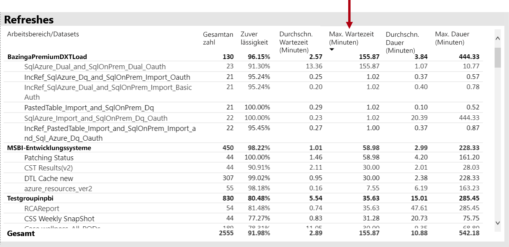

Darüber hinaus werden in der **stündlichen durchschnittliche aktualisieren warten Sie, wie oft** visual, sie feststellen, dass die Aktualisierung Wartezeiten konsistent rund um 16 Uhr täglich spitzenauslastung.

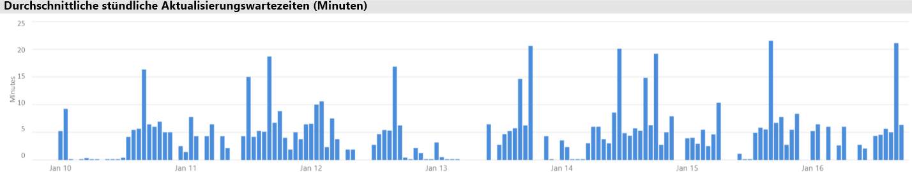

Es gibt mehrere mögliche Erklärungen für diese Ergebnisse:

- Zu viele Aktualisierungsversuchen können zur gleichen Zeit, durchgeführt werden überschreitet die Grenzwerte der Kapazität-Knoten (sechs gleichzeitige Aktualisierungen auf eine P1 mit Standard-speicherbelegung)

- Datasets aktualisiert werden möglicherweise zu groß für verfügbare Speicher (und erfordert mindestens 2 x den erforderlichen Speicher für die vollständige Aktualisierung)
- Ineffiziente Power Query-Logik kann in eine Auslastungsspitze von Arbeitsspeicher während der Datasetaktualisierung resultierende sein. Für eine ausgelastete Kapazität kann dadurch gelegentlich die physische Grenze, die Aktualisierung fehlschlägt, und möglicherweise Auswirkungen auf andere Vorgänge Bericht anzeigen, auf die Kapazität erreichen.
- Häufig abgefragte Datasets, die im Speicher verbleiben müssen, beeinträchtigen die Fähigkeit eines anderen Datasets, die aufgrund von begrenzt verfügbaren Arbeitsspeicher aktualisieren

Damit können dies untersuchen, sehen die Power BI-Administrator für:

- Unzureichender Arbeitsspeicher zum Zeitpunkt der datenaktualisierung, wenn Speicherplatz weniger als 2 x die Größe des Datasets aktualisiert werden müssen ist
- Datasets, wurden nicht aktualisiert werden und wurden nicht im Arbeitsspeicher vor der Aktualisierung, aber der begonnen hat, um interaktive Datenverkehr während hohe Aktualisierungszeiten anzuzeigen. Um festzustellen, welche Datasets in den Arbeitsspeicher zu jedem Zeitpunkt einer Power BI geladen wurden sehen sich Administratoren im Bereich "Datasets" des **Datasets** Registerkarte in der app und Cross-Filter zu einem bestimmten Zeitpunkt durch Klicken auf einen Balken in den **pro Stunde Laden von Dataset-Anzahl**. Eine lokale Spitze (in der folgenden Abbildung dargestellt) gibt an, eine Stunde, wenn mehrere Datasets in den Arbeitsspeicher geladen wurden dem Start der geplanten Aktualisierungen verzögern kann
- Erhöhte Dataset entfernungen dauert platzieren, wenn es sich bei datenaktualisierungen geplant sind, gestartet wurde, der angibt, gab es hoher arbeitsspeicherauslastung durch zu viele verschiedene interaktive Berichte vor dem Zeitpunkt der Aktualisierung verarbeitet verursacht. Die **stündlichen Dataset Entfernungen und Arbeitsspeichernutzung** Visual kann Spitzen in der entfernungen eindeutig anzugeben.

Die folgende Abbildung zeigt eine lokale Spitze in der geladenen Datasets, das bedeutet, dass interaktive Abfragen verzögert Anfang aktualisiert. Wählen einen Zeitraum auf die **stündlichen geladen Dataset zählt** Visual kreuzt Filter die **Größe des Datasets beseitigt** visual.

Power BI-Administrator versuchen, das Problem zu beheben, indem Sie Schritte ausführen, um sicherzustellen, dass ausreichend Arbeitsspeicher für datenaktualisierungen zunächst verfügbar ist:

- Kontaktaufnahme mit dem Dataset datenaktualisierung Besitzer und aufgefordert, zu staffeln Daten trennen Zeitpläne
- Verkleinern Datasets Kacheln durch Abfragen verursachte Last durch das Entfernen unnötiger Dashboards oder Dashboard, besonders solche, die Sicherheit auf Zeilenebene zu erzwingen.
- Beschleunigen der datenaktualisierungen durch Optimieren der Power Query-Logik, Modell berechnete Spalten oder Tabellen, Reduzieren der Größe des Datasets beseitigt und die Konfigurierung von größeren Datasets zum Durchführen von inkrementeller Daten aktualisieren

### Identifizieren langsame Reaktion Datasets

In diesem Szenario wurde eine Untersuchung ausgelöst, wenn Benutzer sich darüber beschwert, dass bestimmte Berichte öffnen, lange dauerte und zuweilen mehr reagierte.

In der app kann der Power BI-Administrator mithilfe der **Abfragedauern** das visuelle Element an die schlechteste Leistung Datasets zu bestimmen, indem Sie das Sortieren von Datasets nach absteigender **Durchschnittsdauer**. Dieses visuelle Element wird auch Dataset Anzahl von Abfragen, damit Sie sehen, wie oft die Datasets abgefragt werden.

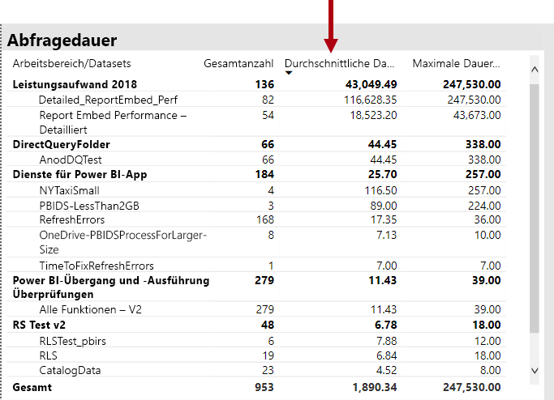

Power BI-Administrator kann, finden Sie in der **Abfrage Dauerverteilung** Visualisierung zeigt ein gesamtverteilung von Buckets abfrageleistung (< = 30ms, 0 – 100 ms, usw.) für den gefilterten Zeitraum. Im Allgemeinen Abfragen akzeptieren einer Sekunde oder weniger werden von den meisten Benutzern reaktionsfähig berücksichtigt Abfragen, die länger dauern tendenziell eine Vorstellung von schlechte Leistung erstellen.

Die **Verteilung der Dauer für die stündliche Abfrage** Visual kann der Administrator Power BI ein-Stunden-Zeiträume zu identifizieren, wenn die Leistung der Kapazität kann haben wurde erkannt, die als schlechter. Je größer Segmente die Leiste der Abfrage darstellen Dauer von mehr als einer Sekunde, je größer das Risiko, dass Benutzer eine schlechte Leistung wahrgenommen werden.

Das visuelle Element ist interaktiv, und wenn ein Segment des Balkens aktiviert ist, den entsprechenden **Abfragedauern** tabellenvisual auf der Berichtsseite ist kreuzgefiltert Datasets angezeigt, dar. Power BI-Administrator auf einfache Weise identifizieren, die diese kreuzfilterung ermöglicht die Datasets langsam reagiert.

Die folgende Abbildung zeigt eine Visualisierung gefiltert nach **stündlichen Abfrage Dauer Verteilungen**die schlechteste Leistung Datasets in einer Stunde Buckets Schwerpunkt. 

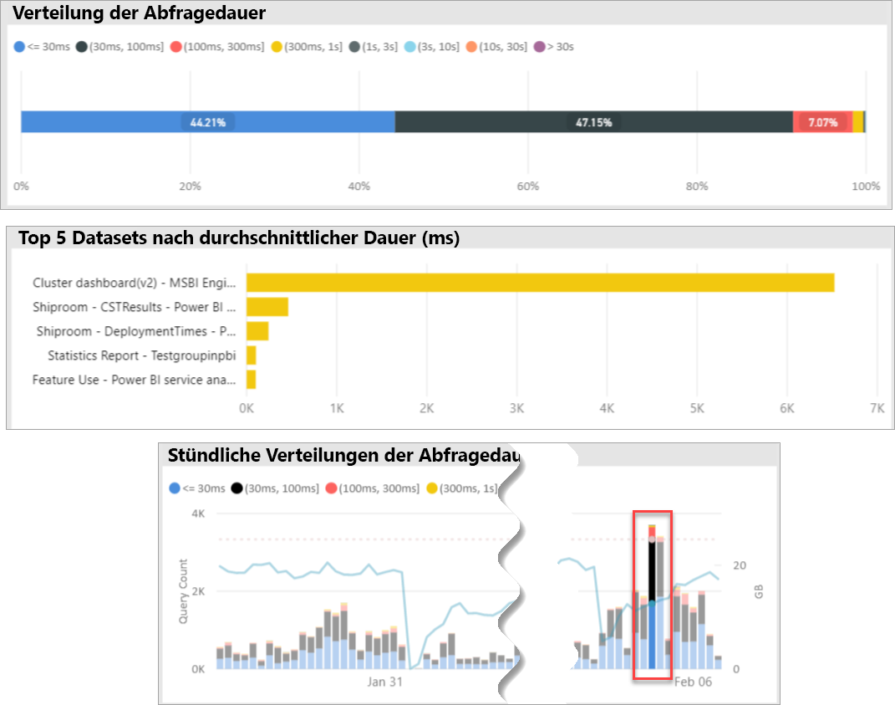

Nachdem das schlechtere Leistung-Dataset in einen bestimmten Zeitraum von 1 Stunde identifiziert wurde, kann Power BI-Administrator überprüfen Sie, ob eine schlechte Leistung, wenn eine überladene Kapazität verursacht wird oder aufgrund einer fehlerhaft, Dataset oder Bericht entwickelt. Um dies zu erreichen, können sie verweisen auf die **Abfrage warten Sie, wie oft** Visual und Sortieren von Datasets nach absteigender Durchschnittliche Abfragewartezeit. Wenn ein großer Prozentsatz der Abfragen warten, ist für das Dataset ein hoher Bedarf an wahrscheinlich die Ursache für die vielen Abfrage wartet. Die durchschnittliche Zeit "Abfragewartezeit" ist eine wesentliche (> 100 ms), könnte nicht Schaden überprüfen das Dataset und den Bericht, um festzustellen, ob Optimierungen vorgenommen werden können. Vielleicht weniger Visualisierungen auf angenommen, Seiten des Berichts oder einer DAX-Ausdruck-Optimierung.

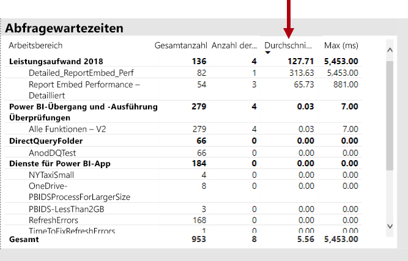

Es gibt mehrere mögliche Gründe für Query Wait Time erstellen in Datasets:

- Ein nicht optimaler Modellentwurf, Measureausdrücke oder sogar den Berichtsentwurf - alle Umstände, die über mitwirkungsrechte lang andauernde Abfragen, die hohe CPU nutzen. Dies erzwingt, dass neue Abfragen warten, bis die CPU-Threads verfügbar, und erstellen einen Konvoi-Effekt (Stellen Sie sich datenverkehrsstau), während der Hauptgeschäftszeiten häufig gesehen. Die **Abfragewartevorgänge** Seite werden die Haupt-Ressourcenskriptdatei zu bestimmen, ob die Datasets hohe durchschnittliche abfragewartezeiten enthalten.
- Eine hohe Anzahl von gleichzeitigen Kapazität Benutzer (Hunderte oder Tausende) nutzen, den gleichen Bericht oder Dataset. Sogar ausgereifte Datasets können einen Schwellenwert für die Parallelität ausführen. Dies wird in der Regel durch ein einzelnes Dataset einen deutlich höheren Wert angezeigt, für die Abfrage als andere Datasets anzeigen zählt angegeben (d. h. 300 KB Abfragen für ein Dataset gegenüber < 30 KB-Abfragen für alle anderen Datasets). An einem bestimmten Punkt, der die Abfrage wartet, für dieses Dataset gestartet wird, um staffeln, und dies Sie in finden wird der **Abfragedauern** visual.
- Viele verschiedene Datasets gleichzeitig abgefragt speicherüberlastung verursachen, da Datasets häufig in den Arbeitsspeicher durchlaufen. Dies führt dazu, dass Benutzer, die Leistungseinbußen auftreten, wenn das Dataset in den Arbeitsspeicher geladen wird. Um dies zu bestätigen, Power BI-Administrator kann finden Sie unter den **stündlichen Dataset Entfernungen und Arbeitsspeichernutzung** visual, die möglicherweise eine große Anzahl von Datasets in den Arbeitsspeicher geladen wird wiederholt entfernt werden.

### Identifizieren von Ursachen für sporadisch langsam reagieren Datasets

In diesem Szenario wurde eine Untersuchung ausgelöst, wenn Benutzer beschrieben, dass der Bericht, den visuellen Elementen in einigen Fällen sind der Ansicht, die erst langsam reagieren oder konnte nicht mehr reagiert, aber in anderen Fällen diese Auswirkung in akzeptabler Weise reagiert wurden.

Innerhalb der app die **Abfragedauern** Abschnitt wurde verwendet, um die Ursache Dataset wie folgt suchen:

- In der **Abfragedauern** visual der Administrator gefilterte Dataset von Dataset (beginnend mit dem obersten abgefragte Datasets) und untersucht die übergreifende gefilterte Balken in den **stündlichen Abfrage Verteilungen** visual.
- Wenn ein einstündigen Balken bedeutende Änderungen des Verhältnisses zwischen allen Abfragegruppen Dauer im Vergleich zu anderen Balken, eine Stunde für dieses Dataset wurde (d. h. das Verhältnis zwischen der Farben, ändert sich erheblich), es bedeutet, dass dieses Dataset veranschaulicht eine sporadische Änderung die Leistung.
- Zeigt einen unregelmäßigen Teil der Abfragen mit schlechter Leistung, eine Stunde Balken angezeigt ein TimeSpan-Objekt, in denen das Dataset durch einen konkurrierenden Effekt, durch andere Datasets Aktivitäten verursacht betroffen war.

Die folgende Abbildung zeigt eine Stunde am 30. Januar mit erheblichen preisgünstiger leistungsregression eines Datasets Fehler, angegeben durch die Größe des "(3,10s]"Ausführung Dauer Buckets. Klicken Sie auf diese Leiste einstündigen zeigt alle Datasets in den Arbeitsspeicher geladen werden, während dieser Zeit stellt daher die Candidate Ursache-Datasets den noisy-Neighbor-Effekt verursachen.

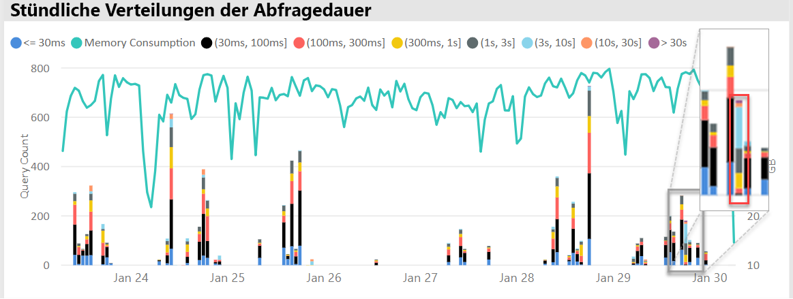

Nachdem ein problematisch TimeSpan-Objekt (d. h. während Jan 30 in der Abbildung oben) identifiziert wurde kann Power BI-Administrator entfernen Sie alle datasetfilter anschließend filtern Sie nur nach dieser Zeitspanne, um zu bestimmen, welche Datasets während dieser Zeit aktiv abgefragt wurden. Das Dataset Ursache für den Effekt noisy-Neighbor ist normalerweise auf, des oberen abgefragte Datasets oder die Woche mit die längste durchschnittliche Abfragedauer.

Eine Lösung für dieses Problem könnte sein, um die Ursache zu verteilen, die Datasets, die über unterschiedliche Arbeitsbereiche auf verschiedenen Premium-Kapazitäten oder gemeinsam genutzte Kapazität, wenn der Datasetgröße, Verbrauch Anforderungen und Daten aktualisieren Muster unterstützt werden.

Das Gegenteil könnte auch "true" sein. Power BI-Administrator konnte identifizieren Mal, wenn ein Dataset-abfrageleistung erheblich verbessert, und suchen Sie nach, was nicht mehr vorhanden. Wenn bestimmte Informationen an diesem Punkt fehlt, können, die um auf das Problem zu verweisen.

### Bestimmen, ob genug Speicher steht

Bestimmt, ob genügend für die Kapazität Arbeitsspeicher um seine Workloads abzuschließen, Power BI-Administrator kann finden Sie unter den **Arbeitsspeicherprozentsätze verbraucht** in visual die **Datasets** Registerkarte der app. **Alle** (gesamt) Arbeitsspeicher darstellt, die speicherbelegungen, die durch Datasets, die in den Arbeitsspeicher, unabhängig davon, ob diese aktiv abgefragt oder verarbeitet werden geladen. **Aktive** Arbeitsspeicher darstellt, die speicherbelegungen, die durch Datasets, die aktiv verarbeitet werden.

In einer fehlerfreien Kapazität das visuelle Element aussehen wird, zeigt eine Lücke zwischen allen (gesamt) und den aktiven Arbeitsspeicher:

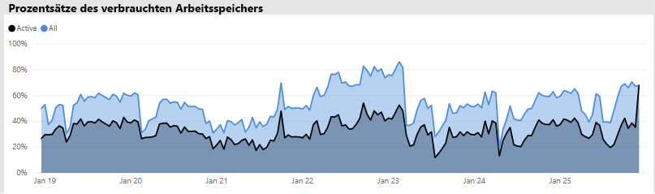

In einer Kapazität arbeitsspeicherauslastung auftritt zeigt dasselbe visuelle deutlich aktiven Arbeitsspeicher und Gesamtarbeitsspeicher konvergieren, was bedeutet, dass es nicht möglich, weitere Datasets zu diesem Zeitpunkt in den Arbeitsspeicher geladen ist. In diesem Fall kann die Power BI-Administrator klicken **Kapazität neu starten** (in **erweiterte Optionen** der Bereich "Kapazität Einstellungen" des Verwaltungsportals). Neu starten die Ergebnisse für die Kapazität wird für alle Datasets aus dem Speicher geleert und ermöglicht ihnen, in den Arbeitsspeicher gemäß der Vorgabe (Abfrage- oder datenaktualisierungsanforderungen) neu zu laden.

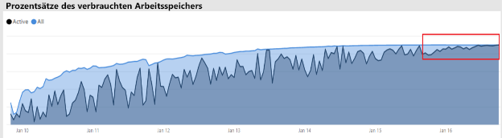

### Bestimmen, ob es ist ausreichend CPU

Im Allgemeinen sollte eine Kapazität für die durchschnittliche CPU-Auslastung unter 80 % bleiben. Diesen Wert überschreiten, bedeutet, dass die Kapazität annähert, die die CPU-Auslastung ist.

Auswirkungen der CPU-Auslastung wird durch Vorgänge dauert länger, als sie aufgrund der Kapazität, die viele CPU-Kontextwechsel durchführen sollten, da es versucht, alle Vorgänge zu verarbeiten. Warten Sie Zeiten, in einer Premium-Kapazität mit einer hohen Anzahl gleichzeitiger Abfragen, die dies durch hohe Abfrage angegeben ist. Eine Folge von hohem Wartezeiten ist langsamer Reaktionsfähigkeit als üblich. Power BI-Administrator kann ganz einfach ermitteln, wenn die CPU Kapazität, anhand erschöpft ist der **stündlichen Abfrage warten Zeit Verteilungen** visual. Periodische Spitzen der Abfrage die Wartezeit Anzahl potenzieller die CPU-Auslastung angeben.

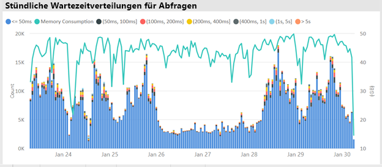

Ein ähnliches Muster kann manchmal in Hintergrundvorgänge erkannt werden, wenn sie auf die CPU-Auslastung beitragen. Ein Power BI-Administrator finden für ein periodischer Anstieg der Aktualisierungen auf Zeiten für ein bestimmtes Dataset, in der angeben kann, dass Sie die CPU-Auslastung, die zum Zeitpunkt (möglicherweise aufgrund eines anderen laufenden Dataset aktualisiert und/oder interaktive Abfragen). In diesem Fall auf die **System** Ansicht der app nicht unbedingt ergibt möglicherweise, dass die CPU bei 100 % liegt. Die **System** zeigt stündlichen Durchschnittswerte, jedoch die CPU kann werden ausgelastet mehrere Minuten lang, der intensive Vorgänge, die wird als Spitzen im Wartezeiten.

Es gibt weitere Details in Bezug auf die Auswirkungen der CPU-Auslastung anzeigen. Während die Anzahl der Abfragen, die warten wichtig ist, wird Abfragewartezeit immer zu einem gewissen Grad ausgeführt, ohne dass eine Verringerung der wahrnehmbaren Leistung. Einige Datasets (mit längere Durchschnittliche Abfragezeit, der angibt, Komplexität oder Größe), sind anfälliger für die Auswirkungen der CPU-Auslastung als andere. Um diese Datasets ganz einfach identifizieren zu können, sehen sich Power BI-Administrator für die Änderungen in der Zusammensetzung der Farbe der Balken in den **pro Stunde warten Verteilung** visual. Nach dem Ermitteln einer Leiste Ausreißer, können sie die Datasets, die Abfrage wartet, während dieser Zeit musste suchen und betrachten Sie auch die Durchschnittliche Abfragewartezeit verglichen, um die durchschnittliche Abfragedauer. Wenn diese beiden Metriken von der gleichen Größe werden und die abfragearbeitsauslastung für das Dataset nicht trivial ist, ist es wahrscheinlich, dass das Dataset nicht genügend CPU-Nutzung beeinträchtigt wird.

Dieser Effekt kann besonders offensichtlich sein, wenn ein Dataset in kurze Bursts sehr häufig Abfragen von mehreren Benutzern (z. B. in einer Schulung), wodurch die CPU-Auslastung während jeder Burst-genutzt wird. In diesem Fall können erhebliche abfragewartezeiten für dieses Dataset auftreten können, sowie für andere Datasets in der Kapazität (Auswirkung noisy-Neighbor) beeinträchtigt wird.

In einigen Fällen können Power BI-Administratoren fordern Sie die Besitzer von Datasets einen weniger Erstellung flüchtige abfragearbeitsauslastung durch Erstellen eines Dashboards (welche Abfragen regelmäßig mit der ein Dataset aktualisieren für zwischengespeicherte Kacheln) anstelle eines Berichts. Dies kann helfen, Spitzen zu verhindern, wenn das Dashboard geladen wird. Diese Lösung möglicherweise immer möglich, dass die angegebene geschäftsanforderungen, nicht jedoch eine effektive Möglichkeit, um die CPU-Auslastung zu vermeiden, ohne dass auf das Dataset ändern können.

## Fazit

Power BI Premium bietet eine einheitlichere Leistung, Unterstützung für große Datenmengen und die Flexibilität, eine einheitliche Self-Service- und Enterprise-BI-Plattform für alle Benutzer in Ihrer Organisation. Diese Stufe 300 technischen Whitepaper wurde speziell für Power BI-Administratoren und Autoren von Inhalten und Herausgeber geschrieben. Es zielt darauf ab, um diese das volle Potenzial von Power BI Premium besser zu verstehen und zu entwerfen, bereitstellen, überwachen und Behandeln von skalierbaren Lösungen erläutert.

Zum Bereitstellen und Verwalten von Power BI Premium-Kapazitäten, Administratoren und Entwickler benötigen ein sehr gutes Verständnis der Funktionsweise Kapazitäten-Funktion, wie sie verwaltet und überwacht werden können und wie Modelle optimiert werden können, um angemessen zu reagieren, Leistungsprobleme und Engpässe sollten diese auftreten.

## End-Hinweise

\[1\] technischen Artikel betrifft das Power BI Premium die nur vom Power BI-Cloud-Dienst unterstützt werden und Power BI-Berichtsserver ist mit einigen enthalten, damit Power BI-Berichtsserver nicht im Bereich, mit Ausnahme von Zustand, die die Lizenz erforderlich befindet, um die Installation Power BI Premium-SKUs.

\[2\] Power BI als Cloud-Dienst bei der zum Einbetten von Inhalten für Anwendungsbenutzer verwendet wird, Platform-as-a-Service (PaaS). Diese Art von Einbettung kann mit anderen Produkten, erreicht werden, von denen Power BI Premium ist.

\[3\] per Push übertragen, streaming und Hybrid-Datasets werden nicht im Premium-Kapazitäten gespeichert und sind daher keine wichtige Überlegung beim Bereitstellen, verwalten und Überwachen von Premium-Kapazitäten.

\[4\] Excel-Arbeitsmappen als einen Inhaltstyp mit Power BI werden nicht im Premium-Kapazitäten gespeichert und sind daher nicht berücksichtigt bei der Bereitstellung, Verwaltung oder Überwachung der Premium-Kapazitäten.

\[5\] Visuals können so konfiguriert werden, dass um Datenschnitt-Interaktionen zu ignorieren. Weitere Informationen finden Sie in der [Interaktionen mit Visualisierungen in Power BI-Berichten](service-reports-visual-interactions.md) Dokument.

\[6\] der Unterschied in der Größe bestimmt werden kann, indem Sie die Größe des Power BI Desktop-Datei mit dem Task-Manager Speicher unter Verwendung der Datei vergleichen.

\[7\] Unterstützung für Microsoft-Datenquellen gehören SQL Server, Azure der databricks-Instanz, Azure HDInsight Spark (Beta), Azure SQL-Datenbank und Azure SQL Data Warehouse. Informationen zu zusätzlichen Quellen, finden Sie in der [von DirectQuery in Power BI unterstützte Datenquellen](desktop-directquery-data-sources.md) Dokument.

\[8\] Power BI Premium unterstützt das Hochladen einer Datei Power BI Desktop (.pbix) bis zu einem Maximum von 10 GB groß. Nach dem hochladen kann ein Datasets bis zu 12 GB Größe als Ergebnis der Aktualisierung anwachsen. Maximale Uploadgröße variiert je nach SKU. Weitere Informationen finden Sie in der [Power BI Premium-Unterstützung für große Datasets](service-premium-large-datasets.md) Dokument.

\[9\] SKUs mit weniger als vier V-Kerne nicht auf dedizierte Infrastruktur ausgeführt werden. Dies schließt die EM1, EM2, A1 und A2-SKUs.

\[10\] zwar selten, können Modelle aus dem Arbeitsspeicher aufgrund von Dienstvorgängen entladen werden.

\[11\] diese Zeitangaben jederzeit geändert werden.

\[12\] Dies wird als Multi-Geo Capabilities, gegenwärtig im vorschaustadium bezeichnet. Der Grund für eine Multi-Geo Capabilities-Bereitstellung ist in der Regel für Unternehmen oder Government-Compliance, anstatt der Leistung und Skalierung. Bericht und das Dashboard laden umfasst weiterhin Anforderungen an den Startbereich für Metadaten an. Weitere Informationen finden Sie in der [Multi-Geo-Unterstützung für Power BI Premium (Vorschau)](service-admin-premium-multi-geo.md) Dokument.

\[13\] es ist möglich, dass Benutzer durch Überladen von Power BI-Dienst mit Aufträgen, übermäßig komplexe Abfragen zu schreiben, Erstellen von Zirkelverweisen usw. zu Leistungsproblemen führen können.

\[14\] die Option zum Zuweisen der Arbeitsbereiche der gesamten Organisation wird nicht empfohlen, und es wird ein gezielterer Ansatz bevorzugt. Im Allgemeinen ist es nicht empfohlen, persönlichen Arbeitsbereiche für Produktions-Inhalt verwenden.

\[15\] es ist möglich, A-SKUs in der app oder im Azure-Portal, aber nicht in der Power BI-Verwaltungsportal überwachen. Um A-SKUs zu überwachen, schlägt die Aktualisierung des Berichts, wenn die app nicht die Rolle "Leser" der Ressource hinzugefügt wurde. Weitere Informationen finden Sie in der [Monitor Power BI Premium und Power BI Embedded-Kapazitäten](service-admin-premium-monitor-capacity.md) Dokument.

\[16\] Aktualisierungen können warten, wenn nicht genügend CPU- oder Arbeitsspeicherressourcen, um zu starten.

\[17\] die Größe des Datasets im Arbeitsspeicher kann größer sein als die Größe auf dem Datenträger von bis zu 20 %.

\[18\] durchschnittliche Speicherauslastung (GB) und höchste Arbeitsspeichernutzung (GB)

\[19\] Dataset entfernungen

\[20\] Datasetabfragen, Dataset durchschnittliche Abfragedauer (ms), Datasets zu warten, Anzahl und Durchschnitt von Dataset-Wartezeit (ms)

\[21\] Anzahl von hoher CPU-Auslastung und CPU-Zeit der höchsten Auslastung (in den letzten sieben Tage)

\[22\] DQ/LC hohe Auslastung Anzahl und den DQ/LC-Zeitpunkt der höchsten Auslastung (in den letzten sieben Tage)