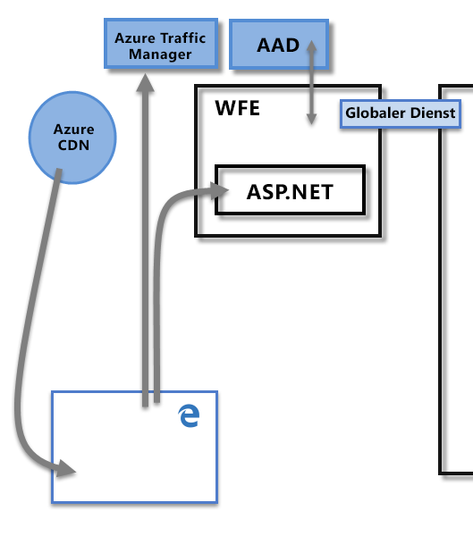
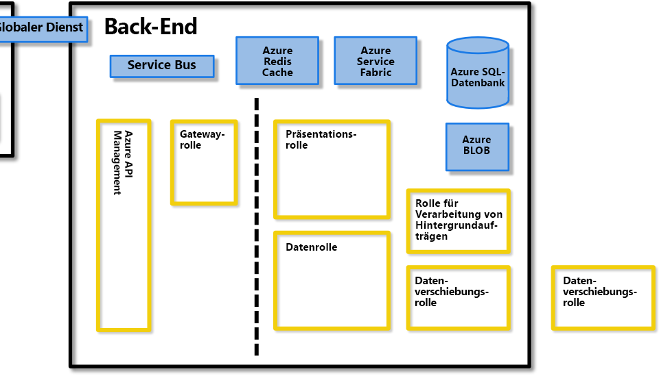
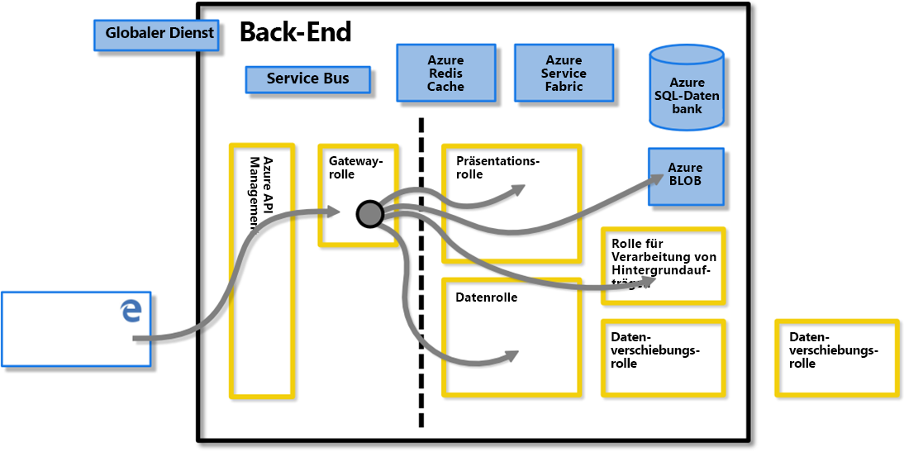
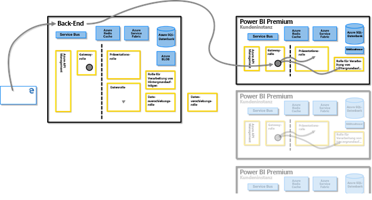
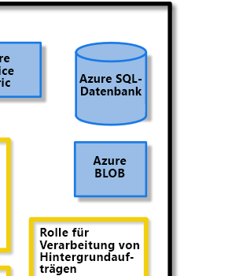
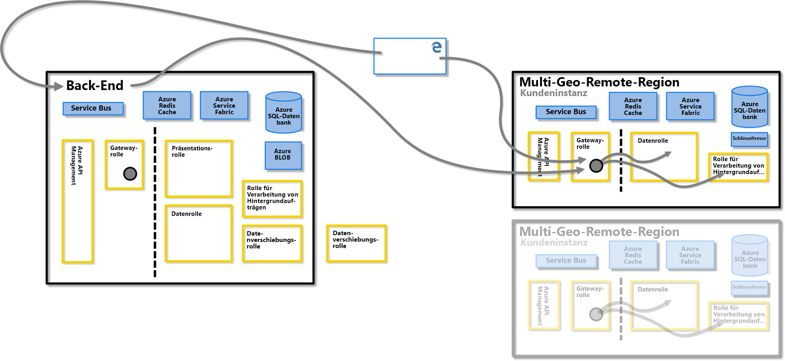
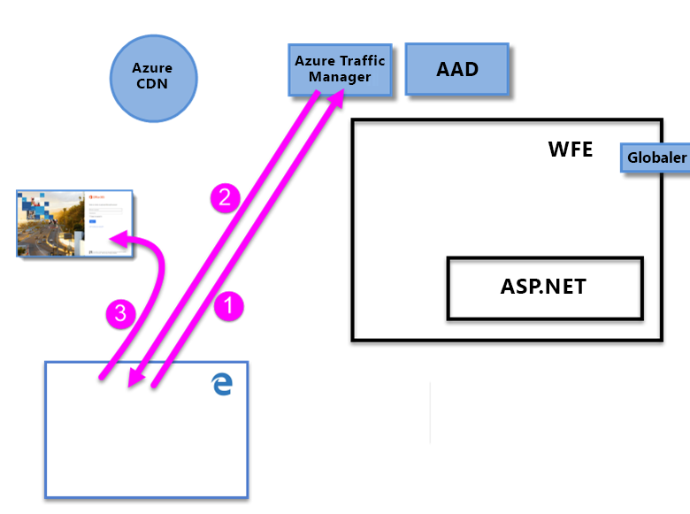
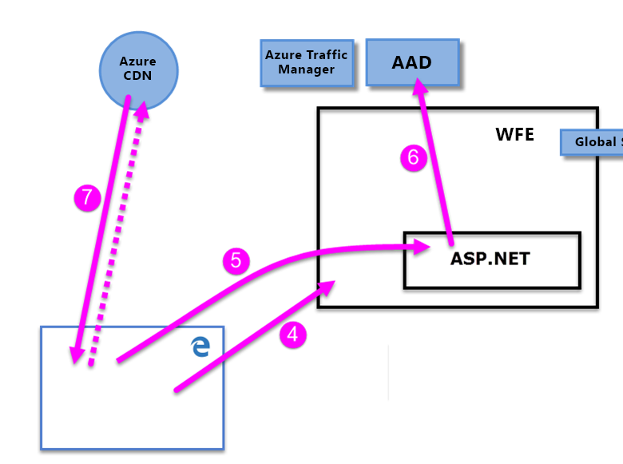

# Whitepaper zur Sicherheit in Power BI

**Zusammenfassung:** Power BI ist ein Onlinesoftwaredienst (*SaaS* oder Software-as-a-Service) von Microsoft, mit dem Sie ganz unkompliziert und schnell Self-Service-Business Intelligence-Dashboards, -Berichte, -Datasets und Visualisierungen erstellen können. Mithilfe von Power BI können Sie eine Verbindung mit vielen verschiedenen Datenquellen herstellen, Daten aus diesen Verbindungen kombinieren und formen und anschließend Berichte und Dashboards erstellen, die Sie mit anderen teilen können.

**Autor:** David Iseminger

**Technische Reviewer:** Pedram Rezaei, Cristian Petculescu, Siva Harinath, Tod Manning, Haydn Richardson, Adam Wilson, Ben Childs, Robert Bruckner, Sergei Gundorov, Kasper de Jonge

**Gilt für:** Power BI-SaaS, Power BI Desktop, Power BI Embedded, Power BI Premium

> [!NOTE]
> Sie können dieses Whitepaper speichern oder ausdrucken, indem Sie in Ihrem Browser erst auf **Drucken** und dann auf **Als PDF speichern** klicken.

## Einführung

**Power BI** ist ein Onlinesoftwaredienst (_SaaS_ oder Software-as-a-Service) von Microsoft, mit dem Sie ganz unkompliziert und schnell Self-Service-Business Intelligence-Dashboards, -Berichte, -Datasets und Visualisierungen erstellen können. Mithilfe von Power BI können Sie eine Verbindung mit vielen verschiedenen Datenquellen herstellen, Daten aus diesen Verbindungen kombinieren und formen und anschließend Berichte und Dashboards erstellen, die Sie mit anderen teilen können.

Der Power BI-Dienst ist Gegenstand der [Microsoft Online Services-Nutzungsbedingungen](http://www.microsoftvolumelicensing.com/DocumentSearch.aspx?Mode=3&amp;DocumentTypeId=31) und der [Datenschutzbestimmungen von Microsoft Enterprise](http://www.microsoft.com/privacystatement/OnlineServices/Default.aspx). Informationen zum für die Datenverarbeitung vorgesehenen Speicherort finden Sie im entsprechenden Abschnitt in den Microsoft Online Services-Nutzungsbedingungen. Complianceinformationen in Bezug auf Power BI finden Sie in erster Linie im [Microsoft Trust Center](https://www.microsoft.com/trustcenter). Das Power BI-Team arbeitet hart daran, seinen Kunden die neuesten Innovationen und Produktivitätsfunktionen zur Verfügung zu stellen. Power BI ist derzeit Teil der Ebene D des [Office 365 Compliance Frameworks](http://go.microsoft.com/fwlink/p/?LinkID=618494).

In diesem Artikel wird die Power BI-Sicherheit anhand einer Erläuterung der Power BI-Architektur beschrieben, anschließend wird erklärt, wie Benutzer Power BI zur Authentifizierung verwenden können und wie Datenverbindungen hergestellt werden. Danach erhalten Sie Informationen dazu, wie Power BI Daten innerhalb des Diensts speichert und verschiebt. Zudem finden Sie im letzten Abschnitt Fragen und Antworten zum Thema Sicherheit.

## Architektur von Power BI

Der **Power BI**-Dienst basiert auf **Azure**, der [Cloud Computing-Plattform](http://azure.microsoft.com/overview/what-is-azure/) von Microsoft. Power BI wird derzeit weltweit in vielen Rechenzentren bereitgestellt und in den Regionen, die von diesen Rechenzentren abgedeckt werden, gibt es dieselbe Anzahl an aktiven Bereitstellungen, die den Kunden zur Verfügung stehen, und passiven Bereitstellungen, die jeweils zur Sicherung der aktiven Bereitstellungen dienen.

Jede Power BI-Bereitstellung umfasst zwei Cluster: einen Web-Front-End- (**WFE**) und einen -**Back-End**-Cluster. Diese beiden Cluster werden auf dem folgenden Bild dargestellt und sind Hintergrund für den Rest dieses Artikels. 

Power BI verwendet Azure Active Directory (**AAD**) zur Kontoauthentifizierung und -verwaltung. Für den Authentifizierungsvorgang und zum Herunterladen von statischen Inhalten und Dateien verwendet Power BI außerdem den **Azure Traffic Manager (ATM)**, um den Benutzerverkehr an das nächstgelegene Rechenzentrum weiterzuleiten, das durch den DNS-Eintrag des Clients bestimmt wird, der eine Verbindung herstellen möchte. Zudem verwendet Power BI **Azure Content Delivery Network (CDN)** für die effiziente Verteilung der erforderlichen statischen Inhalte und Dateien an Benutzer basierend auf einem Gebietsschema.

### Der WFE-Cluster

Das **WFE** Cluster steuert die Erstverbindung und den Authentifizierungsvorgang für Power BI und verwendet dabei AAD zum Authentifizieren von Clients und Token für nachfolgende Client Verbindungen mit dem Power BI-Dienst.

Wenn Benutzer versuchen, eine Verbindung mit dem Power BI-Dienst herzustellen, kommuniziert der DNS-Dienst des Kunden möglicherweise mit dem **Azure Traffic Manager**, um das nächstgelegene Rechenzentrum mit einer Power BI-Bereitstellung zu finden. Weitere Informationen über diesen Prozess finden Sie unter [Traffic Manager-Routingmethoden](https://azure.microsoft.com/documentation/articles/traffic-manager-routing-methods/#performance-traffic-routing-method).

Der WFE-Cluster, der dem Benutzer am nächsten gelegen ist, verwaltet die Anmelde- und Authentifizierungssequenz (weiter unten in diesem Artikel beschrieben), und stellt ein AAD-Token für den Benutzer bereit, sobald die Authentifizierung erfolgreich abgeschlossen wurde. Die ASP.NET-Komponente innerhalb des WFE-Clusters analysiert die Anforderung, um zu ermitteln, welcher Organisation der Benutzer angehört, und konsultiert anschließend den **globalen Power BI-Dienst**. Beim globalen Dienst handelt es sich um eine einzelne Azure Table-Instanz, die für alle Web-Front-End und -Back-End-Cluster weltweit freigegeben ist und Benutzer sowie die Organisationen von Kunden dem Rechenzentrum zuordnen, in dem sich der jeweilige Power BI-Mandant befindet. Der WFE-Cluster teilt dem Browser mit, in welchem Back-End-Cluster sich der Mandant der Organisation befindet. Sobald ein Benutzer authentifiziert ist, erfolgen alle anschließenden Clientinteraktionen direkt mit dem Back-End-Cluster. Der WFE-Cluster muss bei diesen Anforderungen nicht mehr schlichten.

### Der Power BI-Back-End-Cluster

Das **Back-End** -Cluster zeigt, wie authentifizierte Clients mit dem Power BI-Dienst interagieren. Die **Back-End** -Cluster steuert Visualisierungen, Benutzer-Dashboards, Datasets, Berichte, Datenspeicher, Datenverbindungen, Datenaktualisierungen und andere Aspekte der Interaktion mit dem Power BI-Dienst.

Die **Gateway-Rolle** fungiert als Gateway zwischen Benutzeranforderungen und dem Power BI-Dienst. Mit Ausnahme der Gatewayrolle interagieren Benutzer nicht direkt mit Rollen.

**Wichtig:** Es ist unbedingt zu beachten, dass _nur_ das Azure API Management (**APIM**) und Gatewayrollen (**GW**) über das öffentliche Internet zugänglich sind. Sie bieten Authentifizierung, Autorisierung, DDoS-Schutz, Einschränkung, Lastenausgleich, Routing und andere Funktionen.

Die gepunktete Linie auf dem Bild des **Back-End**-Clusters oben verdeutlicht die Grenze zwischen den beiden einzigen Rollen, die für Benutzer (links neben der gepunkteten Linie) zugänglich sind, und Rollen, die nur für das System zugänglich sind. Wenn ein authentifizierter Benutzer eine Verbindung mit dem Power BI-Dienst herstellt, werden die Verbindung und jede Anforderung vom Client von der **Gatewayrolle** und vom **Azure API Management** akzeptiert und verwaltet, die dann im Namen des Benutzers mit dem restlichen Power BI-Dienst interagieren. Wenn beispielsweise ein Client versucht, ein Dashboard anzuzeigen, akzeptiert die **Gateway-Rolle** die Anforderung und sendet dann separat eine Anforderung an die **Präsentationsrolle** , um die vom Browser benötigten Daten zum Rendern des Dashboards abzurufen.

### Power BI Premium

**Power BI Premium** bietet einen dedizierten, bereitgestellten und partitionierten Dienstarbeitsbereich für Abonnenten, die dedizierte Ressourcen für ihre Power BI-Aktivitäten benötigen. Wenn sich ein Kunde für ein Power BI Premium-Abonnement registriert, wird die Premium-Kapazität über den **Azure Resource Manager** erstellt. Beim Rollout dieses Abonnements werden in dem Rechenzentrum, in dem der Power BI-Mandant gehostet wird (mit Ausnahme von Multi-Geo-Umgebungen, wie weiter unten in diesem Artikel beschrieben), je nach Abonnementebene mehrere virtuelle Computer zugewiesen. Dies wird als **Azure Service Fabric**-Bereitstellung initiiert.

Nach der Erstellung wird sämtliche Kommunikation mit dem Premium-Cluster über den Power BI-Back-End-Cluster geleitet, bei dem eine Verbindung mit den dedizierten virtuellen Computern des Kunden für das **Power BI Premium**-Abonnement hergestellt wird.

### Datenspeicherungsarchitektur

Power BI verwendet zwei primäre Repositorys zum Speichern und Verwalten von Daten: Daten, die von Benutzern hochgeladen werden, werden in der Regel an den **Azure-Blobspeicher** gesendet, und alle Metadaten sowie Artefakte des Systems selbst werden hinter einer Firewall in der **Azure SQL-Datenbank**-Instanz gespeichert.

Wenn beispielsweise ein Benutzer eine Excel-Arbeitsmappe in den Power BI-Dienst importiert, wird eine tabellarische Analysis Services-In-Memory-Datenbank erstellt, und die Daten werden für bis zu eine Stunde (oder bis zur Auslastung des Systemspeichers) im Arbeitsspeicher gespeichert. Außerdem werden die Daten an den **Azure Blobspeicher** gesendet.

Metadaten zum Power BI-Abonnement eines Benutzers, z.B. Dashboards, Berichte, kürzlich verwendete Datenquellen, Arbeitsbereiche, Informationen zu Organisation und zum Mandanten, und andere Metadaten zum System werden in **Azure SQL-Datenbank** gespeichert und aktualisiert. Alle in Azure SQL-Datenbank gespeicherten Informationen werden mithilfe der integrierten [Transparent Data Encryption](https://msdn.microsoft.com/library/dn948096.aspx)-Technologie vollständig verschlüsselt. Ebenso werden alle im Azure-Blobspeicher gespeicherten Daten verschlüsselt. Weitere Informationen zum Laden, Speichern und Verschieben von Daten werden im Abschnitt **Datenspeicherung und -verschiebung** beschrieben.

## Mandantenerstellung

Ein Mandant stellt eine dedizierte Instanz des Azure AD-Diensts dar, die eine Organisation erhält und besitzt, wenn sie sich für einen Microsoft-Clouddienst wie Azure, Microsoft Intune, Power BI oder Office 365 registriert. Jeder Azure AD-Mandant ist eigenständig und von anderen Azure AD-Mandanten getrennt.

Mandanten beinhalten die Benutzer eines Unternehmens und die dazugehörigen Informationen: Kennwörter, Benutzerprofildaten, Berechtigungen etc. Außerdem enthalten sie Gruppen, Anwendungen und andere Informationen, die im Zusammenhang mit einer Organisation und deren Sicherheit stehen. Weitere Informationen finden Sie unter [What is an Azure AD tenant? (Was ist ein Azure AD-Mandant?)](https://msdn.microsoft.com/library/azure/jj573650.aspx#BKMK_WhatIsAnAzureADTenant).

Power BI-Mandanten werden in dem Rechenzentrum erstellt, das anhand der für den jeweiligen Mandanten in Azure Active Directory bei der Bereitstellung von Office 365 oder des Power BI-Diensts zur Verfügung gestellten Informationen zum Land (zur Region) und zum Status als das Nächste betrachtet wird. Der Power BI-Mandant wird dann zum jeweiligen Zeitpunkt nicht aus dem Rechenzentrum verschoben.

### Mehrere geografische Regionen (Multi-Geo): Vorschau

Einige Organisationen benötigen aufgrund ihrer Geschäftsanforderungen Power BI-Bereitstellungen in mehreren (geografischen) Regionen. Es kann z.B. sein, dass sich der Power BI-Mandant eines Unternehmens in den USA befindet, aber das Unternehmen auch in anderen geografischen Regionen wie Australien agiert und dort Power BI-Dienste und eine Möglichkeit zum Speichern von Daten benötigt.  Seit Mitte 2018 können Organisationen mit einem Mandanten in einer Region auch auf Power BI-Ressourcen in anderen Regionen zugreifen, wenn eine ordnungsgemäße Bereitstellung vorliegt. Dieses Feature wird der Einfachheit halber im weiteren Verlauf dieses Artikels als **Multi-Geo** bezeichnet.

Bei der Ausführung in verschiedenen Regionen sind einige technische Auswirkungen zu beachten, die nachfolgend erläutert werden. Folgendes ist zu beachten:

- Eine zwischengespeicherte Abfrage, die in einer weit entfernten Region gespeichert werden, verbleibt im Ruhezustand in dieser Region. Andere Daten, die übertragen werden, können zwischen den verschiedenen Regionen verschoben werden.
- Manchmal werden von Berichten in PBIX- oder XLSX-Dateien in einer weit entfernten Region, die für Power BI veröffentlicht werden, Kopien oder Schattenkopien erstellt, die im Azure-Blobspeicher für Power BI gespeichert werden. Wenn dies der Fall ist, werden die Daten mithilfe der Azure-Speicherdienstverschlüsselung verschlüsselt.
- Wenn Daten in einer Multi-Geo-Umgebung von einer Region in eine andere verschoben werden, findet innerhalb von sieben bis zehn Tagen in der Region, aus der die Daten verschoben wurden, eine automatische Speicherbereinigung statt und die kopierten Daten, die aus der ursprünglichen Region verschoben wurden, werden gelöscht.

Auf dem folgenden Bild sehen Sie, wie in einer Multi-Geo-Region der in der weit entfernten Region bereitgestellte Power BI-Dienst über den **Power BI-Back-End**-Cluster geleitet wird, bei dem eine Verbindung mit dem virtuellen Computer des Kunden für das Power BI-Abonnement hergestellt wird.

### Rechenzentren und Gebietsschemas

Power BI wird basierend auf dem Bereitstellungsort von Power BI-Clustern in regionalen Rechenzentren nur für bestimmte Regionen angeboten. Microsoft möchte in Zukunft die Power BI-Infrastruktur aber auf weitere Rechenzentren ausweiten.

Über die folgenden Links erhalten Sie weitere Informationen zu Azure-Rechenzentren.

- [Azure-Regionen:](http://azure.microsoft.com/regions/) Informationen zu Azure-Standorten auf der ganzen Welt
- [Azure-Dienste, nach Region:](http://azure.microsoft.com/regions/#services) eine vollständige Liste der Azure-Dienste (sowohl Infrastruktur- als auch Plattformdienste), die Microsoft in den einzelnen Regionen zur Verfügung stellt.

Derzeit ist der Power BI-Dienst unter den folgenden primären Rechenzentren in den folgenden Regionen verfügbar:

- USA
  - USA, Osten
  - USA, Osten 2
  - USA, Norden-Mitte
  - USA, Süden-Mitte
  - USA, Westen
  - USA, Westen 2
- Kanada
  - Kanada, Mitte
  - Kanada, Osten
- United Kingdom
  - Vereinigtes Königreich, Westen
  - Vereinigtes Königreich, Süden
- Brazil
  - Brasilien, Süden
- Deutschland
  - Deutschland, Mitte
  - Deutschland, Nordosten
- Europa
  - Europa, Norden
  - Europa, Westen
- Japan
  - Japan, Osten
  - Japan, Westen
- India
  - Indien, Mitte
  - Indien, Süden
  - Indien, Westen
- Asien-Pazifik
  - Asien, Osten
  - Asien, Südosten
- Australia
  - Australien, Osten
  - Australien, Südosten

Microsoft bietet auch Rechenzentren für unabhängige Staaten an. Weitere Informationen zur Verfügbarkeit des Power BI-Diensts für Sovereign Clouds finden Sie unter [Power BI Sovereign Clouds](https://powerbi.microsoft.com/clouds/).

Weitere Informationen zu Speicherort und Verwendung Ihrer Daten finden Sie im [Microsoft Trust Center](https://www.microsoft.com/TrustCenter/Transparency/default.aspx#_You_know_where). Verpflichtungen zum Speicherort ruhender Kundendaten sind in den **Bedingungen zur Datenverarbeitung** der [Bestimmungen für Onlinedienste von Microsoft](http://www.microsoftvolumelicensing.com/DocumentSearch.aspx?Mode=3&amp;DocumentTypeId=31) angegeben.

## Benutzerauthentifizierung

Die Benutzerauthentifizierung für den Power BI-Dienst besteht aus mehreren Anforderungen, Antworten und Umleitungen zwischen dem Browser des Benutzers und dem Power BI-Dienst oder den Azure-Diensten, die von Power BI verwendet werden. In dieser Sequenz wird der Ablauf der Benutzerauthentifizierung in Power BI beschrieben. Weitere Informationen zu den unterschiedlichen Modellen für die Benutzerauthentifizierung einer Organisation (Anmeldemodelle) finden Sie unter [Choosing a sign-in model for Office 365 (Auswahl eines Anmeldemodells für Office 365)](https://blogs.office.com/2014/05/13/choosing-a-sign-in-model-for-office-365/).

### Authentifizierungssequenz

Die Benutzerauthentifizierungssequenz für den Power BI-Dienst läuft wie in den folgenden Schritten beschrieben ab und wird durch die Bilder veranschaulicht.

1. Ein Benutzer initiiert eine Verbindung zum Power BI-Dienst von einem Browser aus, indem er entweder die Power BI-Adresse in die Adressleiste eingibt (z.B. https://app.powerbi.com) oder auf der Power BI-Startseite auf _Anmelden_ klickt (https://powerbi.microsoft.com). Die Verbindung wird mit TLS 1.2 und HTTPS hergestellt, und bei der gesamten weiteren Kommunikation zwischen dem Browser und dem Power BI-Dienst wird HTTPS verwendet. Die Anforderung wird an den **Azure Traffic Manager** übermittelt.

2. Der **Azure Traffic Manager** überprüft den DNS-Eintrag des Benutzers, um das nächstgelegene Rechenzentrum zu ermitteln, in dem Power BI bereitgestellt wird, und antwortet DNS mit der IP-Adresse des WFE-Clusters, zu der der Benutzer geleitet werden soll.

3. Der WFE-Cluster leitet den Benutzer dann zur Anmeldeseite von Microsoft Online Services weiter.

    

1. Sobald der Benutzer authentifiziert ist, wird er von der Anmeldeseite an den zuvor bestimmten nächstgelegenen **WFE-Cluster** des Power BI-Diensts weitergeleitet.

2. Der Browser sendet ein Cookie, das von der erfolgreichen Anmeldung bei Microsoft Online Services stammt. Dieses wird vom **ASP.NET-Dienst** innerhalb des **WFE-Clusters** überprüft.

3. Der WFE-Cluster führt eine Überprüfung beim **Azure Active Directory**-Dienst (**AAD**) durch, um das Power BI-Dienst-Abonnement des Benutzers zu authentifizieren und ein AAD-Sicherheitstoken abzurufen. Wenn AAD den Benutzer erfolgreich authentifiziert hat und ein AAD-Sicherheitstoken zurückgibt, wendet sich der WFE-Cluster an den **Power BI**** Global Service**. Dort ist eine Liste von Mandanten und deren Power BI-Back-End-Clusterstandorten hinterlegt, und es wird ermittelt, welcher Cluster des Power BI-Diensts den Mandanten des Benutzers enthält. Der WFE-Cluster leitet den Benutzer dann an den Power BI-Cluster weiter, in dem sich dessen Mandant befindet, und gibt mehrere Elemente an den Browser des Benutzers zurück:

      - Das **AAD-Sicherheitstoken**
      - **Sitzungsinformationen**
      - Die Webadresse des **Back-End**-Clusters, mit dem der Benutzer kommunizieren und interagieren kann

1. Der Browser des Benutzers kontaktiert dann das angegebene Azure CDN bzw. für einige der Dateien den WFE-Cluster, um die Sammlung der angegebenen gemeinsamen Dateien herunterzuladen, die benötigt werden, um die Interaktion des Browsers mit dem Power BI-Dienst zu aktivieren. Die Browserseite enthält dann für die Dauer der Browsersitzung beim Power BI-Dienst das AAD-Token, Sitzungsinformationen, den Speicherort des zugehörigen Back-End-Clusters sowie die Sammlung der Dateien, die vom Azure CDN und vom WFE-Cluster heruntergeladen wurden.

Wenn diese Elemente vollständig sind, initiiert der Browser den Kontakt zum angegebenen Back-End-Cluster, und die Interaktion des Benutzers mit dem Power BI-Dienst beginnt. Ab diesem Moment werden alle Aufrufe des Power BI-Diensts über den angegebenen Back-End-Cluster durchgeführt, und alle Aufrufe beinhalten das AAD-Token des Benutzers. Das Timeout des AAD-Tokens beträgt eine Stunde. Das Token wird regelmäßig vom WFE-Cluster aktualisiert, solange eine Benutzersitzung geöffnet ist, damit der Zugang erhalten bleibt.

## Datenspeicherung und -verschiebung

Daten im Power BI-Dienst befinden sich entweder _im Ruhezustand_ (für einen Power BI-Benutzer verfügbare Daten, mit denen aktuell nichts geschieht) oder _in Verarbeitung_ (zum Beispiel Abfragen, die ausgeführt werden, Datenverbindungen und -modelle, mit denen etwas geschieht, Daten und/oder Modelle, die in den Power BI-Dienst hochgeladen werden, und andere Aktionen, die Benutzer oder der Power BI-Dienst an Daten vornehmen, auf die aktiv zugegriffen wird oder die aktualisiert werden). Daten, die verarbeitet werden, werden als _Daten in Verarbeitung_ bezeichnet. Ruhende Daten werden in Power BI verschlüsselt. Daten in Übertragung, also Daten, die vom Power BI-Dienst gesendet oder empfangen werden, werden ebenfalls verschlüsselt.

Der Power BI-Dienst verwaltet Daten zudem in Abhängigkeit davon unterschiedlich, ob darauf mit einer **DirectQuery**-Abfrage zugegriffen wird oder _nicht_. Es gibt für Power BI also zwei Kategorien von Benutzerdaten: Daten, auf die mit DirectQuery zugegriffen wird, und Daten, auf die nicht mit DirectQuery zugegriffen wird.

Eine **DirectQuery**-Abfrage ist eine Abfrage, für die die Abfrage eines Power BI-Benutzers von der Microsoft-Abfragesprache Data Analysis Expressions (DAX) – der Sprache, die von Power BI und anderen Microsoft-Produkten für das Erstellen von Abfragen verwendet wird – in die native Datensprache der Datenquelle übersetzt wurde (z.B. T-SQL oder andere native Datenbanksprachen). Die mit einer DirectQuery-Abfrage verbundenen Daten werden nur als Verweis gespeichert. Das bedeutet, dass Quelldaten nicht in Power BI gespeichert werden, wenn die DirectQuery-Abfrage nicht aktiv ist (außer für Visualisierungsdaten zum Anzeigen von Dashboards und Berichten, wie unten im Abschnitt _Daten in Verarbeitung (Datenverschiebung)_ beschrieben). Stattdessen werden Verweise auf DirectQuery-Daten gespeichert, die Zugriff auf diese Daten ermöglichen, wenn die DirectQuery-Abfrage ausgeführt wird. Eine DirectQuery-Abfrage enthält alle zum Ausführen der Abfrage erforderlichen Informationen, darunter die Verbindungszeichenfolge und die Anmeldeinformationen für den Zugriff auf die Datenquellen, mit denen die DirectQuery-Abfrage eine Verbindung mit den enthaltenen Datenquellen zur automatischen Aktualisierung herstellen kann. Die Informationen des zugrunde liegenden Datenmodells werden dabei in die DirectQuery-Abfrage integriert.

Eine Abfrage, die DirectQuery **nicht** verwendet, besteht aus einer Sammlung von DAX-Abfragen, die _nicht_ direkt in die native Sprache einer zugrunde liegenden Datenquelle übersetzt werden. Abfragen ohne DirectQuery enthalten keine Anmeldeinformationen für die zugrunde liegenden Daten. Die zugrunde liegenden Daten werden in den Power BI-Dienst geladen, sofern es sich dabei nicht um lokale Daten handelt, auf die über ein [Power BI-Gateway](https://powerbi.microsoft.com/documentation/powerbi-gateway-enterprise/) zugegriffen wird. In diesem Fall speichert die Abfrage nur Verweise auf lokale Daten.

Die Unterscheidung zwischen einer DirectQuery-Abfrage und anderen Abfragen bestimmt, wie der Power BI-Dienst mit ruhenden Daten umgeht und ob die Abfrage selbst verschlüsselt wird. In den folgenden Abschnitten werden ruhende Daten und Daten in Bewegung beschrieben und Verschlüsselung, Speicherort und Verarbeitung der Daten erklärt.

### Ruhende Daten

Wenn Daten ruhen, speichert der Power BI-Dienst Datasets, Berichte und Dashboardkacheln wie in den folgenden Unterabschnitten beschrieben. Wie bereits erwähnt, werden ruhende Daten in Power BI verschlüsselt. ETL steht in den folgenden Abschnitten für Extrahieren, Transformieren und Laden.

#### Verschlüsselungsschlüssel

- Die Verschlüsselungsschlüssel für Azure Blob-Schlüssel werden im Azure Key Vault gespeichert und verschlüsselt.
- Die Verschlüsselungsschlüssel für die TDE-Technologie der Azure SQL-Datenbank werden von Azure SQL selbst verwaltet.
- Der Verschlüsselungsschlüssel für den Datenverschiebungsdienst und das lokale Datengateway werden wie folgt gespeichert:
  - Im lokalen Datengateway in der Infrastruktur des Kunden im Fall von lokalen Datenquellen
  - In der Datenverschiebungsrolle im Fall von cloudbasierten Datenquellen

Der Inhaltsverschlüsselungsschlüssel (Content Encryption Key, CEK), der zum Verschlüsseln des Microsoft Azure-Blobspeicher verwendet wird, ist ein zufällig generierter 256-Bit-Schlüssel. Der CEK verwendet zum Verschlüsseln des Inhalts den Algorithmus AES\_CBC\_256.

Der Schlüsselverschlüsselungsschlüssel (Key Encryption Key, KEK), der dann zum Verschlüsseln des CEK verwendet wird, ist ein vordefinierter 256-Bit-Schlüssel. Der KEK verwendet zum Verschlüsseln des CEK den Algorithmus A256KW.

Gateway-Verschlüsselungsschlüssel, die auf dem Wiederherstellungsschlüssel basieren, verlassen niemals eine lokale Infrastruktur. Power BI kann nicht auf die Werte der verschlüsselten lokalen Anmeldeinformationen zugreifen und diese Anmeldeinformationen nicht abfangen. Webclients verschlüsseln die Anmeldeinformationen mit einem öffentlichen Schlüssel, der dem bestimmten Gateway, mit dem die Kommunikation stattfindet, zugeordnet ist.

Bei cloudbasierten Datenquellen verschlüsselt die Datenverschiebungsrolle die Verschlüsselungsschlüssel mit [Always Encrypted](https://msdn.microsoft.com/library/mt163865.aspx)-Methoden. Weitere Informationen dazu finden Sie unter [Always Encrypted database feature (Always Encrypted (Datenbank-Engine))](https://msdn.microsoft.com/library/mt163865.aspx).

#### Datasets

1. Metadaten (Tabellen, Spalten, Measures, Berechnungen, Verbindungszeichenfolgen usw.)
      
    a. Für lokale Analysis Services wird im Dienst nichts gespeichert außer einem Verweis auf diese Datenbank, die verschlüsselt in Azure SQL gespeichert wurde.
 
    b. Alle anderen Metadaten für ETL, DirectQuery und Push-Daten werden verschlüsselt und im Azure-Blobspeicher gespeichert.

1. Anmeldeinformationen für die ursprünglichen Datenquellen
  
      a. Für lokale Analysis Services sind keine Anmeldeinformationen erforderlich und werden deshalb nicht gespeichert.

      b. DirectQuery: dies hängt davon ab, ob das Modell direkt im Dienst erstellt wurde. In diesem Fall wird es in der Verbindungszeichenfolge gespeichert und im Azure-Blobspeicher verschlüsselt. Wenn das Modell hingegen aus Power BI Desktop importiert wird, werden die Anmeldeinformationen verschlüsselt in der Azure SQL-Datenbank-Instanz der Datenverschiebung gespeichert. Der Verschlüsselungsschlüssel wird auf dem Computer gespeichert, der das Gateway für die Infrastruktur des Kunden ausführt.

      c. Push-Daten: nicht zulässig

      d. ETL

      - Für **Salesforce** oder **OneDrive**: Die Aktualisierungstoken werden in der Azure SQL-Datenbank-Instanz des Power BI-Diensts gespeichert.
      - Andernfalls:
        - Wenn das Dataset für die Aktualisierung festgelegt ist, werden die Anmeldeinformationen verschlüsselt in der Azure SQL-Datenbank-Instanz der Datenverschiebung gespeichert. Der Verschlüsselungsschlüssel wird auf dem Computer gespeichert, der das Gateway für die Infrastruktur des Kunden ausführt.
        - Wenn das Dataset nicht für die Aktualisierung festgelegt ist, werden keine Anmeldeinformationen für die Datenquellen gespeichert.

1. eingeben

    a. Analysis Services (lokal) und DirectQuery: Im Power BI-Dienst werden keine Datasets gespeichert.

    b. ETL: Die Daten werden i gespeichert. Für alle derzeit im Azure-Blobspeicher in Power BI-Diensts enthaltenen Daten wird die [Speicherdienstverschlüsselung (SSE) von Azure](https://docs.microsoft.com/azure/storage/common/storage-service-encryption) verwendet, die auch als serverseitige Verschlüsselung bekannt ist. Für Multi-Geo wird ebenfalls die SSE verwendet.

    c. Push-Daten v1: Die Daten werden im Azure-Blobspeicher gespeichert. Für alle derzeit im Azure-Blobspeicher des Power BI-Diensts enthaltenen Daten wird die [Speicherdienstverschlüsselung (SSE) von Azure](https://docs.microsoft.com/azure/storage/common/storage-service-encryption) verwendet, die auch als serverseitige Verschlüsselung bekannt ist. Für Multi-Geo wird ebenfalls die SSE verwendet.

    d. Push-Daten v2: werden in Azure SQL gespeichert.

Power BI verwendet clientseitige Verschlüsselung mithilfe des CBC-Modus (Blockchiffreverkettung, Cipher Block Chaining) mit AES (Advanced Encryption Standard) zur Verschlüsselung des Azure-Blobspeichers. [Hier finden Sie weitere Informationen zur clientseitigen Verschlüsselung](https://azure.microsoft.com/documentation/articles/storage-client-side-encryption/).

Power BI stellt die Überwachung der Datenintegrität auf folgende Weise zur Verfügung:

* Für ruhende Daten in Azure SQL verwendet Power BI DBCC, TDE und konstante Seitenprüfsummen als native Bestandteile von SQL.

* Für ruhende Daten im Azure-Blobspeicher verwendet Power BI clientseitige Verschlüsselung und HTTPS zum Übertragen von Daten in den Speicher, die Integritätsprüfungen beim Abrufen der Daten enthalten. [Hier finden Sie weitere Informationen zur Sicherheit des Azure-Blobspeichers](https://azure.microsoft.com/documentation/articles/storage-security-guide/).

#### Berichte

1. Metadaten (Berichtsdefinition)

   a. Bei Berichten kann es sich entweder um mit Excel erstellte Office 365-Berichte oder um Power BI-Berichte handeln. Für Metadaten gilt je nach Art von Bericht Folgendes:

       a. Excel Report metadata is stored encrypted in SQL Azure. Metadata is also stored in Office 365.
       
       b. Power BI reports are stored encrypted in Azure SQL database.

2. Statische Daten

   Statische Daten umfassen Artefakte wie Hintergrundbilder und benutzerdefinierte Visuals.

    a. Für Berichte, die mit Excel für Office 365 erstellt wurden, werden keine Daten gespeichert.

    b. Für Power BI-Berichte werden statische Daten im Azure-Blobspeicher gespeichert und verschlüsselt.

3. Caches a. Für Berichte, die mit Excel für Office 365 erstellt wurden, werden keine Daten zwischengespeichert.

    b. Für Power BI-Berichte werden die Daten für die angezeigten Visuals verschlüsselt in Azure SQL-Datenbank zwischengespeichert.
 

4. Ursprüngliche Power BI Desktop- (.pbix) oder Excel-Dateien (.xlsx), die in Power BI veröffentlicht werden.

    Manchmal wird eine Kopie oder eine Momentaufnahme der XLSX- oder PBIX-Dateien im Azure-Blobspeicher von Power BI gespeichert. In diesem Fall werden die Daten verschlüsselt. Für all diese Berichte, die im Azure-Blobspeicher des Power BI-Diensts gespeichert werden, wird die [Speicherdienstverschlüsselung (SSE) von Azure](https://docs.microsoft.com/azure/storage/common/storage-service-encryption) verwendet, die auch als serverseitige Verschlüsselung bekannt ist. Für Multi-Geo wird ebenfalls die SSE verwendet.

#### Dashboards und Dashboardkacheln

1. Caches: Die erforderlichen Daten für die Visuals im Dashboard werden in der Regel in einer Azure SQL-Datenbank-Instanz verschlüsselt zwischengespeichert. Andere Kacheln, z.B. angeheftete Visuals aus Excel oder SSRS (SQL Server Reporting Services), werden im Azure-Blobspeicher als Bilder gespeichert, die ebenfalls verschlüsselt sind.

2. Statische Daten: umfassen Artefakte wie Hintergrundbilder und benutzerdefinierte Visuals, die im Azure-Blobspeicher verschlüsselt gespeichert werden.

Microsoft verwaltet die Verschlüsselung der Schlüssel für Kunden unabhängig von der verwendeten Verschlüsselungsmethode in einem Geheimnisspeicher oder im Azure Key Vault.

### Vorübergehend auf nichtflüchtigen Speichergeräten gespeicherte Daten

Im Folgenden werden Daten beschrieben, die vorübergehend auf nichtflüchtigen Geräten gespeichert werden.

#### Datasets

1. Metadaten (Tabellen, Spalten, Measures, Berechnungen, Verbindungszeichenfolgen usw.)

2. Einige Artefakte, die im Zusammenhang mit dem Schema stehen, können für einen begrenzten Zeitraum auf dem Datenträger der Computeknoten gespeichert werden. Außerdem können einige Artefakte für einen begrenzten Zeitraum unverschlüsselt im Azure Redis Cache gespeichert werden.

3. Anmeldeinformationen für die ursprünglichen Datenquellen

    a. Analysis Services (lokal): Es werden keine Anmeldeinformationen gespeichert.

    b. DirectQuery: dies hängt davon ab, ob das Modell direkt im Dienst erstellt wurde. In diesem Fall wird es im verschlüsselten Format mit dem in Klartext gespeicherten Verschlüsselungsschlüssel (mit den verschlüsselten Informationen) in der Verbindungszeichenfolge gespeichert. Wenn das Modell hingegen aus Power BI Desktop importiert wird, werden die Anmeldeinformationen nicht auf nichtflüchtigen Speichergeräten gespeichert.

    c. Push-Daten: keine (nicht zulässig)

    d. ETL: keine (wie im Abschnitt **Ruhende Daten** oben beschrieben werden weder Anmeldeinformationen noch anderes im Computeknoten gespeichert)
4. eingeben

    Einige Datenartefakte können für einen begrenzten Zeitraum auf dem Datenträger der Computeknoten gespeichert werden.

### Daten in Verarbeitung

Daten befinden sich in Verarbeitung, wenn sie aktiv verwendet werden oder ein Benutzer auf sie zugreift. Beispielsweise befinden sich Daten in Verarbeitung, wenn ein Benutzer auf ein Dataset zugreift, ein Dashboard oder einen Bericht überarbeitet oder anpasst und wenn eine Aktualisierung oder andere Datenzugriffsaktivitäten auftreten. Wenn eines dieser Ereignisse auftritt, und Daten dadurch verarbeitet werden, erstellt die **Datenrolle** im Power BI-Dienst eine Analysis Services-In-Memory-Datenbank, und das Dataset wird in diese Datenbank geladen. Unabhängig davon, ob das Dataset auf DirectQuery basiert, werden in die Analysis Services-Datenbank geladenen Daten nicht verschlüsselt, damit der Zugriff für die **Datenrolle** erlaubt ist, und für weiteren Zugriff im Arbeitsspeicher beibehalten, bis der Power BI-Dienst das Dataset nicht mehr benötigt. Für Kunden mit einem Power BI Premium-Abonnement erstellt Power BI eine Analysis Services-In-Memory-Datenbank in der separat bereitgestellten Sammlung virtueller Power BI-Computer.

Sobald die Daten verwendet werden (einschließlich des Ladens der Daten in Power BI), kann der Power BI-Dienst die Visualisierungsdaten in einer verschlüsselten **Azure SQL-Datenbank-Instanz** unabhängig davon zwischenspeichern, ob das Dataset auf DirectQuery basiert.

Zur Überwachung der Datenintegrität von Daten in Verarbeitung nutzt Power BI HTTPS, TCP/IP und TLS, um sicherzustellen, dass die Daten verschlüsselt sind und die Integrität während der Übertragung beibehalten.

## Benutzerauthentifizierung in Datenquellen

Benutzer stellen mit jeder Datenquelle eine Verbindung basierend auf ihren Anmeldenamen her und greifen mit diesen Anmeldeinformationen auf die Daten zu. Benutzer können dann Abfragen, Dashboards und Berichte basierend auf den zugrunde liegenden Daten erstellen.

Wenn ein Benutzer Abfragen, Dashboards, Berichte oder beliebige Visualisierungen freigibt, hängt der Zugriff auf diese Daten und Visualisierungen davon ab, ob die zugrunde liegenden Datenquellen die rollenbasierte Sicherheit (Role Level Security, RLS) unterstützen.

Wenn eine zugrunde liegende Datenquelle die **rollenbasierte Sicherheit von Power BI** unterstützt, wendet der Power BI-Dienst die rollenbasierte Sicherheit an. Für Benutzer, die über unzureichende Anmeldeinformationen verfügen, um auf die zugrunde liegenden Daten zuzugreifen (dabei kann es sich um eine Abfrage handeln, die in einem Dashboard, Bericht oder anderen Datenartefakt verwendet wird), werden keine Daten angezeigt, für die der Benutzer nicht über die erforderlichen Berechtigungen verfügt. Wenn der Zugriff auf die zugrunde liegenden Daten eines Benutzers sich von dem des Benutzers unterscheidet, der das Dashboard oder den Bericht erstellt hat, zeigen die Visualisierungen und andere Artefakte nur Daten an, für die der Benutzer berechtigt ist.

Wenn eine Datenquelle die rollenbasierte Sicherheit **nicht** anwendet, werden die Power BI-Anmeldeinformationen auf die zugrunde liegende Datenquelle angewendet, oder andere Anmeldeinformationen werden angewendet, sofern diese während der Verbindung bereitgestellt werden. Wenn ein Benutzer Daten aus Datenquellen ohne rollenbasierter Sicherheit in den Power BI-Dienst lädt, werden die Daten wie in diesem Artikel im Abschnitt **Datenspeicherung und -verschiebung** beschrieben in Power BI gespeichert. Wenn Daten aus Datenquellen ohne rollenbasierter Sicherheit für andere Benutzer freigegeben (z.B. über ein Dashboard oder einen Bericht) oder aktualisiert werden, werden die ursprünglichen Anmeldeinformationen verwendet, um auf die Daten zuzugreifen oder sie anzuzeigen.

Kurzes Beispiel für den Vergleich von Datenquellen mit und ohne rollenbasierter Sicherheit: Sam erstellt einen Bericht und ein Dashboard, die er für Abby und Ralph freigibt. Wenn die im Bericht und Dashboard verwendeten Datenquellen die rollenbasierte Sicherheit **nicht** unterstützen, werden die Daten, die Sam in das Dashboard eingefügt hat (das in den Power BI-Dienst hochgeladen wurde), für Abby und Ralph angezeigt, und sie können beide mit den Daten interagieren. Wenn Sam jedoch einen Bericht und ein Dashboard mit Datenquellen erstellt, die die rollenbasierte Sicherheit unterstützen, und diese für Abby und Ralph freigibt, geschieht Folgendes, wenn Abby versucht das Dashboard anzuzeigen:

1. Da das Dashboard aus einer Datenquelle mit rollenbasierter Sicherheit stammt, zeigen die Dashboardvisualisierungen kurz eine &quot;Lademeldung&quot; an, während der Power BI-Dienst die Datenquelle abfragt, um das aktuelle Dataset abzurufen, das in der Verbindungszeichenfolge festgelegt und der zugrunde liegenden Abfrage des Dashboards zugeordnet ist.

2. Auf die Daten wird mit Abbys Anmeldeinformationen und Rolle zugegriffen, und sie werden abgerufen. Es werden nur Daten in das Dashboard und den Bericht geladen, für die Abby autorisiert ist.

3. Die im Dashboard und Bericht angezeigten Visualisierungen basieren auf Abbys Rolle.

Wenn Ralph auf das freigegebene Dashboard oder den Bericht zugreift, würde der selbe Ablauf mit seiner Rolle auftreten.

## Power BI und ExpressRoute

Mit Power BI und ExpressRoute können Sie auch eine private Netzwerkverbindung zwischen Ihrer Organisation oder dem Standort Ihres Servers bei Ihrem Internetdienstanbieter und Power BI einrichten. Dabei umgehen Sie das Internet, um Ihre sensiblen Power BI-Daten und Verbindungen besser zu schützen.

ExpressRoute ist ein Azure-Dienst der Ihnen ermöglicht, private Verbindungen zwischen Azure-Datencentern (wo sich Power BI befindet) und Ihrer lokalen Infrastruktur herzustellen. Alternativ können Sie private Verbindungen zwischen Azure-Datencentern und dem Standort Ihres Servers bei Ihrem Internetdienstanbieter herstellen. Weitere Informationen finden Sie im Artikel [Power BI und ExpressRoute](https://powerbi.microsoft.com/documentation/powerbi-admin-power-bi-expressroute/).

## Power BI Mobile

Power BI Mobile ist eine Sammlung von Apps, die für die drei primären mobilen Plattformen entwickelt wurden: Android, iOS und Windows Mobile. Sicherheitsaspekte für Power BI Mobile-Apps betreffen zwei Kategorien:

* Gerätekommunikation
* Die Anwendung und Daten auf dem Gerät

Zum Thema **Gerätekommunikation**: Alle Power BI Mobile-Anwendungen kommunizieren mit dem Power BI-Dienst und verwenden dabei dieselben Verbindungs- und Authentifizierungssequenzen, die von Browsern verwendet werden. Diese wurden in diesem Whitepaper bereits an früherer Stelle beschrieben. Die Power BI Mobile-Anwendungen unter iOS und Android rufen eine Browsersitzung innerhalb der Anwendung selbst auf, und die mobile Windows-App ruft einen Broker auf, um den Kommunikationskanal mit Power BI herzustellen.

In der folgenden Tabelle ist die Unterstützung der zertifikatbasierten Authentifizierung (certificate-based authentication, CBA) für Power BI Mobile nach Mobilgeräteplattform aufgelistet:

| **CBA-Unterstützung** | **iOS** | **Android** | **Windows** |
| --- | --- | --- | --- |
| **Power BI** (Anmelden beim Dienst) | Unterstützt | Unterstützt | Nicht unterstützt |
| **SSRS-ADFS** (Verbinden mit SSRS-Server) | Nicht unterstützt | Unterstützt | Nicht unterstützt |

Power BI Mobile-Apps kommunizieren aktiv mit dem Power BI-Dienst. Über Telemetriedaten werden Statistikdaten zur Verwendung von mobilen Apps und ähnliche Daten erfasst, die dann an Dienste übermittelt werden, die verwendet werden, um die Nutzung und die Aktivität zu überwachen. Zusammen mit den Telemetriedaten werden jedoch keine personenbezogenen Informationen (personally identifiable information, PII) gesendet.

Die Power BI-**Anwendung auf dem Gerät** speichert Daten auf dem Gerät, die die Verwendung der App erleichtern:

* Azure Active Directory- und Aktualisierungstoken werden durch einen sicheren Mechanismus auf dem Gerät gespeichert. Dabei kommen Sicherheitsmaßnahmen nach Industriestandard zum Einsatz.

* Daten werden im Speicher auf dem Gerät zwischengespeichert, aber nicht direkt von der Anwendung selbst verschlüsselt.

* Einstellungen werden ebenfalls unverschlüsselt auf dem Gerät gespeichert, aber keine eigentlichen Benutzerdaten werden gespeichert.

Der Datencache von Power BI Mobile wird zwei Wochen lang auf dem Gerät gespeichert, es sei denn die App wird vorher entfernt, der Benutzer meldet sich von Power BI Mobile ab oder die Anmeldung eines Benutzers schlägt fehl (z.B. im Falle eines abgelaufenen Token oder einer Kennwortänderung). Im Datencache sind Dashboards und Berichte enthalten, auf die zuvor über die Power BI Mobile-App zugegriffen wurde.

Power BI Mobile-Anwendungen berücksichtigen keine Ordner auf dem Gerät. Erfahren Sie mehr über den [Offlinemodus zum Anzeigen von Daten in mobilen Power BI-Apps](https://powerbi.microsoft.com/documentation/powerbi-mobile-offline-android/).

Alle drei Plattformen, die für Power BI Mobile verfügbar sind, unterstützen Microsoft Intune, ein Softwaredienst, der Mobilgeräte- und Anwendungsverwaltung anbietet. Wenn Intune aktiviert und konfiguriert ist, werden Daten auf dem mobilen Gerät verschlüsselt, und die Power BI-Anwendung selbst kann nicht auf einer SD-Karte installiert werden. Weitere Informationen zu [Microsoft Intune](http://www.microsoft.com/cloud-platform/microsoft-intune).

## Fragen und Antworten zur Power BI-Sicherheit

Im Folgenden finden Sie häufige Sicherheitsfragen und dazugehörige Antworten für Power BI. Diese sind danach geordnet, wann sie diesem Whitepaper hinzugefügt wurden, um es Ihnen zu ermöglichen, neue Fragen und Antworten mühelos und schnell zu finden, wenn dieses Paper aktualisiert wird. Die neuesten Fragen werden am Ende dieser Liste angefügt.

**Wie verbinden sich Benutzer während der Verwendung von Power BI mit Datenquellen und erhalten Zugriff auf diese?**

* **Power BI-Anmeldeinformationen und Domainanmeldeinformationen:** Benutzer melden sich in Power BI mit einer E-Mail-Adresse an. Wenn ein Benutzer versucht, sich mit einer Datenressource zu verbinden, übergibt Power BI die E-Mail-Adresse der Power BI-Anmeldung als Anmeldeinformation. Für mit Domänen verbundene Ressourcen (entweder lokal oder cloudbasiert) wird die Anmelde-E-Mail-Adresse vom Verzeichnisdienst mit einem _Benutzerprinzipalname_  ([User Principal Name, UPN](https://msdn.microsoft.com/library/windows/desktop/aa380525(v=vs.85).aspx)) abgeglichen, um zu bestimmen, ob ausreichende Anmeldeinformationen vorliegen, um den Zugriff zu ermöglichen. Für Organisationen, die zur Anmeldung in Power BI geschäftliche E-Mail-Adressen verwenden (dieselbe E-Mail-Adresse wird verwendet, um sich in Arbeitsressourcen anzumelden, z.B. _david@contoso.com_), erfolgt die Zuordnung nahtlos. Für Organisationen, die keine geschäftlichen E-Mail-Adressen verwendet haben (z.B. _david@contoso.onmicrosoft.com_), muss die Verzeichniszuordnung zuerst erstellt werden, um den Zugriff auf lokale Ressourcen über Anmeldeinformationen der Power BI-Anmeldung zu ermöglichen.

* **SQL Server Analysis Services und Power BI:** Für Unternehmen, die lokale SQL Server Analysis Services verwenden, bietet Power BI das lokale Power BI-Datengateway. Dieses ist ein **Gateway**, wie das, auf das im vorherigen Abschnitt bereits verwiesen wurde.  Das lokale Power BI-Datengateway kann Sicherheit auf Rollenebene (role-level security, RLS) in Datenquellen erzwingen. Weitere Informationen zu RLS finden Sie weiter oben in diesem Artikel im Abschnitt **Benutzerauthentifizierung in Datenquellen**. Noch detailliertere Informationen finden Sie im Artikel [Lokales Datengateway](https://powerbi.microsoft.com/documentation/powerbi-gateway-enterprise/).

  Zusätzlich können Organisationen Kerberos für **einmaliges Anmelden** (single sign-on, SSO) verwenden und sich nahtlos von Power BI aus mit lokalen Datenquellen, z.B. SQL Server, SAP HANA und Teradata, verbinden. Weitere Informationen und die genauen Konfigurationsanforderungen finden Sie unter [**Use Kerberos for SSO from Power BI to on-premises data sources (Verwenden von Kerberos für einmaliges Anmelden bei lokalen Daten über Power BI)**](https://docs.microsoft.com/power-bi/service-gateway-kerberos-for-sso-pbi-to-on-premises-data).

* **Nicht mit Domänen verknüpfte Verbindungen:** Für Datenverbindungen, die nicht mit einer Domäne verknüpft und nicht zu Sicherheit auf Rollenebene (Role Level Security, RLS) fähig sind, muss der Benutzer während der Verbindungssequenz Anmeldeinformationen bereitstellen. Diese werden dann von Power BI an die Datenquelle übergeben, um die Verbindung herzustellen. Wenn die Berechtigungen ausreichend sind, werden Daten aus der Datenquelle in den Power BI-Dienst geladen.

**Wie werden Daten in den Power BI-Dienst übertragen?**

* Alle von Power BI angeforderten und übertragenen Daten werden bei der Übertragung verschlüsselt. Dafür wird HTTPS verwendet, um die Datenquelle mit dem Power BI-Dienst zu verbinden. Eine sichere Verbindung mit dem Datenanbieter wird hergestellt. Die Datenübertragung über das Netzwerk erfolgt erst, wenn diese Verbindung hergestellt wurde.

**Wie werden in Power BI Bericht-, Dashboard- oder Modelldaten im Cache gespeichert, und ist das sicher?**

* Wenn auf eine Datenquelle zugegriffen wird, befolgt der Power BI-Dienst den Prozess, der weiter oben in diesem Artikel im Abschnitt **Datenspeicherung und -verschiebung** erläutert wurde.

**Speichern Clients Webseitendaten lokal im Cache?**

* Wenn Browserclients auf Power BI zugreifen, legen die Power BI-Webserver die Direktive _Cache-Control_ (Cache-Steuerung) auf _no-store_ (nicht-speichern) fest. Die _no-store_-Direktive (nicht-speichern) befiehlt Browsern, die Webseite, die vom Benutzer angesehen wird, nicht im Cache zu speichern, und die Webseite auch nicht im Cacheordner des Clients zu speichern.

**Wie sieht es mit rollenbasierter Sicherheit, der Freigabe von Berichten oder Dashboards und Datenverbindungen aus? Wie funktioniert das im Bezug auf Datenzugriff, Ansicht von Dashboards und Zugriff auf oder Aktualisierung von Berichten?**

* Wenn ein Dashboard, Bericht oder Datenmodell bei Datenquellen, für die **keine Sicherheit auf Rollenebene (Role Level Security, RLS)** aktiviert wurde, für andere Benutzer über Power BI freigegeben wurde, sind Daten für die Benutzer verfügbar, für die freigegeben wurde, diese anzusehen und mit diesen zu interagieren. Power BI authentifiziert Benutzer *nicht* noch einmal für die ursprüngliche Datenquelle. Sobald Daten in Power BI hochgeladen wurden, ist der Benutzer, der sich für die Datenquelle authentifiziert hat, verantwortlich zu verwalten, welche anderen Benutzer und Gruppen sich die Daten ansehen können.

  Wenn Datenverbindungen mit einer Datenquelle, die zu **RLS** fähig ist, hergestellt werden, z.B. zu einer Analysis Services-Datenquelle, werden nur Dashboard-Daten in Power BI im Cache gespeichert. Jedes Mal, wenn ein Bericht oder ein Dataset in Power BI angesehen oder auf ihn bzw. es zugegriffen wird und dabei Daten aus der zu RLS fähigen Datenquelle verwendet werden, greift der Power BI-Dienst auf die Datenquelle zu, um Daten auf Grundlage der Anmeldeinformationen des Benutzers zu erhalten. Wenn dann ausreichende Berechtigungen bestehen, werden die Daten für diesen Benutzer in den Bericht oder das Datenmodell geladen. Wenn die Authentifizierung fehlschlägt, wird ein Fehler für den Benutzer zurückgegeben.

  Weitere Informationen finden Sie weiter oben in diesem Artikel im Abschnitt **Benutzerauthentifizierung in Datenquellen**.

**Unsere Benutzer verbinden sich ständig mit derselben Datenquelle. Dafür werden aber manchmal Anmeldeinformationen benötigt, die sich von deren Domänenanmeldeinformationen unterscheiden. Wie kann vermieden werden, dass diese Anmeldeinformationen jedes Mal eingegeben werden müssen, wenn eine Datenverbindung hergestellt werden soll?**

* Power BI bietet das [Power BI Personal Gateway](https://support.powerbi.com/knowledgebase/articles/649846), ein Feature, das Benutzern die Erstellung von Anmeldeinformationen für mehrere unterschiedliche Datenquellen ermöglicht, und dann diese Anmeldeinformationen automatisch verwendet, wenn anschließend auf eine dieser Datenquellen zugegriffen wird. [Weitere Informationen zum Power BI Personal Gateway.](https://support.powerbi.com/knowledgebase/articles/649846)

**Wie funktionieren Power BI-Gruppen?**

* Power BI-Gruppen ermöglichen Benutzern, bei der Erstellung von Dashboards, Berichten und Datenmodellen innerhalb festgelegter Teams schnell und einfach zusammenzuarbeiten. Wenn Sie z.B. eine Power BI-Gruppe haben, in der jeder in Ihrem unmittelbaren Team enthalten ist, können Sie einfach mit jedem in Ihrem Team zusammenarbeiten, indem Sie die Gruppe in Power BI auswählen. Power BI-Gruppen entsprechen universellen Office 365-Gruppen (hier erhalten Sie weitere Informationen zu diesen Gruppen [allgemein](https://support.office.com/Article/Find-help-about-Groups-in-Office-365-7a9b321f-b76a-4d53-b98b-a2b0b7946de1), und wie Sie diese [erstellen](https://support.office.com/Article/View-create-and-delete-Groups-in-the-Office-365-admin-center-a6360120-2fc4-46af-b105-6a04dc5461c7) und [verwalten](https://support.office.com/Article/Manage-Group-membership-in-the-Office-365-admin-center-e186d224-a324-4afa-8300-0e4fc0c3000a)) und verwenden dieselben Authentifizierungsmechanismen, die in Azure Active Directory verwendet werden, um Daten zu schützen. Sie können [Gruppen in Power BI erstellen](https://support.powerbi.com/knowledgebase/articles/654250) oder eine universelle Gruppe im Administrationscenter von Office 365 erstellen. So oder so ist das Ergebnis für Power BI dasselbe.

  Denken Sie daran, dass für Daten, die für Power BI-Gruppen freigegeben werden, dieselben Sicherheitsaspekte gelten wie für alle anderen in Power BI freigegebenen Daten. Für Datenquellen, die **nicht zu RLS fähig** sind, authentifiziert Power BI Benutzer für die ursprüngliche Datenquelle **nicht** noch einmal. Sobald Daten in Power BI hochgeladen wurden, ist der Benutzer, der für die Datenquelle authentifiziert wurde, dafür verantwortlich, zu verwalten, welche anderen Benutzer und Gruppen sich die Daten ansehen können. Weitere Informationen finden Sie weiter oben in diesem Artikel im Abschnitt **Benutzerauthentifizierung in Datenquellen**.

  Weitere Informationen zu [Gruppen in Power BI](https://support.powerbi.com/knowledgebase/articles/654247).

**Welche Ports werden von lokalen Datengateways und persönlichen Gateways verwendet? Gibt es Domänennamen, die aus Konnektivitätsgründen zugelassen werden müssen?**

* Eine detaillierte Antwort auf diese Frage erhalten Sie hinter folgendem Link: [https://powerbi.microsoft.com/documentation/powerbi-gateway-enterprise](https://powerbi.microsoft.com/documentation/powerbi-gateway-enterprise)

**Wie werden Wiederherstellungsschlüssel verwendet und wo werden sie gespeichert, wenn mit dem lokalen Datengateway gearbeitet wird? Wie sieht es mit sicherer Anmeldeinformationsverwaltung aus?**

* Während der Installation und Konfiguration eines Gateway gibt der Administrator einen **Wiederherstellungsschlüssel** für das Gateway ein. Dieser **Wiederherstellungsschlüssel** wird verwendet, um zwei Sätze noch stärkerer Schlüssel zu generieren:

  - Ein asymmetrischer **RSA**-Schlüssel
  - Ein symmetrischer **AES**-Schlüssel

  Diese generierten Schlüssel (**RSA** und **AES**) werden in einer Datei gespeichert, die sich auf dem lokalen Computer befindet. Diese Datei ist ebenfalls verschlüsselt. Die Inhalte dieser Datei können nur von einem speziellen Windows-Computer entschlüsselt werden, und auch nur von diesem speziellen Gatewaydienstkonto.

  Wenn ein Benutzer in der Power BI-Benutzeroberfläche Datenquellenanmeldeinformationen eingibt, werden die Anmeldeinformationen mit dem öffentlichen Schlüssel im Browser verschlüsselt. Das Gateway verschlüsselt dann die (bereits verschlüsselten) Anmeldeinformationen noch einmal mit einem symmetrischen AES-Schlüssel, bevor die Daten in Power BI gespeichert werden. Durch diesen Prozess ist sichergestellt, dass der Power BI-Dienst niemals auf die nicht verschlüsselten Daten zugreifen kann.

**Welche Kommunikationsprotokolle werden vom lokalen Datengateway verwendet, und wie werden sie geschützt?**

* Das Gateway unterstützt die folgenden beiden Kommunikationsprotokolle:

  - **AMQP 1.0 – TCP + TLS:** Dieses Protokoll erfordert, dass die Ports 443, 5671-5672 und 9350-9354 für ausgehende Kommunikation geöffnet sind. Dieses Protokoll wird bevorzugt, da es einen geringeren Kommunikationsaufwand hat.

  - **HTTPS – WebSockets über HTTPS + TLS:** Dieses Protokoll verwendet nur den Port 443. Das WebSocket-Protokoll wird von einer einzelnen Nachricht „HTTP CONNECT“ initiiert. Sobald der Kanal hergestellt wurde, erfolgt die Kommunikation im Grunde genommen über TCP+TLS. Sie können erzwingen, dass das Gateway dieses Protokoll verwendet, indem Sie eine Einstellung bearbeiten, die im Artikel [Lokales Datengateway](https://powerbi.microsoft.com/documentation/powerbi-gateway-onprem/) beschrieben wird.

**Welche Rolle spielt Azure CDN in Power BI?**

* Wie bereits erwähnt, verwendet Power BI das **Azure Content Delivery Network (CDN)** für die effiziente Verteilung der erforderlichen statischen Inhalte und Dateien an Benutzer basierend auf einem Gebietsschema. Um noch weiter ins Details zu gehen: Der Power BI-Dienst verwendet mehrere **CDN**, um den erforderlichen statischen Inhalt und Dateien effizient über das öffentliche Internet an Benutzer zu verteilen. Diese statischen Dateien umfassen Downloads von Produkten (wie **Power BI Desktop**, dem **lokalen Datengateway** oder Power BI-Apps von verschiedenen unabhängigen Dienstanbietern), Browserkonfigurationsdateien, mit denen alle darauffolgenden Verbindungen mit Power BI initiiert und hergestellt werden, sowie die sichere erste Anmeldeseite für Power BI.

  Auf Grundlage der Informationen, die während der ersten Verbindung mit dem Power BI-Dienst bereitgestellt werden, kontaktiert der Browser eines Benutzers das angegebene Azure **CDN** bzw. für einige der Dateien den **WFE-Cluster**, um die Sammlung der angegebenen gemeinsamen Dateien herunterzuladen, die benötigt werden, um die Interaktion des Browsers mit dem Power BI-Dienst zu aktivieren. Die Browserseite enthält dann für die Dauer der Browsersitzung beim Power BI-Dienst das AAD-Token, Sitzungsinformationen, den Speicherort des zugehörigen **Back-End**-Clusters sowie die Sammlung der Dateien, die vom Azure **CDN** und vom **WFE**-Cluster heruntergeladen wurden.

**Beurteilt Microsoft bei benutzerdefinierten Visuals deren Code hinsichtlich Sicherheit und Datenschutz, bevor Elemente im Katalog veröffentlicht werden?**

* Nein. Der Kunde ist dafür verantwortlich, zu prüfen und zu bestimmen, ob man sich auf den Code benutzerdefinierter Visuals verlassen kann. Der Code aller benutzerdefinierten Visuals wird in einer Sandboxumgebung ausgeführt, sodass sich fehlerhafter Code in einem benutzerdefinierten Visual nicht nachteilig auf den restlichen Power BI-Dienst auswirkt.

**Gibt es andere Power BI-Visuals, die Informationen vom Netzwerk des Kunden nach außen senden?**

* Ja. Bing-Karten und ESRI-Visuals übermitteln Daten vom Power BI-Dienst nach außen, wenn Visuals diese Dienste nutzen. Weitere Informationen und ausführliche Beschreibungen des Datenverkehrs vom Power BI-Mandanten nach außen finden Sie unter [**Power BI und ExpressRoute**](https://powerbi.microsoft.com/documentation/powerbi-admin-power-bi-expressroute/).

**Was ist mit Datenhoheit? Können wir Mandanten in Rechenzentren in bestimmten Regionen bereitstellen, um sicherzustellen, dass Daten das Land nicht verlassen?**

* Einige Kunden in bestimmten Regionen haben die Möglichkeit, einen Mandanten in einer Sovereign Cloud zu erstellen. Dort finden Datenspeicherung und -verarbeitung von allen anderen Rechenzentren getrennt statt. Sovereign Clouds verfügen über eine etwas andere Art von Sicherheit, da ein separater Datentreuhänder den Sovereign Cloud-Power BI-Dienst im Auftrag von Microsoft betreibt.

  Alternativ können Kunden auch einen Mandanten in einer bestimmten Region einrichten. Solche Mandanten verfügen jedoch nicht über einen separaten Datentreuhänder von Microsoft. Die Preise für Sovereign Clouds unterscheiden sich vom allgemein verfügbaren, kommerziellen Power BI-Dienst. Weitere Informationen zur Verfügbarkeit des Power BI-Diensts für Sovereign Clouds finden Sie unter [Power BI Sovereign Clouds](https://powerbi.microsoft.com/clouds/).

**Wie behandelt Microsoft Verbindungen für Kunden, die über Power BI Premium-Abonnements verfügen? Unterscheiden sich diese Verbindungen von denen, die für den Power BI-Dienst ohne Premium eingerichtet werden?**

* Die Verbindungen, die für Kunden mit Power BI Premium-Abonnements eingerichtet werden, implementieren einen [Azure Business-to-Business (B2B)](https://docs.microsoft.com/azure/active-directory/active-directory-b2b-what-is-azure-ad-b2b)-Autorisierungsprozess, bei dem Azure Active Directory (AD) für die Zugriffssteuerung und Autorisierung verwendet wird. Power BI behandelt Verbindungen von Power BI Premium-Abonnenten mit Power BI Premium-Ressourcen wie bei jedem anderen Azure AD-Benutzer.

## Fazit

Die Power BI-Dienstarchitektur basiert auf zwei Clustern – dem Web-Front-End-Cluster (WFE) und dem Back-End-Cluster. Das WFE-Cluster ist zuständig für die Erstverbindung und Authentifizierung beim Power BI-Dienst. Nach erfolgter Authentifizierung steuert dann das Back-End-Cluster alle weiteren Benutzerinteraktionen. Power BI verwendet Azure Active Directory (AAD) zum Speichern und Verwalten von Benutzeridentitäten. Zum Speichern von Daten und Metadaten wird Azure Blob bzw. die Azure SQL-Datenbank verwendet.

Die Datenspeicherung und Datenverarbeitung in Power BI unterscheidet sich je nachdem, ob auf Daten mit einer DirectQuery-Abfrage zugegriffen wird, und hängt zudem davon ab, ob sich Datenquellen in der Cloud befinden oder lokal sind. Power BI kann zudem rollenbasierte Sicherheit (Role Level Security, RLS) erzwingen und interagiert mit Gateways, die Zugriff auf lokale Daten ermöglichen.

## Feedback und Vorschläge

Wir wissen Ihr Feedback zu schätzen. Es interessiert uns, welche Vorschläge Sie für Verbesserungen, Ergänzungen oder Klarstellungen dieses Whitepapers oder anderer Power BI-Inhalte haben. Senden Sie Ihre Vorschläge bitte an [pbidocfeedback@microsoft.com](mailto:pbidocfeedback@microsoft.com).

## Zusätzliche Ressourcen

Weitere Informationen zu Power BI finden Sie in den folgenden Ressourcen.

- [Groups in Power BI (Gruppen in Power BI)](https://support.powerbi.com/knowledgebase/articles/654247)
- [Erste Schritte mit Power BI Desktop](https://support.powerbi.com/knowledgebase/articles/471664)
- [Lokales Datengateway](https://powerbi.microsoft.com/documentation/powerbi-gateway-enterprise/)
- [Power BI REST APIs – Overview (Power BI-REST-APIs – Übersicht)](https://msdn.microsoft.com/library/dn877544.aspx)
- [Power BI REST APIs (Power BI-REST-APIs)](https://msdn.microsoft.com/library/mt147898.aspx)
- [Lokales Datengateway](https://powerbi.microsoft.com/documentation/powerbi-gateway-onprem/)
- [Power BI und ExpressRoute](https://powerbi.microsoft.com/documentation/powerbi-admin-power-bi-expressroute/)
- [Power BI Sovereign Clouds](https://powerbi.microsoft.com/clouds/)
- [Power BI Premium](https://aka.ms/pbipremiumwhitepaper)
- [Use Kerberos for SSO from Power BI to on-premises data sources (Verwenden von Kerberos für einmaliges Anmelden bei lokalen Daten über Power BI)](https://docs.microsoft.com/power-bi/service-gateway-kerberos-for-sso-pbi-to-on-premises-data)